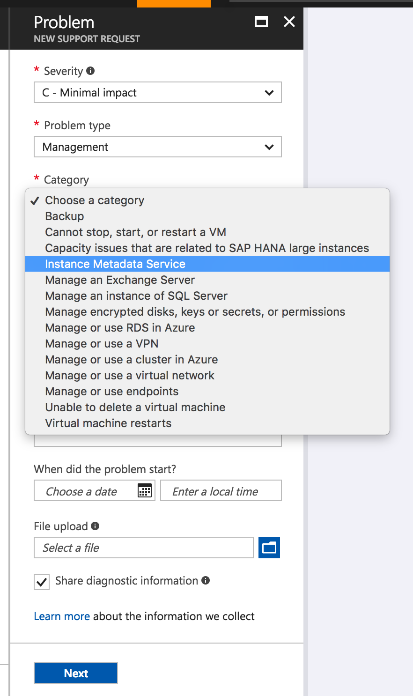

# Azure Instance Metadata service

The Azure Instance Metadata Service (IMDS) provides information about currently running virtual machine instances and can be used to manage and configure your virtual machines.
This information includes the SKU, storage, network configurations, and upcoming maintenance events. For a complete list of the data that is available, see [metadata APIs](#metadata-apis).
Instance Metadata Service is available for both the VM and virtual machine scale set Instances. It is only available for running VMs created/managed using [Azure Resource Manager](https://docs.microsoft.com/rest/api/resources/).

Azure's IMDS is a REST Endpoint that is available at a well-known non-routable IP address (`169.254.169.254`), it can be accessed only from within the VM. Communication between the VM and IMDS never leaves the Host.
It is best practice to have your HTTP clients bypass web proxies within the VM when querying IMDS and treat `169.254.169.254` the same as [`168.63.129.16`](https://docs.microsoft.com/azure/virtual-network/what-is-ip-address-168-63-129-16).

## Security

The Instance Metadata Service endpoint is accessible only from within the running virtual machine instance on a non-routable IP address. In addition, any request with a `X-Forwarded-For` header is rejected by the service.
Requests must also contain a `Metadata: true` header to ensure that the actual request was directly intended and not a part of unintentional redirection.

> [!IMPORTANT]
> Instance Metadata Service is not a channel for sensitive data. The end point is open to all processes on the VM. Information exposed through this service should be considered as shared information to all applications running inside the VM.

## Usage

### Accessing Azure Instance Metadata Service

To access Instance Metadata Service, create a VM from [Azure Resource Manager](https://docs.microsoft.com/rest/api/resources/) or the [Azure portal](https://portal.azure.com), and follow the samples below.
More examples of how to query IMDS can be found at [Azure Instance Metadata Samples](https://github.com/microsoft/azureimds).

Below is the sample code to retrieve all metadata for an instance, to access specific data source, see [Metadata API](#metadata-apis) section. 

**Request**

```powershell
Invoke-RestMethod -Headers @{"Metadata"="true"} -Method GET -NoProxy -Uri http://169.254.169.254/metadata/instance?api-version=2019-06-01
```

**Response**

> [!NOTE]
> The response is a JSON string. The following example response is pretty-printed for readability.

```json
{
  "compute": {
    "azEnvironment": "AzurePublicCloud",
    "customData": "",
    "location": "centralus",
    "name": "negasonic",
    "offer": "lampstack",
    "osType": "Linux",
    "placementGroupId": "",
    "plan": {
        "name": "5-6",
        "product": "lampstack",
        "publisher": "bitnami"
    },
    "platformFaultDomain": "0",
    "platformUpdateDomain": "0",
    "provider": "Microsoft.Compute",
    "publicKeys": [],
    "publisher": "bitnami",
    "resourceGroupName": "myrg",
    "resourceId": "/subscriptions/xxxxx-xxxx-xxxx-xxxx-xxxxxxxxxxx/resourceGroups/myrg/providers/Microsoft.Compute/virtualMachines/negasonic",
    "sku": "5-6",
    "storageProfile": {
        "dataDisks": [
          {
            "caching": "None",
            "createOption": "Empty",
            "diskSizeGB": "1024",
            "image": {
              "uri": ""
            },
            "lun": "0",
            "managedDisk": {
              "id": "/subscriptions/xxxxx-xxxx-xxxx-xxxx-xxxxxxxxxxx/resourceGroups/macikgo-test-may-23/providers/Microsoft.Compute/disks/exampledatadiskname",
              "storageAccountType": "Standard_LRS"
            },
            "name": "exampledatadiskname",
            "vhd": {
              "uri": ""
            },
            "writeAcceleratorEnabled": "false"
          }
        ],
        "imageReference": {
          "id": "",
          "offer": "UbuntuServer",
          "publisher": "Canonical",
          "sku": "16.04.0-LTS",
          "version": "latest"
        },
        "osDisk": {
          "caching": "ReadWrite",
          "createOption": "FromImage",
          "diskSizeGB": "30",
          "diffDiskSettings": {
            "option": "Local"
          },
          "encryptionSettings": {
            "enabled": "false"
          },
          "image": {
            "uri": ""
          },
          "managedDisk": {
            "id": "/subscriptions/xxxxx-xxxx-xxxx-xxxx-xxxxxxxxxxx/resourceGroups/macikgo-test-may-23/providers/Microsoft.Compute/disks/exampleosdiskname",
            "storageAccountType": "Standard_LRS"
          },
          "name": "exampleosdiskname",
          "osType": "Linux",
          "vhd": {
            "uri": ""
          },
          "writeAcceleratorEnabled": "false"
        }
    },
    "subscriptionId": "xxxxx-xxxx-xxxx-xxxx-xxxxxxxxxxx",
    "tags": "Department:IT;Environment:Prod;Role:WorkerRole",
    "version": "7.1.1902271506",
    "vmId": "13f56399-bd52-4150-9748-7190aae1ff21",
    "vmScaleSetName": "",
    "vmSize": "Standard_A1_v2",
    "zone": "1"
  },
  "network": {
    "interface": [
      {
        "ipv4": {
          "ipAddress": [
            {
              "privateIpAddress": "10.1.2.5",
              "publicIpAddress": "X.X.X.X"
            }
          ],
          "subnet": [
            {
              "address": "10.1.2.0",
              "prefix": "24"
            }
          ]
        },
        "ipv6": {
          "ipAddress": []
        },
        "macAddress": "000D3A36DDED"
      }
    ]
  }
}
```

### Data output


By default, the Instance Metadata Service returns data in JSON format (`Content-Type: application/json`). However, some APIs are able to return data in different formats if requested.
The following table is a reference of other data formats APIs may support.

API | Default Data Format | Other Formats
--------|---------------------|--------------
/attested | json | none
/identity | json | none
/instance | json | text
/scheduledevents | json | none

To access a non-default response format, specify the requested format as a query string parameter in the request. For example:

```powershell
Invoke-RestMethod -Headers @{"Metadata"="true"} -Method GET -NoProxy -Uri "http://169.254.169.254/metadata/instance?api-version=2017-08-01&format=text"
```

> [!NOTE]
> For leaf nodes in /metadata/instance the `format=json` doesn't work. For these queries `format=text` needs to be explicitly specified since the default format is json.

### Versioning

The Instance Metadata Service is versioned and specifying the API version in the HTTP request is mandatory.

Follow are the supported service versions: 2017-04-02, 2017-08-01, 2017-12-01, 2018-02-01, 2018-04-02, 2018-10-01, 2019-02-01, 2019-03-11, 2019-04-30, 2019-06-01, 2019-06-04, 2019-08-01, 2019-08-15.

Note when new version is released, it will take a while to roll out to all regions. Currently version 2019-11-01 is still getting deployed and may not be available in all regions.

As newer versions are added, older versions can still be accessed for compatibility if your scripts have dependencies on specific data formats.

When no version is specified, an error is returned with a list of the newest supported versions.

> [!NOTE]
> The response is a JSON string. The following example indicates the error condition when version is not specified, the response is pretty-printed for readability.

**Request**

```powershell
Invoke-RestMethod -Headers @{"Metadata"="true"} -Method GET -NoProxy -Uri http://169.254.169.254/metadata/instance
```

**Response**

```json
{
    "error": "Bad request. api-version was not specified in the request. For more information refer to aka.ms/azureimds",
    "newest-versions": [
        "2018-10-01",
        "2018-04-02",
        "2018-02-01"
    ]
}
```

## Metadata APIs

Metadata Service contains multiple APIs representing different data sources.

API | Description | Version Introduced
----|-------------|-----------------------
/attested | See [Attested Data](#attested-data) | 2018-10-01
/identity | See [Acquire an access token](../../active-directory/managed-identities-azure-resources/how-to-use-vm-token.md) | 2018-02-01
/instance | See [Instance API](#instance-api) | 2017-04-02
/scheduledevents | See [Scheduled Events](scheduled-events.md) | 2017-08-01

## Instance API

Instance API exposes the important metadata for the VM instances, including the VM, network, and storage. 
The following categories can be accessed through instance/compute:

Data | Description | Version Introduced
-----|-------------|-----------------------
azEnvironment | Azure Environment where the VM is running in | 2018-10-01
customData | This feature is currently disabled. We will update this documentation when it becomes available | 2019-02-01
location | Azure Region the VM is running in | 2017-04-02
name | Name of the VM | 2017-04-02
offer | Offer information for the VM image and is only present for images deployed from Azure image gallery | 2017-04-02
osType | Linux or Windows | 2017-04-02
placementGroupId | [Placement Group](../../virtual-machine-scale-sets/virtual-machine-scale-sets-placement-groups.md) of your virtual machine scale set | 2017-08-01
plan | [Plan](https://docs.microsoft.com/rest/api/compute/virtualmachines/createorupdate#plan) containing name, product, and publisher for a VM if it is an Azure Marketplace Image | 2018-04-02
platformUpdateDomain |  [Update domain](manage-availability.md) the VM is running in | 2017-04-02
platformFaultDomain | [Fault domain](manage-availability.md) the VM is running in | 2017-04-02
provider | Provider of the VM | 2018-10-01
publicKeys | [Collection of Public Keys](https://docs.microsoft.com/rest/api/compute/virtualmachines/createorupdate#sshpublickey) assigned to the VM and paths | 2018-04-02
publisher | Publisher of the VM image | 2017-04-02
resourceGroupName | [Resource group](../../azure-resource-manager/management/overview.md) for your Virtual Machine | 2017-08-01
resourceId | The [fully qualified](https://docs.microsoft.com/rest/api/resources/resources/getbyid) ID of the resource | 2019-03-11
sku | Specific SKU for the VM image | 2017-04-02
storageProfile | See [Storage Profile](#storage-metadata) | 2019-06-01
subscriptionId | Azure subscription for the Virtual Machine | 2017-08-01
tags | [Tags](../../azure-resource-manager/management/tag-resources.md) for your Virtual Machine  | 2017-08-01
tagsList | Tags formatted as a JSON array for easier programmatic parsing  | 2019-06-04
version | Version of the VM image | 2017-04-02
vmId | [Unique identifier](https://azure.microsoft.com/blog/accessing-and-using-azure-vm-unique-id/) for the VM | 2017-04-02
vmScaleSetName | [Virtual machine scale set Name](../../virtual-machine-scale-sets/virtual-machine-scale-sets-overview.md) of your virtual machine scale set | 2017-12-01
vmSize | [VM size](sizes.md) | 2017-04-02
zone | [Availability Zone](../../availability-zones/az-overview.md) of your virtual machine | 2017-12-01

### Sample 1: Tracking VM running on Azure

As a service provider, you may require to track the number of VMs running your software or have agents that need to track uniqueness of the VM. To be able to get a unique ID for a VM, use the `vmId` field from Instance Metadata Service.

**Request**

```powershell
Invoke-RestMethod -Headers @{"Metadata"="true"} -Method GET -NoProxy -Uri "http://169.254.169.254/metadata/instance/compute/vmId?api-version=2017-08-01&format=text"
```

**Response**

```text
5c08b38e-4d57-4c23-ac45-aca61037f084
```

### Sample 2: Placement of containers, data-partitions based fault/update domain

For certain scenarios, placement of different data replicas is of prime importance. For example, [HDFS replica placement](https://hadoop.apache.org/docs/stable/hadoop-project-dist/hadoop-hdfs/HdfsDesign.html#Replica_Placement:_The_First_Baby_Steps)
or container placement via an [orchestrator](https://kubernetes.io/docs/user-guide/node-selection/) may you require to know the `platformFaultDomain` and `platformUpdateDomain` the VM is running on.
You can also use [Availability Zones](../../availability-zones/az-overview.md) for the instances to make these decisions.
You can query this data directly via the Instance Metadata Service.

**Request**

```powershell
Invoke-RestMethod -Headers @{"Metadata"="true"} -Method GET -NoProxy -Uri "http://169.254.169.254/metadata/instance/compute/platformFaultDomain?api-version=2017-08-01&format=text"
```

**Response**

```text
0
```

### Sample 3: Getting more information about the VM during support case

As a service provider, you may get a support call where you would like to know more information about the VM. Asking the customer to share the compute metadata can provide basic information for the support professional to know about the kind of VM on Azure.

**Request**

```powershell
Invoke-RestMethod -Headers @{"Metadata"="true"} -Method GET -NoProxy -Uri http://169.254.169.254/metadata/instance/compute?api-version=2019-06-01
```

**Response**

> [!NOTE]
> The response is a JSON string. The following example response is pretty-printed for readability.

```json
{
    "azEnvironment": "AzurePublicCloud",
    "customData": "",
    "location": "centralus",
    "name": "negasonic",
    "offer": "lampstack",
    "osType": "Linux",
    "placementGroupId": "",
    "plan": {
        "name": "5-6",
        "product": "lampstack",
        "publisher": "bitnami"
    },
    "platformFaultDomain": "0",
    "platformUpdateDomain": "0",
    "provider": "Microsoft.Compute",
    "publicKeys": [],
    "publisher": "bitnami",
    "resourceGroupName": "myrg",
    "resourceId": "/subscriptions/xxxxx-xxxx-xxxx-xxxx-xxxxxxxxxxx/resourceGroups/myrg/providers/Microsoft.Compute/virtualMachines/negasonic",
    "sku": "5-6",
    "storageProfile": {
        "dataDisks": [
          {
            "caching": "None",
            "createOption": "Empty",
            "diskSizeGB": "1024",
            "image": {
              "uri": ""
            },
            "lun": "0",
            "managedDisk": {
              "id": "/subscriptions/xxxxx-xxxx-xxxx-xxxx-xxxxxxxxxxx/resourceGroups/macikgo-test-may-23/providers/Microsoft.Compute/disks/exampledatadiskname",
              "storageAccountType": "Standard_LRS"
            },
            "name": "exampledatadiskname",
            "vhd": {
              "uri": ""
            },
            "writeAcceleratorEnabled": "false"
          }
        ],
        "imageReference": {
          "id": "",
          "offer": "UbuntuServer",
          "publisher": "Canonical",
          "sku": "16.04.0-LTS",
          "version": "latest"
        },
        "osDisk": {
          "caching": "ReadWrite",
          "createOption": "FromImage",
          "diskSizeGB": "30",
          "diffDiskSettings": {
            "option": "Local"
          },
          "encryptionSettings": {
            "enabled": "false"
          },
          "image": {
            "uri": ""
          },
          "managedDisk": {
            "id": "/subscriptions/xxxxx-xxxx-xxxx-xxxx-xxxxxxxxxxx/resourceGroups/macikgo-test-may-23/providers/Microsoft.Compute/disks/exampleosdiskname",
            "storageAccountType": "Standard_LRS"
          },
          "name": "exampleosdiskname",
          "osType": "Linux",
          "vhd": {
            "uri": ""
          },
          "writeAcceleratorEnabled": "false"
        }
    },
    "subscriptionId": "xxxxx-xxxx-xxxx-xxxx-xxxxxxxxxxx",
    "tags": "Department:IT;Environment:Test;Role:WebRole",
    "version": "7.1.1902271506",
    "vmId": "13f56399-bd52-4150-9748-7190aae1ff21",
    "vmScaleSetName": "",
    "vmSize": "Standard_A1_v2",
    "zone": "1"
}
```

### Sample 4: Getting Azure Environment where the VM is running

Azure has various sovereign clouds like [Azure Government](https://azure.microsoft.com/overview/clouds/government/). Sometimes you need the Azure Environment to make some runtime decisions. The following sample shows you how you can achieve this behavior.

**Request**

```powershell
Invoke-RestMethod -Headers @{"Metadata"="true"} -Method GET -NoProxy -Uri "http://169.254.169.254/metadata/instance/compute/azEnvironment?api-version=2018-10-01&format=text"
```

**Response**

```text
AzurePublicCloud
```

The cloud and the values of the Azure Environment are listed below.

 Cloud   | Azure Environment
---------|-----------------
[All Generally Available Global Azure Regions](https://azure.microsoft.com/regions/)     | AzurePublicCloud
[Azure Government](https://azure.microsoft.com/overview/clouds/government/)              | AzureUSGovernmentCloud
[Azure China 21Vianet](https://azure.microsoft.com/global-infrastructure/china/)         | AzureChinaCloud
[Azure Germany](https://azure.microsoft.com/overview/clouds/germany/)                    | AzureGermanCloud

## Network Metadata 

Network metadata is part of the instance API. The following Network categories are available through the instance/network endpoint.

Data | Description | Version Introduced
-----|-------------|-----------------------
ipv4/privateIpAddress | Local IPv4 address of the VM | 2017-04-02
ipv4/publicIpAddress | Public IPv4 address of the VM | 2017-04-02
subnet/address | Subnet address of the VM | 2017-04-02
subnet/prefix | Subnet prefix, example 24 | 2017-04-02
ipv6/ipAddress | Local IPv6 address of the VM | 2017-04-02
macAddress | VM mac address | 2017-04-02

> [!NOTE]
> All API responses are JSON strings. All following example responses are pretty-printed for readability.

#### Sample 1: Retrieving network information

**Request**

```powershell
Invoke-RestMethod -Headers @{"Metadata"="true"} -Method GET -NoProxy -Uri http://169.254.169.254/metadata/instance/network?api-version=2017-08-01
```

**Response**

> [!NOTE]
> The response is a JSON string. The following example response is pretty-printed for readability.

```json
{
  "interface": [
    {
      "ipv4": {
        "ipAddress": [
          {
            "privateIpAddress": "10.1.0.4",
            "publicIpAddress": "X.X.X.X"
          }
        ],
        "subnet": [
          {
            "address": "10.1.0.0",
            "prefix": "24"
          }
        ]
      },
      "ipv6": {
        "ipAddress": []
      },
      "macAddress": "000D3AF806EC"
    }
  ]
}

```

#### Sample 2: Retrieving public IP address

```powershell
Invoke-RestMethod -Headers @{"Metadata"="true"} -Method GET -NoProxy -Uri "http://169.254.169.254/metadata/instance/network/interface/0/ipv4/ipAddress/0/publicIpAddress?api-version=2017-08-01&format=text"
```

## Storage Metadata

Storage metadata is part of the instance API under instance/compute/storageProfile endpoint.
It provides details about the storage disks associated with the VM. 

The storage profile of a VM is divided into three categories: image reference, OS disk, and data disks.

The image reference object contains the following information about the OS image:

Data    | Description
--------|-----------------
id      | Resource ID
offer   | Offer of the platform or marketplace image
publisher | Image publisher
sku     | Image sku
version | Version of the platform or marketplace image

The OS disk object contains the following information about the OS disk used by the VM:

Data    | Description
--------|-----------------
caching | Caching requirements
createOption | Information about how the VM was created
diffDiskSettings | Ephemeral disk settings
diskSizeGB | Size of the disk in GB
image   | Source user image virtual hard disk
lun     | Logical unit number of the disk
managedDisk | Managed disk parameters
name    | Disk name
vhd     | Virtual hard disk
writeAcceleratorEnabled | Whether or not writeAccelerator is enabled on the disk

The data disks array contains a list of data disks attached to the VM. Each data disk object contains the following information:

Data    | Description
--------|-----------------
caching | Caching requirements
createOption | Information about how the VM was created
diffDiskSettings | Ephemeral disk settings
diskSizeGB | Size of the disk in GB
encryptionSettings | Encryption settings for the disk
image   | Source user image virtual hard disk
managedDisk | Managed disk parameters
name    | Disk name
osType  | Type of OS included in the disk
vhd     | Virtual hard disk
writeAcceleratorEnabled | Whether or not writeAccelerator is enabled on the disk

The following example shows how to query the VM's storage information.

**Request**

```powershell
Invoke-RestMethod -Headers @{"Metadata"="true"} -Method GET -NoProxy -Uri http://169.254.169.254/metadata/instance/compute/storageProfile?api-version=2019-06-01
```

**Response**

> [!NOTE]
> The response is a JSON string. The following example response is pretty-printed for readability.

```json
{
    "dataDisks": [
      {
        "caching": "None",
        "createOption": "Empty",
        "diskSizeGB": "1024",
        "image": {
          "uri": ""
        },
        "lun": "0",
        "managedDisk": {
          "id": "/subscriptions/xxxxx-xxxx-xxxx-xxxx-xxxxxxxxxxx/resourceGroups/macikgo-test-may-23/providers/Microsoft.Compute/disks/exampledatadiskname",
          "storageAccountType": "Standard_LRS"
        },
        "name": "exampledatadiskname",
        "vhd": {
          "uri": ""
        },
        "writeAcceleratorEnabled": "false"
      }
    ],
    "imageReference": {
      "id": "",
      "offer": "UbuntuServer",
      "publisher": "Canonical",
      "sku": "16.04.0-LTS",
      "version": "latest"
    },
    "osDisk": {
      "caching": "ReadWrite",
      "createOption": "FromImage",
      "diskSizeGB": "30",
      "diffDiskSettings": {
        "option": "Local"
      },
      "encryptionSettings": {
        "enabled": "false"
      },
      "image": {
        "uri": ""
      },
      "managedDisk": {
        "id": "/subscriptions/xxxxx-xxxx-xxxx-xxxx-xxxxxxxxxxx/resourceGroups/macikgo-test-may-23/providers/Microsoft.Compute/disks/exampleosdiskname",
        "storageAccountType": "Standard_LRS"
      },
      "name": "exampleosdiskname",
      "osType": "Linux",
      "vhd": {
        "uri": ""
      },
      "writeAcceleratorEnabled": "false"
    }
}
```

## VM Tags

VM tags are included the instance API under instance/compute/tags endpoint.
Tags may have been applied to your Azure VM to logically organize them into a taxonomy. The tags assigned to a VM can be retrieved by using the request below.

**Request**

```powershell
Invoke-RestMethod -Headers @{"Metadata"="true"} -Method GET -NoProxy -Uri "http://169.254.169.254/metadata/instance/compute/tags?api-version=2018-10-01&format=text"
```

**Response**

```text
Department:IT;Environment:Test;Role:WebRole
```

The `tags` field is a string with the tags delimited by semicolons. This output can be a problem if semicolons are used in the tags themselves. If a parser is written to programmatically extract the tags, you should rely on the `tagsList` field. The `tagsList` field is a JSON array with no delimiters, and consequently, easier to parse.

**Request**

```powershell
Invoke-RestMethod -Headers @{"Metadata"="true"} -Method GET -NoProxy -Uri http://169.254.169.254/metadata/instance/compute/tagsList?api-version=2019-06-04
```

**Response**

```json
[
  {
    "name": "Department",
    "value": "IT"
  },
  {
    "name": "Environment",
    "value": "Test"
  },
  {
    "name": "Role",
    "value": "WebRole"
  }
]
```

## Attested Data

Part of the scenario served by Instance Metadata Service is to provide guarantees that the data provided is coming from Azure. We sign part of this information so that marketplace images can be sure that it's their image running on Azure.

### Sample 1: Getting attested Data

> [!NOTE]
> All API responses are JSON strings. The following example responses are pretty-printed for readability.

**Request**

```powershell
Invoke-RestMethod -Headers @{"Metadata"="true"} -Method GET -NoProxy -Uri "http://169.254.169.254/metadata/attested/document?api-version=2018-10-01&nonce=1234567890"
```

> [!NOTE]
> Due to IMDS's caching mechanism, a previously cached nonce value may be returned.

Api-version is a mandatory field. Refer to the [usage section](#usage) for supported API versions.
Nonce is an optional 10-digit string. If not provided, IMDS returns the current UTC timestamp in its place.

**Response**

> [!NOTE]
> The response is a JSON string. The following example response is pretty-printed for readability.

```json
{
 "encoding":"pkcs7","signature":"MIIEEgYJKoZIhvcNAQcCoIIEAzCCA/8CAQExDzANBgkqhkiG9w0BAQsFADCBugYJKoZIhvcNAQcBoIGsBIGpeyJub25jZSI6IjEyMzQ1NjY3NjYiLCJwbGFuIjp7Im5hbWUiOiIiLCJwcm9kdWN0IjoiIiwicHVibGlzaGVyIjoiIn0sInRpbWVTdGFtcCI6eyJjcmVhdGVkT24iOiIxMS8yMC8xOCAyMjowNzozOSAtMDAwMCIsImV4cGlyZXNPbiI6IjExLzIwLzE4IDIyOjA4OjI0IC0wMDAwIn0sInZtSWQiOiIifaCCAj8wggI7MIIBpKADAgECAhBnxW5Kh8dslEBA0E2mIBJ0MA0GCSqGSIb3DQEBBAUAMCsxKTAnBgNVBAMTIHRlc3RzdWJkb21haW4ubWV0YWRhdGEuYXp1cmUuY29tMB4XDTE4MTEyMDIxNTc1N1oXDTE4MTIyMDIxNTc1NlowKzEpMCcGA1UEAxMgdGVzdHN1YmRvbWFpbi5tZXRhZGF0YS5henVyZS5jb20wgZ8wDQYJKoZIhvcNAQEBBQADgY0AMIGJAoGBAML/tBo86ENWPzmXZ0kPkX5dY5QZ150mA8lommszE71x2sCLonzv4/UWk4H+jMMWRRwIea2CuQ5RhdWAHvKq6if4okKNt66fxm+YTVz9z0CTfCLmLT+nsdfOAsG1xZppEapC0Cd9vD6NCKyE8aYI1pliaeOnFjG0WvMY04uWz2MdAgMBAAGjYDBeMFwGA1UdAQRVMFOAENnYkHLa04Ut4Mpt7TkJFfyhLTArMSkwJwYDVQQDEyB0ZXN0c3ViZG9tYWluLm1ldGFkYXRhLmF6dXJlLmNvbYIQZ8VuSofHbJRAQNBNpiASdDANBgkqhkiG9w0BAQQFAAOBgQCLSM6aX5Bs1KHCJp4VQtxZPzXF71rVKCocHy3N9PTJQ9Fpnd+bYw2vSpQHg/AiG82WuDFpPReJvr7Pa938mZqW9HUOGjQKK2FYDTg6fXD8pkPdyghlX5boGWAMMrf7bFkup+lsT+n2tRw2wbNknO1tQ0wICtqy2VqzWwLi45RBwTGB6DCB5QIBATA/MCsxKTAnBgNVBAMTIHRlc3RzdWJkb21haW4ubWV0YWRhdGEuYXp1cmUuY29tAhBnxW5Kh8dslEBA0E2mIBJ0MA0GCSqGSIb3DQEBCwUAMA0GCSqGSIb3DQEBAQUABIGAld1BM/yYIqqv8SDE4kjQo3Ul/IKAVR8ETKcve5BAdGSNkTUooUGVniTXeuvDj5NkmazOaKZp9fEtByqqPOyw/nlXaZgOO44HDGiPUJ90xVYmfeK6p9RpJBu6kiKhnnYTelUk5u75phe5ZbMZfBhuPhXmYAdjc7Nmw97nx8NnprQ="
}
```

The signature blob is a [pkcs7](https://aka.ms/pkcs7) signed version of document. It contains the certificate used for signing along with the VM details like vmId, sku, nonce, subscriptionId, timeStamp for creation and expiry of the document and the plan information about the image. The plan information is only populated for Azure Marketplace images. The certificate can be extracted from the response and used to validate that the response is valid and is coming from Azure.
The document contains the following fields:

Data | Description
-----|------------
nonce | A string that can be optionally provided with the request. If no nonce was supplied, the current UTC timestamp is used
plan | The [Azure Marketplace Image plan](https://docs.microsoft.com/rest/api/compute/virtualmachines/createorupdate#plan). Contains the plan id (name), product image or offer (product), and publisher id (publisher).
timestamp/createdOn | The UTC timestamp for when the signed document was created
timestamp/expiresOn | The UTC timestamp for when the signed document expires
vmId |  [Unique identifier](https://azure.microsoft.com/blog/accessing-and-using-azure-vm-unique-id/) for the VM
subscriptionId | Azure subscription for the Virtual Machine, introduced in `2019-04-30`
sku | Specific SKU for the VM image, introduced in `2019-11-01`

### Sample 2: Validating that the VM is running in Azure

Marketplace vendors want to ensure that their software is licensed to run only in Azure. If someone copies the VHD out to on-premise, then they should have the ability to detect that. By calling into Instance Metadata Service, Marketplace vendors can get signed data that guarantees response only from Azure.

```powershell
# Get the signature
$attestedDoc = Invoke-RestMethod -Headers @{"Metadata"="true"} -Method GET -NoProxy -Uri http://169.254.169.254/metadata/attested/document?api-version=2019-04-30
# Decode the signature
$signature = [System.Convert]::FromBase64String($attestedDoc.signature)
```

Verify that the signature is from Microsoft Azure and check the certificate chain for errors.

```powershell
# Get certificate chain
$cert = [System.Security.Cryptography.X509Certificates.X509Certificate2]($signature)
$chain = New-Object -TypeName System.Security.Cryptography.X509Certificates.X509Chain
$chain.Build($cert)
# Print the Subject of each certificate in the chain
foreach($element in $chain.ChainElements)
{
    Write-Host $element.Certificate.Subject
}

# Get the content of the signed document
Add-Type -AssemblyName System.Security
$signedCms = New-Object -TypeName System.Security.Cryptography.Pkcs.SignedCms
$signedCms.Decode($signature);
$content = [System.Text.Encoding]::UTF8.GetString($signedCms.ContentInfo.Content)
Write-Host "Attested data: " $conten
$json = $content | ConvertFrom-Json
# Do additional validation here
```

> [!NOTE]
> Due to IMDS's caching mechanism, a previously cached nonce value may be returned.

The nonce in the signed document can be compared if you provided a nonce parameter in the initial request.

> [!NOTE]
> The certificate for Public cloud and each sovereign cloud will be different.

Cloud | Certificate
------|------------
[All Generally Available Global Azure Regions](https://azure.microsoft.com/regions/) | *.metadata.azure.com
[Azure Government](https://azure.microsoft.com/overview/clouds/government/)          | *.metadata.azure.us
[Azure China 21Vianet](https://azure.microsoft.com/global-infrastructure/china/)     | *.metadata.azure.cn
[Azure Germany](https://azure.microsoft.com/overview/clouds/germany/)                | *.metadata.microsoftazure.de

> [!NOTE]
> There is a known issue around the certificate used for signing. The certificates may not have an exact match of `metadata.azure.com` for public cloud. Hence the certification validation should allow a common name from any `.metadata.azure.com` subdomain.

In cases where the intermediate certificate cannot be downloaded due to network constraints during validation, the intermediate certificate can be pinned. However, Azure will roll over the certificates as per standard PKI practice. The pinned certificates would need to be updated when rollover happens. Whenever a change to update the intermediate certificate is planned, the Azure blog will be updated and Azure customers will be notified. The intermediate certificates can be found [here](https://www.microsoft.com/pki/mscorp/cps/default.htm). The intermediate certificates for each of the regions can be different.

> [!NOTE]
> The intermediate certificate for Azure China 21Vianet will be from DigiCert Global Root CA instead of Baltimore.
Also if you had pinned the intermediate certificates for Azure China as part of root chain authority change, the intermediate certificates will have to be updated.

## Failover Clustering in Windows Server

For certain scenarios when querying Instance Metadata Service with Failover Clustering, it is necessary to add a route to the routing table.

1. Open command prompt with administrator privileges.

1. Run the following command and note the address of the Interface for Network Destination (`0.0.0.0`) in the IPv4 Route Table.

```bat
route print
```

> [!NOTE]
> The following example output from a Windows Server VM with Failover Cluster enabled contains only the IPv4 Route Table for simplicity.

```text
IPv4 Route Table
===========================================================================
Active Routes:
Network Destination        Netmask          Gateway       Interface  Metric
          0.0.0.0          0.0.0.0         10.0.1.1        10.0.1.10    266
         10.0.1.0  255.255.255.192         On-link         10.0.1.10    266
        10.0.1.10  255.255.255.255         On-link         10.0.1.10    266
        10.0.1.15  255.255.255.255         On-link         10.0.1.10    266
        10.0.1.63  255.255.255.255         On-link         10.0.1.10    266
        127.0.0.0        255.0.0.0         On-link         127.0.0.1    331
        127.0.0.1  255.255.255.255         On-link         127.0.0.1    331
  127.255.255.255  255.255.255.255         On-link         127.0.0.1    331
      169.254.0.0      255.255.0.0         On-link     169.254.1.156    271
    169.254.1.156  255.255.255.255         On-link     169.254.1.156    271
  169.254.255.255  255.255.255.255         On-link     169.254.1.156    271
        224.0.0.0        240.0.0.0         On-link         127.0.0.1    331
        224.0.0.0        240.0.0.0         On-link     169.254.1.156    271
  255.255.255.255  255.255.255.255         On-link         127.0.0.1    331
  255.255.255.255  255.255.255.255         On-link     169.254.1.156    271
  255.255.255.255  255.255.255.255         On-link         10.0.1.10    266
```

Run the following command and use the address of the Interface for Network Destination (`0.0.0.0`) which is (`10.0.1.10`) in this example.

```bat
route add 169.254.169.254/32 10.0.1.10 metric 1 -p
```

## Managed Identity via Metadata Service

A system assigned managed identity can be enabled on the VM or one or more user assigned managed identities can be assigned to the VM.
Tokens for managed identities can then be requested from Instance Metadata Service. These tokens can be used to authenticate with other Azure services such as Azure Key Vault.

For detailed steps to enable this feature, see [Acquire an access token](../../active-directory/managed-identities-azure-resources/how-to-use-vm-token.md).

## Scheduled Events via Metadata Service
You can obtain the status of the scheduled events via metadata service, then user can specify a set of action to execute upon these events.  See [Scheduled Events](scheduled-events.md) for details. 

## Regional Availability

The service is **generally available** in all Azure Clouds.

## Sample Code in Different Languages

Samples of calling metadata service using different languages inside the VM:

Language      | Example
--------------|----------------
C++ (Windows) | https://github.com/Microsoft/azureimds/blob/master/IMDSSample-windows.cpp
C#            | https://github.com/Microsoft/azureimds/blob/master/IMDSSample.cs
Go            | https://github.com/Microsoft/azureimds/blob/master/imdssample.go
Java          | https://github.com/Microsoft/azureimds/blob/master/imdssample.java
NodeJS        | https://github.com/Microsoft/azureimds/blob/master/IMDSSample.js
Perl          | https://github.com/Microsoft/azureimds/blob/master/IMDSSample.pl
PowerShell    | https://github.com/Microsoft/azureimds/blob/master/IMDSSample.ps1
Puppet        | https://github.com/keirans/azuremetadata
Python        | https://github.com/Microsoft/azureimds/blob/master/IMDSSample.py
Ruby          | https://github.com/Microsoft/azureimds/blob/master/IMDSSample.rb
Visual Basic  | https://github.com/Microsoft/azureimds/blob/master/IMDSSample.vb

## Error and Debugging

If there is a data element not found or a malformed request, the Instance Metadata Service returns standard HTTP errors. For example:

HTTP Status Code | Reason
-----------------|-------
200 OK |
400 Bad Request | Missing `Metadata: true` header or missing parameter `format=json` when querying a leaf node
404 Not Found  | The requested element doesn't exist
405 Method Not Allowed | Only `GET` requests are supported
410 Gone | Retry after some time for a max of 70 seconds
429 Too Many Requests | The API currently supports a maximum of 5 queries per second
500 Service Error     | Retry after some time

### Known issues and FAQ

1. I am getting the error `400 Bad Request, Required metadata header not specified`. What does this mean?
   * The Instance Metadata Service requires the header `Metadata: true` to be passed in the request. Passing this header in the REST call allows access to the Instance Metadata Service.
1. Why am I not getting compute information for my VM?
   * Currently the Instance Metadata Service only supports instances created with Azure Resource Manager. In the future, support for  Cloud Service VMs might be added.
1. I created my Virtual Machine through Azure Resource Manager a while back. Why am I not see compute metadata information?
   * For any VMs created after Sep 2016, add a [Tag](../../azure-resource-manager/management/tag-resources.md) to start seeing compute metadata. For older VMs (created before Sep 2016), add/remove extensions or data disks to the VM instance(s) to refresh metadata.
1. I am not seeing all data populated for new version
   * For any VMs created after Sep 2016, add a [Tag](../../azure-resource-manager/management/tag-resources.md) to start seeing compute metadata. For older VMs (created before Sep 2016), add/remove extensions or data disks to the VM instance(s) to refresh metadata.
1. Why am I getting the error `500 Internal Server Error` or `410 Resource Gone`?
   * Retry your request based on exponential back off system or other methods described in [Transient fault handling](https://docs.microsoft.com/azure/architecture/best-practices/transient-faults). If the issue persists create a support issue in Azure portal for the VM.
1. Would this work for Virtual Machine Scale Set instances?
   * Yes Metadata service is available for Scale Set instances.
1. I updated my tags in Virtual Machine Scale Sets but they don't appear in the instances unlike single instance VMs?
   * Currently tags for Scale Sets only show to the VM on a reboot, reimage, or disk change to the instance.
1. I get request timed out for my call to the service?
   * Metadata calls must be made from the primary IP address assigned to the primary network card of the VM. Additionally in the case you have changed your routes, there must be a route for the 169.254.169.254/32 address in your VM's local routing table.
   * <details>
        <summary>Verifying your routing table</summary>

        1. Dump your local routing table and look for the IMDS entry (e.g.):
            ```console
            > route print
            IPv4 Route Table
            ===========================================================================
            Active Routes:
            Network Destination        Netmask          Gateway       Interface  Metric
                      0.0.0.0          0.0.0.0      172.16.69.1      172.16.69.7     10
                    127.0.0.0        255.0.0.0         On-link         127.0.0.1    331
                    127.0.0.1  255.255.255.255         On-link         127.0.0.1    331
              127.255.255.255  255.255.255.255         On-link         127.0.0.1    331
                168.63.129.16  255.255.255.255      172.16.69.1      172.16.69.7     11
              169.254.169.254  255.255.255.255      172.16.69.1      172.16.69.7     11
            ... (continues) ...
            ```
        1. Verify that a route exists for `169.254.169.254`, and note the corresponding network interface (e.g. `172.16.69.7`).
        1. Dump the interface configuration and find the interface that corresponds to the one referenced in the routing table, noting the MAC (Physical) address.
            ```console
            > ipconfig /all
            ... (continues) ...
            Ethernet adapter Ethernet:

               Connection-specific DNS Suffix  . : xic3mnxjiefupcwr1mcs1rjiqa.cx.internal.cloudapp.net
               Description . . . . . . . . . . . : Microsoft Hyper-V Network Adapter
               Physical Address. . . . . . . . . : 00-0D-3A-E5-1C-C0
               DHCP Enabled. . . . . . . . . . . : Yes
               Autoconfiguration Enabled . . . . : Yes
               Link-local IPv6 Address . . . . . : fe80::3166:ce5a:2bd5:a6d1%3(Preferred)
               IPv4 Address. . . . . . . . . . . : 172.16.69.7(Preferred)
               Subnet Mask . . . . . . . . . . . : 255.255.255.0
            ... (continues) ...
            ```
        1. Confirm that the interface corresponds to the VM's primary NIC and primary IP. You can find the primary NIC/IP by looking at the network configuration in Azure Portal or by looking it up [with the Azure CLI](https://docs.microsoft.com/cli/azure/vm/nic?view=azure-cli-latest#az-vm-nic-show). Note the public and private IPs (and the MAC address if using the cli). PowerShell CLI example:
            ```powershell
            $ResourceGroup = '<Resource_Group>'
            $VmName = '<VM_Name>'
            $NicNames = az vm nic list --resource-group $ResourceGroup --vm-name $VmName | ConvertFrom-Json | Foreach-Object { $_.id.Split('/')[-1] }
            foreach($NicName in $NicNames)
            {
            	$Nic = az vm nic show --resource-group $ResourceGroup --vm-name $VmName --nic $NicName | ConvertFrom-Json
            	Write-Host $NicName, $Nic.primary, $Nic.macAddress
            }
            # Output: wintest767 True 00-0D-3A-E5-1C-C0
            ```
        1. If they do not match, update the routing table such that the primary NIC/IP are targeted.
    </details>

## Support and Feedback

Submit your feedback and comments on https://feedback.azure.com.

To get support for the service, create a support issue in Azure portal for the VM where you are not able to get metadata response after long retries.
Use the Problem Type of `Management` and select `Instance Metadata Service` as the Category.



## Next Steps

Learn more about:
1.  [Acquire an access token for the VM](../../active-directory/managed-identities-azure-resources/how-to-use-vm-token.md).
2.  [Scheduled Events](scheduled-events.md)
