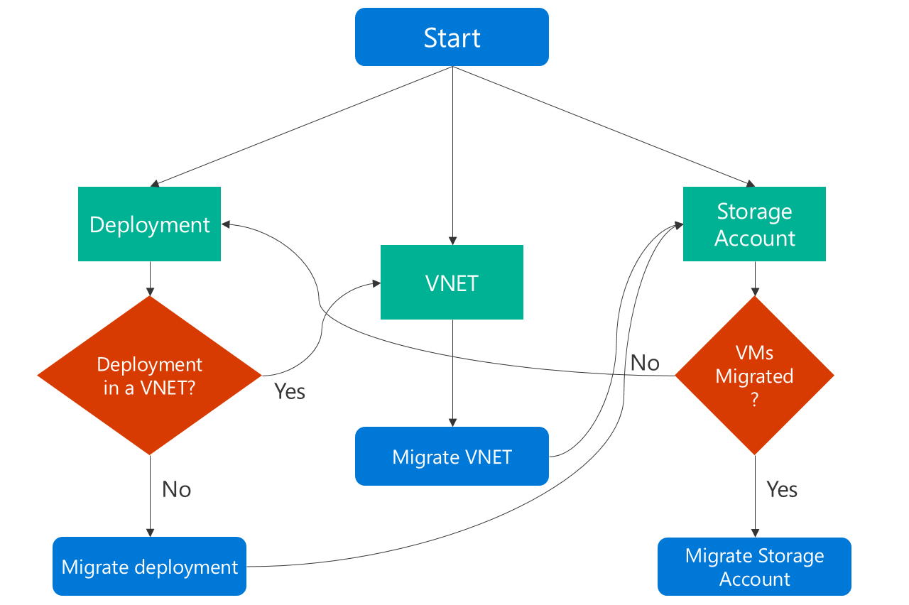

---
title: Migrate to Resource Manager with PowerShell | Microsoft Docs
description: This article walks through the platform-supported migration of IaaS resources such as virtual machines (VMs), virtual networks (VNETs), and storage accounts from classic to Azure Resource Manager (ARM) by using Azure PowerShell commands
services: virtual-machines-windows
documentationcenter: ''
author: singhkays
manager: gwallace
editor: ''
tags: azure-resource-manager

ms.assetid: 2b3dff9b-2e99-4556-acc5-d75ef234af9c
ms.service: virtual-machines-windows
ms.workload: infrastructure-services
ms.tgt_pltfrm: vm-windows
ms.devlang: na
ms.topic: article
ms.date: 03/30/2017
ms.author: kasing

---
# Migrate IaaS resources from classic to Azure Resource Manager by using Azure PowerShell
These steps show you how to use Azure PowerShell commands to migrate infrastructure as a service (IaaS) resources from the classic deployment model to the Azure Resource Manager deployment model.

If you want, you can also migrate resources by using the [Azure Command Line Interface (Azure CLI)](../linux/migration-classic-resource-manager-cli.md).

* For background on supported migration scenarios, see [Platform-supported migration of IaaS resources from classic to Azure Resource Manager](migration-classic-resource-manager-overview.md).
* For detailed guidance and a migration walkthrough, see [Technical deep dive on platform-supported migration from classic to Azure Resource Manager](migration-classic-resource-manager-deep-dive.md).
* [Review most common migration errors](migration-classic-resource-manager-errors.md)

<br>
Here is a flowchart to identify the order in which steps need to be executed during a migration process



[!INCLUDE [updated-for-az.md](../../../includes/updated-for-az.md)]

## Step 1: Plan for migration
Here are a few best practices that we recommend as you evaluate migrating IaaS resources from classic to Resource Manager:

* Read through the [supported and unsupported features and configurations](migration-classic-resource-manager-overview.md). If you have virtual machines that use unsupported configurations or features, we recommend that you wait for the configuration/feature support to be announced. Alternatively, if it suits your needs, remove that feature or move out of that configuration to enable migration.
* If you have automated scripts that deploy your infrastructure and applications today, try to create a similar test setup by using those scripts for migration. Alternatively, you can set up sample environments by using the Azure portal.

> [!IMPORTANT]
> Application Gateways are not currently supported for migration from classic to Resource Manager. To migrate a classic virtual network with an Application gateway, remove the gateway before running a Prepare operation to move the network. After you complete the migration, reconnect the gateway in Azure Resource Manager.
>
>ExpressRoute gateways connecting to ExpressRoute circuits in another subscription cannot be migrated automatically. In such cases, remove the ExpressRoute gateway, migrate the virtual network and recreate the gateway. Please see [Migrate ExpressRoute circuits and associated virtual networks from the classic to the Resource Manager deployment model](../../expressroute/expressroute-migration-classic-resource-manager.md) for more information.

## Step 2: Install the latest version of Azure PowerShell
There are two main options to install Azure PowerShell: [PowerShell Gallery](https://www.powershellgallery.com/profiles/azure-sdk/) or [Web Platform Installer (WebPI)](https://aka.ms/webpi-azps). WebPI receives monthly updates. PowerShell Gallery receives updates on a continuous basis. This article is based on Azure PowerShell version 2.1.0.

For installation instructions, see [How to install and configure Azure PowerShell](/powershell/azure/overview).

<br>

## Step 3: Ensure that you are an administrator for the subscription in Azure portal
To perform this migration, you must be added as a co-administrator for the subscription in the [Azure portal](https://portal.azure.com).

1. Sign into the [Azure portal](https://portal.azure.com).
2. On the Hub menu, select **Subscription**. If you don't see it, select **All services**.
3. Find the appropriate subscription entry, then look at the **MY ROLE** field. For a co-administrator, the value should be _Account admin_.

If you are not able to add a co-administrator, then contact a service administrator or co-administrator for the subscription to get yourself added.   

## Step 4: Set your subscription and sign up for migration
First, start a PowerShell prompt. For migration, you need to set up your environment for both classic and Resource Manager.

Sign in to your account for the Resource Manager model.

```powershell
    Connect-AzAccount
```

Get the available subscriptions by using the following command:

```powershell
    Get-AzSubscription | Sort Name | Select Name
```

Set your Azure subscription for the current session. This example sets the default subscription name to **My Azure Subscription**. Replace the example subscription name with your own.

```powershell
    Select-AzSubscription –SubscriptionName "My Azure Subscription"
```

> [!NOTE]
> Registration is a one-time step, but you must do it once before attempting migration. Without registering, you see the following error message:
>
> *BadRequest : Subscription is not registered for migration.*

Register with the migration resource provider by using the following command:

```powershell
    Register-AzResourceProvider -ProviderNamespace Microsoft.ClassicInfrastructureMigrate
```

Please wait five minutes for the registration to finish. You can check the status of the approval by using the following command:

```powershell
    Get-AzResourceProvider -ProviderNamespace Microsoft.ClassicInfrastructureMigrate
```

Make sure that RegistrationState is `Registered` before you proceed.

Now sign in to your account for the classic model.

```powershell
    Add-AzureAccount
```

Get the available subscriptions by using the following command:

```powershell
    Get-AzureSubscription | Sort SubscriptionName | Select SubscriptionName
```

Set your Azure subscription for the current session. This example sets the default subscription to **My Azure Subscription**. Replace the example subscription name with your own.

```powershell
    Select-AzureSubscription –SubscriptionName "My Azure Subscription"
```

<br>

## Step 5: Make sure you have enough Azure Resource Manager Virtual Machine vCPUs in the Azure region of your current deployment or VNET
You can use the following PowerShell command to check the current number of vCPUs you have in Azure Resource Manager. To learn more about vCPU quotas, see [Limits and the Azure Resource Manager](../../azure-subscription-service-limits.md#limits-and-azure-resource-manager).

This example checks the availability in the **West US** region. Replace the example region name with your own.

```powershell
Get-AzVMUsage -Location "West US"
```

## Step 6: Run commands to migrate your IaaS resources
* [Migrate VMs in a cloud service (not in virtual network)](#step-61-option-1---migrate-virtual-machines-in-a-cloud-service-not-in-a-virtual-network)
* [Migrate VMs in a virtual network](#step-61-option-2---migrate-virtual-machines-in-a-virtual-network)
* [Migrate Storage Account](#step-62-migrate-a-storage-account)

> [!NOTE]
> All the operations described here are idempotent. If you have a problem other than an unsupported feature or a configuration error, we recommend that you retry the prepare, abort, or commit operation. The platform then tries the action again.


### Step 6.1: Option 1 - Migrate virtual machines in a cloud service (not in a virtual network)
Get the list of cloud services by using the following command, and then pick the cloud service that you want to migrate. If the VMs in the cloud service are in a virtual network or if they have web or worker roles, the command returns an error message.

```powershell
    Get-AzureService | ft Servicename
```

Get the deployment name for the cloud service. In this example, the service name is **My Service**. Replace the example service name with your own service name.

```powershell
    $serviceName = "My Service"
    $deployment = Get-AzureDeployment -ServiceName $serviceName
    $deploymentName = $deployment.DeploymentName
```

Prepare the virtual machines in the cloud service for migration. You have two options to choose from.

* **Option 1. Migrate the VMs to a platform-created virtual network**

    First, validate if you can migrate the cloud service using the following commands:

    ```powershell
    $validate = Move-AzureService -Validate -ServiceName $serviceName `
        -DeploymentName $deploymentName -CreateNewVirtualNetwork
    $validate.ValidationMessages
    ```

    The following command displays any warnings and errors that block migration. If validation is successful, then you can move on to the **Prepare** step:

    ```powershell
    Move-AzureService -Prepare -ServiceName $serviceName `
        -DeploymentName $deploymentName -CreateNewVirtualNetwork
    ```
* **Option 2. Migrate to an existing virtual network in the Resource Manager deployment model**

    This example sets the resource group name to **myResourceGroup**, the virtual network name to **myVirtualNetwork** and the subnet name to **mySubNet**. Replace the names in the example with the names of your own resources.

    ```powershell
    $existingVnetRGName = "myResourceGroup"
    $vnetName = "myVirtualNetwork"
    $subnetName = "mySubNet"
    ```

    First, validate if you can migrate the virtual network using the following command:

    ```powershell
    $validate = Move-AzureService -Validate -ServiceName $serviceName `
        -DeploymentName $deploymentName -UseExistingVirtualNetwork -VirtualNetworkResourceGroupName $existingVnetRGName -VirtualNetworkName $vnetName -SubnetName $subnetName
    $validate.ValidationMessages
    ```

    The following command displays any warnings and errors that block migration. If validation is successful, then you can proceed with the following Prepare step:

    ```powershell
        Move-AzureService -Prepare -ServiceName $serviceName -DeploymentName $deploymentName `
        -UseExistingVirtualNetwork -VirtualNetworkResourceGroupName $existingVnetRGName `
        -VirtualNetworkName $vnetName -SubnetName $subnetName
    ```

After the Prepare operation succeeds with either of the preceding options, query the migration state of the VMs. Ensure that they are in the `Prepared` state.

This example sets the VM name to **myVM**. Replace the example name with your own VM name.

```powershell
    $vmName = "myVM"
    $vm = Get-AzureVM -ServiceName $serviceName -Name $vmName
    $vm.VM.MigrationState
```

Check the configuration for the prepared resources by using either PowerShell or the Azure portal. If you are not ready for migration and you want to go back to the old state, use the following command:

```powershell
    Move-AzureService -Abort -ServiceName $serviceName -DeploymentName $deploymentName
```

If the prepared configuration looks good, you can move forward and commit the resources by using the following command:

```powershell
    Move-AzureService -Commit -ServiceName $serviceName -DeploymentName $deploymentName
```

### Step 6.1: Option 2 - Migrate virtual machines in a virtual network

To migrate virtual machines in a virtual network, you migrate the virtual network. The virtual machines automatically migrate with the virtual network. Pick the virtual network that you want to migrate.
> [!NOTE]
> [Migrate single classic virtual machine](migrate-single-classic-to-resource-manager.md) by creating a new Resource Manager virtual machine with Managed Disks using the VHD (OS and data) files of the virtual machine.
<br>

> [!NOTE]
> The virtual network name might be different from what is shown in the new Portal. The new Azure Portal displays the name as `[vnet-name]` but the actual virtual network name is of type `Group [resource-group-name] [vnet-name]`. Before migrating, lookup the actual virtual network name using the command `Get-AzureVnetSite | Select -Property Name` or view it in the old Azure Portal. 

This example sets the virtual network name to **myVnet**. Replace the example virtual network name with your own.

```powershell
    $vnetName = "myVnet"
```

> [!NOTE]
> If the virtual network contains web or worker roles, or VMs with unsupported configurations, you get a validation error message.

First, validate if you can migrate the virtual network by using the following command:

```powershell
    Move-AzureVirtualNetwork -Validate -VirtualNetworkName $vnetName
```

The following command displays any warnings and errors that block migration. If validation is successful, then you can proceed with the following Prepare step:

```powershell
    Move-AzureVirtualNetwork -Prepare -VirtualNetworkName $vnetName
```

Check the configuration for the prepared virtual machines by using either Azure PowerShell or the Azure portal. If you are not ready for migration and you want to go back to the old state, use the following command:

```powershell
    Move-AzureVirtualNetwork -Abort -VirtualNetworkName $vnetName
```

If the prepared configuration looks good, you can move forward and commit the resources by using the following command:

```powershell
    Move-AzureVirtualNetwork -Commit -VirtualNetworkName $vnetName
```

### Step 6.2 Migrate a storage account
Once you're done migrating the virtual machines, we recommend you perform the following prerequisite checks before you migrate the storage accounts.

> [!NOTE]
> If your storage account had no associated disks or VM data, you can skip directly to the **Validate Storage Account and Start Migration** section.

* **Prerequisite checks if you migrated any VMs or your storage account has Disk resources**
    * **Migrate classic virtual machines whose disks are stored in the storage account**

        The following command returns RoleName and DiskName properties of all the classic VM disks in the storage account. RoleName is the name of the virtual machine to which a disk is attached. If this command returns disks then ensure that virtual machines to which these disks are attached are migrated before migrating the storage account.
        ```powershell
         $storageAccountName = 'yourStorageAccountName'
          Get-AzureDisk | where-Object {$_.MediaLink.Host.Contains($storageAccountName)} | Select-Object -ExpandProperty AttachedTo -Property `
          DiskName | Format-List -Property RoleName, DiskName

        ```
    * **Delete unattached classic VM disks stored in the storage account**

        Find unattached classic VM disks in the storage account using following command:

        ```powershell
            $storageAccountName = 'yourStorageAccountName'
            Get-AzureDisk | where-Object {$_.MediaLink.Host.Contains($storageAccountName)} | Where-Object -Property AttachedTo -EQ $null | Format-List -Property DiskName  

        ```
        If above command returns disks then delete these disks using following command:

        ```powershell
           Remove-AzureDisk -DiskName 'yourDiskName'
        ```
    * **Delete VM images stored in the storage account**

        The following command returns all the VM images with OS disk stored in the storage account.
         ```powershell
            Get-AzureVmImage | Where-Object { $_.OSDiskConfiguration.MediaLink -ne $null -and $_.OSDiskConfiguration.MediaLink.Host.Contains($storageAccountName)`
                                    } | Select-Object -Property ImageName, ImageLabel
         ```
         The following command returns all the VM images with data disks stored in the storage account.
         ```powershell

            Get-AzureVmImage | Where-Object {$_.DataDiskConfigurations -ne $null `
                                             -and ($_.DataDiskConfigurations | Where-Object {$_.MediaLink -ne $null -and $_.MediaLink.Host.Contains($storageAccountName)}).Count -gt 0 `
                                            } | Select-Object -Property ImageName, ImageLabel
         ```
        Delete all the VM images returned by above commands using this command:
        ```powershell
        Remove-AzureVMImage -ImageName 'yourImageName'
        ```
* **Validate Storage Account and Start Migration**

    Validate each storage account for migration by using the following command. In this example, the storage account name is **myStorageAccount**. Replace the example name with the name of your own storage account.

    ```powershell
        $storageAccountName = "myStorageAccount"
        Move-AzureStorageAccount -Validate -StorageAccountName $storageAccountName
    ```

    Next step is to prepare the storage account for migration

    ```powershell
        $storageAccountName = "myStorageAccount"
        Move-AzureStorageAccount -Prepare -StorageAccountName $storageAccountName
    ```

    Check the configuration for the prepared storage account by using either Azure PowerShell or the Azure portal. If you are not ready for migration and you want to go back to the old state, use the following command:

    ```powershell
        Move-AzureStorageAccount -Abort -StorageAccountName $storageAccountName
    ```

    If the prepared configuration looks good, you can move forward and commit the resources by using the following command:

    ```powershell
        Move-AzureStorageAccount -Commit -StorageAccountName $storageAccountName
    ```

## Next steps
* [Overview of platform-supported migration of IaaS resources from classic to Azure Resource Manager](migration-classic-resource-manager-overview.md?toc=%2fazure%2fvirtual-machines%2fwindows%2ftoc.json)
* [Technical deep dive on platform-supported migration from classic to Azure Resource Manager](migration-classic-resource-manager-deep-dive.md?toc=%2fazure%2fvirtual-machines%2fwindows%2ftoc.json)
* [Planning for migration of IaaS resources from classic to Azure Resource Manager](migration-classic-resource-manager-plan.md?toc=%2fazure%2fvirtual-machines%2fwindows%2ftoc.json)
* [Use CLI to migrate IaaS resources from classic to Azure Resource Manager](../linux/migration-classic-resource-manager-cli.md?toc=%2fazure%2fvirtual-machines%2fwindows%2ftoc.json)
* [Community tools for assisting with migration of IaaS resources from classic to Azure Resource Manager](migration-classic-resource-manager-community-tools.md?toc=%2fazure%2fvirtual-machines%2fwindows%2ftoc.json)
* [Review most common migration errors](migration-classic-resource-manager-errors.md?toc=%2fazure%2fvirtual-machines%2fwindows%2ftoc.json)
* [Review the most frequently asked questions about migrating IaaS resources from classic to Azure Resource Manager](migration-classic-resource-manager-faq.md?toc=%2fazure%2fvirtual-machines%2fwindows%2ftoc.json)
