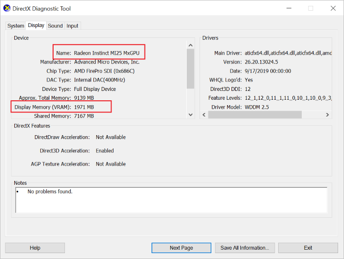

# Install AMD GPU drivers on N-series VMs running Windows

To take advantage of the GPU capabilities of the new Azure NVv4 series VMs running Windows, AMD GPU drivers must be installed. The AMD driver extension will be available in the coming weeks. This article provides supported operating systems, drivers, and manual installation and verification steps.

For basic specs, storage capacities, and disk details, see [GPU Windows VM sizes](sizes-gpu.md?toc=%2fazure%2fvirtual-machines%2fwindows%2ftoc.json).

## Supported operating systems and drivers

| OS | Driver |
| -------- |------------- |
| Windows 10 EVD - Build 1903   Windows 10 - Build 1809  Windows Server 2016  Windows Server 2019 | [19.Q4.1](https://download.microsoft.com/download/7/e/5/7e558ac0-3fff-413d-af62-800285a2fc53/Radeon-Pro-Software-for-Enterprise-19.Q4.1-Technical-Preview.exe) (.exe) |

## Driver installation

1. Connect by Remote Desktop to each NVv4-series VM.

1. Download and extract the driver setup files. Navigate to the folder and run 'setup.exe' to install the supported driver for your Windows operating system.

## Verify driver installation

You can verify driver installation in Device Manager. The following example shows successful configuration of the Radeon Instinct MI25 card on an Azure NVv4 VM.
 

You can use dxdiag to verify the GPU display properties including the video RAM. The following example shows a 1/8th partition of the Radeon Instinct MI25 card on an Azure NVv4 VM.
 

