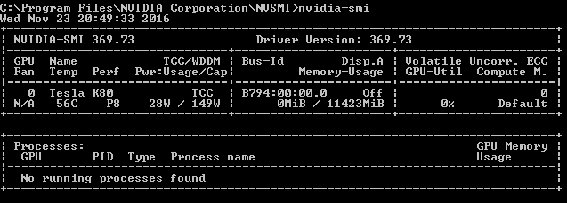

---
title: Azure N-series NVIDIA GPU driver setup for Windows 
description: How to set up NVIDIA GPU drivers for N-series VMs running Windows Server or Windows in Azure
author: vikancha-MSFT
manager: jkabat
ms.service: virtual-machines-windows
ms.topic: how-to
ms.tgt_pltfrm: vm-windows
ms.workload: infrastructure-services
ms.date: 09/24/2018
ms.author: vikancha
ms.custom: H1Hack27Feb2017
---
# Install NVIDIA GPU drivers on N-series VMs running Windows 

To take advantage of the GPU capabilities of Azure N-series VMs backed by NVIDIA GPUs, you must install NVIDIA GPU drivers. The [NVIDIA GPU Driver Extension](../extensions/hpccompute-gpu-windows.md) installs appropriate NVIDIA CUDA or GRID drivers on an N-series VM. Install or manage the extension using the Azure portal or tools such as Azure PowerShell or Azure Resource Manager templates. See the [NVIDIA GPU Driver Extension documentation](../extensions/hpccompute-gpu-windows.md) for supported operating systems and deployment steps.

If you choose to install NVIDIA GPU drivers manually, this article provides supported operating systems, drivers, and installation and verification steps. Manual driver setup information is also available for [Linux VMs](../linux/n-series-driver-setup.md?toc=%2fazure%2fvirtual-machines%2flinux%2ftoc.json).

For basic specs, storage capacities, and disk details, see [GPU Windows VM sizes](sizes-gpu.md?toc=%2fazure%2fvirtual-machines%2fwindows%2ftoc.json). 

[!INCLUDE [virtual-machines-n-series-windows-support](../../../includes/virtual-machines-n-series-windows-support.md)]

## Driver installation

1. Connect by Remote Desktop to each N-series VM.

2. Download, extract, and install the supported driver for your Windows operating system.

After GRID driver installation on a VM, a restart is required. After CUDA driver installation, a restart is not required.

## Verify driver installation

Please note that the Nvidia Control panel is only accessible with the GRID driver installation. If you have installed CUDA drivers then the Nvidia control panel will not be visible.

You can verify driver installation in Device Manager. The following example shows successful configuration of the Tesla K80 card on an Azure NC VM.


To query the GPU device state, run the [nvidia-smi](https://developer.nvidia.com/nvidia-system-management-interface) command-line utility installed with the driver.

1. Open a command prompt and change to the **C:\Program Files\NVIDIA Corporation\NVSMI** directory.

2. Run `nvidia-smi`. If the driver is installed, you will see output similar to the following. The **GPU-Util** shows **0%** unless you are currently running a GPU workload on the VM. Your driver version and GPU details may be different from the ones shown.

  

## RDMA network connectivity

RDMA network connectivity can be enabled on RDMA-capable N-series VMs such as NC24r deployed in the same availability set or in a single placement group in a virtual machine scale set. The HpcVmDrivers extension must be added to install Windows network device drivers that enable RDMA connectivity. To add the VM extension to an RDMA-enabled N-series VM, use [Azure PowerShell](/powershell/azure/overview) cmdlets for Azure Resource Manager.

To install the latest version 1.1 HpcVMDrivers extension on an existing RDMA-capable VM named myVM in the West US region:
  ```powershell
  Set-AzVMExtension -ResourceGroupName "myResourceGroup" -Location "westus" -VMName "myVM" -ExtensionName "HpcVmDrivers" -Publisher "Microsoft.HpcCompute" -Type "HpcVmDrivers" -TypeHandlerVersion "1.1"
  ```
  For more information, see [Virtual machine extensions and features for Windows](extensions-features.md).

The RDMA network supports Message Passing Interface (MPI) traffic for applications running with [Microsoft MPI](https://docs.microsoft.com/message-passing-interface/microsoft-mpi) or Intel MPI 5.x. 


## Next steps

* Developers building GPU-accelerated applications for the NVIDIA Tesla GPUs can also download and install the latest [CUDA Toolkit](https://developer.nvidia.com/cuda-downloads). For more information, see the [CUDA Installation Guide](https://docs.nvidia.com/cuda/cuda-installation-guide-microsoft-windows/index.html#axzz4ZcwJvqYi).


