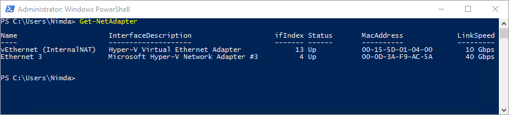
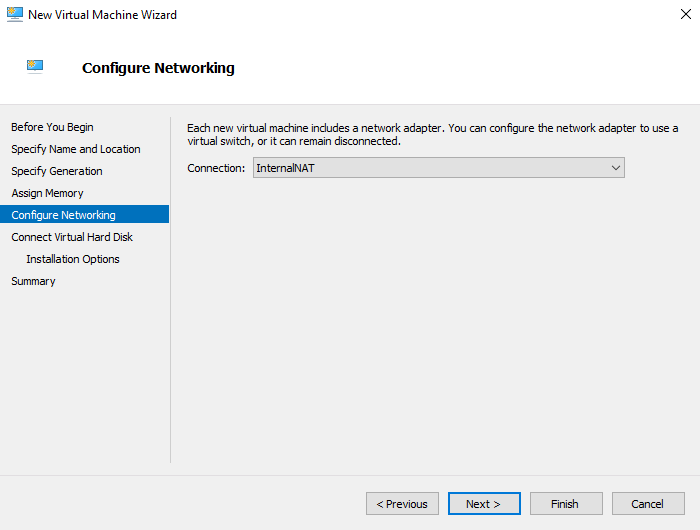
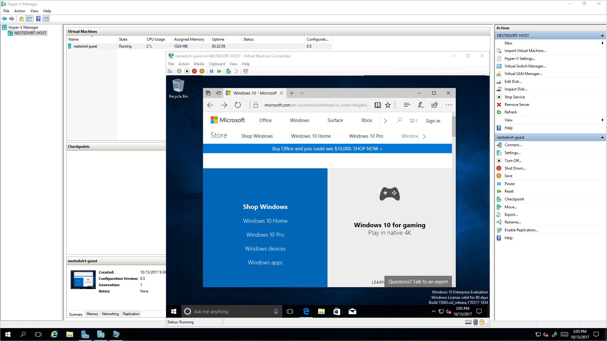

# How to enable nested virtualization in an Azure VM

Nested virtualization is supported in several Azure virtual machine families. This capability provides great flexibility in supporting scenarios such as development, testing, training, and demonstration environments.   

This article steps through enabling Hyper-V on an Azure VM and configuring Internet connectivity to that guest virtual machine.

## Create a nesting capable Azure VM

Create a new Windows Server 2016 Azure VM. For a complete list of virtual machine sizes that support nesting, check out the [Azure Compute Unit article](acu.md).

Remember to choose a VM size large enough to support the demands of a guest virtual machine. In this example, we are using a D3_v3 size Azure VM. 

You can view the regional availability of Dv3 or Ev3 series virtual machines [here](https://azure.microsoft.com/regions/services/).

>[!NOTE]
>
>For detailed instructions on creating a new virtual machine, see [Create and Manage Windows VMs with the Azure PowerShell module](https://docs.microsoft.com/azure/virtual-machines/windows/tutorial-manage-vm)
    
## Connect to your Azure VM

Create a remote desktop connection to the virtual machine.

1. Click the **Connect** button on the virtual machine properties. A Remote Desktop Protocol file (.rdp file) is created and downloaded.

2. To connect to your VM, open the downloaded RDP file. If prompted, click **Connect**. On a Mac, you need an RDP client such as this [Remote Desktop Client](https://apps.apple.com/app/microsoft-remote-desktop/id1295203466?mt=12) from the Mac App Store.

3. Enter the user name and password you specified when creating the virtual machine, then click **Ok**.

4. You may receive a certificate warning during the sign-in process. Click **Yes** or **Continue** to proceed with the connection.

## Enable the Hyper-V feature on the Azure VM
You can configure these settings manually or we have provided a PowerShell script to automate the configuration.

### Option 1: Use a PowerShell script to configure nested virtualization
A PowerShell script to enable nested virtualization on a Windows Server 2016 host is available on [GitHub](https://github.com/charlieding/Virtualization-Documentation/tree/live/hyperv-tools/Nested). The script checks pre-requisites and then configures nested virtualization on the Azure VM. A restart of the Azure VM is necessary to complete the configuration. This script may work in other environments but is not guaranteed. 
Check out the Azure blog post with a live video demonstration on nested virtualization running on Azure! https://aka.ms/AzureNVblog.

### Option 2: Configure nested virtualization manually

1. On the Azure VM, open PowerShell as an Administrator. 

2. Enable the Hyper-V feature and Management Tools.

    ```powershell
    Install-WindowsFeature -Name Hyper-V -IncludeManagementTools -Restart
    ```

    >[!WARNING] 
    >
    >This command restarts the Azure VM. You will lose your RDP connection during the restart process.
    
3. After the Azure VM restarts, reconnect to your VM using RDP.

## Set up internet connectivity for the guest virtual machine
Create a new virtual network adapter for the guest virtual machine and configure a NAT Gateway to enable Internet connectivity.

### Create a NAT virtual network switch

1. On the Azure VM, open PowerShell as an Administrator.
   
2. Create an internal switch.

    ```powershell
    New-VMSwitch -Name "InternalNAT" -SwitchType Internal
    ```

3. View the properties of the switch and note the ifIndex for the new adapter.

    ```powershell
    Get-NetAdapter
    ```

    

    >[!NOTE] 
    >
    >Take note of the "ifIndex" for the virtual switch you just created.
    
4. Create an IP address for the NAT Gateway.
    
In order to configure the gateway, you need some information about your network:    
  * IPAddress - The NAT Gateway IP specifies the IPv4 or IPv6 address to use as the default gateway address for the virtual network subnet. The generic form is a.b.c.1 (for example, "192.168.0.1"). While the final position doesn't have to be .1, it usually is (based on prefix length). Typically you should use an RFC 1918 private network address space. 
  * PrefixLength - The subnet prefix length defines the local subnet size (subnet mask). The subnet prefix length will be an integer value between 0 and 32. 0 would map the entire internet, 32 would only allow one mapped IP. Common values range from 24 to 12 depending on how many IPs need to be attached to the NAT. A common PrefixLength is 24 -- this is a subnet mask of 255.255.255.0.
  * InterfaceIndex - **ifIndex** is the interface index of the virtual switch created in the previous step. 

    ```powershell
    New-NetIPAddress -IPAddress 192.168.0.1 -PrefixLength 24 -InterfaceIndex 13
    ```

### Create the NAT network

In order to configure the gateway, you will need to provide information about the network and NAT Gateway:
  * Name - This is the name of the NAT network. 
  * InternalIPInterfaceAddressPrefix - The NAT subnet prefix describes both the NAT Gateway IP prefix from above as well as the NAT Subnet Prefix Length from above. The generic form will be a.b.c.0/NAT Subnet Prefix Length. 

In PowerShell, create a new NAT network.
```powershell
New-NetNat -Name "InternalNat" -InternalIPInterfaceAddressPrefix 192.168.0.0/24
```


## Create the guest virtual machine

>[!IMPORTANT] 
>
>The Azure guest agent is not supported on nested VMs, and may cause issues on both the host and nested VMs. Don't install the Azure agent on nested VMs, and don't use an image for creating the nested VMs that already has the Azure guest agent installed.

1. Open Hyper-V Manager and create a new virtual machine. Configure the virtual machine to use the new Internal network you created.
    
    
    
2. Install an operating system on the guest virtual machine.
    
    >[!NOTE] 
    >
    >You need installation media for an operating system to install on the VM. In this case we are using Windows 10 Enterprise.

## Assign an IP address to the guest virtual machine

You can assign an IP address to the guest virtual machine either by manually setting a static IP address on the guest virtual machine or configuring DHCP on the Azure VM to assign the IP address dynamically.

###  Option 1: Configure DHCP to dynamically assign an IP address to the guest virtual machine
Follow the steps below to configure DHCP on the host virtual machine for dynamic address assignment.

#### Install DCHP Server on the Azure VM

1. Open Server Manager. On the Dashboard, click **Add roles and features**. The Add Roles and Features Wizard appears.
  
2. In wizard, click **Next** until the Server Roles page.
  
3. Click to select the **DHCP Server** checkbox, click **Add Features**, and then click **Next** until you complete the wizard.
  
4. Click **Install**.

#### Configure a new DHCP scope

1. Open DHCP Manager.
  
2. In the navigation pane, expand the server name, right-click **IPv4**, and click **New Scope**. The New Scope Wizard appears, click **Next**.
  
3. Enter a Name and Description for the scope and click **Next**.
  
4. Define an IP Range for your DCHP Server (for example, 192.168.0.100 to 192.168.0.200).
  
5. Click **Next** until the Default Gateway page. Enter the IP Address you created earlier (for example, 192.168.0.1) as the Default Gateway, then click **Add**.
  
6. Click **Next** until the wizard completes, leaving all default values, then click **Finish**.
    
### Option 2: Manually set a static IP address on the guest virtual machine
If you did not configure DHCP to dynamically assign an IP address to the guest virtual machine, follow these steps to set a static IP address.

1. On the Azure VM, open PowerShell as an Administrator.

2. Right-click the guest virtual machine and click Connect.

3. Sign in to the guest virtual machine.

4. On the guest virtual machine, open the Network and Sharing Center.

5. Configure the network adapter for an address within the range of the NAT network you created in the previous section.

In this example you will use an address in the 192.168.0.0/24 range.

## Test connectivity in guest virtual machine

In the guest virtual machine, open your browser and navigate to a web page.
    

## Set up intranet connectivity for the guest virtual machine

For instructions on how to enable transparent connectivity between Guest VMs and Azure VMs, please reference [this document](https://docs.microsoft.com/virtualization/hyper-v-on-windows/user-guide/nested-virtualization-azure-virtual-network).
