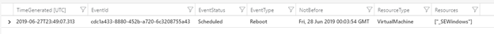

# Set up notifications about maintenance affecting your VM

Updates are applied to different parts of Azure every day,  to keep the services running on them secure and up to date. In addition to planned updates, unplanned events may also occur. For example, if any hardware degradation or fault is detected, Azure services may need to perform unplanned maintenance. Using live migration, memory preserving updates and generally keeping a strict bar on the impact of updates, in most cases these events are almost transparent to customers, and they have no impact or at most cause a few seconds of virtual machine freeze. However, for some particular applications, even a few seconds of virtual machine freeze could cause impact and knowing in advance about upcoming Azure maintenance is important, to ensure the best experience for those applications. [Scheduled Events](scheduled-events.md) provides you a programmatic interface to be notified about upcoming maintenance and enables you to gracefully handle the maintenance. 

In this article, we will show how you can leverage scheduled events to be notified about maintenance events that could be affecting your VMs and build some basic automation that can help with monitoring and analysis.


## Routing scheduled events to Log Analytics

Scheduled Events is available as part of the [Azure Instance Metadata Service](instance-metadata-service.md), which is available on every Azure virtual machine. Customers can write automation to query the endpoint of their virtual machines to discover scheduled maintenance and perform mitigations, like saving the state and taking the virtual machine out of rotation. We recommend building automation toensure high availability, using Scheduled Events. A first step would be to record the Scheduled Events so you can have an auditing log of Azure maintenance events. 

In this article, we will walk you through how to capture maintenance Scheduled Events to Log Analytics. Then, we will trigger some basic notification actions, like sending an email to your team and getting a historical view of all events that have affected your virtual machines. For the event aggregation and automation we will use [Log Analytics](/azure/azure-monitor/learn/quick-create-workspace), but you can use any monitoring solution to collect these logs and trigger automation.


## Set up steps

1.	Create a [Windows Virtual Machine in an Availability Set](tutorial-availability-sets.md). Scheduled Events provide notifications about changes that can affect any of the virtual machines in your availability set, Cloud Service, Virtual Machine Scale Set or standalone VMs. In this example, the Azure Virtual machines were part of an Availability Set. We will be running a [service](https://github.com/microsoft/AzureScheduledEventsService) that polls for scheduled events on one of the VMs that will act as a collector, to get events for all of the other VMs in the availability set.    
------

Go through the tutorial and create the 2 initial VMs.

Don't delete the group. Create a 3rd VM called myCollectorVM in the same availability set, but have the 3rd VM use the custom script extension to install the PowerShell script:

New-AzVm `
   -ResourceGroupName "myResourceGroupAvailability" `
   -Name "myCollectorVM" `
   -Location "East US" `
   -VirtualNetworkName "myVnet" `
   -SubnetName "mySubnet" `
   -SecurityGroupName "myNetworkSecurityGroup" `
   -PublicIpAddressName "myPublicIpAddress3" `
   -AvailabilitySetName "myAvailabilitySet" `
   -Credential $cred
   
$fileUri = @("https://raw.githubusercontent.com/microsoft/AzureScheduledEventsService/master/Powershell/SchService.ps1")
$settings = @{"fileUris" = $fileUri};
$protectedSettings = @{"commandToExecute" = "powershell -ExecutionPolicy Unrestricted -File SchService.ps1 -Setup; powershell -ExecutionPolicy Unrestricted -File SchService.ps1 -Start"};

Set-AzVMExtension `
    -ResourceGroupName "myResourceGroupAvailability"  `
    -ExtensionName "Collector" `
    -VMName "myCollectorVM" `
    -Location "East US" `
    -Publisher Microsoft.Compute `
    -ExtensionType CustomScriptExtension `
    -TypeHandlerVersion 1.9 `
	-Settings $settings `
    -ProtectedSettings $protectedSettings 
	
	


1.	[Create a Log Analytics workspace](/azure/azure-monitor/learn/quick-create-workspace). The Log Analytics workspace acts as a repository and we will [configure event log collection](/azure/azure-monitor/platform/agent-data-sources#configuring-data-sources) to capture the Windows application logs. Make sure you select the **Information event** type for **Application**.
1.	Connect the virtual machine to the workspace. To route the Scheduled Events to the Events Log, which will be saved as Application log by our service, you will need to connect your virtual machine to your Log Analytics workspace.  To connect the Virtual Machine to Log Analytics from the Azure portal, go to your Log Analytics workspace , find your virtual machine and click on “Connect”. This will install the [Microsoft Monitoring agent](/azure/virtual-machines/extensions/oms-windows) in your virtual machine, which will import all the Windows events to Log Analytics. 


>![NOTE] 
>In this example, the virtual machines were are in an availability set, which enabled us to designate a single virtual machine as the collector to listen and route scheduled events to our log analytics works space. If you have standalone virtual machines, you can run the service on every virtual machine, and then connect them individually to your log analytics workspace.
>
>For our setup, we chose Windows, but you can design a similar solution on Linux as schedule events is also supported on Linux


## Capturing and exporting Scheduled Events

In our setup, we are running a service on our Windows virtual machine that polls the [instance metadata service endpoint](/azure/azure-monitor/learn/quick-create-workspace) for scheduled event and logs the events to Windows Application logs. You can download the powershell based script from [https://github.com/microsoft/AzureScheduledEventsService](https://github.com/microsoft/AzureScheduledEventsService) and copy the script to the Windows Azure Virtual machine that’s going to run Schedule Event service. 

On your VM, open a PowerShell prompt and run the following command to setup the service.

```powershell
.\SchService.ps1 -Setup
```

Start the service.

```powershell
.\SchService.ps1 -Start
```

The service will now start polling every 10 seconds for any scheduled events and approve the events to expedite the maintenance.  Freeze, Reboot, Redeploy and Preempt are the events captured by Schedule events.   Note that you can extend the script to trigger some mitigations prior to approving the event.

Validate the service status and make sure it is running.

```powershell
.\SchService.ps1 -status  
```

Once the service is setup and started, it will log events in the Windows Application logs.   To verify this works, restart one of the virtual machines and you should see an event being logged in your Azure Windows virtual machine application logs. 

When any of the above events are captured by Schedule Event service, it will get logged in the Application Event Log as below with Event Status, Event Type, Resources (Virtual machine names) and NotBefore (minimum notice period). You can locate the events with ID 1234 in the Application Event Log.


The Microsoft Monitoring Agent running on this Virtual Machine will import these events to your Log Analytics workspace. 


!{NOTE}
>There will be some latency with Log Analytics, and it may take up to 10 minutes before the log is available. You can use any monitoring solution to collect these events and fire an alert to trigger automation.  

At any point you can stop/remove the Scheduled Event Service by using the switches `–stop` and `–remove`.

## Creating an alert rule with Azure Monitor 

Once the events are pushed to Log Analytics, you can run the following [query](/azure/azure-monitor/log-query/get-started-portal) to look for the schedule Events.

```
Event
| where EventLog == "Application" and Source contains "AzureScheduledEvents" and RenderedDescription contains "Scheduled" and RenderedDescription contains "EventStatus" 
| project TimeGenerated, RenderedDescription
| extend ReqJson= parse_json(RenderedDescription)
| extend EventId = ReqJson["EventId"]
,EventStatus = ReqJson["EventStatus"]
,EventType = ReqJson["EventType"]
,NotBefore = ReqJson["NotBefore"]
,ResourceType = ReqJson["ResourceType"]
,Resources = ReqJson["Resources"]
| project-away RenderedDescription,ReqJson
```

The query will display a table similar to this:




 
You can use the same query to create an alert rule. To create an alert rule, you need an [action group](/azure/azure-monitor/platform/action-groups). An action group is used to define an action for an alert. You can use this to send an Email or SMS message to your team, or wire up other automation using Webhooks or a Logic App.
     
## Next steps

