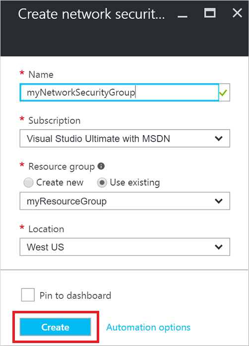
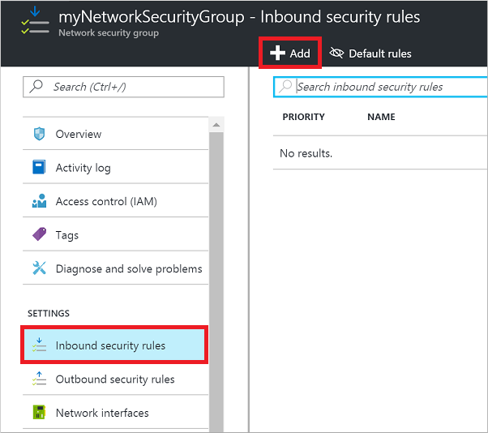
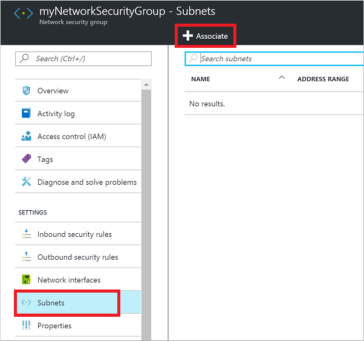
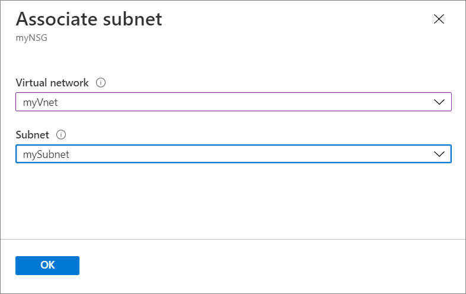

# How to open ports to a virtual machine with the Azure portal
[!INCLUDE [virtual-machines-common-nsg-quickstart](../../../includes/virtual-machines-common-nsg-quickstart.md)]

## Sign in to Azure
Sign in to the Azure portal at https://portal.azure.com.

## Create a network security group

1. Search for and select the resource group for the VM, choose **Add**, then search for and select **Network security group**.

2. Select **Create**.

    The **Create network security group** window opens.

    

2. Enter a name for your network security group. 

3. Select or create a resource group, then select a location.

4. Select **Create** to create the network security group.

## Create an inbound security rule

1. Select your new network security group. 

2. Select **Inbound security rules**, then select **Add**.

    

3. Select **Advanced**. 

4. Choose a common **Service** from the drop-down menu, such as **HTTP**. You can also select **Custom** if you want to provide a specific port to use. 

5. Optionally, change the **Priority** or **Name**. The priority affects the order in which rules are applied: the lower the numerical value, the earlier the rule is applied.

6. Select **Add** to create the rule.

## Associate your network security group with a subnet

Your final step is to associate your network security group with a subnet or a specific network interface. For this example, we'll associate the network security group with a subnet. 

1. Select **Subnets**, then select **Associate**.

    

2. Select your virtual network, and then select the appropriate subnet.

    

    Any VMs you connect to that subnet are now reachable on port 80.

## Additional information

You can also [perform the steps in this article by using Azure PowerShell](nsg-quickstart-powershell.md).

The commands described in this article allow you to quickly get traffic flowing to your VM. Network security groups provide many great features and granularity for controlling access to your resources. For more information, see [Filter network traffic with a network security group](../../virtual-network/tutorial-filter-network-traffic.md).

For highly available web applications, consider placing your VMs behind an Azure load balancer. The load balancer distributes traffic to VMs, with a network security group that provides traffic filtering. For more information, see [Load balance Windows virtual machines in Azure to create a highly available application](tutorial-load-balancer.md).

## Next steps
In this article, you created a network security group, created an inbound rule that allows HTTP traffic on port 80, and then associated that rule with a subnet. 

You can find information on creating more detailed environments in the following articles:
- [Azure Resource Manager overview](../../azure-resource-manager/resource-group-overview.md)
- [Security groups](../../virtual-network/security-overview.md)