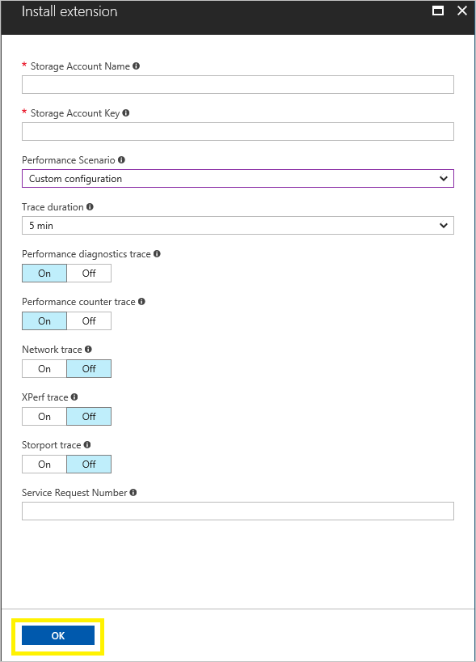
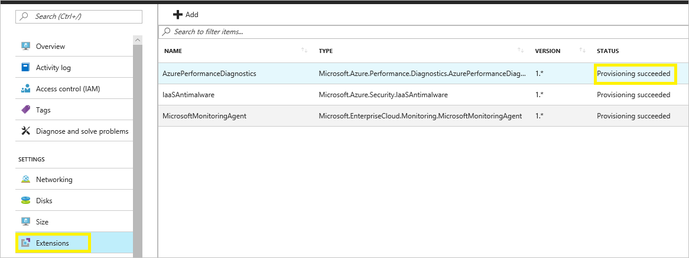

# Azure Performance Diagnostics VM Extension for Windows

## Summary
Azure Performance Diagnostics VM Extension helps collect performance diagnostic data from Windows VMs, performs analysis and provides a report of findings & recommendations to identify and resolve performance issues on the virtual machine. This extension installs a troubleshooting tool called [PerfInsights](http://aka.ms/perfinsights).

## Prerequisites
### Operating Systems
This extension can be installed on Windows Server 2008 R2, 2012, 2012 R2, 2016; Windows 8.1 and Windows 10 operating systems.

## Extension Schema
The following JSON shows the schema for the Azure Performance Diagnostics Extension. This extension requires the name and key for a Storage Account to storage the diagnostics output and report. These values are sensitive and should be stored inside protected setting configuration. Azure VM extension protected setting data is encrypted, and only decrypted on the target virtual machine. Note that storageAccountName and storageAccountKey are case-sensitive. Other required parameters are listed in the section below.

```JSON
    {
      "name": "[concat(parameters('vmName'),'/AzurePerformanceDiagnostics')]",
      "type": "Microsoft.Compute/virtualMachines/extensions",
      "location": "[parameters('location')]",
      "apiVersion": "2015-06-15",
      "properties": {
        "publisher": "Microsoft.Azure.Performance.Diagnostics",
        "type": "AzurePerformanceDiagnostics",
        "typeHandlerVersion": "1.0",
        "autoUpgradeMinorVersion": true,
        "settings": {
            "performanceScenario": "[parameters('performanceScenario')]",
			      "traceDurationInSeconds": "[parameters('traceDurationInSeconds')]",
			      "diagnosticsTrace": "[parameters('diagnosticsTrace')]",
			      "perfCounterTrace": "[parameters('perfCounterTrace')]",
			      "networkTrace": "[parameters('networkTrace')]",
			      "xperfTrace": "[parameters('xperfTrace')]",
			      "storPortTrace": "[parameters('storPortTrace')]",
            "srNumber": "[parameters('srNumber')]",
            "requestTimeUtc":  "[parameters('requestTimeUtc')]"
        },
		  "protectedSettings": {
            "storageAccountName": "[parameters('storageAccountName')]",
            "storageAccountKey": "[parameters('storageAccountKey')]"		
		    }
      }
    }
```

### Property values

|   **Name**   |**Value / Example**|       **Description**      |
|--------------|-------------------|----------------------------|
|apiVersion|2015-06-15|Version of the API
|publisher|Microsoft.Azure.Performance.Diagnostics|Publisher namespace for the extension
|type|AzurePerformanceDiagnostics|Type of the VM extension
|typeHandlerVersion|1.0|Version of the Extension Handler
|performanceScenario|basic|Performance scenario to capture the data for. Valid values are: **basic**, **vmslow**, **azurefiles**, and **custom**.
|traceDurationInSeconds|300|Duration of the Traces if any of the trace options are selected.
|DiagnosticsTrace|d|Option to enable Diagnostic Trace. Valid values are **d** or empty value. If you do not want to capture this trace, just leave the value as empty.
|perfCounterTrace|p|Option to enable Performance Counter Trace. Valid values are **p** or empty value. If you do not want to capture this trace, just leave the value as empty.
|networkTrace|n|Option to enable Netmon Trace. Valid values are **n** or empty value. If you do not want to capture this trace, just leave the value as empty.
|xperfTrace|x|Option to enable XPerf Trace. Valid values are **x** or empty value. If you do not want to capture this trace, just leave the value as empty.
|storPortTrace|s|Option to enable StorPort Trace. Valid values are s or empty value. If you do not want to capture this trace, just leave the value as empty.
|srNumber|123452016365929|Support Ticket Number if available. Leave as empty if you don’t have it.
|requestTimeUtc|9/2/2017 11:06:00 PM|Current Date Time in Utc. You do not need to provide this value if you are using the portal to install this extension.
|storageAccountName|mystorageaccount|Name of the Storage account to store the diagnostics logs and results.
|storageAccountKey|lDuVvxuZB28NNP…hAiRF3voADxLBTcc==|Key for the storage account.

## Install the extension

Follow these steps to install the VM Extension on Windows Virtual Machines:

1. Log on to the [Azure portal](http://portal.azure.com).
2. Select the virtual machine where you want to install this extension.

    
3. Select **Extensions** blade and click the **Add** button.

    
4. Select Azure Performance Diagnostics Extension, Review the Terms and conditions and click the **Create** button.

    
5. Provide the parameter values for the installation and click **OK** to install the extension. You can find more information on the supported troubleshooting scenarios [here](how-to-use-perfInsights.md#supported-troubleshooting-scenarios). 

    
6. Once the installation is successful, you will see a message indicating provisioning succeeded.

    

    > [!NOTE]
    > The extension execution will start once the provisioning is succeeded and it will take couple of minutes or less to complete the execution for basic scenario. For other scenarios, it will run through the duration specified during the installation.

## Remove the extension
To remove the extension from a virtual machine, follow these steps:

1. Log on to the [Azure portal](http://portal.azure.com), select the virtual machine where you want to remove this extension and then select Extensions blade. 
2. Click the (**…**) for Performance Diagnostics Extension entry from the list and select uninstall.

    

    > [!NOTE]
    > You may also select the extension entry and select Uninstall option.

## Template Deployment
Azure VM extensions can be deployed with Azure Resource Manager templates. The JSON schema detailed in the previous section can be used in an Azure Resource Manager template to run the Azure Performance Diagnostics extension during an Azure Resource Manager template deployment. Here is a sample template that can be used with Template deployment:

````
{
  "$schema": "http://schema.management.azure.com/schemas/2015-01-01/deploymentTemplate.json#",
  "contentVersion": "1.0.0.0",
  "parameters": {
    "vmName": {
      "type": "string",
	  "defaultValue": "yourVMName"
    },
    "location": {
      "type": "string",
	  "defaultValue": "southcentralus"
    },
    "storageAccountName": {
      "type": "securestring"
	  "defaultValue": "yourStorageAccount"
    },
    "storageAccountKey": {
      "type": "securestring"
	  "defaultValue": "yourStorageAccountKey"
    },
    "performanceScenario": {
      "type": "string",
	  "defaultValue": "basic"
    },
    "srNumber": {
      "type": "string",
	  "defaultValue": ""
    },
	"traceDurationInSeconds": {
	  "type": "int",
    "defaultValue": 300
	},
    "diagnosticsTrace": {
      "type": "string",
	  "defaultValue": "d"
    },
    "perfCounterTrace": {
      "type": "string",
	  "defaultValue": "p"
    },
    "networkTrace": {
      "type": "string",
	  "defaultValue": ""
    },
    "xperfTrace": {
      "type": "string",
	  "defaultValue": ""
    },
    "storPortTrace": {
      "type": "string",
	  "defaultValue": ""
    },
    "requestTimeUtc": {
	  "type": "string",
      "defaultValue": "10/2/2017 11:06:00 PM"
    }		
  },
  "resources": [
    {
      "name": "[concat(parameters('vmName'),'/AzurePerformanceDiagnostics')]",
      "type": "Microsoft.Compute/virtualMachines/extensions",
      "location": "[parameters('location')]",
      "apiVersion": "2015-06-15",
      "properties": {
        "publisher": "Microsoft.Azure.Performance.Diagnostics",
        "type": "AzurePerformanceDiagnostics",
        "typeHandlerVersion": "1.0",
        "autoUpgradeMinorVersion": true,
        "settings": {
            "performanceScenario": "[parameters('performanceScenario')]",
			      "traceDurationInSeconds": "[parameters('traceDurationInSeconds')]",
			      "diagnosticsTrace": "[parameters('diagnosticsTrace')]",
			      "perfCounterTrace": "[parameters('perfCounterTrace')]",
			      "networkTrace": "[parameters('networkTrace')]",
			      "xperfTrace": "[parameters('xperfTrace')]",
			      "storPortTrace": "[parameters('storPortTrace')]",
            "srNumber": "[parameters('srNumber')]",
            "requestTimeUtc":  "[parameters('requestTimeUtc')]"
        },
		  "protectedSettings": {
            "storageAccountName": "[parameters('storageAccountName')]",
            "storageAccountKey": "[parameters('storageAccountKey')]"		
		    }
      }
    }
  ]
}
````

## PowerShell Deployment
The `Set-AzureRmVMExtension` command can be used to deploy the Azure Performance Diagnostics virtual machine extension to an existing virtual machine. Before running the command, the public and private configurations need to be stored in a PowerShell hash table.

PowerShell

````
$PublicSettings = @{ "performanceScenario" = "basic"; "traceDurationInSeconds" = 300; "diagnosticsTrace" = "d"; "perfCounterTrace" = "p"; "networkTrace" = ""; "xperfTrace" = ""; "storPortTrace" = ""; "srNumber" = ""; "requestTimeUtc" = "2017-09-28T22:08:53.736Z" }
$ProtectedSettings = @{"storageAccountName" = "mystorageaccount" ; "storageAccountKey" = "mystoragekey"}

Set-AzureRmVMExtension -ExtensionName "AzurePerformanceDiagnostics" `
    -ResourceGroupName "myResourceGroup" `
    -VMName "myVM" `
    -Publisher "Microsoft.Azure.Performance.Diagnostics" `
    -ExtensionType "AzurePerformanceDiagnostics" `
    -TypeHandlerVersion 1.0 `
    -Settings $PublicSettings `
    -ProtectedSettings $ProtectedSettings `
    -Location WestUS `
````

## Information on the data captured
PerfInsights Tool collects various logs, configuration, diagnostic data etc. depending on the selected scenario. For more information on the data collected per scenario please visit [PerfInsights documentation](http://aka.ms/perfinsights).

## View and Share the results

Output of the extension is stored inside a folder named log_collection under Temp drive (usually D:\log_collection) by default. Under this folder, you can see zip file(s) containing the diagnostic logs and a report with findings and recommendations.

The zip file created is also uploaded to the storage account provided during the installation and is shared for 30 days using [Shared Access Signatures (SAS)](../../storage/common/storage-dotnet-shared-access-signature-part-1.md). A text file named *zipfilename*_saslink.txt is also created in the log_collection folder. This file contains the SAS link created to download the zip file. Anyone who has this link will be able to download the zip file.

Microsoft may use this SAS link to download the Diagnostics data for further investigation by the Support Engineer working on your support ticket.

To view the report, just extract the zip file and open **PerfInsights Report.html** file.

You may also be able to download the zip file directly from the portal by selecting the extension.


> [!NOTE]
> The SAS link displayed in the portal may not work sometimes due to malformed Url (caused by special characters) during encoding and decoding operation. The workaround is to get the link directly from the *_saslink.txt file from the VM.

## Troubleshoot and support
### Troubleshoot

- Extension deployment status (in the notification area) may show “Deployment in progress” even though the extension is successfully provisioned.

    This issue can be safely ignored as long as the extension status indicates that the extension is successfully provisioned.
- Some issues during installation can be troubleshoot using the extension logs. Extension execution output is logged to files found in the following directory:

        C:\Packages\Plugins\Microsoft.Azure.Performance.Diagnostics.AzurePerformanceDiagnostics

### Support

If you need more help at any point in this article, you can contact the Azure experts on the [MSDN Azure and Stack Overflow forums](https://azure.microsoft.com/support/forums/). Alternatively, you can file an Azure support incident. Go to the [Azure support site](https://azure.microsoft.com/support/options/) and select Get support. For information about using Azure Support, read the [Microsoft Azure support FAQ](https://azure.microsoft.com/support/faq/).
