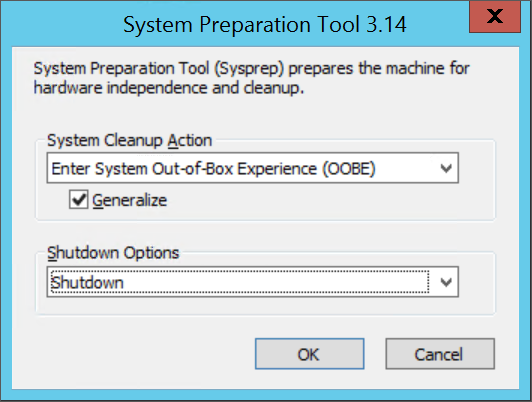

# Prepare a Windows VHD or VHDX to upload to Azure

**Applies to:** :heavy_check_mark: Windows VMs

Before you upload a Windows virtual machine (VM) from on-premises to Azure, you must prepare the
virtual hard disk (VHD or VHDX). Azure supports both generation 1 and generation 2 VMs that are in
VHD file format and that have a fixed-size disk. The maximum size allowed for the OS VHD on a generation 1 VM is 2 TB.

You can convert a VHDX file to VHD, convert a dynamically
expanding disk to a fixed-size disk, but you can't change a VM's generation. For more information,
see
[Should I create a generation 1 or 2 VM in Hyper-V?](/windows-server/virtualization/hyper-v/plan/Should-I-create-a-generation-1-or-2-virtual-machine-in-Hyper-V)
and [Support for generation 2 VMs on Azure](../generation-2.md).

For information about the support policy for Azure VMs, see
[Microsoft server software support for Azure VMs](https://support.microsoft.com/help/2721672/).

> [!NOTE]
> The instructions in this article apply to:
>
> - The 64-bit version of Windows Server 2008 R2 and later Windows Server operating systems. For information about running a 32-bit operating system in Azure, see [Support for 32-bit operating systems in Azure VMs](https://support.microsoft.com/help/4021388/).
> - If any Disaster Recovery tool will be used to migrate the workload, like Azure Site Recovery or Azure Migrate, this process is still required on the Guest OS to prepare the image before the migration.

## System File Checker

### Run Windows System File Checker utility before generalization of OS image

The System File Checker (SFC) is used to verify and replace Windows system files.

> [!IMPORTANT]
> Use an elevated PowerShell session to run the examples in this article.

Run the SFC command:

```powershell
sfc.exe /scannow
```

```Output
Beginning system scan.  This process will take some time.

Beginning verification phase of system scan.
Verification 100% complete.

Windows Resource Protection did not find any integrity violations.
```

After the SFC scan completes, install Windows Updates and restart the computer.

## Set Windows configurations for Azure

> [!NOTE]
> Azure platform mounts an ISO file to the DVD-ROM when a Windows VM is created from a generalized
> image. For this reason, the DVD-ROM must be enabled in the OS in the generalized image. If it is
> disabled, the Windows VM will be stuck at out-of-box experience (OOBE).

1. Remove any static persistent routes in the routing table:

   - To view the routing table, run `route.exe print`.
   - Check the **Persistence Routes** section. If there's a persistent route, use the
     `route.exe delete` command to remove it.

1. Remove the WinHTTP proxy:

   ```powershell
   netsh.exe winhttp reset proxy
   ```

    If the VM needs to work with a specific proxy, add a proxy exception for the Azure IP address
    ([168.63.129.16](../../virtual-network/what-is-ip-address-168-63-129-16.md))
    so the VM can connect to Azure:

    ```
    $proxyAddress='<your proxy server>'
    $proxyBypassList='<your list of bypasses>;168.63.129.16'
    netsh.exe winhttp set proxy $proxyAddress $proxyBypassList
    ```

1. Open DiskPart:

   ```powershell
   diskpart.exe
   ```

   Set the disk SAN policy to [`Onlineall`](/previous-versions/windows/it-pro/windows-server-2012-R2-and-2012/gg252636(v=ws.11)):

   ```DiskPart
   DISKPART> san policy=onlineall
   DISKPART> exit
   ```

1. Set Coordinated Universal Time (UTC) time for Windows. Also, set the startup type of the Windows
   time service **w32time** to **Automatic**:

   ```powershell
   Set-ItemProperty -Path HKLM:\SYSTEM\CurrentControlSet\Control\TimeZoneInformation -Name RealTimeIsUniversal -Value 1 -Type DWord -Force
   Set-Service -Name w32time -StartupType Automatic
   ```

1. Set the power profile to high performance:

   ```powershell
   powercfg.exe /setactive SCHEME_MIN
   powercfg /setacvalueindex SCHEME_CURRENT SUB_VIDEO VIDEOIDLE 0
   ```

1. Make sure the environmental variables **TEMP** and **TMP** are set to their default values:

   ```powershell
   Set-ItemProperty -Path 'HKLM:\SYSTEM\CurrentControlSet\Control\Session Manager\Environment' -Name TEMP -Value "%SystemRoot%\TEMP" -Type ExpandString -Force
   Set-ItemProperty -Path 'HKLM:\SYSTEM\CurrentControlSet\Control\Session Manager\Environment' -Name TMP -Value "%SystemRoot%\TEMP" -Type ExpandString -Force
   ```
1. For VMs with legacy operating systems (Windows Server 2012 R2 or Windows 8.1 and below), make sure the latest Hyper-V Integration Component Services are installed. For more information, see [Hyper-V integration components update for Windows VM](https://support.microsoft.com/topic/hyper-v-integration-components-update-for-windows-virtual-machines-8a74ffad-576e-d5a0-5a2f-d6fb2594f990).

> [!NOTE]
> In a scenario where VMs are to be set up with a disaster recovery solution between the on-premises VMware server and Azure, the Hyper-V Integration Component Services can't be used. If that’s the case, please contact the VMware support to migrate the VM to Azure and make it co-reside in VMware server.

## Check the Windows services

Make sure that each of the following Windows services is set to the Windows default value. These
services are the minimum that must be configured to ensure VM connectivity. To set the startup
settings, run the following example:

```powershell
Get-Service -Name BFE, Dhcp, Dnscache, IKEEXT, iphlpsvc, nsi, mpssvc, RemoteRegistry |
  Where-Object StartType -ne Automatic |
    Set-Service -StartupType Automatic

Get-Service -Name Netlogon, Netman, TermService |
  Where-Object StartType -ne Manual |
    Set-Service -StartupType Manual
```

## Update remote desktop registry settings

Make sure the following settings are configured correctly for remote access:

> [!NOTE]
> If you receive an error message when running
> `Set-ItemProperty -Path 'HKLM:\SOFTWARE\Policies\Microsoft\Windows NT\Terminal Services' -Name <string> -Value <object>`,
> you can safely ignore it. It means the domain isn't setting that configuration through a Group
> Policy Object.

1. Remote Desktop Protocol (RDP) is enabled:

   ```powershell
   Set-ItemProperty -Path 'HKLM:\SYSTEM\CurrentControlSet\Control\Terminal Server' -Name fDenyTSConnections -Value 0 -Type DWord -Force
   Set-ItemProperty -Path 'HKLM:\SOFTWARE\Policies\Microsoft\Windows NT\Terminal Services' -Name fDenyTSConnections -Value 0 -Type DWord -Force
   ```

1. The RDP port is set up correctly using the default port of 3389:

   ```powershell
   Set-ItemProperty -Path 'HKLM:\SYSTEM\CurrentControlSet\Control\Terminal Server\Winstations\RDP-Tcp' -Name PortNumber -Value 3389 -Type DWord -Force
   ```

   When you deploy a VM, the default rules are created for port 3389. To change the port number, do
   that after the VM is deployed in Azure.

1. The listener is listening on every network interface:

   ```powershell
   Set-ItemProperty -Path 'HKLM:\SYSTEM\CurrentControlSet\Control\Terminal Server\Winstations\RDP-Tcp' -Name LanAdapter -Value 0 -Type DWord -Force
   ```

1. Configure network-level authentication (NLA) mode for the RDP connections:

   ```powershell
   Set-ItemProperty -Path 'HKLM:\SYSTEM\CurrentControlSet\Control\Terminal Server\WinStations\RDP-Tcp' -Name UserAuthentication -Value 1 -Type DWord -Force
   ```

1. Set the keep-alive value:

   ```PowerShell
   Set-ItemProperty -Path 'HKLM:\SOFTWARE\Policies\Microsoft\Windows NT\Terminal Services' -Name KeepAliveEnable -Value 1  -Type DWord -Force
   Set-ItemProperty -Path 'HKLM:\SOFTWARE\Policies\Microsoft\Windows NT\Terminal Services' -Name KeepAliveInterval -Value 1  -Type DWord -Force
   Set-ItemProperty -Path 'HKLM:\SYSTEM\CurrentControlSet\Control\Terminal Server\Winstations\RDP-Tcp' -Name KeepAliveTimeout -Value 1 -Type DWord -Force
   ```

1. Set the reconnect options:

   ```PowerShell
   Set-ItemProperty -Path 'HKLM:\SOFTWARE\Policies\Microsoft\Windows NT\Terminal Services' -Name fDisableAutoReconnect -Value 0 -Type DWord -Force
   Set-ItemProperty -Path 'HKLM:\SYSTEM\CurrentControlSet\Control\Terminal Server\Winstations\RDP-Tcp' -Name fInheritReconnectSame -Value 1 -Type DWord -Force
   Set-ItemProperty -Path 'HKLM:\SYSTEM\CurrentControlSet\Control\Terminal Server\Winstations\RDP-Tcp' -Name fReconnectSame -Value 0 -Type DWord -Force
   ```

1. Limit the number of concurrent connections:

   ```powershell
   Set-ItemProperty -Path 'HKLM:\SYSTEM\CurrentControlSet\Control\Terminal Server\Winstations\RDP-Tcp' -Name MaxInstanceCount -Value 4294967295 -Type DWord -Force
   ```

1. Remove any self-signed certificates tied to the RDP listener:

   ```powershell
   if ((Get-Item -Path 'HKLM:\SYSTEM\CurrentControlSet\Control\Terminal Server\WinStations\RDP-Tcp').Property -contains 'SSLCertificateSHA1Hash')
   {
       Remove-ItemProperty -Path 'HKLM:\SYSTEM\CurrentControlSet\Control\Terminal Server\WinStations\RDP-Tcp' -Name SSLCertificateSHA1Hash -Force
   }
   ```

   This code ensures that you can connect when you deploy the VM. You can also review these
   settings after the VM is deployed in Azure.

1. If the VM is part of a domain, check the following policies to make sure the previous settings
   aren't reverted.

    |                 Goal                  |                                                                            Policy                                                                            |                           Value                            |
    | ------------------------------------- | ------------------------------------------------------------------------------------------------------------------------------------------------------------ | ---------------------------------------------------------- |
    | RDP is enabled                        | Computer Configuration\Policies\Windows Settings\Administrative Templates\Components\Remote Desktop Services\Remote Desktop Session Host\Connections         | Allow users to connect remotely by using Remote Desktop    |
    | NLA group policy                      | Settings\Administrative Templates\Components\Remote Desktop Services\Remote Desktop Session Host\Security                                                    | Require user authentication for remote access by using NLA |
    | Keep-alive settings                   | Computer Configuration\Policies\Windows Settings\Administrative Templates\Windows Components\Remote Desktop Services\Remote Desktop Session Host\Connections | Configure keep-alive connection interval                   |
    | Reconnect settings                    | Computer Configuration\Policies\Windows Settings\Administrative Templates\Windows Components\Remote Desktop Services\Remote Desktop Session Host\Connections | Reconnect automatically                                    |
    | Limited number of connection settings | Computer Configuration\Policies\Windows Settings\Administrative Templates\Windows Components\Remote Desktop Services\Remote Desktop Session Host\Connections | Limit number of connections                                |

## Configure Windows Firewall rules

1. Turn on Windows Firewall on the three profiles (domain, standard, and public):

   ```powershell
   Set-NetFirewallProfile -Profile Domain, Public, Private -Enabled True
   ```

1. Run the following example to allow WinRM through the three firewall profiles (domain, private,
   and public), and enable the PowerShell remote service:

   ```powershell
   Enable-PSRemoting -Force
   ```
   
> [!NOTE]
> When this command runs, it enables the appropriate firewall rules automatically.

1. Enable the following firewall rules to allow the RDP traffic:

   ```powershell
   Get-NetFirewallRule -DisplayGroup 'Remote Desktop' | Set-NetFirewallRule -Enabled True
   ```

1. Enable the rule for file and printer sharing so the VM can respond to ping requests inside the
   virtual network:

   ```powershell
   Set-NetFirewallRule -Name FPS-ICMP4-ERQ-In -Enabled True
   ```

1. Create a rule for the Azure platform network:

   ```powershell
   New-NetFirewallRule -DisplayName AzurePlatform -Direction Inbound -RemoteAddress 168.63.129.16 -Profile Any -Action Allow -EdgeTraversalPolicy Allow
   New-NetFirewallRule -DisplayName AzurePlatform -Direction Outbound -RemoteAddress 168.63.129.16 -Profile Any -Action Allow
   ```
  
 > [!IMPORTANT]
 > 168.63.129.16 is a special public IP address that is owned by Microsoft for Azure. For more information, see [What is IP address 168.63.129.16](../../virtual-network/what-is-ip-address-168-63-129-16.md).

1. If the VM is part of a domain, check the following Microsoft Entra policies to make sure the previous
   settings aren't reverted.

    |                 Goal                 |                                                                         Policy                                                                          |                  Value                  |
    | ------------------------------------ | ------------------------------------------------------------------------------------------------------------------------------------------------------- | --------------------------------------- |
    | Enable the Windows Firewall profiles | Computer Configuration\Policies\Windows Settings\Administrative Templates\Network\Network Connection\Windows Firewall\Domain Profile\Windows Firewall   | Protect all network connections         |
    | Enable RDP                           | Computer Configuration\Policies\Windows Settings\Administrative Templates\Network\Network Connection\Windows Firewall\Domain Profile\Windows Firewall   | Allow inbound Remote Desktop exceptions |
    |                                      | Computer Configuration\Policies\Windows Settings\Administrative Templates\Network\Network Connection\Windows Firewall\Standard Profile\Windows Firewall | Allow inbound Remote Desktop exceptions |
    | Enable ICMP-V4                       | Computer Configuration\Policies\Windows Settings\Administrative Templates\Network\Network Connection\Windows Firewall\Domain Profile\Windows Firewall   | Allow ICMP exceptions                   |
    |                                      | Computer Configuration\Policies\Windows Settings\Administrative Templates\Network\Network Connection\Windows Firewall\Standard Profile\Windows Firewall | Allow ICMP exceptions                   |

## Verify the VM

Make sure the VM is healthy, secure, and RDP accessible:

1. To make sure the disk is healthy and consistent, check the disk at the next VM restart:

   ```powershell
   chkdsk.exe /f
   ```

   Make sure the report shows a clean and healthy disk.

1. Set the Boot Configuration Data (BCD) settings.

   ```powershell
   cmd

   bcdedit.exe /set "{bootmgr}" integrityservices enable
   bcdedit.exe /set "{default}" device partition=C:
   bcdedit.exe /set "{default}" integrityservices enable
   bcdedit.exe /set "{default}" recoveryenabled Off
   bcdedit.exe /set "{default}" osdevice partition=C:
   bcdedit.exe /set "{default}" bootstatuspolicy IgnoreAllFailures

   #Enable Serial Console Feature
   bcdedit.exe /set "{bootmgr}" displaybootmenu yes
   bcdedit.exe /set "{bootmgr}" timeout 5
   bcdedit.exe /set "{bootmgr}" bootems yes
   bcdedit.exe /ems "{current}" ON
   bcdedit.exe /emssettings EMSPORT:1 EMSBAUDRATE:115200

   exit
   ```

1. The dump log can be helpful in troubleshooting Windows crash issues. Enable the dump log
   collection:

   ```powershell
   # Set up the guest OS to collect a kernel dump on an OS crash event
   Set-ItemProperty -Path 'HKLM:\SYSTEM\CurrentControlSet\Control\CrashControl' -Name CrashDumpEnabled -Type DWord -Force -Value 2
   Set-ItemProperty -Path 'HKLM:\SYSTEM\CurrentControlSet\Control\CrashControl' -Name DumpFile -Type ExpandString -Force -Value "%SystemRoot%\MEMORY.DMP"
   Set-ItemProperty -Path 'HKLM:\SYSTEM\CurrentControlSet\Control\CrashControl' -Name NMICrashDump -Type DWord -Force -Value 1

   # Set up the guest OS to collect user mode dumps on a service crash event
   $key = 'HKLM:\SOFTWARE\Microsoft\Windows\Windows Error Reporting\LocalDumps'
   if ((Test-Path -Path $key) -eq $false) {(New-Item -Path 'HKLM:\SOFTWARE\Microsoft\Windows\Windows Error Reporting' -Name LocalDumps)}
   New-ItemProperty -Path $key -Name DumpFolder -Type ExpandString -Force -Value 'C:\CrashDumps'
   New-ItemProperty -Path $key -Name CrashCount -Type DWord -Force -Value 10
   New-ItemProperty -Path $key -Name DumpType -Type DWord -Force -Value 2
   Set-Service -Name WerSvc -StartupType Manual
   ```

1. Verify that the Windows Management Instrumentation (WMI) repository is consistent:

   ```powershell
   winmgmt.exe /verifyrepository
   ```

   If the repository is corrupted, see [WMI: Repository corruption or not](https://techcommunity.microsoft.com/t5/ask-the-performance-team/wmi-repository-corruption-or-not/ba-p/375484).

1. Make sure no other applications than TermService are using port 3389. This port is used for the RDP service in
   Azure. To see which ports are used on the VM, run `netstat.exe -anob`:

   ```powershell
   netstat.exe -anob
   ```

   The following is an example.

   ```powershell
   netstat.exe -anob | findstr 3389
   TCP    0.0.0.0:3389           0.0.0.0:0              LISTENING       4056
   TCP    [::]:3389              [::]:0                 LISTENING       4056
   UDP    0.0.0.0:3389           *:*                                    4056
   UDP    [::]:3389              *:*                                    4056

   tasklist /svc | findstr 4056
   svchost.exe                   4056 TermService
   ```

1. To upload a Windows VHD that's a domain controller:

   - Follow [these extra steps](https://support.microsoft.com/kb/2904015) to prepare the disk.

   - Make sure you know the Directory Services Restore Mode (DSRM) password in case you ever have to
     start the VM in DSRM. For more information, see
     [Set a DSRM password](/previous-versions/windows/it-pro/windows-server-2012-R2-and-2012/cc754363(v=ws.11)).

1. Make sure you know the built-in administrator account and password. You might want to reset the
   current local administrator password and make sure you can use this account to sign in to Windows
   through the RDP connection. This access permission is controlled by the "Allow log on through
   Remote Desktop Services" Group Policy Object. View this object in the Local Group Policy Editor:

   - `Computer Configuration\Windows Settings\Security Settings\Local Policies\User Rights Assignment`

1. Check the following Microsoft Entra policies to make sure they're not blocking RDP access:

   - `Computer Configuration\Windows Settings\Security Settings\Local Policies\User Rights
      Assignment\Deny access to this computer from the network`

   - `Computer Configuration\Windows Settings\Security Settings\Local Policies\User Rights
      Assignment\Deny log on through Remote Desktop Services`

1. Check the following Microsoft Entra policy to make sure they're not removing any of the required access
   accounts:

   - `Computer Configuration\Windows Settings\Security Settings\Local Policies\User Rights Assignment\Access this computer from the network`

   The policy should list the following groups:

   - Administrators

   - Backup Operators

   - Everyone

   - Users

1. Restart the VM to make sure that Windows is still healthy and can be reached through the RDP
   connection. At this point, consider creating a VM on your local Hyper-V server to make sure the
   VM starts completely. Then test to make sure you can reach the VM through RDP.

1. Remove any extra Transport Driver Interface (TDI) filters. For example, remove software that
   analyzes TCP packets or extra firewalls.

1. Uninstall any other third-party software or driver that's related to physical components or any
   other virtualization technology.

### Install Windows updates

> [!NOTE]
> To avoid an accidental reboot during the VM provisioning, we recommend completing all Windows update installations and to make sure there’s no pending restart. One way to do this is to install all Windows updates and to reboot the VM before performing the migration to Azure. </br><br>
>If you also need to do a generalization of the OS (sysprep), you must update Windows and restart the VM before running the Sysprep command.

Ideally, you should keep the machine updated to the *patch level*, if this isn't possible, make sure
the following updates are installed. To get the latest updates, see the Windows update history
pages: [Windows 10, and Windows Server 2019](https://support.microsoft.com/help/4000825),
[Windows 8.1, and Windows Server 2012 R2](https://support.microsoft.com/help/4009470) and
[Windows 7 SP1, and Windows Server 2008 R2 SP1](https://support.microsoft.com/help/4009469).

<br />

|        Component        |     Binary     | Windows 7 SP1, Windows Server 2008 R2 SP1 |       Windows 8, Windows Server 2012        | Windows 8.1, Windows Server 2012 R2 | Windows 10 v1607, Windows Server 2016 v1607 |      Windows 10 v1703      | Windows 10 v1709, Windows Server 2016 v1709 | Windows 10 v1803, Windows Server 2016 v1803 |
| ----------------------- | -------------- | ----------------------------------------- | ------------------------------------------- | ----------------------------------- | ------------------------------------------- | -------------------------- | ------------------------------------------- | ------------------------------------------- |
| Storage                 | disk.sys       | 6.1.7601.23403 - KB3125574                | 6.2.9200.17638 / 6.2.9200.21757 - KB3137061 | 6.3.9600.18203 - KB3137061          | -                                           | -                          | -                                           | -                                           |
|                         | storport.sys   | 6.1.7601.23403 - KB3125574                | 6.2.9200.17188 / 6.2.9200.21306 - KB3018489 | 6.3.9600.18573 - KB4022726          | 10.0.14393.1358 - KB4022715                 | 10.0.15063.332             | -                                           | -                                           |
|                         | ntfs.sys       | 6.1.7601.23403 - KB3125574                | 6.2.9200.17623 / 6.2.9200.21743 - KB3121255 | 6.3.9600.18654 - KB4022726          | 10.0.14393.1198 - KB4022715                 | 10.0.15063.447             | -                                           | -                                           |
|                         | Iologmsg.dll   | 6.1.7601.23403 - KB3125574                | 6.2.9200.16384 - KB2995387                  | -                                   | -                                           | -                          | -                                           | -                                           |
|                         | Classpnp.sys   | 6.1.7601.23403 - KB3125574                | 6.2.9200.17061 / 6.2.9200.21180 - KB2995387 | 6.3.9600.18334 - KB3172614          | 10.0.14393.953 - KB4022715                  | -                          | -                                           | -                                           |
|                         | Volsnap.sys    | 6.1.7601.23403 - KB3125574                | 6.2.9200.17047 / 6.2.9200.21165 - KB2975331 | 6.3.9600.18265 - KB3145384          | -                                           | 10.0.15063.0               | -                                           | -                                           |
|                         | partmgr.sys    | 6.1.7601.23403 - KB3125574                | 6.2.9200.16681 - KB2877114                  | 6.3.9600.17401 - KB3000850          | 10.0.14393.953 - KB4022715                  | 10.0.15063.0               | -                                           | -                                           |
|                         | volmgr.sys     |                                           |                                             |                                     |                                             | 10.0.15063.0               | -                                           | -                                           |
|                         | Volmgrx.sys    | 6.1.7601.23403 - KB3125574                | -                                           | -                                   | -                                           | 10.0.15063.0               | -                                           | -                                           |
|                         | Msiscsi.sys    | 6.1.7601.23403 - KB3125574                | 6.2.9200.21006 - KB2955163                  | 6.3.9600.18624 - KB4022726          | 10.0.14393.1066 - KB4022715                 | 10.0.15063.447             | -                                           | -                                           |
|                         | Msdsm.sys      | 6.1.7601.23403 - KB3125574                | 6.2.9200.21474 - KB3046101                  | 6.3.9600.18592 - KB4022726          | -                                           | -                          | -                                           | -                                           |
|                         | Mpio.sys       | 6.1.7601.23403 - KB3125574                | 6.2.9200.21190 - KB3046101                  | 6.3.9600.18616 - KB4022726          | 10.0.14393.1198 - KB4022715                 | -                          | -                                           | -                                           |
|                         | vmstorfl.sys   | 6.3.9600.18907 - KB4072650                | 6.3.9600.18080 - KB3063109                  | 6.3.9600.18907 - KB4072650          | 10.0.14393.2007 - KB4345418                 | 10.0.15063.850 - KB4345419 | 10.0.16299.371 - KB4345420                  | -                                           |
|                         | Fveapi.dll     | 6.1.7601.23311 - KB3125574                | 6.2.9200.20930 - KB2930244                  | 6.3.9600.18294 - KB3172614          | 10.0.14393.576 - KB4022715                  | -                          | -                                           | -                                           |
|                         | Fveapibase.dll | 6.1.7601.23403 - KB3125574                | 6.2.9200.20930 - KB2930244                  | 6.3.9600.17415 - KB3172614          | 10.0.14393.206 - KB4022715                  | -                          | -                                           | -                                           |
| Network                 | netvsc.sys     | -                                         | -                                           | -                                   | 10.0.14393.1198 - KB4022715                 | 10.0.15063.250 - KB4020001 | -                                           | -                                           |
|                         | mrxsmb10.sys   | 6.1.7601.23816 - KB4022722                | 6.2.9200.22108 - KB4022724                  | 6.3.9600.18603 - KB4022726          | 10.0.14393.479 - KB4022715                  | 10.0.15063.483             | -                                           | -                                           |
|                         | mrxsmb20.sys   | 6.1.7601.23816 - KB4022722                | 6.2.9200.21548 - KB4022724                  | 6.3.9600.18586 - KB4022726          | 10.0.14393.953 - KB4022715                  | 10.0.15063.483             | -                                           | -                                           |
|                         | mrxsmb.sys     | 6.1.7601.23816 - KB4022722                | 6.2.9200.22074 - KB4022724                  | 6.3.9600.18586 - KB4022726          | 10.0.14393.953 - KB4022715                  | 10.0.15063.0               | -                                           | -                                           |
|                         | tcpip.sys      | 6.1.7601.23761 - KB4022722                | 6.2.9200.22070 - KB4022724                  | 6.3.9600.18478 - KB4022726          | 10.0.14393.1358 - KB4022715                 | 10.0.15063.447             | -                                           | -                                           |
|                         | http.sys       | 6.1.7601.23403 - KB3125574                | 6.2.9200.17285 - KB3042553                  | 6.3.9600.18574 - KB4022726          | 10.0.14393.251 - KB4022715                  | 10.0.15063.483             | -                                           | -                                           |
|                         | vmswitch.sys   | 6.1.7601.23727 - KB4022719                | 6.2.9200.22117 - KB4022724                  | 6.3.9600.18654 - KB4022726          | 10.0.14393.1358 - KB4022715                 | 10.0.15063.138             | -                                           | -                                           |
| Core                    | ntoskrnl.exe   | 6.1.7601.23807 - KB4022719                | 6.2.9200.22170 - KB4022718                  | 6.3.9600.18696 - KB4022726          | 10.0.14393.1358 - KB4022715                 | 10.0.15063.483             | -                                           | -                                           |
| Remote Desktop Services | rdpcorets.dll  | 6.2.9200.21506 - KB4022719                | 6.2.9200.22104 - KB4022724                  | 6.3.9600.18619 - KB4022726          | 10.0.14393.1198 - KB4022715                 | 10.0.15063.0               | -                                           | -                                           |
|                         | termsrv.dll    | 6.1.7601.23403 - KB3125574                | 6.2.9200.17048 - KB2973501                  | 6.3.9600.17415 - KB3000850          | 10.0.14393.0 - KB4022715                    | 10.0.15063.0               | -                                           | -                                           |
|                         | termdd.sys     | 6.1.7601.23403 - KB3125574                | -                                           | -                                   | -                                           | -                          | -                                           | -                                           |
|                         | win32k.sys     | 6.1.7601.23807 - KB4022719                | 6.2.9200.22168 - KB4022718                  | 6.3.9600.18698 - KB4022726          | 10.0.14393.594 - KB4022715                  | -                          | -                                           | -                                           |
|                         | rdpdd.dll      | 6.1.7601.23403 - KB3125574                | -                                           | -                                   | -                                           | -                          | -                                           | -                                           |
|                         | rdpwd.sys      | 6.1.7601.23403 - KB3125574                | -                                           | -                                   | -                                           | -                          | -                                           | -                                           |
| Security                | MS17-010       | KB4012212                                 | KB4012213                                   | KB4012213                           | KB4012606                                   | KB4012606                  | -                                           | -                                           |
|                         |                |                                           | KB4012216                                   |                                     | KB4013198                                   | KB4013198                  | -                                           | -                                           |
|                         |                | KB4012215                                 | KB4012214                                   | KB4012216                           | KB4013429                                   | KB4013429                  | -                                           | -                                           |
|                         |                |                                           | KB4012217                                   |                                     | KB4013429                                   | KB4013429                  | -                                           | -                                           |
|                         | CVE-2018-0886  | KB4103718                                 | KB4103730                                   | KB4103725                           | KB4103723                                   | KB4103731                  | KB4103727                                   | KB4103721                                   |
|                         |                | KB4103712                                 | KB4103726                                   | KB4103715                           |                                             |                            |                                             |                                             |

> [!NOTE]
> To avoid an accidental reboot during VM provisioning, we recommend ensuring that all Windows
> Update installations are finished and that no updates are pending. One way to do this is to
> install all possible Windows updates and reboot once before you run the `sysprep.exe` command.

## Determine when to use Sysprep

System Preparation Tool (`sysprep.exe`) is a process you can run to reset a Windows installation.
Sysprep provides an "out of the box" experience by removing all personal data and resetting several
components.

You typically run `sysprep.exe` to create a template from which you can deploy several other VMs
that have a specific configuration. The template is called a *generalized image*.

To create only one VM from one disk, you don't have to use Sysprep. Instead, you can create the VM
from a *specialized image*. For information about how to create a VM from a specialized disk, see:

- [Create a VM from a specialized disk](create-vm-specialized.md)
- [Create a VM from a specialized VHD disk](./create-vm-specialized-portal.md)

To create a generalized image, you need to run Sysprep. For more information, see
[How to use Sysprep: An introduction](/previous-versions/windows/it-pro/windows-xp/bb457073(v=technet.10)).

Not every role or application that's installed on a Windows-based computer supports generalized
images. Before you use this procedure, make sure Sysprep supports the role of the computer. For more
information, see
[Sysprep support for server roles](/windows-hardware/manufacture/desktop/sysprep-support-for-server-roles).

In particular, Sysprep requires the drives to be fully decrypted before execution. If you have enabled encryption on your VM, disable it before running Sysprep.


### Generalize a VHD

>[!NOTE]
> If you're creating a generalized image from an existing Azure VM, we recommend to remove the VM extensions
> before running the sysprep.

>[!NOTE]
> After you run `sysprep.exe` in the following steps, turn off the VM. Don't turn it back on until
> you create an image from it in Azure.

1. Sign in to the Windows VM.
1. Run a PowerShell session as an administrator.
1. Delete the panther directory (C:\Windows\Panther).
1. Change the directory to `%windir%\system32\sysprep`. Then run `sysprep.exe`.
1. In the **System Preparation Tool** dialog box, select **Enter System Out-of-Box Experience
   (OOBE)**, and make sure the **Generalize** checkbox is selected.

    
1. In **Shutdown Options**, select **Shutdown**.
1. Select **OK**.
1. When Sysprep finishes, shut down the VM. Don't use **Restart** to shut down the VM.

Now the VHD is ready to be uploaded. For more information about how to create a VM from a
generalized disk, see
[Upload a generalized VHD and use it to create a new VM in Azure](/previous-versions/azure/virtual-machines/windows/sa-upload-generalized).

>[!NOTE]
> A custom *unattend.xml* file is not supported. Although we do support the
> **additionalUnattendContent** property, that provides only limited support for adding
> [microsoft-windows-shell-setup](/windows-hardware/customize/desktop/unattend/microsoft-windows-shell-setup)
> options into the *unattend.xml* file that the Azure provisioning agent uses. You can use, for
> example,
> [additionalUnattendContent](/dotnet/api/microsoft.azure.management.compute.models.additionalunattendcontent)
> to add FirstLogonCommands and LogonCommands. For more information, see
> [additionalUnattendContent FirstLogonCommands example](https://github.com/Azure/azure-quickstart-templates/issues/1407).

## Convert the virtual disk to a fixed size VHD

> [!NOTE]
> If you're going to use Azure PowerShell to [upload your disk to Azure](disks-upload-vhd-to-managed-disk-powershell.md) and you have [Hyper-V](/windows-server/virtualization/hyper-v/hyper-v-technology-overview) enabled, this step is optional. [Add-AzVHD](/powershell/module/az.compute/add-azvhd) will perform it for you.

Use one of the methods in this section to convert and resize your virtual disk to the required format for Azure:

1. Back up the VM before you run the virtual disk conversion or resize process.

1. Make sure that the Windows VHD works correctly on the local server. Resolve any errors within the
   VM itself before you try to convert or upload it to Azure.

1. Convert the virtual disk to type fixed.

1. Resize the virtual disk to meet Azure requirements:

   1. Disks in Azure must have a virtual size aligned to 1 MiB. If your VHD is a fraction of 1 MiB, you'll need to resize the disk to  a multiple of 1 MiB. Disks that are fractions of a MiB cause errors when creating images from the uploaded VHD. To verify the size you can use the PowerShell [Get-VHD](/powershell/module/hyper-v/get-vhd) cmdlet to show "Size", which must be a multiple of 1 MiB in Azure, and "FileSize", which will be equal to "Size" plus 512 bytes for the VHD footer.

      ```powershell
      $vhd = Get-VHD -Path C:\test\MyNewVM.vhd
      $vhd.Size % 1MB
      0
      $vhd.FileSize - $vhd.Size
      512
      ```

   1. The maximum size allowed for the OS VHD with a generation 1 VM is 2,048 GiB (2 TiB),
   1. The maximum size for a data disk is 32,767 GiB (32 TiB).

> [!NOTE]
> - If you are preparing a Windows OS disk after you convert to a fixed disk and resize if needed, create a VM that uses the disk. Start and sign in to the VM and continue with the sections in this article to finish preparing it for uploading.
> - If you are preparing a data disk you may stop with this section and proceed to uploading your disk.

### Use Hyper-V Manager to convert the disk

1. Open Hyper-V Manager and select your local computer on the left. In the menu above the computer
   list, select **Action** > **Edit Disk**.
1. On the **Locate Virtual Hard Disk** page, select your virtual disk.
1. On the **Choose Action** page, select **Convert** > **Next**.
1. To convert from VHDX, select **VHD** > **Next**.
1. To convert from a dynamically expanding disk, select **Fixed size** > **Next**.
1. Locate and select a path to save the new VHD file.
1. Select **Finish**.

### Use PowerShell to convert the disk

You can convert a virtual disk using the [Convert-VHD](/powershell/module/hyper-v/convert-vhd)
cmdlet in PowerShell. If you need information about installing this cmdlet see [Install the Hyper-V role](/windows-server/virtualization/hyper-v/get-started/install-the-hyper-v-role-on-windows-server).

> [!NOTE]
> If you're going to use Azure PowerShell to [upload your disk to Azure](disks-upload-vhd-to-managed-disk-powershell.md) and you have [Hyper-V](/windows-server/virtualization/hyper-v/hyper-v-technology-overview) enabled, this step is optional. [Add-AzVHD](/powershell/module/az.compute/add-azvhd) will perform it for you.

The following example converts the disk from VHDX to VHD. It also converts the disk from a
dynamically expanding disk to a fixed-size disk.

```powershell
Convert-VHD -Path C:\test\MyVM.vhdx -DestinationPath C:\test\MyNewVM.vhd -VHDType Fixed
```

In this example, replace the value for **Path** with the path to the virtual hard disk that you want
to convert. Replace the value for **DestinationPath** with the new path and name of the converted
disk.

### Use Hyper-V Manager to resize the disk

> [!NOTE]
> If you're going to use Azure PowerShell to [upload your disk to Azure](disks-upload-vhd-to-managed-disk-powershell.md) and you have [Hyper-V](/windows-server/virtualization/hyper-v/hyper-v-technology-overview) enabled, this step is optional. [Add-AzVHD](/powershell/module/az.compute/add-azvhd) will perform it for you.

1. Open Hyper-V Manager and select your local computer on the left. In the menu above the computer
   list, select **Action** > **Edit Disk**.
1. On the **Locate Virtual Hard Disk** page, select your virtual disk.
1. On the **Choose Action** page, select **Expand** > **Next**.
1. On the **Locate Virtual Hard Disk** page, enter the new size in GiB > **Next**.
1. Select **Finish**.

### Use PowerShell to resize the disk

> [!NOTE]
> If you're going to use Azure PowerShell to [upload your disk to Azure](disks-upload-vhd-to-managed-disk-powershell.md) and you have [Hyper-V](/windows-server/virtualization/hyper-v/hyper-v-technology-overview) enabled, this step is optional. [Add-AzVHD](/powershell/module/az.compute/add-azvhd) will perform it for you.

You can resize a virtual disk using the [Resize-VHD](/powershell/module/hyper-v/resize-vhd)
cmdlet in PowerShell. If you need information about installing this cmdlet see [Install the Hyper-V role](/windows-server/virtualization/hyper-v/get-started/install-the-hyper-v-role-on-windows-server).

The following example resizes the disk from 100.5 MiB to 101 MiB to meet the Azure alignment requirement.

```powershell
Resize-VHD -Path C:\test\MyNewVM.vhd -SizeBytes 105906176
```

In this example, replace the value for **Path** with the path to the virtual hard disk that you want
to resize. Replace the value for **SizeBytes** with the new size in bytes for the disk.

### Convert from VMware VMDK disk format

If you have a Windows VM image in the [VMDK file format](https://en.wikipedia.org/wiki/VMDK), then you can use [Azure Migrate](../../migrate/server-migrate-overview.md) to convert the VMDK and upload it to Azure.

## Complete the recommended configurations

The following settings don't affect VHD uploading. However, we strongly recommend that you
configured them.

- Install the
  [Azure Virtual Machine Agent](https://go.microsoft.com/fwlink/?LinkID=394789). Then
  you can enable VM extensions. The VM extensions implement most of the critical functionality that
  you might want to use with your VMs. You'll need the extensions, for example, to reset passwords
  or configure RDP. For more information, see the
  [Azure Virtual Machine Agent overview](../extensions/agent-windows.md).
- After you create the VM in Azure, we recommend that you put the page file on the *temporal drive
  volume* to improve performance. You can set up the file placement as follows:

  ```powershell
  Set-ItemProperty -Path 'HKLM:\SYSTEM\CurrentControlSet\Control\Session Manager\Memory Management' -Name PagingFiles -Value 'D:\pagefile.sys' -Type MultiString -Force
  ```

  If a data disk is attached to the VM, the temporal drive volume's letter is typically *D*. This
  designation could be different, depending on your settings and the number of available drives.

  - We recommend disabling script blockers that might be provided by antivirus software. They might
    interfere and block the Windows Provisioning Agent scripts executed when you deploy a new VM
    from your image.

> [!TIP]
> **Optional** Use [DISM](/windows-hardware/manufacture/desktop/dism-optimize-image-command-line-options) to optimize your image and reduce your VM's first boot time.
>
> To optimize your image, mount your VHD by double-clicking on it in Windows explorer, and then run DISM with the `/optimize-image` parameter.
>
> ```cmd
> DISM /image:D:\ /optimize-image /boot
> ```
> Where D: is the mounted VHD's path.
>
> Running `DISM /optimize-image` should be the last modification you make to your VHD. If you make any changes to your VHD prior to deployment, you'll have to run `DISM /optimize-image` again.

## Next steps

- [Upload a Windows VM image to Azure for Resource Manager deployments](upload-generalized-managed.md)
- [Troubleshoot Azure Windows VM activation problems](/troubleshoot/azure/virtual-machines/troubleshoot-activation-problems)
