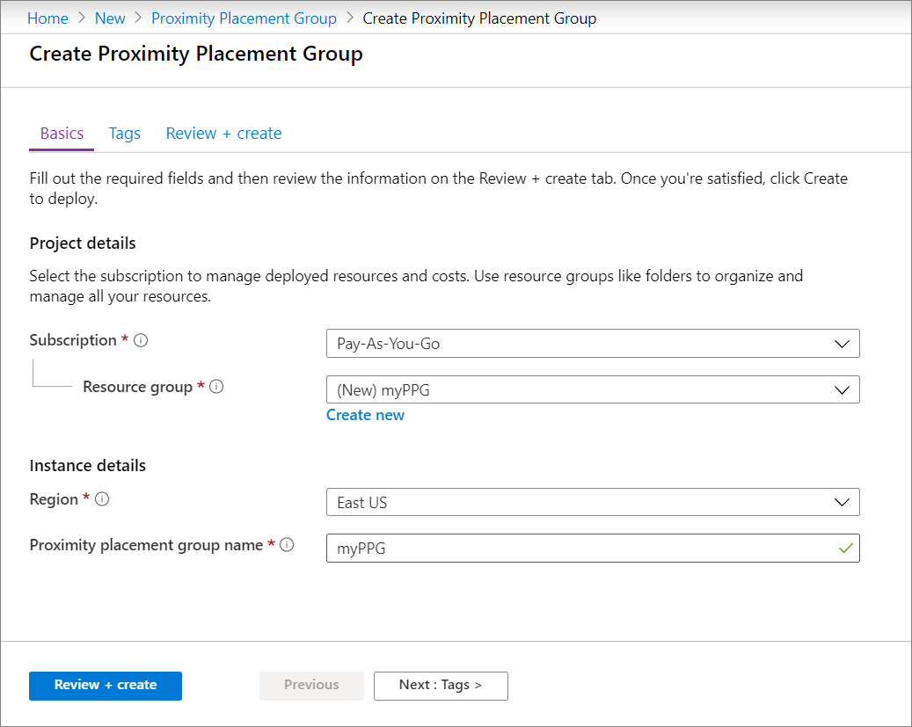
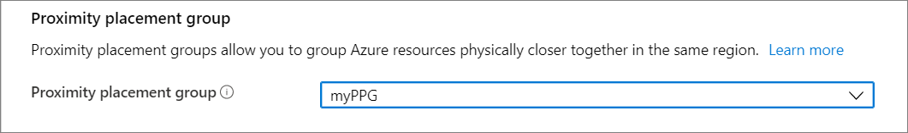

# Create a proximity placement group using the Azure portal

**Applies to:** :heavy_check_mark: Linux VMs :heavy_check_mark: Windows VMs 

To get VMs as close as possible, achieving the lowest possible latency, you should deploy them within a [proximity placement group](../co-location.md#proximity-placement-groups).

A proximity placement group is a logical grouping used to make sure that Azure compute resources are physically located close to each other. Proximity placement groups are useful for workloads where low latency is a requirement.

> [!NOTE]
> Proximity placement groups cannot be used with dedicated hosts.
>
> Intent for proximity placement groups is not supported on Azure portal. Use ARM templates or other client tools like Powershell or CLI to provide intent for proximity placement groups.
>
> If you want to use availability zones together with placement groups, you need to make sure that the VMs in the placement group are also all in the same availability zone.
>

## Create the proximity placement group

1. Type **proximity placement group** in the search.
1. Under **Services** in the search results, select **Proximity placement groups**.
1. In the **Proximity placement groups** page, select **Add**.
1. In the **Basics** tab, under **Project details**, make sure the correct subscription is selected.
1. In **Resource group** either select **Create new** to create a new group or select an empty resource group that already exists, from the drop-down. 
1. In **Region** select the location where you want the proximity placement group to be created.
1. In **Proximity placement group name** type a name and then select **Review + create**.
1. After validation passes, select **Create** to create the proximity placement group.

	

## Create a VM

1. While creating a VM in the portal, go to the **Advanced** tab. 
1. In the **Proximity placement group** selection, select the correct placement group. 

	

1. When you are done making all of the other required selections, select **Review + create**.
1. After it passes validation, select **Create** to deploy the VM in the placement group.

## Add VMs in an availability set to a proximity placement group

If the VM is part of the Availability set, you need to add the availability set into the the placement group, before adding the VMs.

1. In the [portal](https://portal.azure.com) search for *Availability sets* and select your availability set from the results.
1. Stop\deallocate each VM in the availability set by selecting the VM, then selecting **Stop** on the page for the VM, and then select **OK** to stop the VM.
1. On the page for your availability set, make sure all of the VMs have the **Status** listed as **Stopped (deallocated)**.
1. In the left menu, select **Configuration**.
1. Under **Proximity placement group**, select a placement group from the drop-down, and then select **Save**.
1. Select **Overview** from the left menu to see the list of VMs again. 
1. Select each VM in the availability set, and then select **Start** on the page for each VM. 

## Add existing VM to placement group 

1. On the page for the VM, select **Stop**.
1. Once the status of the VM is listed as **Stopped (deallocated)**, select **Configuration** on the left menu.
1. Under **Proximity placement group**, select a placement group from the drop-down, and then select **Save**.
1. Select **Overview** from the left menu, then select **Start** to restart the VM.

 

## Next steps

You can also use the [Azure PowerShell](proximity-placement-groups.md) to create proximity placement groups.
