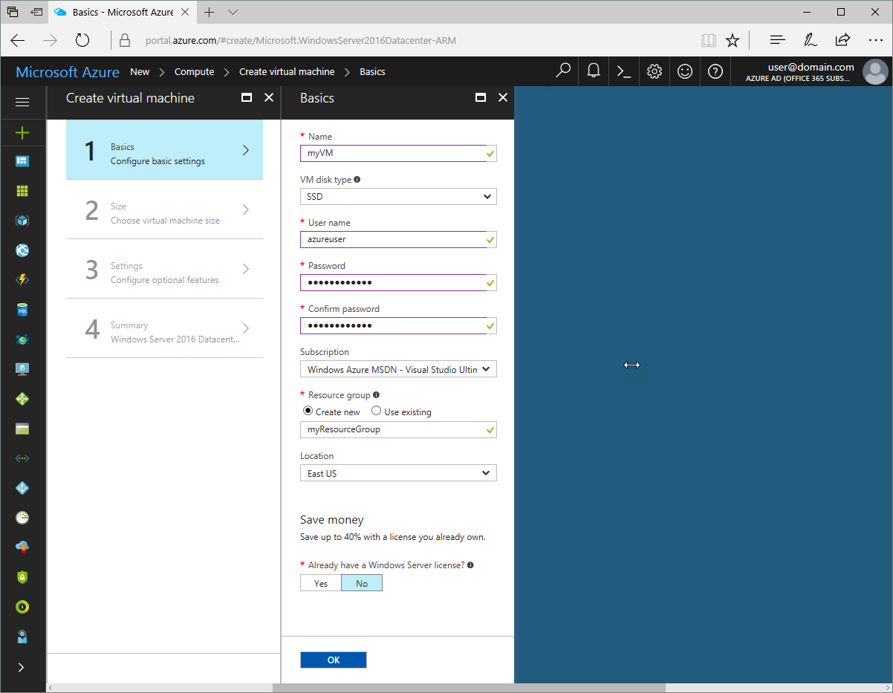

# Create a Windows virtual machine with the Azure portal

Azure virtual machines can be created through the Azure portal. This method provides a browser-based user interface for creating and configuring virtual machines and all related resources. This Quickstart steps through creating a virtual machine and installing a webserver on the VM.

If you don't have an Azure subscription, create a [free account](https://azure.microsoft.com/free/?WT.mc_id=A261C142F) before you begin.

## Log in to Azure

Log in to the Azure portal at http://portal.azure.com.

## Create virtual machine

1. Click the **New** button found on the upper left-hand corner of the Azure portal.

2. Select **Compute**, select **Windows Server 2016 Datacenter**, and ensure that **Resource Manager** is the selected deployment model. Click the **Create** button. 

3. Enter the virtual machine information. The user name and password entered here is used to log in to the virtual machine. When complete, click **OK**.

      

4. Select a size for the VM. To see more sizes, select **View all** or change the **Supported disk type** filter. 

      

5. On the settings blade, select **Yes** under **Use managed disks**, keep the defaults for the rest of the settings, and click **OK**.

6. On the summary page, click **Ok** to start the virtual machine deployment.

7. The VM will be pinned to the Azure portal dashboard. Once the deployment has completed, the VM summary blade automatically opens.


## Connect to virtual machine

Create a remote desktop connection to the virtual machine.

1. Click the **Connect** button on the virtual machine properties. A Remote Desktop Protocol file (.rdp file) is created and downloaded.

     

2. To connect to your VM, open the downloaded RDP file. If prompted, click **Connect**. On a Mac, you need an RDP client such as this [Remote Desktop Client](https://itunes.apple.com/us/app/microsoft-remote-desktop/id715768417?mt=12) from the Mac App Store.

3. Enter the user name and password you specified when creating the virtual machine, then click **Ok**.

4. You may receive a certificate warning during the sign-in process. Click **Yes** or **Continue** to proceed with the connection.


## Install IIS using PowerShell

On the virtual machine, start a PowerShell session and run the following command to install IIS.

```powershell
Install-WindowsFeature -name Web-Server -IncludeManagementTools
```

When done, exit the RDP session and return the VM properties in the Azure portal.

## Open port 80 for web traffic 

A Network security group (NSG) secures inbound and outbound traffic. When a VM is created from the Azure portal, an inbound rule is created on port 3389 for RDP connections. Because this VM hosts a webserver, an NSG rule needs to be created for port 80.

1. On the virtual machine, click the name of the **Resource group**.
2. Select the **network security group**. The NSG can be identified using the **Type** column. 
3. On the left-hand menu, under settings, click **Inbound security rules**.
4. Click on **Add**.
5. In **Name**, type **http**. Make sure **Port range** is set to 80 and **Action** is set to **Allow**. 
6. Click **OK**.


## View the IIS welcome page

With IIS installed, and port 80 open to your VM, the webserver can now be accessed from the internet. Open a web browser, and enter the public IP address of the VM. the public IP address can be found on the VM blade in the Azure portal.

 

## Clean up resources

When no longer needed, delete the resource group, virtual machine, and all related resources. To do so, select the resource group from the virtual machine blade and click **Delete**.

## Next steps

In this quick start, you’ve deployed a simple virtual machine, a network security group rule, and installed a web server. To learn more about Azure virtual machines, continue to the tutorial for Windows VMs.

> [!div class="nextstepaction"]
> [Azure Windows virtual machine tutorials](./tutorial-manage-vm.md)
