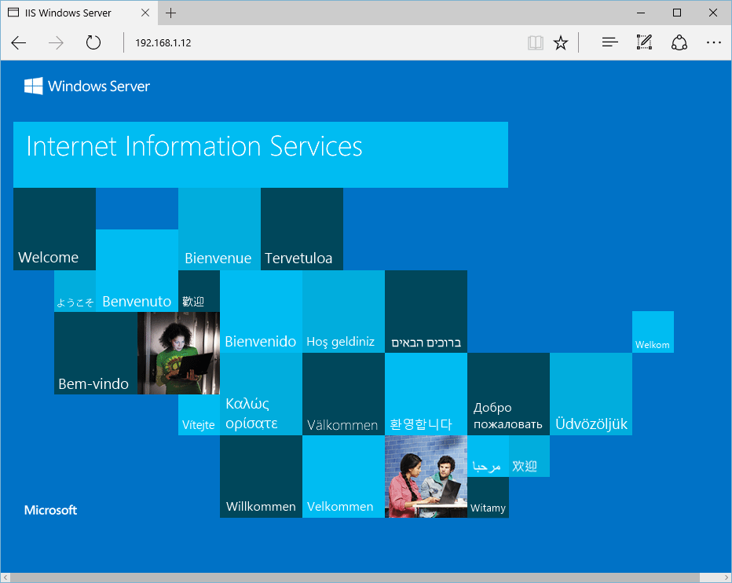

# Quickstart: Create a Windows virtual machine in the Azure portal

**Applies to:** :heavy_check_mark: Windows VMs 

Azure virtual machines (VMs) can be created through the Azure portal. This method provides a browser-based user interface to create VMs and their associated resources. This quickstart shows you how to use the Azure portal to deploy a virtual machine (VM) in Azure that runs Windows Server 2019. To see your VM in action, you then RDP to the VM and install the IIS web server.

If you don't have an Azure subscription, create a [free account](https://azure.microsoft.com/free/?WT.mc_id=A261C142F) before you begin.

## Sign in to Azure

Sign in to the [Azure portal](https://portal.azure.com).

## Create virtual machine

1. Enter *virtual machines* in the search.
1. Under **Services**, select **Virtual machines**.
1. In the **Virtual machines** page, select **Create** and then **Azure virtual machine**. The **Create a virtual machine** page opens.
1. Under **Instance details**, enter *myVM* for the **Virtual machine name** and choose *Windows Server 2022 Datacenter: Azure Edition - x64 Gen 2* for the **Image**. Leave the other defaults.

    :::image type="content" source="media/quick-create-portal/instance-details.png" alt-text="Screenshot of the Instance details section where you provide a name for the virtual machine and select its region, image and size." lightbox="media/quick-create-portal/instance-details.png":::

    > [!NOTE]
    > Some users will now see the option to create VMs in multiple zones. To learn more about this new capability, see [Create virtual machines in an availability zone](../create-portal-availability-zone.md).
    > :::image type="content" source="../media/create-portal-availability-zone/preview.png" alt-text="Screenshot showing that you have the option to create virtual machines in multiple availability zones.":::

1. Under **Administrator account**,  provide a username, such as *azureuser* and a password. The password must be at least 12 characters long and meet the [defined complexity requirements](faq.yml#what-are-the-password-requirements-when-creating-a-vm-).

    :::image type="content" source="media/quick-create-portal/administrator-account.png" alt-text="Screenshot of the Administrator account section where you provide the administrator username and password":::

1. Under **Inbound port rules**, choose **Allow selected ports** and then select **RDP (3389)** and **HTTP (80)** from the drop-down.

    :::image type="content" source="media/quick-create-portal/inbound-port-rules.png" alt-text="Screenshot of the inbound port rules section where you select what ports inbound connections are allowed on":::

1. Leave the remaining defaults and then select the **Review + create** button at the bottom of the page.

    :::image type="content" source="media/quick-create-portal/review-create.png" alt-text="Screenshot showing the Review + create button at the bottom of the page.":::


1. After validation runs, select the **Create** button at the bottom of the page.
    :::image type="content" source="media/quick-create-portal/validation.png" alt-text="Screenshot showing that validation has passed. Select the Create button to create the VM." lightbox="media/quick-create-portal/validation.png":::

1. After deployment is complete, select **Go to resource**.

     :::image type="content" source="media/quick-create-portal/next-steps.png" alt-text="Screenshot showing the next step of going to the resource.":::


## Connect to virtual machine

Create a remote desktop connection to the virtual machine. These directions tell you how to connect to your VM from a Windows computer. On a Mac, you need an RDP client such as this [Remote Desktop Client](https://apps.apple.com/app/microsoft-remote-desktop/id1295203466?mt=12) from the Mac App Store.

1. On the overview page for your virtual machine, select the **Connect** > **RDP**. 

    :::image type="content" source="media/quick-create-portal/portal-quick-start-9.png" alt-text="Screenshot of the virtual machine overview page showing the location of the connect button.":::

2. In the **Connect with RDP** tab, keep the default options to connect by IP address, over port 3389, and click **Download RDP file**.

    :::image type="content" source="media/quick-create-portal/remote-desktop.png" alt-text="Screenshot showing the remote desktop settings and the Download RDP file button.":::

2. Open the downloaded RDP file and click **Connect** when prompted.

3. In the **Windows Security** window, select **More choices** and then **Use a different account**. Type the username as **localhost**\\*username*, enter the password you created for the virtual machine, and then click **OK**.

4. You may receive a certificate warning during the sign-in process. Click **Yes** or **Continue** to create the connection.

## Install web server

To see your VM in action, install the IIS web server. Open a PowerShell prompt on the VM and run the following command:

```powershell
Install-WindowsFeature -name Web-Server -IncludeManagementTools
```

When done, close the RDP connection to the VM.


## View the IIS welcome page

In the portal, select the VM and in the overview of the VM, hover over the IP address to show **Copy to clipboard**. Copy the IP address and paste it into a browser tab. The default IIS welcome page will open, and should look like this:



## Clean up resources

### Delete resources
When no longer needed, you can delete the resource group, virtual machine, and all related resources.

1. On the Overview page for the VM, select the **Resource group** link.
1. At the top of the page for the resource group, select **Delete resource group**. 
1. A page will open warning you that you are about to delete resources. Type the name of the resource group and select **Delete** to finish deleting the resources and the resource group.

### Auto-shutdown
If the VM is still needed, Azure provides an Auto-shutdown feature for virtual machines to help manage costs and ensure you are not billed for unused resources.

1. On the **Operations** section for the VM, select the **Auto-shutdown** option.
1. A page will open where you can configure the auto-shutdown time. Select the **On** option to enable and then set a time that works for you.
1. Once you have set the time, select **Save**  at the top to enable your Auto-shutdown configuration.

> [!NOTE]
> Remember to configure the time zone correctly to match your requirements, as (UTC) Coordinated Universal Time is the default setting in the Time zone dropdown.

For more information see [Auto-shutdown](/azure/virtual-machines/auto-shutdown-vm).

## Next steps

In this quickstart, you deployed a simple virtual machine, opened a network port for web traffic, and installed a basic web server. To learn more about Azure virtual machines, continue to the tutorial for Windows VMs.

> [!div class="nextstepaction"]
> [Azure Windows virtual machine tutorials](./tutorial-manage-vm.md)
