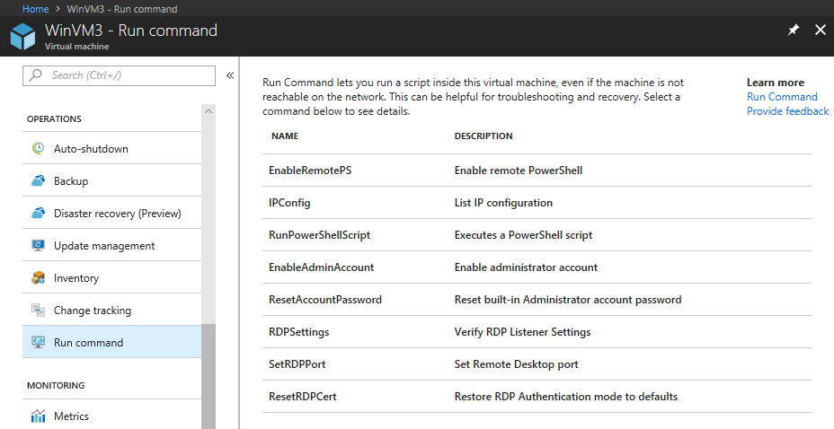
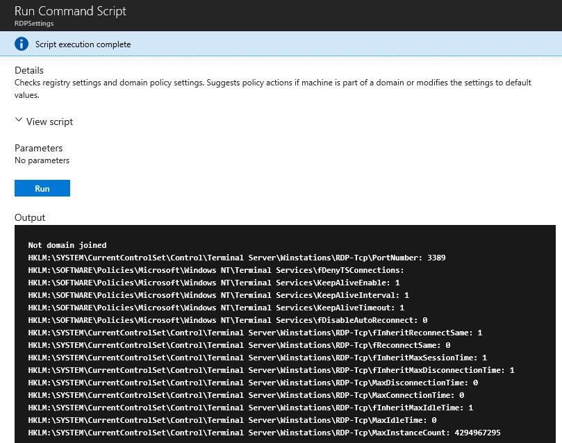

# Run scripts in your Windows VM by using action Run Commands

The Run Command feature uses the virtual machine (VM) agent to run PowerShell scripts within an Azure Windows VM. You can use these scripts for general machine or application management. They can help you to quickly diagnose and remediate VM access and network issues and get the VM back to a good state.

## Benefits

You can access your virtual machines in multiple ways. Run Command can run scripts on your virtual machines remotely by using the VM agent. You use Run Command through the Azure portal, [REST API](/rest/api/compute/virtual-machines/run-command), or [PowerShell](/powershell/module/az.compute/invoke-azvmruncommand) for Windows VMs.

This capability is useful in all scenarios where you want to run a script within a virtual machine. It's one of the only ways to troubleshoot and remediate a virtual machine that doesn't have the RDP or SSH port open because of improper network or administrative user configuration.

## Prerequisites

### **Windows OS’ Supported**
| **Windows OS** |	**x64** |
|:----|:----:|
| Windows 10 |	Supported |
| Windows 11 |	Supported |
| Windows Server 2008 SP2 |	Supported |
| Windows Server 2008 R2 |	Supported |
| Windows Server 2012 |	Supported |
| Windows Server 2012 R2 |	Supported |
| Windows Server 2016 |	Supported |
| Windows Server 2016 Core |	Supported |
| Windows Server 2019 |	Supported |
| Windows Server 2019 Core |	Supported |
| Windows Server 2022 |	Supported |
| Windows Server 2022 Core |	Supported |

## Restrictions

The following restrictions apply when you're using Run Command:

* Output is limited to the last 4,096 bytes.
* The minimum time to run a script is about 20 seconds.
* Scripts run as System on Windows.
* One script at a time can run.
* Scripts that prompt for information (interactive mode) aren't supported.
* You can't cancel a running script.
* The maximum time a script can run is 90 minutes. After that, it will time out.
* Outbound connectivity from the VM is required to return the results of the script.
* It isn't recommended to run a script that will cause a stop or update of the VM Agent. This can let the extension in a Transitioning state, leading to a timeout.

> [!NOTE]
> To function correctly, Run Command requires connectivity (port 443) to Azure public IP addresses. If the extension doesn't have access to these endpoints, the scripts might run successfully but not return the results. If you're blocking traffic on the virtual machine, you can use [service tags](../../virtual-network/network-security-groups-overview.md#service-tags) to allow traffic to Azure public IP addresses by using the `AzureCloud` tag.
> 
> The Run Command feature doesn't work if the VM agent status is NOT READY. Check the agent status in the VM's properties in the Azure portal.

## Available commands

This table shows the list of commands available for Windows VMs. You can use the **RunPowerShellScript** command to run any custom script that you want. When you're using the Azure CLI or PowerShell to run a command, the value that you provide for the `--command-id` or `-CommandId` parameter must be one of the following listed values. When you specify a value that isn't an available command, you receive this error:

```error
The entity was not found in this Azure location
```
<br>

| **Name** | **Description** |
|---|---|
| **RunPowerShellScript** | Runs a PowerShell script |
| **DisableNLA** | Disable Network Level Authentication |
| **DisableWindowsUpdate** | Disable Windows Update Automatic Updates |
| **EnableAdminAccount** | Checks if the local administrator account is disabled, and if so enables it. |
| **EnableEMS** | EnableS EMS |
| **EnableRemotePS** | Configures the machine to enable remote PowerShell. |
| **EnableWindowsUpdate** | Enable Windows Update Automatic Updates |
| **IPConfig** | Shows detailed information for the IP address, subnet mask, and default gateway for each adapter bound to TCP/IP. |
| **RDPSettings** | Checks registry settings and domain policy settings. Suggests policy actions if the machine is part of a domain or modifies the settings to default values. |
| **ResetRDPCert** | Removes the TLS/SSL certificate tied to the RDP listener and restores the RDP listener security to default. Use this script if you see any issues with the certificate. |
| **SetRDPPort** | Sets the default or user-specified port number for Remote Desktop connections. Enables firewall rules for inbound access to the port. |

## Azure CLI

The following example uses the [az vm run-command](/cli/azure/vm/run-command#az-vm-run-command-invoke) command to run a shell script on an Azure Windows VM.

```azurecli-interactive
# script.ps1
#   param(
#       [string]$arg1,
#       [string]$arg2
#   )
#   Write-Host This is a sample script with parameters $arg1 and $arg2

az vm run-command invoke  --command-id RunPowerShellScript --name win-vm -g my-resource-group \
    --scripts @script.ps1 --parameters "arg1=somefoo" "arg2=somebar"
```

## Azure portal

Go to a VM in the [Azure portal](https://portal.azure.com) and select **Run command** from the left menu, under **Operations**. You see a list of the available commands to run on the VM.



Choose a command to run. Some of the commands might have optional or required input parameters. For those commands, the parameters are presented as text fields for you to provide the input values. For each command, you can view the script that's being run by expanding **View script**. **RunPowerShellScript** is different from the other commands, because it allows you to provide your own custom script.

> [!NOTE]
> The built-in commands are not editable.

After you choose the command, select **Run** to run the script. After the script finishes, it returns the output and any errors in the output window. The following screenshot shows an example output from running the **RDPSettings** command.



## PowerShell

The following example uses the [Invoke-AzVMRunCommand](/powershell/module/az.compute/invoke-azvmruncommand) cmdlet to run a PowerShell script on an Azure VM. The cmdlet expects the script referenced in the `-ScriptPath` parameter to be local to where the cmdlet is being run.

```azurepowershell-interactive
Invoke-AzVMRunCommand -ResourceGroupName '<myResourceGroup>' -Name '<myVMName>' -CommandId 'RunPowerShellScript' -ScriptPath '<pathToScript>' -Parameter @{"arg1" = "var1";"arg2" = "var2"}
```
> [!NOTE]
> Parameter values can be string type only and the script is responsible for converting them to other types if needed.

## Limiting access to Run Command

Listing the run commands or showing the details of a command requires the `Microsoft.Compute/locations/runCommands/read` permission on Subscription Level. The built-in [Reader](../../role-based-access-control/built-in-roles.md#reader) role and higher levels have this permission.

Running a command requires the `Microsoft.Compute/virtualMachines/runCommands/write` permission. The [Virtual Machine Contributor](../../role-based-access-control/built-in-roles.md#virtual-machine-contributor) role and higher levels have this permission.

You can use one of the [built-in roles](../../role-based-access-control/built-in-roles.md) or create a [custom role](../../role-based-access-control/custom-roles.md) to use Run Command.


## Action Run Command Windows troubleshooting

When troubleshooting action run command for Windows environments, refer to the *RunCommandExtension* log file typically located in the following directory: `C:\WindowsAzure\Logs\Plugins\Microsoft.CPlat.Core.RunCommandWindows\<version>\RunCommandExtension.log` for further details.

### Known issues

Your Action Run Command Extension might fail to execute in your Windows environment if the command contains reserved characters. For example:

If the `&` symbol is passed in the parameter of your command such as the below PowerShell script, it might fail.

```powershell-interactive    
$paramm='abc&jj'
Invoke-AzVMRunCommand -ResourceGroupName AzureCloudService1 -Name test -CommandId 'RunPowerShellScript' -ScriptPath C:\data\228332902\PostAppConfig.ps1 -Parameter @{"Prefix" = $paramm}
```

Use the `^` character to escape the `&` in the argument, such as `$paramm='abc^&jj'`

The Run Command extension might also fail to execute if command to be executed contains "\n" in the path, as it will be treated as a new line. For example, `C:\Windows\notepad.exe` contains the `\n` in the file path. Consider replacing `\n` with `\N` in your path.

### Action Run Command Removal

If needing to remove your action run command Windows extension, refer to the below steps for Azure PowerShell and CLI:

 Replace *rgname* and *vmname* with your relevant resource group name and virtual machine name in the following removal examples.


```powershell-interactive
 Invoke-AzVMRunCommand -ResourceGroupName 'rgname' -VMName 'vmname' -CommandId 'RemoveRunCommandWindowsExtension'
```

```azurecli-interactive
az vm run-command invoke  --command-id RemoveRunCommandWindowsExtension --name vmname -g rgname
```
> [!NOTE]
> When you apply a Run Command again, the extension will get installed automatically. You can use the extension removal command to troubleshoot any issues related to the extension.

## Next steps

To learn about other ways to run scripts and commands remotely in your VM, see [Run scripts in your Windows VM](run-scripts-in-vm.md).
