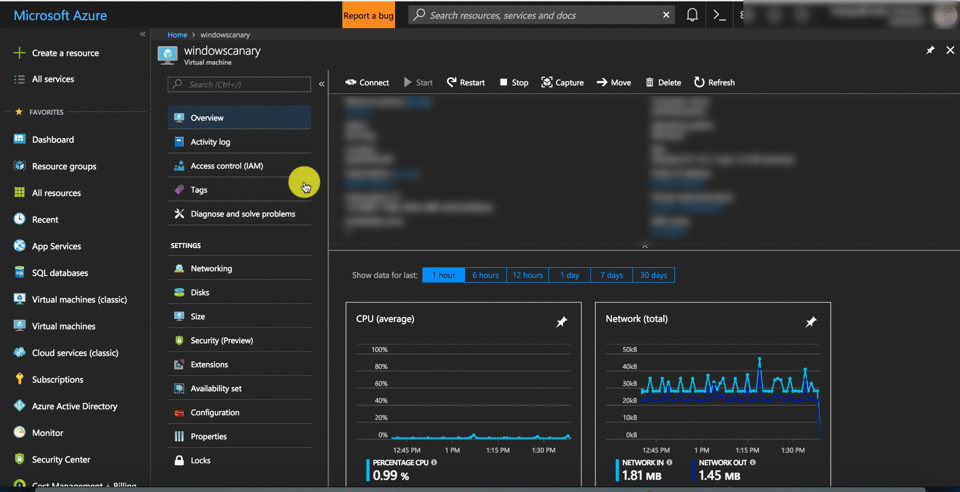

# Virtual Machine Serial Console (preview) 


The Virtual Machine Serial Console on Azure provides access to a text-based console for Windows virtual machines. This serial connection is to the COM1 serial port of the virtual machine, providing access to the virtual machine that is independent of a virtual machine's network or operating system state. Access to the serial console for a virtual machine can currently only be done via the Azure portal and is allowed only for those users who have VM Contributor or above access to the virtual machine. 

For serial console documentation for Linux VMs, [click here](../linux/serial-console.md).

> [!Note] 
> Previews are made available to you on the condition that you agree to the terms of use. For more information, see [Microsoft Azure Supplemental Terms of Use for Microsoft Azure Previews.] (https://azure.microsoft.com/support/legal/preview-supplemental-terms/)
>Currently this service is in **public preview** and access to the serial console for virtual machines is available to global Azure regions. At this point serial console is not available Azure Government, Azure Germany, and Azure China cloud.

 

## Prerequisites 

* You must be using the resource management deployment model. Classic deployments are not supported. 
* Virtual machine  MUST have [boot diagnostics](boot-diagnostics.md) enabled 

    

* The account using the serial console must have [Contributor role](../../role-based-access-control/built-in-roles.md) for VM and the [boot diagnostics](boot-diagnostics.md) storage account. 
* The virtual machine for which you are acessing serial console must also have a password-based account. You can create one with the [reset password](https://docs.microsoft.com/azure/virtual-machines/extensions/vmaccess#reset-password) functionality of the VM access extension - see the screenshot below.

    

## Get started with Serial Console
Serial console for virtual machines is only accessible via [Azure portal](https://portal.azure.com). Below are the steps to access the serial console for virtual machines via portal.

  1. Open the Azure portal
  2. In the left menu, select virtual machines.
  3. Click on the VM in the list. The overview page for the VM will open.
  4. Scroll down to the Support + Troubleshooting section and click on the serial console (Preview) option. A new pane with the serial console will open and start the connection.



## Enable Serial Console in custom or older images
Newer Windows Server images on Azure will have [Special Administrative Console](https://technet.microsoft.com/library/cc787940(v=ws.10).aspx) (SAC) enabled by default. SAC is supported on server versions of Windows but is not available on client versions (for example, Windows 10, Windows 8, or Windows 7). 
To enable Serial console for Windows virtual machines created before February 2018, please use the following steps: 

1. Connect to your Windows virtual machine via Remote Desktop
2. From an Administrative command prompt, run the following commands 
* `bcdedit /ems {current} on`
* `bcdedit /emssettings EMSPORT:1 EMSBAUDRATE:115200`
3. Reboot the system for the SAC console to be enabled


If needed SAC can be enabled offline as well, 

1. Attach the windows disk you want SAC configured for as a data disk to existing VM. 
2. From an Administrative command prompt, run the following commands 
* `bcdedit /store <mountedvolume>\boot\bcd /ems {default} on`
* `bcdedit /store <mountedvolume>\boot\bcd /emssettings EMSPORT:1 EMSBAUDRATE:115200`

### How do I know if SAC is enabled?

If [SAC] (https://technet.microsoft.com/library/cc787940(v=ws.10).aspx) is not enabled the serial console will not show the SAC prompt. In some cases, VM Health information will be shown, and in other cases it will be blank. If you are using a Windows Server image created before February 2018, SAC will likely not be enabled.

## Enable the Windows Boot Menu in Serial Console 

If you need to enable Windows boot loader prompts to show in the serial console, you can add the following additional options to your boot configuration data. See [bcdedit](https://docs.microsoft.com/windows-hardware/drivers/devtest/bcdedit--set) for more details

1. Connect to your Windows virtual machine via Remote Desktop
2. From an Administrative command prompt run the following commands 
* `bcdedit /set {bootmgr} displaybootmenu yes`
* `bcdedit /set {bootmgr} timeout 5`
* `bcdedit /set {bootmgr} bootems yes`
3. Reboot the system for the boot menu to be enabled

## Use Serial Console for NMI calls in Windows VMs
A non-maskable interrupt (NMI) is designed to create a signal that software on a virtual machine will not ignore. Historically, NMIs have been used to monitor for hardware issues on systems that required specific response times.  Today, programmers and system administrators often use NMI as a mechanism to debug or troubleshoot systems which are hung.

The Serial Console can be used to send a NMI to an Azure virtual machine using the keyboard icon in the command bar shown below. Once the NMI is delivered, the virtual machine configuration will control how the system responds. Windows can be configured to crash and create a memory dump when receiving an NMI.

 <br>

For information on configuring Windows to create a crash dump when it receives an NMI, see: [How to generate a complete crash dump file or a kernel crash dump file by using an NMI on a Windows-based system](https://support.microsoft.com/en-us/help/927069/how-to-generate-a-complete-crash-dump-file-or-a-kernel-crash-dump-file)

## Disable Serial Console
By default, all subscriptions have serial console access enabled for all VMs. You may disable serial console at either the subscription level or VM level.

### Subscription-level disable
Serial Console can be disabled for an entire subscription by through the [Disable Console REST API call](https://aka.ms/disableserialconsoleapi). You may use the "Try It" functionality available on the API Documentation page to disable and enable Serial Console for a subscription. Enter your `subscriptionId`, "default" in the `default` field, and click Run. Azure CLI commands are not yet available and will arrive at a later date. [Try the REST API call here](https://aka.ms/disableserialconsoleapi).


Alternatively, you may use the set of commands below in Cloud Shell (bash commands shown) to disable, enable, and view the disbled status of serial console for a subscription. 

* To get the disabled status of serial console for a subscription:
    ```azurecli-interactive
    $ export ACCESSTOKEN=($(az account get-access-token --output=json | jq .accessToken | tr -d '"')) 

    $ export SUBSCRIPTION_ID=$(az account show --output=json | jq .id -r)

    $ curl "https://management.azure.com/subscriptions/$SUBSCRIPTION_ID/providers/Microsoft.SerialConsole/consoleServices/default?api-version=2018-05-01" -H "Authorization: Bearer $ACCESSTOKEN" -H "Content-Type: application/json" -H "Accept: application/json" -s | jq .properties
    ```
* To disable serial console for a subscription:
    ```azurecli-interactive 
    $ export ACCESSTOKEN=($(az account get-access-token --output=json | jq .accessToken | tr -d '"')) 

    $ export SUBSCRIPTION_ID=$(az account show --output=json | jq .id -r)

    $ curl -X POST "https://management.azure.com/subscriptions/$SUBSCRIPTION_ID/providers/Microsoft.SerialConsole/consoleServices/default/disableConsole?api-version=2018-05-01" -H "Authorization: Bearer $ACCESSTOKEN" -H "Content-Type: application/json" -H "Accept: application/json" -s -H "Content-Length: 0"
    ```
* To enable serial console for a subscription:
    ```azurecli-interactive
    $ export ACCESSTOKEN=($(az account get-access-token --output=json | jq .accessToken | tr -d '"')) 

    $ export SUBSCRIPTION_ID=$(az account show --output=json | jq .id -r)

    $ curl -X POST "https://management.azure.com/subscriptions/$SUBSCRIPTION_ID/providers/Microsoft.SerialConsole/consoleServices/default/enableConsole?api-version=2018-05-01" -H "Authorization: Bearer $ACCESSTOKEN" -H "Content-Type: application/json" -H "Accept: application/json" -s -H "Content-Length: 0"
    ```

### VM-level disable
Serial console can be disabled for specific VMs by disabling that VM's boot diagnostics setting. Simply turn off boot diagnostics from the Azure portal and serial console will be disabled for the VM.

## Serial Console security 

### Access security 
Access to Serial console is limited to users who have [VM Contributors](../../role-based-access-control/built-in-roles.md#virtual-machine-contributor) or above access to the virtual machine. If your AAD tenant requires Multi-Factor Authentication then access to the serial console will also need MFA as its access is via [Azure portal](https://portal.azure.com).

### Channel security
All data that is sent back and forth is encrypted on the wire.

### Audit logs
All access to the serial console is currently logged in the [boot diagnostics](https://docs.microsoft.com/azure/virtual-machines/linux/boot-diagnostics) logs of the virtual machine. Access to these logs are owned and controlled by the Azure virtual machine administrator.  

>[!CAUTION] 
While no access passwords for the console are logged, if commands run within the console contain or output passwords, secrets, user names or any other form of Personally Identifiable Information (PII), those will be written to the virtual machine boot diagnostics logs, along with all other visible text, as part of the implementation of the serial console's scroll back functionality. These logs are circular and only individuals with read permissions to the diagnostics storage account have access to them, however we recommend following the best practice of using the Remote Desktop for anything that may involve secrets and/or PII. 

### Concurrent usage
If a user is connected to serial console and another user successfully requests access to that same virtual machine, the first user will be disconnected and the second user connected in a manner akin to the first user standing up and leaving the physical console and a new user sitting down.

>[!CAUTION] 
This means that the user who gets disconnected will not be logged out! The ability to enforce a logout upon disconnect (via SIGHUP or similar mechanism) is still in the roadmap. For Windows, there is an automatic timeout enabled in SAC, however for Linux you can configure terminal timeout setting. 

## Common scenarios for accessing serial console 
Scenario          | Actions in serial console                
:------------------|:-----------------------------------------
Incorrect firewall rules | Access serial console and fix Windows firewall rules. 
Filesystem corruption/check | Access serial console and recover filesystem. 
RDP configuration issues | Access serial console and change settings. Go to the [RDP documentation](https://docs.microsoft.com/windows-server/remote/remote-desktop-services/clients/remote-desktop-allow-access) to get started.
Network lock down system| Access serial console via portal to manage system. Some network commands are listed in the [Serial Console CMD and PowerShell documentation](./serial-console-cmd-ps-commands.md). 
Interacting with bootloader | Access BCD via the serial console. Go to [Enabling boot menu to show in the serial console](#enabling-boot-menu-to-show-in-the-serial-console) to get started. 

## Accessibility
Accessibility is a key focus for the Azure serial console. To that end, we have ensured that the serial console is accessible for those with visual and hearing impairments, as well as people who may not be able to use a mouse.

### Keyboard navigation
Use the `tab` key on your keyboard to navigate around the serial console interface within the Aure portal. Your location will be highlighted on screen. To leave the focus of the serial console blade, press `Ctrl + F6` on your keyboard.

### Use serial console with a screen reader
Serial console comes with screen reader support built in. Navigating around with a screen reader turned on will allow the alt text for the currently selected button to be read aloud by the screen reader.

## Errors
Most errors are transient in nature and retrying connection address these. The table below shows a list of errors and mitigations

Error                            |   Mitigation 
:---------------------------------|:--------------------------------------------|
Unable to retrieve boot diagnostics settings for '<VMNAME>'. To use the serial console, ensure that boot diagnostics is enabled for this VM. | Ensure that the VM has [boot diagnostics](boot-diagnostics.md) enabled. 
The VM is in a stopped deallocated state. Start the VM and retry the serial console connection. | Virtual machine must be in a started state to access the serial console
You do not have the required permissions to use this VM serial console. Ensure you have at least VM Contributor role permissions.| Serial console access requires certain permission to access. See [access requirements](#prerequisites) for details
Unable to determine the resource group for the boot diagnostics storage account '<STORAGEACCOUNTNAME>'. Verify that boot diagnostics is enabled for this VM and you have access to this storage account. | Serial console access requires certain permission to access. See [access requirements](#prerequisites) for details
A 'Forbidden' response was encountered when accessing this VM's boot diagnostic storage account. | Ensure that boot diagnostics does not have an account firewall. An accessible boot diagnostic storage account is necessary for serial console to function.
Web socket is closed or could not be opened. | You may need to whitelist `*.console.azure.com`. A more detailed but longer approach is to whitelist the [Microsoft Azure Datacenter IP ranges](https://www.microsoft.com/en-us/download/details.aspx?id=41653), which change fairly regularly.

## Known issues 
As we are still in the preview stages for serial console access, we are working through some known issues, below is the list of these with possible workarounds 

Issue                             |   Mitigation 
:---------------------------------|:--------------------------------------------|
There is no option with virtual machine scale set instance serial console | At the time of preview, access to the serial console for virtual machine scale set instances is not supported.
Hitting enter after the connection banner does not show a log in prompt | Please see this page: [Hitting enter does nothing](https://github.com/Microsoft/azserialconsole/blob/master/Known_Issues/Hitting_enter_does_nothing.md). This may happen if you are running a custom VM, hardened appliance, or GRUB config that causers Windows to fail to properly connect to the serial port.
Only health information is shown when connecting to a Windows VM| This will show up if the Special Administrative Console has not been enabled for your Windows image. See [Access Serial Console for Windows](#access-serial-console-for-windows) for instructions on how to manually enable SAC on your Windows VM. More details can be found at [Windows Health Signals](https://github.com/Microsoft/azserialconsole/blob/master/Known_Issues/Windows_Health_Info.md).
Unable to type at SAC prompt if kernel debugging is enabled | RDP to VM and run `bcdedit /debug {current} off` from an elevated command prompt. If you can't RDP you can instead attach the OS disk to another Azure VM and modify it while attached as a data disk using `bcdedit /store <drive letter of data disk>:\boot\bcd /debug <identifier> off`, then swap the disk back.
Pasting into PowerShell in SAC results in a third character if original content had a repeating character | A workaround is to unload the PSReadLine module from the current session. Run `Remove-Module PSReadLine` to unload the PSReadLine module from the current session - this will not delete or uninstall the module.
Some keyboard inputs produce strange SAC output (e.g. `[A`, `[3~`) | [VT100](https://aka.ms/vtsequences) escape sequences are not supported by the SAC prompt.
A 'Forbidden' response was encountered when accessing this VM's boot diagnostic storage account. | Ensure that boot diagnostics does not have an account firewall. An accessible boot diagnostic storage account is necessary for serial console to function.

## Frequently asked questions 
**Q. How can I send feedback?**

A. Provide feedback as an issue by going to https://aka.ms/serialconsolefeedback. Alternatively (less preferred) Send feedback via azserialhelp@microsoft.com or in the virtual machine category of http://feedback.azure.com

**Q. I am not able to access the serial console, where can I file a support case?**

A. This preview feature is covered via Azure Preview Terms. Support for this is best handled via channels mentioned above. 

## Next steps
* For an in-depth guide to CMD and PowerShell commands you can use in the Windows SAC, click [here](serial-console-cmd-ps-commands.md).
* The Serial Console is also available for [Linux](../linux/serial-console.md) VMs.
* Learn more about [boot diagnostics](boot-diagnostics.md).
