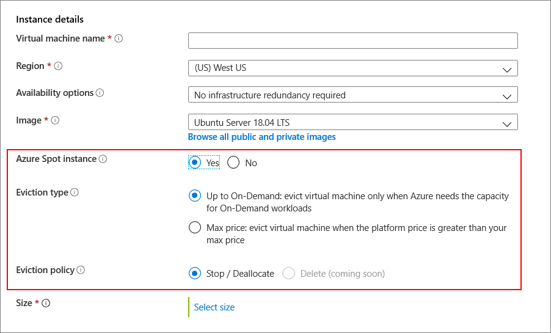

# Deploy Spot VMs using the Azure portal

Using [Spot VMs](spot-vms.md) allows you to take advantage of our unused capacity at a significant cost savings. At any point in time when Azure needs the capacity back, the Azure infrastructure will evict Spot VMs. Therefore, Spot VMs are great for workloads that can handle interruptions like batch processing jobs, dev/test environments, large compute workloads, and more.

Pricing for Spot VMs is variable, based on region and SKU. For more information, see VM pricing for [Linux](https://azure.microsoft.com/pricing/details/virtual-machines/linux/) and [Windows](https://azure.microsoft.com/pricing/details/virtual-machines/windows/). For more information about setting the max price, see [Spot VMs - Pricing](spot-vms.md#pricing).

You have option to set a max price you are willing to pay, per hour, for the VM. The max price for a Spot VM can be set in US dollars (USD), using up to 5 decimal places. For example, the value `0.05701`would be a max price of $0.05701 USD per hour. If you set the max price to be `-1`, the VM won't be evicted based on price. The price for the VM will be the current price for spot or the price for a standard VM, which ever is less, as long as there is capacity and quota available.

## Create the VM

The process to create a VM that uses Spot VMs is the same as detailed in the [quickstart](quick-create-portal.md). When you are deploying a VM, you can choose to use an Azure spot instance.

On the **Basics** tab, in the **Instance details** section, **No** is the default for using an Azure spot instance.

It you select **Yes**, the section expands and you can choose your [eviction type and eviction policy](spot-vms.md#eviction-policy). 

## Next steps

You can also create Spot VMs using [PowerShell](spot-powershell.md).