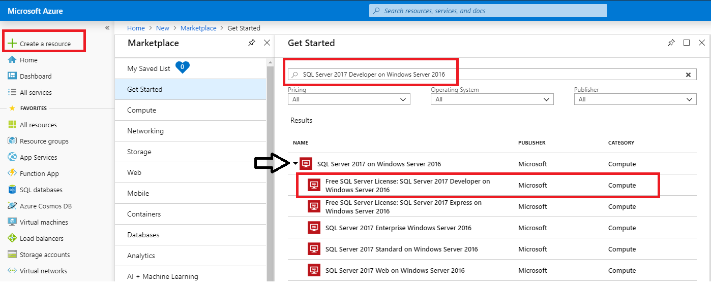
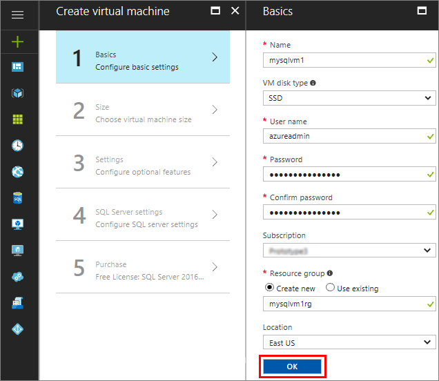
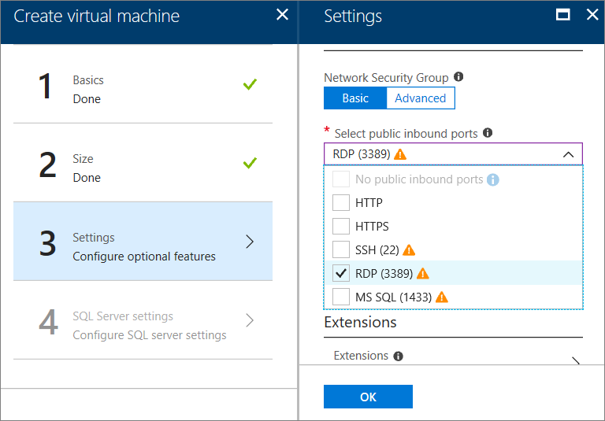
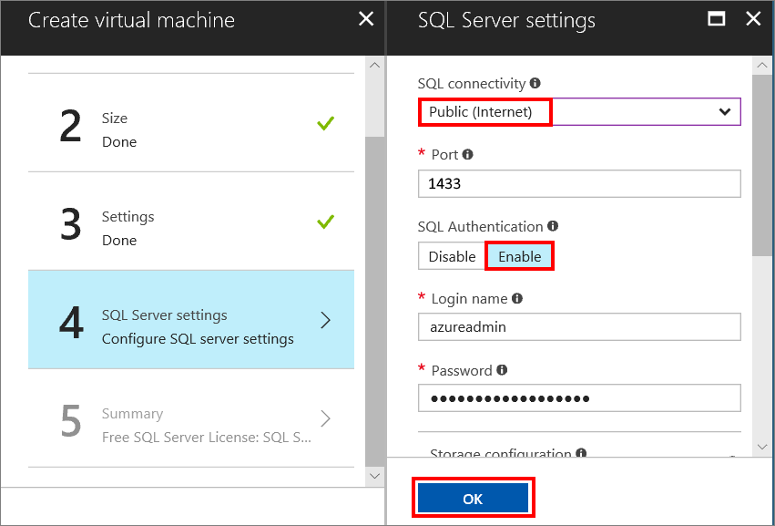
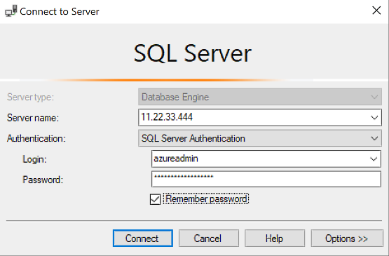

# Quickstart: Create a SQL Server 2017 Windows virtual machine in the Azure portal

> [!div class="op_single_selector"]
> * [Windows](quickstart-sql-vm-create-portal.md)
> * [Linux](../../linux/sql/provision-sql-server-linux-virtual-machine.md)

This quickstart steps through creating a SQL Server virtual machine in the Azure portal.

> [!TIP]
> This quickstart provides a path for quickly provisioning and connecting to a SQL VM. For more information about other SQL VM provisioning choices, see the [Provisioning guide for Windows SQL Server VMs in the Azure portal](virtual-machines-windows-portal-sql-server-provision.md).

> [!TIP]
> If you have questions about SQL Server virtual machines, see the [Frequently Asked Questions](virtual-machines-windows-sql-server-iaas-faq.md).

##  Get an Azure subscription

If you don't have an Azure subscription, create a [free account](https://azure.microsoft.com/free/?WT.mc_id=A261C142F) before you begin.

##  Select a SQL Server VM image

1. Log in to the [Azure portal](https://portal.azure.com) using your account.

1. On the Azure portal, click **Create a resource**. 

1. In the search field, type **SQL Server 2017 Developer on Windows Server 2016**, and press ENTER.

1. Select the **Free SQL Server License: SQL Server 2017 Developer on Windows Server 2016** image.

   

   > [!TIP]
   > The Developer edition is used in this tutorial because it is a full-featured edition of SQL Server that is free for development testing purposes. You pay only for the cost of running the VM. For complete pricing considerations, see [Pricing guidance for SQL Server Azure VMs](virtual-machines-windows-sql-server-pricing-guidance.md).

1. Click **Create**.

##  Provide basic details

On the **Basics** window, provide the following information:

1. In the **Name** field, enter a unique virtual machine name. 

1. In the **User name** field, enter a name for the local administrator account on the VM.

1. Provide a strong **Password**.

1. Enter a new **Resource group** name. This group helps to manage all resources associated with the virtual machine.

1. Verify the other default settings, and click **OK** to continue.

   

## Choose virtual machine size

1. On the **Size** step, choose a virtual machine size in the **Choose a size** window.

   For this quickstart, select **D2S_V3**. The portal shows the estimated monthly machine cost for continuous use (not including SQL Server licensing costs). Note that the Developer Edition has no extra licensing costs for SQL Server. For more specific pricing information, see the [pricing page](https://azure.microsoft.com/pricing/details/virtual-machines/windows/).

   > [!TIP]
   > The **D2S_V3** machine size saves money while testing. But for production workloads, see the recommended machine sizes and configuration in [Performance best practices for SQL Server in Azure Virtual Machines](virtual-machines-windows-sql-performance.md).

1. Click **Select** to continue.

## Configure optional features

1. In the **Settings** window, select the **RDP (3389)** port in the **Select public inbound ports** list if you want to remote desktop into the VM.

   

   > [!NOTE]
   > You can select the **MS SQL (1433)** port to access SQL Server remotely. However, this is not necessary, because the **SQL Server settings** step provides this option as well. If you do select port 1433 at this step, it will be opened irregardless of your selections in the **SQL Server settings** step.

1. Click **OK** to save your changes and continue.

## SQL Server settings

On the **SQL Server settings** window, configure the following options.

1. In the **SQL connectivity** drop-down, select **Public (Internet)**. This allows SQL Server connections over the internet.

1. Change the **Port** to **1401** to avoid using a well-known port name in the public scneario.

1. Under **SQL Authentication**, click **Enable**. The SQL Login is set to the same user name and password that you configured for the VM.

1. Change any other settings if needed, and click **OK** to complete the configuration of the SQL Server VM.

   

## Create the SQL Server VM

On the **Summary** window, review the summary and click **Purchase** to create SQL Server, resource group, and resources specified for this VM.

You can monitor the deployment from the Azure portal. The **Notifications** button at the top of the screen shows basic status of the deployment.

> [!TIP]
> Deploying a Windows SQL Server VM can take several minutes.

## Connect to SQL Server

1. In the portal, find the **Public IP address** of your VM in the **Overview** section of your virtual machine's properties.

1. On a different computer connected to the Internet, open SQL Server Management Studio (SSMS).

   > [!TIP]
   > If you do not have SQL Server Management Studio, you can download it [here](https://docs.microsoft.com/sql/ssms/download-sql-server-management-studio-ssms).

1. In the **Connect to Server** or **Connect to Database Engine** dialog box, edit the **Server name** value. Enter your VM's public IP address. Then add a comma, and add the custom port, **1401**, that we specified when you configured the new VM. For example, `11.22.33.444,1401`.

1. In the **Authentication** box, select **SQL Server Authentication**.

1. In the **Login** box, type the name of a valid SQL login.

1. In the **Password** box, type the password of the login.

1. Click **Connect**.

    

##  Log in to the VM remotely

Use the following steps to connect to the SQL Server virtual machine with Remote Desktop:

[!INCLUDE [Connect to SQL Server VM with remote desktop](../../../../includes/virtual-machines-sql-server-remote-desktop-connect.md)]

After you connect to the SQL Server virtual machine, you can launch SQL Server Management Studio and connect with Windows Authentication using your local administrator credentials. If you enabled SQL Server Authentication, you can also connect with SQL Authentication using the SQL login and password you configured during provisioning.

Access to the machine enables you to directly change machine and SQL Server settings based on your requirements. For example, you could configure the firewall settings or change SQL Server configuration settings.

## Clean up resources

If you do not need your SQL VM to run continually, you can avoid unnecessary charges by stopping it when not in use. You can also permanently delete all resources associated with the virtual machine by deleting its associated resource group in the portal. This permanently deletes the virtual machine as well, so use this command with care. For more information, see [Manage Azure resources through portal](../../../azure-resource-manager/resource-group-portal.md).

## Next steps

In this quickstart, you created a SQL Server 2017 virtual machine in the Azure Portal. To learn more about how to migrate your data to the new SQL Server, see the following article.

> [!div class="nextstepaction"]
> [Migrate a database to a SQL VM](virtual-machines-windows-migrate-sql.md)
