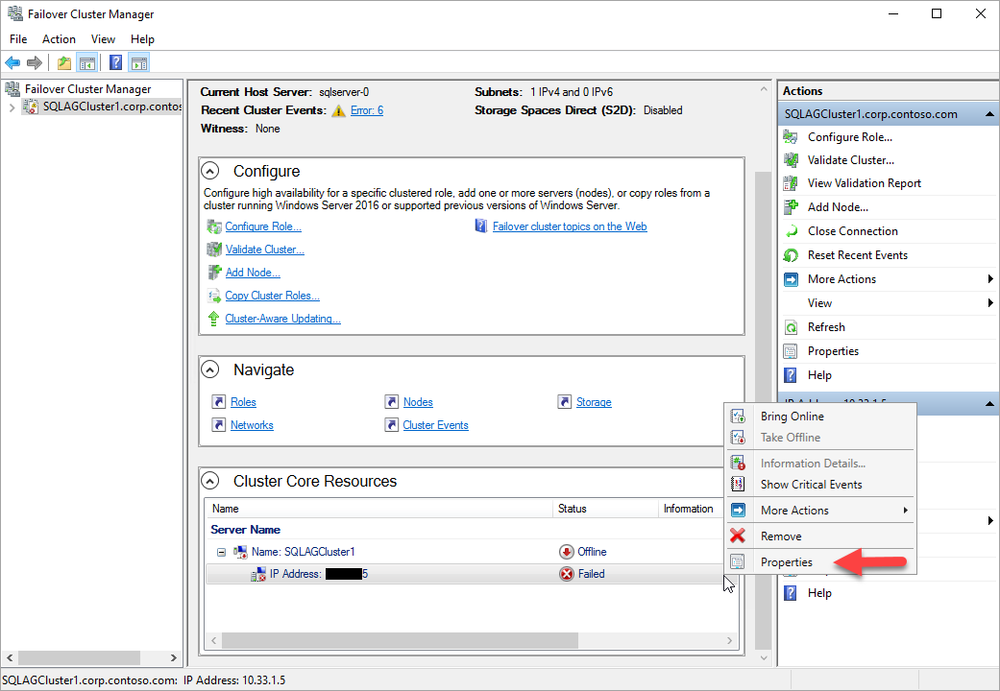
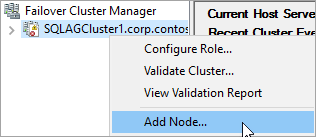
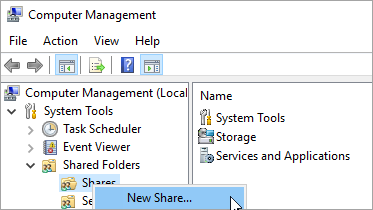
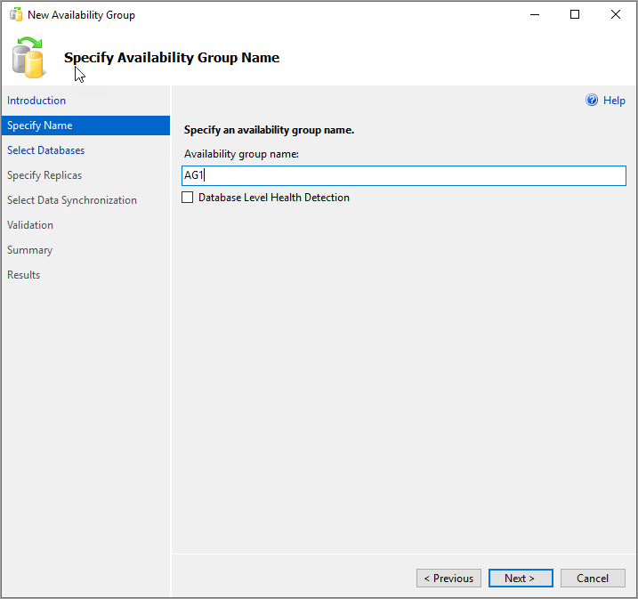
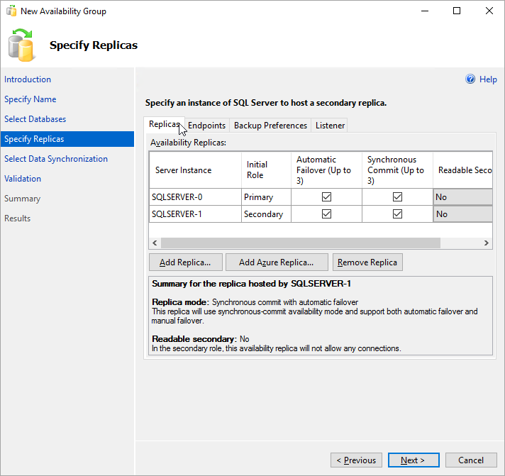
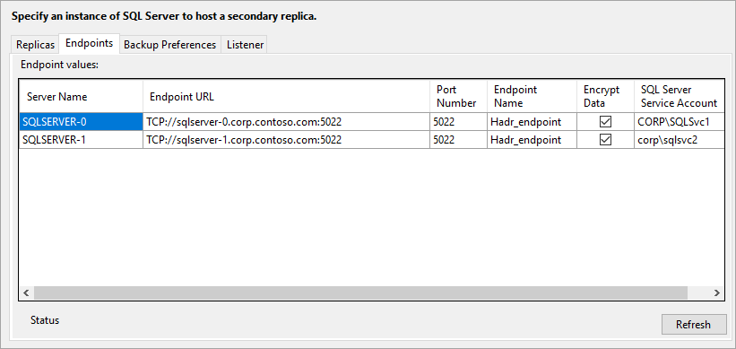
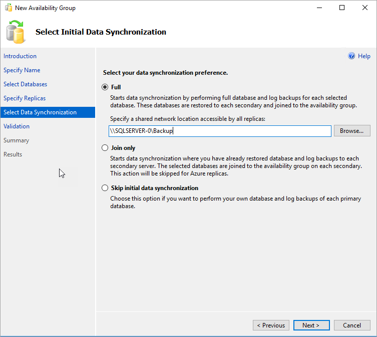
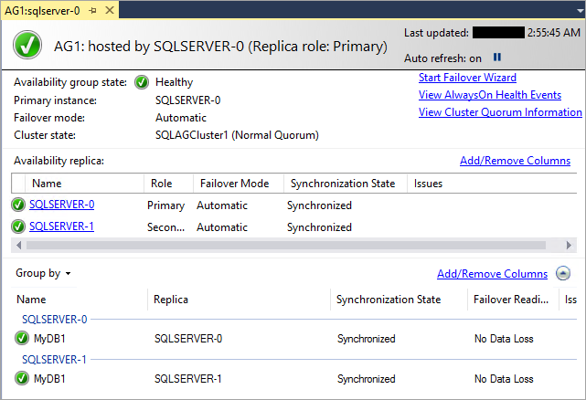
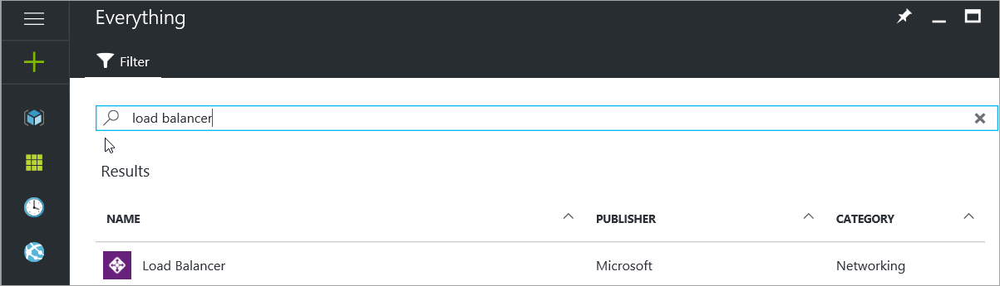

# Configure Always On Availability Group in Azure VM manually

This tutorial shows how to create a SQL Server Always On Availability Group on Azure Virtual Machines. The complete tutorial creates an Availability Group with a database replica on two SQL Servers.

**Time estimate**: Takes about 30 minutes to complete once the prerequisites are met.

The diagram illustrates what you build in the tutorial.


## Prerequisites

The tutorial assumes you have a basic understanding of SQL Server Always On Availability Groups. If you need more information, see [Overview of Always On Availability Groups (SQL Server)](http://msdn.microsoft.com/library/ff877884.aspx).

The following table lists the prerequisites that you need to complete before starting this tutorial:

|  |Requirement |Description |
|----- |----- |----- |
| | Two SQL Servers | - In an Azure availability set <br/> - In a single domain <br/> - With Failover Clustering feature installed |
|| Windows Server | File share for cluster witness |  
||SQL Server service account | Domain account |
||SQL Server Agent service account | Domain account |  
||Firewall ports open | - SQL Server: **1433** for default instance <br/> - Database mirroring endpoint: **5022** or any available port <br/> - Availability group load balancer IP address health probe: **59999** or any available port <br/> - Cluster core load balancer IP address health probe: **58888** or any available port |
||Add Failover Clustering Feature | Both SQL Servers require this feature |
||Installation domain account | - Local administrator on each SQL Server <br/> - Member of SQL Server sysadmin fixed server role for each instance of SQL Server  |


Before you begin the tutorial, you need to [Complete prerequisites for creating Always On Availability Groups in Azure Virtual Machines](virtual-machines-windows-portal-sql-availability-group-prereq.md). If these prerequisites are completed already, you can jump to [Create Cluster](#CreateCluster).


<!--**Procedure**: *This is the first “step”. Make titles H2’s and short and clear – H2’s appear in the right pane on the web page and are important for navigation.*-->

<a name="CreateCluster"></a>
## Create the cluster

After the prerequisites are completed, the first step is to create a Windows Server Failover Cluster that includes two SQL Severs and a witness server.

1. RDP to the first SQL Server using a domain account that is an administrator on both SQL Servers and the witness server.

   >[!TIP]
   >If you followed the [prerequisites document](virtual-machines-windows-portal-sql-availability-group-prereq.md), you created an account called **CORP\Install**. Use this account.

2. In the **Server Manager** dashboard, select **Tools**, and then click **Failover Cluster Manager**.
3. In the left pane, right-click **Failover Cluster Manager**, and then click **Create a Cluster**.
   
4. In the Create Cluster Wizard, create a one-node cluster by stepping through the pages with the settings in the following table:

   | Page | Settings |
   | --- | --- |
   | Before You Begin |Use defaults |
   | Select Servers |Type the first SQL Server name in **Enter server name** and click **Add**. |
   | Validation Warning |Select **No. I do not require support from Microsoft for this cluster, and therefore do not want to run the validation tests. When I click Next, continue Creating the cluster**. |
   | Access Point for Administering the Cluster |Type a cluster name, for example **SQLAGCluster1** in **Cluster Name**.|
   | Confirmation |Use defaults unless you are using Storage Spaces. See the note following this table. |

### Set the Windows server failover cluster IP address

1. In **Failover Cluster Manager**, scroll down to **Cluster Core Resources** and expand the cluster details. You should see both the **Name** and the **IP Address** resources in the **Failed** state. The IP address resource cannot be brought online because the cluster is assigned the same IP address as the machine itself, therefore it is a duplicate address.

2. Right-click the failed **IP Address** resource, and then click **Properties**.

   

3. Select **Static IP Address** and specify an available address from the same subnet as your virtual machines.

4. In the **Cluster Core Resources** section, right-click cluster name and click **Bring Online**. Then, wait until both resources are online. When the cluster name resource comes online, it updates the DC server with a new AD computer account. Use this AD account to run the Availability Group clustered service later.

### <a name="addNode"></a>Add the other SQL Server to cluster

Add the other SQL Server to the cluster.

1. In the browser tree, right-click the cluster and click **Add Node**.

    

1. In the **Add Node Wizard**, click **Next**. In the **Select Servers** page, add the second SQL Server. Type the server name in **Enter server name** and then click **Add**. When you are done, click **Next**.

1. In the **Validation Warning** page, click **No** (in a production scenario you should perform the validation tests). Then, click **Next**.

8. In the **Confirmation** page if you are using Storage Spaces, clear the checkbox labeled **Add all eligible storage to the cluster.**

   

    >[!WARNING]
   >If you are using Storage Spaces and do not uncheck **Add all eligible storage to the cluster**, Windows detaches the virtual disks during the clustering process. As a result, they do not appear in Disk Manager or Explorer until the storage spaces are removed from the cluster and reattached using PowerShell. Storage Spaces groups multiple disks in to storage pools. For more information, see [Storage Spaces](https://technet.microsoft.com/library/hh831739).

1. Click **Next**.

1. Click **Finish**.

   Failover Cluster Manager shows that your cluster has a new node and lists it in the **Nodes** container.

10. Log out of the remote desktop session.

### Add a cluster quorum file share

In this example the Windows cluster uses a file share to create a cluster quorum. This tutorial uses a Node and File Share Majority quorum. For more information, see [Understanding Quorum Configurations in a Failover Cluster](http://technet.microsoft.com/library/cc731739.aspx).

1. Connect to the file share witness member server with a remote desktop session.

1. On **Server Manager**, click **Tools**. Open **Computer Management**.

1. Click **Shared Folders**.

1. Right-click **Shares**, and click **New Share...**.

   

   Use **Create a Shared Folder Wizard** to create a share.

1. On **Folder Path**, click **Browse** and locate or create a path for the shared folder. Click **Next**.

1. In **Name, Description, and Settings** verify the share name and path. Click **Next**.

1. On **Shared Folder Permissions** set **Customize permissions**. Click **Custom...**.

1. On **Customize Permissions**, click **Add...**.

1. Make sure that the account used to create the cluster has full control.

   

1. Click **OK**.

1. In **Shared Folder Permissions**, click **Finish**. Click **Finish** again.  

1. Log out of the server

### Configure cluster quorum

Next, set the cluster quorum.

1. Connect to the first cluster node with remote desktop.

1. In **Failover Cluster Manager**, right-click the cluster, point to **More Actions**, and click **Configure Cluster Quorum Settings...**.

   

1. In **Configure Cluster Quorum Wizard**, click **Next**.

1. In **Select Quorum Configuration Option**, choose **Select the quorum witness**, and click **Next**.

1. On **Select Quorum Witness**, click **Configure a file share witness**.

   >[!TIP]
   >Windows Server 2016 supports a cloud witness. If you choose this type of witness, you do not need a file share witness. For more information, see [Deploy a cloud witness for a Failover Cluster](http://technet.microsoft.com/windows-server-docs/failover-clustering/deploy-cloud-witness). This tutorial uses a file share witness, which is supported by previous operating systems.

1. On **Configure File Share Witness**, type the path for the share you created. Click **Next**.

1. Verify the settings on **Confirmation**. Click **Next**.

1. Click **Finish**.

The cluster core resources are configured with a file share witness.

## Enable Availability Groups

Next, enable the **AlwaysOn Availability Groups** feature. Do these steps on both SQL Servers.

1. From the **Start** screen, launch **SQL Server Configuration Manager**.
2. In the browser tree, click **SQL Server Services**, then right-click the **SQL Server (MSSQLSERVER)** service and click **Properties**.
3. Click the **AlwaysOn High Availability** tab, then select **Enable AlwaysOn Availability Groups**, as follows:

    

4. Click **Apply**. Click **OK** in the pop-up dialog.

5. Restart the SQL Server service.

Repeat these steps on the other SQL Server.

<!-----------------
## <a name="endpoint-firewall"></a>Open firewall for the database mirroring endpoint

Each instance of SQL Server that participates in an Availability Group requires a database mirroring endpoint. This endpoint is a TCP port for the instance of SQL Server that is used to synchronize the database replicas in the Availability Groups on that instance.

On both SQL Servers, open the firewall for the TCP port for the database mirroring endpoint.

1. On the first SQL Server **Start** screen, launch **Windows Firewall with Advanced Security**.
2. In the left pane, select **Inbound Rules**. On the right pane, click **New Rule**.
3. For **Rule Type**, choose **Port**.
1. For the port, specify TCP and choose an unused TCP port number. For example, type *5022* and click **Next**.

   >[!NOTE]
   >For this example, we're using TCP port 5022. You can use any available port.

5. In the **Action** page, keep **Allow the connection** selected and click **Next**.
6. In the **Profile** page, accept the default settings and click **Next**.
7. In the **Name** page, specify a rule name, such as **Default Instance Mirroring Endpoint** in the **Name** text box, then click **Finish**.

Repeat these steps on the second SQL Server.
-------------------------->

## Create a database on the first SQL Server

1. Launch the RDP file to the first SQL Server with a domain account that is a member of sysadmin fixed server role.
1. Open SQL Server Management Studio and connect to the first SQL Server.
7. In **Object Explorer**, right-click **Databases** and click **New Database**.
8. In **Database name**, type **MyDB1**, then click **OK**.

### <a name="backupshare"></a> Create a backup share

1. On the first SQL Server in **Server Manager**, click **Tools**. Open **Computer Management**.

1. Click **Shared Folders**.

1. Right-click **Shares**, and click **New Share...**.

   

   Use **Create a Shared Folder Wizard** to create a share.

1. On **Folder Path**, click **Browse** and locate or create a path for the database backup shared folder. Click **Next**.

1. In **Name, Description, and Settings** verify the share name and path. Click **Next**.

1. On **Shared Folder Permissions** set **Customize permissions**. Click **Custom...**.

1. On **Customize Permissions**, click **Add...**.

1. Make sure that the SQL Server and SQL Server Agent service accounts for both servers have full control.

   

1. Click **OK**.

1. In **Shared Folder Permissions**, click **Finish**. Click **Finish** again.  

### Take a full backup of the database

You need to back up the new database to initialize the log chain. If you do not take a backup of the new database, it cannot be included in an Availability Group.

1. In **Object Explorer**, right-click the database, point to **Tasks...**, click **Back Up**.

1. Click **OK** to take a full backup to the default backup location.

## Create the Availability Group
You are now ready to configure an Availability Group using the following steps:

* Create a database on the first SQL Server.
* Take both a full backup and a transaction log backup of the database
* Restore the full and log backups to the second SQL Server with the **NORECOVERY** option
* Create the Availability Group (**AG1**) with synchronous commit, automatic failover, and readable secondary replicas

### Create the Availability Group:

1. On remote desktop session to the first SQL Server. In **Object Explorer** in SSMS, right-click **AlwaysOn High Availability** and click **New Availability Group Wizard**.

    

2. In the **Introduction** page, click **Next**. In the **Specify Availability Group Name** page, type a name for the Availability Group, for example **AG1**, in **Availability group name**. Click **Next**.

    

3. In the **Select Databases** page, select your database and click **Next**.

   >[!NOTE]
   >The database meets the prerequisites for an Availability Group because you have taken at least one full backup on the intended primary replica.

   
4. In the **Specify Replicas** page, click **Add Replica**.

   
5. The **Connect to Server** dialog pops up. Type the name of the second server in **Server name**. Click **Connect**.

   Back in the **Specify Replicas** page, you should now see the second server listed in **Availability Replicas**. Configure the replicas as follows.

   

6. Click **Endpoints** to see the database mirroring endpoint for this Availability Group. Use the same port that you used when you set the [firewall rule for database mirroring endpoints](virtual-machines-windows-portal-sql-availability-group-prereq.md#endpoint-firewall).

    

8. In the **Select Initial Data Synchronization** page, select **Full** and specify a shared network location. For the location, use the [backup share that you created](#backupshare). In the example it was, **\\\\\<First SQL Server\>\Backup\**. Click **Next**.

   >[!NOTE]
   >Full synchronization takes a full backup of the database on the first instance of SQL Server and restores it to the second instance. For large databases, full synchronization is not recommended because it may take a long time. You can reduce this time by manually taking a backup of the database and restoring it with `NO RECOVERY`. If the database is already restored with `NO RECOVERY` on the second SQL Server before configuring the Availability Group, choose **Join only**. If you want to take the backup after configuring the Availability Group, choose **Skip initial data synchronization**.

    

9. In the **Validation** page, click **Next**. This page should look similar to the following image:

    

	>[!NOTE]
	>There is a warning for the listener configuration because you have not configured an Availability Group listener. You can ignore this warning because on Azure virtual machines you create the listener after creating the Azure load balancer.

10. In the **Summary** page, click **Finish**, then wait while the wizard configures the new Availability Group. In the **Progress** page, you can click **More details** to view the detailed progress. Once the wizard is finished, inspect the **Results** page to verify that the Availability Group is successfully created.

     
11. Click **Close** to exit the wizard.

### Check the Availability Group

1. In **Object Explorer**, expand **AlwaysOn High Availability**, then expand **Availability Groups**. You should now see the new Availability Group in this container. Right-click the Availability Group and click **Show Dashboard**.

   

   Your **AlwaysOn Dashboard** should look similar to this.

   

   You can see the replicas, the failover mode of each replica and the synchronization state.

2. In **Failover Cluster Manager**, click your cluster. Select **Roles**. The Availability Group name you used is a role on the cluster. That Availability Group does not have an IP address for client connections, because you did not configure a listener. You will configure the listener after you create an Azure load balancer.

   

   > [!WARNING]
   > Do not try to fail over the Availability Group from the Failover Cluster Manager. All failover operations should be performed from within **AlwaysOn Dashboard** in SSMS. For more information, see [Restrictions on Using The Failover Cluster Manager with Availability Groups](https://msdn.microsoft.com/library/ff929171.aspx).
    >

At this point, you have an Availability Group with replicas on two instances of SQL Server. You can move the Availability Group between instances. You cannot connect to the Availability Group yet because you do not have a listener. In Azure virtual machines, the listener requires a load balancer. The next step is to create the load balancer in Azure.

<a name="configure-internal-load-balancer"></a>

## Create an Azure load balancer

On Azure virtual machines, a SQL Server Availability Group requires a load balancer. The load balancer holds the IP addresses for the Availability Group listeners and the Windows Server Failover Cluster. This section summarizes how to create the load balancer in the Azure portal.

An Azure Load Balancer can be either a Standard Load Balancer or a Basic Load Balancer. Standard Load Balancer has more features than the Basic Load Balancer. For an availability group, the Standard Load Balancer is required if you use an Availability Zone (instead of an Availability Set). For details on the difference between the load balancer types, see [Load Balancer SKU comparison](../../../load-balancer/load-balancer-overview.md#skus).

1. In the Azure portal, go to the resource group where your SQL Servers are and click **+ Add**.
1. Search for **Load Balancer**. Choose the load balancer published by Microsoft.

   

1. Click **Create**.
1. Configure the following parameters for the load balancer.

   | Setting | Field |
   | --- | --- |
   | **Name** |Use a text name for the load balancer, for example **sqlLB**. |
   | **Type** |Internal |
   | **Virtual network** |Use the name of the Azure virtual network. |
   | **Subnet** |Use the name of the subnet that the virtual machine is in.  |
   | **IP address assignment** |Static |
   | **IP address** |Use an available address from subnet. Use this address for your availability group listener. Note that this is different from your cluster IP address.  |
   | **Subscription** |Use the same subscription as the virtual machine. |
   | **Location** |Use the same location as the virtual machine. |

   The Azure portal blade should look like this:

   

1. Click **Create**, to create the load balancer.

To configure the load balancer, you need to create a backend pool, a probe, and set the load balancing rules. Do these in the Azure portal.

### Add backend pool for the availability group listener

1. In the Azure portal, go to your availability group. You might need to refresh the view to see the newly created load balancer.

   

1. Click the load balancer, click **Backend pools**, and click **+Add**.

1. Type a name for the backend pool.

1. Associate the backend pool with the availability set that contains the VMs.

1. Under **Target network IP configurations**, check **VIRTUAL MACHINE** and choose both of the virtual machines that will host availability group replicas. Do not include the file share witness server.

   >[!NOTE]
   >If both virtual machines are not specified, connections will only succeed to the primary replica.

1. Click **OK** to create the backend pool.

### Set the probe

1. Click the load balancer, click **Health probes**, and click **+Add**.

1. Set the listener health probe as follows:

   | Setting | Description | Example
   | --- | --- |---
   | **Name** | Text | SQLAlwaysOnEndPointProbe |
   | **Protocol** | Choose TCP | TCP |
   | **Port** | Any unused port | 59999 |
   | **Interval**  | The amount of time between probe attempts in seconds |5 |
   | **Unhealthy threshold** | The number of consecutive probe failures that must occur for a virtual machine to be considered unhealthy  | 2 |

1. Click **OK** to set the health probe.

### Set the load balancing rules

1. Click the load balancer, click **Load balancing rules**, and click **+Add**.

1. Set the listener load balancing rules as follows.
   | Setting | Description | Example
   | --- | --- |---
   | **Name** | Text | SQLAlwaysOnEndPointListener |
   | **Frontend IP address** | Choose an address |Use the address that you created when you created the load balancer. |
   | **Protocol** | Choose TCP |TCP |
   | **Port** | Use the port for the availability group listener | 1433 |
   | **Backend Port** | This field is not used when Floating IP is set for direct server return | 1433 |
   | **Probe** |The name you specified for the probe | SQLAlwaysOnEndPointProbe |
   | **Session Persistence** | Drop down list | **None** |
   | **Idle Timeout** | Minutes to keep a TCP connection open | 4 |
   | **Floating IP (direct server return)** | |Enabled |

   > [!WARNING]
   > Direct server return is set during creation. It cannot be changed.

1. Click **OK** to set the listener load balancing rules.

### Add the cluster core IP address for the Windows Server Failover Cluster (WSFC)

The WSFC IP address also needs to be on the load balancer.

1. In the portal, on the same Azure load balancer, click **Frontend IP configuration** and click **+Add**. Use the IP Address you configured for the WSFC in the cluster core resources. Set the IP address as static.

1. On the load balancer, click **Health probes**, and click **+Add**.

1. Set the WSFC cluster core IP address health probe as follows:

   | Setting | Description | Example
   | --- | --- |---
   | **Name** | Text | WSFCEndPointProbe |
   | **Protocol** | Choose TCP | TCP |
   | **Port** | Any unused port | 58888 |
   | **Interval**  | The amount of time between probe attempts in seconds |5 |
   | **Unhealthy threshold** | The number of consecutive probe failures that must occur for a virtual machine to be considered unhealthy  | 2 |

1. Click **OK** to set the health probe.

1. Set the load balancing rules. Click **Load balancing rules**, and click **+Add**.

1. Set the cluster core IP address load balancing rules as follows.
   | Setting | Description | Example
   | --- | --- |---
   | **Name** | Text | WSFCEndPoint |
   | **Frontend IP address** | Choose an address |Use the address that you created when you configured the WSFC IP address. This is different from the listener IP address |
   | **Protocol** | Choose TCP |TCP |
   | **Port** | Use the port for the cluster IP address. This is an available port that is not used for the listener probe port. | 58888 |
   | **Backend Port** | This field is not used when Floating IP is set for direct server return | 58888 |
   | **Probe** |The name you specified for the probe | WSFCEndPointProbe |
   | **Session Persistence** | Drop down list | **None** |
   | **Idle Timeout** | Minutes to keep a TCP connection open | 4 |
   | **Floating IP (direct server return)** | |Enabled |

   > [!WARNING]
   > Direct server return is set during creation. It cannot be changed.

1. Click **OK** to set the load balancing rules.

## <a name="configure-listener"></a> Configure the listener

The next thing to do is to configure an Availability Group listener on the failover cluster.

> [!NOTE]
> This tutorial shows how to create a single listener - with one ILB IP address. To create one or more listeners using one or more IP addresses, see [Create Availability Group listener and load balancer | Azure](virtual-machines-windows-portal-sql-ps-alwayson-int-listener.md?toc=%2fazure%2fvirtual-machines%2fwindows%2ftoc.json).
>
>

[!INCLUDE [ag-listener-configure](../../../../includes/virtual-machines-ag-listener-configure.md)]

## Set listener port

In SQL Server Management Studio, set the listener port.

1. Launch SQL Server Management Studio and connect to the primary replica.

1. Navigate to **AlwaysOn High Availability** | **Availability Groups** | **Availability Group Listeners**.

1. You should now see the listener name that you created in Failover Cluster Manager. Right-click the listener name and click **Properties**.

1. In the **Port** box, specify the port number for the Availability Group listener. 1433 is the default, then click **OK**.

You now have a SQL Server Availability Group in Azure virtual machines running in Resource Manager mode.

## Test connection to listener

To test the connection:

1. RDP to a SQL Server that is in the same virtual network, but does not own the replica. You can use the other SQL Server in the cluster.

1. Use **sqlcmd** utility to test the connection. For example, the following script establishes a **sqlcmd** connection to the primary replica through the listener with Windows authentication:

  ```cmd
  sqlcmd -S <listenerName> -E
  ```

  If the listener is using a port other than the default port (1433), specify the port in the connection string. For example, the following sqlcmd command connects to a listener at port 1435:

  ```cmd
  sqlcmd -S <listenerName>,1435 -E
  ```

The SQLCMD connection automatically connects to whichever instance of SQL Server hosts the primary replica.

> [!TIP]
> Make sure that the port you specify is open on the firewall of both SQL Servers. Both servers require an inbound rule for the TCP port that you use. For more information, see [Add or Edit Firewall Rule](http://technet.microsoft.com/library/cc753558.aspx).

## Next steps

- [Add an IP address to a load balancer for a second availability group](virtual-machines-windows-portal-sql-ps-alwayson-int-listener.md#Add-IP).
