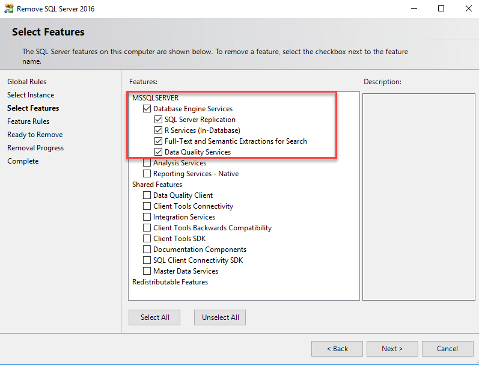
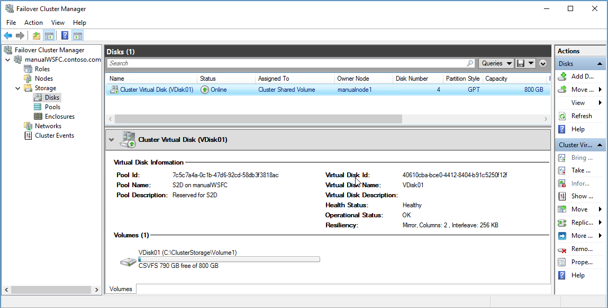
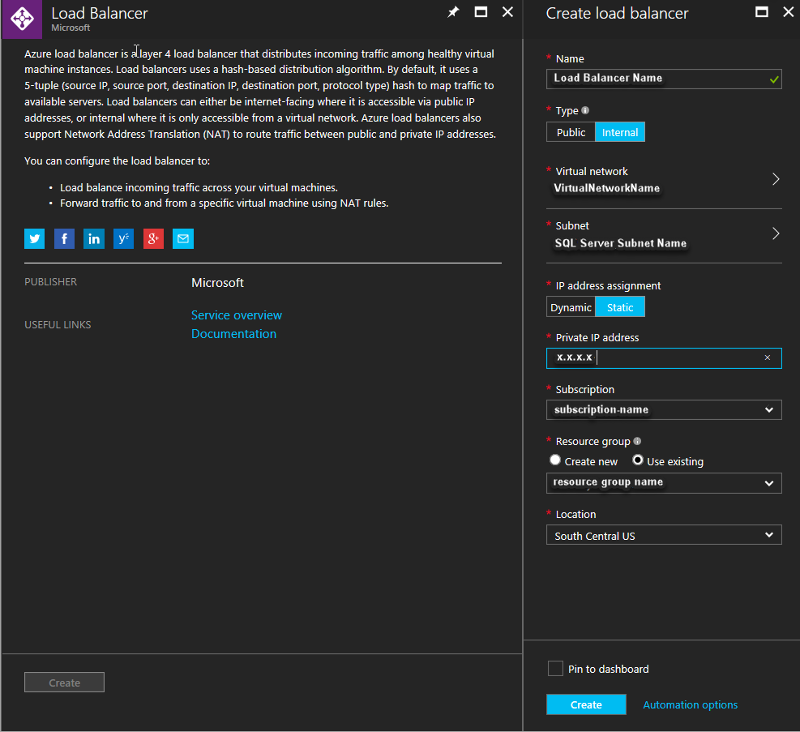

# Configure a SQL Server failover cluster instance on Azure virtual machines

This article explains how to create a SQL Server failover cluster instance (FCI) on Azure virtual machines in the Azure Resource Manager model. This solution uses [Windows Server 2016 Datacenter edition Storage Spaces Direct](https://technet.microsoft.com/windows-server-docs/storage/storage-spaces/storage-spaces-direct-overview) as a software-based virtual SAN that synchronizes the storage (data disks) between the nodes (Azure VMs) in a Windows cluster. Storage Spaces Direct was new in Windows Server 2016.

The following diagram shows the complete solution on Azure virtual machines:


This diagram shows:

- Two Azure virtual machines in a Windows Server Failover Cluster. When a virtual machine is in a failover cluster, it's also called a *cluster node* or *node*.
- Each virtual machine has two or more data disks.
- Storage Spaces Direct synchronizes the data on the data disks and presents the synchronized storage as a storage pool.
- The storage pool presents a Cluster Shared Volume (CSV) to the failover cluster.
- The SQL Server FCI cluster role uses the CSV for the data drives.
- An Azure load balancer to hold the IP address for the SQL Server FCI.
- An Azure availability set holds all the resources.

>[!NOTE]
>All Azure resources in the diagram are in the same resource group.

For details about Storage Spaces Direct, see [Windows Server 2016 Datacenter edition Storage Spaces Direct](https://technet.microsoft.com/windows-server-docs/storage/storage-spaces/storage-spaces-direct-overview).

Storage Spaces Direct supports two types of architectures: converged and hyper-converged. The architecture in this document is hyper-converged. A hyper-converged infrastructure places the storage on the same servers that host the clustered application. In this architecture, the storage is on each SQL Server FCI node.

## Licensing and pricing

On Azure virtual machines, you can license SQL Server using pay-as-you-go (PAYG) or bring-your-own-license (BYOL) VM images. The type of image you choose affects how you're charged.

With pay-as-you-go licensing, a failover cluster instance (FCI) of SQL Server on Azure virtual machines incurs charges for all nodes of the FCI, including the passive nodes. For more information, see [SQL Server Enterprise Virtual Machines Pricing](https://azure.microsoft.com/pricing/details/virtual-machines/sql-server-enterprise/).

If you have Enterprise Agreement with Software Assurance, you can use one free passive FCI node for each active node. To take advantage of this benefit in Azure, use BYOL VM images, and use the same license on both the active and passive nodes of the FCI. For more information, see [Enterprise Agreement](https://www.microsoft.com/Licensing/licensing-programs/enterprise.aspx).

To compare pay-as-you-go and BYOL licensing for SQL Server on Azure virtual machines, see [Get started with SQL VMs](virtual-machines-windows-sql-server-iaas-overview.md#get-started-with-sql-vms).

For complete information about licensing SQL Server, see [Pricing](https://www.microsoft.com/sql-server/sql-server-2017-pricing).

### Example Azure template

You can create this entire solution in Azure from a template. An example of a template is available in the GitHub [Azure Quickstart Templates](https://github.com/MSBrett/azure-quickstart-templates/tree/master/sql-server-2016-fci-existing-vnet-and-ad). This example isn't designed or tested for any specific workload. You can run the template to create a SQL Server FCI with Storage Spaces Direct storage connected to your domain. You can evaluate the template and modify it for your purposes.

## Before you begin

There are a few things you need to know and have in place before you start.

### What to know
You should have an operational understanding of these technologies:

- [Windows cluster technologies](https://docs.microsoft.com/windows-server/failover-clustering/failover-clustering-overview)
- [SQL Server Failover Cluster Instances](https://docs.microsoft.com/sql/sql-server/failover-clusters/windows/always-on-failover-cluster-instances-sql-server)

One thing to be aware of is that on an Azure IaaS VM guest failover cluster, we recommend a single NIC per server (cluster node) and a single subnet. Azure networking has physical redundancy, which makes additional NICs and subnets unnecessary on an Azure IaaS VM guest cluster. The cluster validation report will warn you that the nodes are reachable only on a single network. You can ignore this warning on Azure IaaS VM guest failover clusters.

You should also have a general understanding of these technologies:

- [Hyper-converged solutions that use Storage Spaces Direct in Windows Server 2016](https://docs.microsoft.com/windows-server/storage/storage-spaces/storage-spaces-direct-overview)
- [Azure resource groups](../../../azure-resource-manager/management/manage-resource-groups-portal.md)

> [!IMPORTANT]
> At this time, SQL Server failover cluster instances on Azure virtual machines are only supported with the [lightweight management mode](virtual-machines-windows-sql-register-with-resource-provider.md#management-modes) of the [SQL Server IaaS Agent Extension](virtual-machines-windows-sql-server-agent-extension.md). To change from full extension mode to lightweight, delete the **SQL Virtual Machine** resource for the corresponding VMs and then register them with the SQL VM resource provider in lightweight mode. When deleting the **SQL Virtual Machine** resource using the Azure portal, **clear the checkbox next to the correct Virtual Machine**. The full extension supports features such as automated backup, patching, and advanced portal management. These features will not work for SQL VMs after the agent is reinstalled in lightweight management mode.

### What to have

Before you complete the steps in this article, you should already have:

- A Microsoft Azure subscription.
- A Windows domain on Azure virtual machines.
- An account that has permissions to create objects on both Azure virtual machines and in Active Directory.
- An Azure virtual network and subnet with enough IP address space for these components:
   - Both virtual machines.
   - The failover cluster IP address.
   - An IP address for each FCI.
- DNS configured on the Azure network, pointing to the domain controllers.

With these prerequisites in place, you can start building your failover cluster. The first step is to create the virtual machines.

## Step 1: Create the virtual machines

1. Sign in to the [Azure portal](https://portal.azure.com) with your subscription.

1. [Create an Azure availability set](../tutorial-availability-sets.md).

   The availability set groups virtual machines across fault domains and update domains. It ensures your application isn't affected by single points of failure, like the network switch or the power unit of a rack of servers.

   If you haven't created the resource group for your virtual machines, do it when you create an Azure availability set. If you're using the Azure portal to create the availability set, take these steps:

   1. In the Azure portal, select **Create a resource** to open the Azure Marketplace. Search for **Availability set**.
   1. Select **Availability Set**.
   1. Select **Create**.
   1. Under **Create availability set**, provide these values:
      - **Name**: A name for the availability set.
      - **Subscription**: Your Azure subscription.
      - **Resource group**: If you want to use an existing group, click **Select existing** and then select the group from the list. Otherwise, select **Create new** and enter a name for the group.
      - **Location**: Set the location where you plan to create your virtual machines.
      - **Fault domains**: Use the default (**3**).
      - **Update domains**: Use the default (**5**).
   1. Select **Create** to create the availability set.

1. Create the virtual machines in the availability set.

   Provision two SQL Server virtual machines in the Azure availability set. For instructions, see [Provision a SQL Server virtual machine in the Azure portal](virtual-machines-windows-portal-sql-server-provision.md).

   Place both virtual machines:

   - In the same Azure resource group as your availability set.
   - On the same network as your domain controller.
   - On a subnet that has enough IP address space for both virtual machines and all FCIs that you might eventually use on the cluster.
   - In the Azure availability set.

      >[!IMPORTANT]
      >You can't set or change the availability set after you've created a virtual machine.

   Choose an image from Azure Marketplace. You can use an Azure Marketplace image that includes Windows Server and SQL Server, or use one that just includes Windows Server. For details, see [Overview of SQL Server on Azure virtual machines](virtual-machines-windows-sql-server-iaas-overview.md).

   The official SQL Server images in the Azure Gallery include an installed SQL Server instance, the SQL Server installation software, and the required key.

   Choose the right image, based on how you want to pay for the SQL Server license:

   - **Pay-per-usage licensing**. The per-second cost of these images includes the SQL Server licensing:
      - **SQL Server 2016 Enterprise on Windows Server 2016 Datacenter**
      - **SQL Server 2016 Standard on Windows Server 2016 Datacenter**
      - **SQL Server 2016 Developer on Windows Server 2016 Datacenter**

   - **Bring-your-own-license (BYOL)**

      - **(BYOL) SQL Server 2016 Enterprise on Windows Server 2016 Datacenter**
      - **(BYOL) SQL Server 2016 Standard on Windows Server 2016 Datacenter**

   >[!IMPORTANT]
   >After you create the virtual machine, remove the pre-installed standalone SQL Server instance. You'll use the pre-installed SQL Server media to create the SQL Server FCI after you set up the failover cluster and Storage Spaces Direct.

   Alternatively, you can use Azure Marketplace images that contain just the operating system. Choose a **Windows Server 2016 Datacenter** image and install the SQL Server FCI after you set up the failover cluster and Storage Spaces Direct. This image doesn't contain SQL Server installation media. Place the SQL Server installation media in a location where you can run it for each server.

1. After Azure creates your virtual machines, connect to each one by using RDP.

   When you first connect to a virtual machine by using RDP, a prompt asks you if you want to allow the PC to be discoverable on the network. Select **Yes**.

1. If you're using one of the SQL Server-based virtual machine images, remove the SQL Server instance.

   1. In **Programs and Features**, right-click **Microsoft SQL Server 2016 (64-bit)** and select **Uninstall/Change**.
   1. Select **Remove**.
   1. Select the default instance.
   1. Remove all features under **Database Engine Services**. Don't remove **Shared Features**. You'll see something like the following screenshot:

      

   1. Select **Next**, and then select **Remove**.

1. <a name="ports"></a>Open the firewall ports.

   On each virtual machine, open these ports on the Windows Firewall:

   | Purpose | TCP port | Notes
   | ------ | ------ | ------
   | SQL Server | 1433 | Normal port for default instances of SQL Server. If you used an image from the gallery, this port is automatically opened.
   | Health probe | 59999 | Any open TCP port. In a later step, configure the load balancer [health probe](#probe) and the cluster to use this port.  

1. Add storage to the virtual machine. For detailed information, see [add storage](../disks-types.md).

   Both virtual machines need at least two data disks.

   Attach raw disks, not NTFS-formatted disks.
      >[!NOTE]
      >If you attach NTFS-formatted disks, you can enable Storage Spaces Direct only without a disk eligibility check.  

   Attach a minimum of two premium SSDs to each VM. We recommend at least P30 (1-TB) disks.

   Set host caching to **Read-only**.

   The storage capacity you use in production environments depends on your workload. The values described in this article are for demonstration and testing.

1. [Add the virtual machines to your pre-existing domain](virtual-machines-windows-portal-sql-availability-group-prereq.md#joinDomain).

After you create and configure the virtual machines, you can set up the failover cluster.

## Step 2: Configure the Windows Server Failover Cluster with Storage Spaces Direct

The next step is to configure the failover cluster with Storage Spaces Direct. In this step, you'll complete these substeps:

1. Add the Windows Server Failover Clustering feature.
1. Validate the cluster.
1. Create the failover cluster.
1. Create the cloud witness.
1. Add storage.

### Add Windows Server Failover Clustering

1. Connect to the first virtual machine with RDP by using a domain account that's a member of the local administrators and that has permission to create objects in Active Directory. Use this account for the rest of the configuration.

1. [Add Failover Clustering to each virtual machine](virtual-machines-windows-portal-sql-availability-group-prereq.md#add-failover-clustering-features-to-both-sql-server-vms).

   To install Failover Clustering from the UI, take these steps on both virtual machines:
   1. In **Server Manager**, select **Manage**, and then select **Add Roles and Features**.
   1. In the **Add Roles and Features Wizard**, select **Next** until you get to **Select Features**.
   1. In **Select Features**, select **Failover Clustering**. Include all required features and the management tools. Select **Add Features**.
   1. Select **Next**, and then select **Finish** to install the features.

   To install Failover Clustering by using PowerShell, run the following script from an administrator PowerShell session on one of the virtual machines:

   ```powershell
   $nodes = ("<node1>","<node2>")
   Invoke-Command  $nodes {Install-WindowsFeature Failover-Clustering -IncludeAllSubFeature -IncludeManagementTools}
   ```

For further reference about the next steps, see the instructions under Step 3 of [Hyper-converged solution using Storage Spaces Direct in Windows Server 2016](https://technet.microsoft.com/windows-server-docs/storage/storage-spaces/hyper-converged-solution-using-storage-spaces-direct#step-3-configure-storage-spaces-direct).

### Validate the cluster

Validate the cluster in the UI or by using PowerShell.

To validate the cluster by using the UI, take the following steps on one of the virtual machines:

1. Under **Server Manager**, select **Tools**, and then select **Failover Cluster Manager**.
1. Under **Failover Cluster Manager**, select **Action**, and then select **Validate Configuration**.
1. Select **Next**.
1. Under **Select Servers or a Cluster**, enter the names of both virtual machines.
1. Under **Testing options**, select **Run only tests I select**. Select **Next**.
1. Under **Test Selection**, select all tests except for **Storage**, as shown here:

   

1. Select **Next**.
1. Under **Confirmation**, select **Next**.

The Validate a Configuration Wizard runs the validation tests.

To validate the cluster by using PowerShell, run the following script from an administrator PowerShell session on one of the virtual machines:

   ```powershell
   Test-Cluster –Node ("<node1>","<node2>") –Include "Storage Spaces Direct", "Inventory", "Network", "System Configuration"
   ```

After you validate the cluster, create the failover cluster.

### Create the failover cluster

To create the failover cluster, you need:
- The names of the virtual machines that will become the cluster nodes.
- A name for the failover cluster
- An IP address for the failover cluster. You can use an IP address that's not used on the same Azure virtual network and subnet as the cluster nodes.

#### Windows Server 2008 through Windows Server 2016

The following PowerShell script creates a failover cluster for Windows Server 2008 through Windows Server 2016. Update the script with the names of the nodes (the virtual machine names) and an available IP address from the Azure virtual network.

```powershell
New-Cluster -Name <FailoverCluster-Name> -Node ("<node1>","<node2>") –StaticAddress <n.n.n.n> -NoStorage
```   

#### Windows Server 2019

The following PowerShell script creates a failover cluster for Windows Server 2019. For more information, see [Failover cluster: Cluster Network Object](https://blogs.windows.com/windowsexperience/2018/08/14/announcing-windows-server-2019-insider-preview-build-17733/#W0YAxO8BfwBRbkzG.97). Update the script with the names of the nodes (the virtual machine names) and an available IP address from the Azure virtual network.

```powershell
New-Cluster -Name <FailoverCluster-Name> -Node ("<node1>","<node2>") –StaticAddress <n.n.n.n> -NoStorage -ManagementPointNetworkType Singleton 
```


### Create a cloud witness

Cloud Witness is a new type of cluster quorum witness that's stored in an Azure storage blob. This removes the need for a separate VM that hosts a witness share.

1. [Create a cloud witness for the failover cluster](https://technet.microsoft.com/windows-server-docs/failover-clustering/deploy-cloud-witness).

1. Create a blob container.

1. Save the access keys and the container URL.

1. Configure the failover cluster quorum witness. See [Configure the quorum witness in the user interface](https://technet.microsoft.com/windows-server-docs/failover-clustering/deploy-cloud-witness#to-configure-cloud-witness-as-a-quorum-witness).

### Add storage

The disks for Storage Spaces Direct need to be empty. They can't contain partitions or other data. To clean the disks, follow [the steps in this guide](https://docs.microsoft.com/windows-server/storage/storage-spaces/deploy-storage-spaces-direct?redirectedfrom=MSDN#step-31-clean-drives).

1. [Enable Store Spaces Direct](https://technet.microsoft.com/windows-server-docs/storage/storage-spaces/hyper-converged-solution-using-storage-spaces-direct#step-35-enable-storage-spaces-direct).

   The following PowerShell script enables Storage Spaces Direct:  

   ```powershell
   Enable-ClusterS2D
   ```

   In **Failover Cluster Manager**, you can now see the storage pool.

1. [Create a volume](https://technet.microsoft.com/windows-server-docs/storage/storage-spaces/hyper-converged-solution-using-storage-spaces-direct#step-36-create-volumes).

   Storage Spaces Direct automatically creates a storage pool when you enable it. You're now ready to create a volume. The PowerShell cmdlet `New-Volume` automates the volume creation process. This process includes formatting, adding the volume to the cluster, and creating a Cluster Shared Volume (CSV). This example creates an 800-gigabyte (GB) CSV:

   ```powershell
   New-Volume -StoragePoolFriendlyName S2D* -FriendlyName VDisk01 -FileSystem CSVFS_REFS -Size 800GB
   ```   

   After this command completes, an 800-GB volume is mounted as a cluster resource. The volume is at `C:\ClusterStorage\Volume1\`.

   This screenshot shows a Cluster Shared Volume with Storage Spaces Direct:

   

## Step 3: Test failover cluster failover

In **Failover Cluster Manager**, verify that you can move the storage resource to the other cluster node. If you can connect to the failover cluster by using **Failover Cluster Manager** and move the storage from one node to the other, you're ready to configure the FCI.

## Step 4: Create the SQL Server FCI

After you've configured the failover cluster and all cluster components, including storage, you can create the SQL Server FCI.

1. Connect to the first virtual machine by using RDP.

1. In **Failover Cluster Manager**, make sure all Core Cluster Resources are on the first virtual machine. If necessary, move all resources to that virtual machine.

1. Locate the installation media. If the virtual machine uses one of the Azure Marketplace images, the media is located at `C:\SQLServer_<version number>_Full`. Select **Setup**.

1. In **SQL Server Installation Center**, select **Installation**.

1. Select **New SQL Server failover cluster installation**. Follow the instructions in the wizard to install the SQL Server FCI.

   The FCI data directories need to be on clustered storage. With Storage Spaces Direct, it's not a shared disk, but a mount point to a volume on each server. Storage Spaces Direct synchronizes the volume between both nodes. The volume is presented to the cluster as a Cluster Shared Volume. Use the CSV mount point for the data directories.

   

1. After you complete the instructions in the wizard, Setup will install a SQL Server FCI on the first node.

1. After Setup installs the FCI on the first node, connect to the second node by using RDP.

1. Open the **SQL Server Installation Center**. Select **Installation**.

1. Select **Add node to a SQL Server failover cluster**. Follow the instructions in the wizard to install SQL Server and add the server to the FCI.

   >[!NOTE]
   >If you used an Azure Marketplace gallery image that contains SQL Server, SQL Server tools were included with the image. If you didn't use one of those images, install the SQL Server tools separately. See [Download SQL Server Management Studio (SSMS)](https://msdn.microsoft.com/library/mt238290.aspx).

## Step 5: Create the Azure load balancer

On Azure virtual machines, clusters use a load balancer to hold an IP address that needs to be on one cluster node at a time. In this solution, the load balancer holds the IP address for the SQL Server FCI.

For more information, see [Create and configure an Azure load balancer](virtual-machines-windows-portal-sql-availability-group-tutorial.md#configure-internal-load-balancer).

### Create the load balancer in the Azure portal

To create the load balancer:

1. In the Azure portal, go to the resource group that contains the virtual machines.

1. Select **Add**. Search the Azure Marketplace for **Load Balancer**. Select **Load Balancer**.

1. Select **Create**.

1. Configure the load balancer with:

   - **Subscription**: Your Azure subscription.
   - **Resource group**: The resource group that contains your virtual machines.
   - **Name**: A name that identifies the load balancer.
   - **Region**: The Azure location that contains your virtual machines.
   - **Type**: Either public or private. A private load balancer can be accessed from within the virtual network. Most Azure applications can use a private load balancer. If your application needs access to SQL Server directly over the internet, use a public load balancer.
   - **SKU**: Standard.
   - **Virtual network**: The same network as the virtual machines.
   - **IP address assignment**: Static. 
   - **Private IP address**: The IP address that you assigned to the SQL Server FCI cluster network resource.

 The following screenshot shows the **Create load balancer** UI:

   

### Configure the load balancer backend pool

1. Return to the Azure resource group that contains the virtual machines and locate the new load balancer. You might need to refresh the view on the resource group. Select the load balancer.

1. Select **Backend pools**, and then select **Add**.

1. Associate the backend pool with the availability set that contains the VMs.

1. Under **Target network IP configurations**, select **VIRTUAL MACHINE** and choose the virtual machines that will participate as cluster nodes. Be sure to include all virtual machines that will host the FCI.

1. Select **OK** to create the backend pool.

### Configure a load balancer health probe

1. On the load balancer blade, select **Health probes**.

1. Select **Add**.

1. On the **Add health probe** blade, <a name="probe"></a>set the health probe parameters.

   - **Name**: A name for the health probe.
   - **Protocol**: TCP.
   - **Port**: Set to the port you created in the firewall for the health probe in [this step](#ports). In this article, the example uses TCP port `59999`.
   - **Interval**: 5 Seconds.
   - **Unhealthy threshold**: 2 consecutive failures.

1. Select **OK**.

### Set load balancing rules

1. On the load balancer blade, select **Load balancing rules**.

1. Select **Add**.

1. Set the load balancing rule parameters:

   - **Name**: A name for the load balancing rules.
   - **Frontend IP address**: The IP address for the SQL Server FCI cluster network resource.
   - **Port**: The SQL Server FCI TCP port. The default instance port is 1433.
   - **Backend port**: Uses the same port as the **Port** value when you enable **Floating IP (direct server return)**.
   - **Backend pool**: The backend pool name that you configured earlier.
   - **Health probe**: The health probe that you configured earlier.
   - **Session persistence**: None.
   - **Idle timeout (minutes)**: 4.
   - **Floating IP (direct server return)**: Enabled.

1. Select **OK**.

## Step 6: Configure the cluster for the probe

Set the cluster probe port parameter in PowerShell.

To set the cluster probe port parameter, update the variables in the following script with values from your environment. Remove the angle brackets (`<` and `>`) from the script.

   ```powershell
   $ClusterNetworkName = "<Cluster Network Name>"
   $IPResourceName = "<SQL Server FCI IP Address Resource Name>" 
   $ILBIP = "<n.n.n.n>" 
   [int]$ProbePort = <nnnnn>

   Import-Module FailoverClusters

   Get-ClusterResource $IPResourceName | Set-ClusterParameter -Multiple @{"Address"="$ILBIP";"ProbePort"=$ProbePort;"SubnetMask"="255.255.255.255";"Network"="$ClusterNetworkName";"EnableDhcp"=0}
   ```

The following list describes the values that you need to update:

   - `<Cluster Network Name>`: The Windows Server Failover Cluster name for the network. In **Failover Cluster Manager** > **Networks**, right-click the network and select **Properties**. The correct value is under **Name** on the **General** tab.

   - `<SQL Server FCI IP Address Resource Name>`: The SQL Server FCI IP address resource name. In **Failover Cluster Manager** > **Roles**, under the SQL Server FCI role, under **Server Name**, right-click the IP address resource and select **Properties**. The correct value is under **Name** on the **General** tab. 

   - `<ILBIP>`: The ILB IP address. This address is configured in the Azure portal as the ILB front-end address. This is also the SQL Server FCI IP address. You can find it in **Failover Cluster Manager** on the same properties page where you located the `<SQL Server FCI IP Address Resource Name>`.  

   - `<nnnnn>`: The probe port you configured in the load balancer health probe. Any unused TCP port is valid.

>[!IMPORTANT]
>The subnet mask for the cluster parameter must be the TCP IP broadcast address: `255.255.255.255`.

After you set the cluster probe, you can see all the cluster parameters in PowerShell. Run this script:

   ```powershell
   Get-ClusterResource $IPResourceName | Get-ClusterParameter 
  ```

## Step 7: Test FCI failover

Test failover of the FCI to validate cluster functionality. Take the following steps:

1. Connect to one of the SQL Server FCI cluster nodes by using RDP.

1. Open **Failover Cluster Manager**. Select **Roles**. Notice which node owns the SQL Server FCI role.

1. Right-click the SQL Server FCI role.

1. Select **Move**, and then select **Best Possible Node**.

**Failover Cluster Manager** shows the role, and its resources go offline. The resources then move and come online on the other node.

### Test connectivity

To test connectivity, sign in to another virtual machine in the same virtual network. Open **SQL Server Management Studio** and connect to the SQL Server FCI name.

>[!NOTE]
>If you need to, you can [download SQL Server Management Studio](https://msdn.microsoft.com/library/mt238290.aspx).

## Limitations

Azure virtual machines support Microsoft Distributed Transaction Coordinator (MSDTC) on Windows Server 2019 with storage on Clustered Shared Volumes (CSV) and a [standard load balancer](../../../load-balancer/load-balancer-standard-overview.md).

On Azure virtual machines, MSDTC isn't supported on Windows Server 2016 or earlier because:

- The clustered MSDTC resource can't be configured to use shared storage. On Windows Server 2016, if you create an MSDTC resource, it won't show any shared storage available for use, even if storage is available. This issue has been fixed in Windows Server 2019.
- The basic load balancer doesn't handle RPC ports.

## See also

[Set up Storage Spaces Direct with remote desktop (Azure)](https://technet.microsoft.com/windows-server-docs/compute/remote-desktop-services/rds-storage-spaces-direct-deployment)

[Hyper-converged solution with Storage Spaces Direct](https://technet.microsoft.com/windows-server-docs/storage/storage-spaces/hyper-converged-solution-using-storage-spaces-direct)

[Storage Spaces Direct Overview](https://technet.microsoft.com/windows-server-docs/storage/storage-spaces/storage-spaces-direct-overview)

[SQL Server support for Storage Spaces Direct](https://blogs.technet.microsoft.com/dataplatforminsider/2016/09/27/sql-server-2016-now-supports-windows-server-2016-storage-spaces-direct/)
