# Provision a SQL Server virtual machine in the Azure portal
> [!div class="op_single_selector"]
> * [Portal](virtual-machines-windows-portal-sql-server-provision.md)
> * [PowerShell](virtual-machines-windows-ps-sql-create.md)
> 
> 

This end-to-end tutorial shows you how to use the Azure portal to provision a virtual machine running SQL Server.

The Azure virtual machine (VM) gallery includes several images that contain Microsoft SQL Server. With a few clicks, you can select one of the SQL VM images from the gallery and provision it in your Azure environment.

In this tutorial, you will:

* [Select a SQL VM image from the gallery](#select-a-sql-vm-image-from-the-gallery)
* [Configure and create the VM](#configure-the-vm)
* [Open the VM with Remote Desktop](#open-the-vm-with-remote-desktop)
* [Connect to SQL Server remotely](#connect-to-sql-server-remotely)

## Select a SQL VM image from the gallery

1. Log in to the [Azure portal](https://portal.azure.com) using your account.

   > [!NOTE]
   > If you do not have an Azure account, visit [Azure free trial](https://azure.microsoft.com/pricing/free-trial/).

2. On the Azure portal, click **New**. The portal opens the **New** window.

3. In the **New** window, click **Compute** and then click **See all**.

   

4. In the search field, type **SQL Server**, and press ENTER.

5. Then click the **Filter** icon and select **Microsoft** for the publisher. Click **Done** on the filter window to filter the results to Microsoft published SQL Server images.

   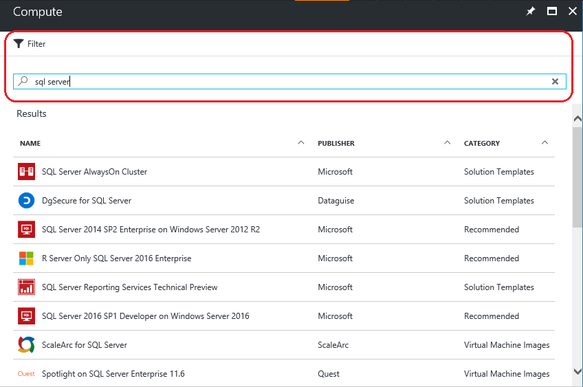

5. Review the available SQL Server images. Each image identifies a SQL Server version and an operating system.

6. Select the image named **Free License: SQL Server 2016 SP1 Developer on Windows Server 2016**.

   > [!TIP]
   > The Developer edition is used in this tutorial because it is a full-featured edition of SQL Server that is free for development testing purposes. You pay only for the cost of running the VM. However, you are free to choose any of the images to use in this tutorial.

   > [!TIP]
   > SQL VM images include the licensing costs for SQL Server into the per-minute pricing of the VM you create (except for the Developer and Express editions). SQL Server Developer is free for development/testing (not production) and SQL Express is free for lightweight workloads (less than 1GB memory, less than 10 GB storage). There is another option to bring-your-own-license (BYOL) and pay only for the VM. Those image names are prefixed with {BYOL}. 
   >
   > For more information on these options, see [Pricing guidance for SQL Server Azure VMs](virtual-machines-windows-sql-server-pricing-guidance.md).

7. Under **Select a deployment model**, verify that **Resource Manager** is selected. Resource Manager is the recommended deployment model for new virtual machines. 

8. Click **Create**.

    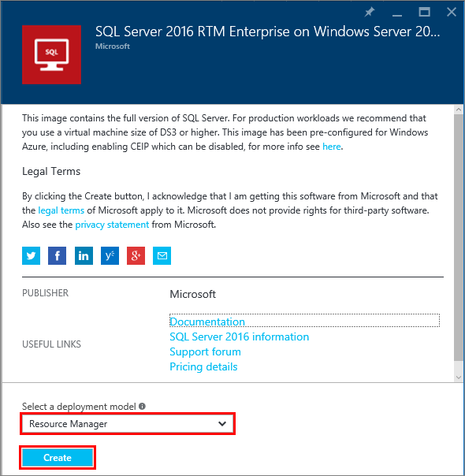

## Configure the VM
There are five windows for configuring a SQL Server virtual machine.

| Step | Description |
| --- | --- |
| **Basics** |[Configure basic settings](#1-configure-basic-settings) |
| **Size** |[Choose virtual machine size](#2-choose-virtual-machine-size) |
| **Settings** |[Configure optional features](#3-configure-optional-features) |
| **SQL Server settings** |[Configure SQL server settings](#4-configure-sql-server-settings) |
| **Summary** |[Review the summary](#5-review-the-summary) |

## 1. Configure basic settings

On the **Basics** window, provide the following information:

* Enter a unique virtual machine **Name**.

* Select **SSD** for VM disk type for optimal performance.

* Specify a **User name** for the local administrator account on the VM. This account is also added to the SQL Server **sysadmin** fixed server role.

* Provide a strong **Password**.

* If you have multiple subscriptions, verify that the subscription is correct for the new VM.

* In the **Resource group** box, type a name for a new resource group. Alternatively, to use an existing resource group click **Use existing**. A resource group is a collection of related resources in Azure (virtual machines, storage accounts, virtual networks, etc.).

  > [!NOTE]
  > Using a new resource group is helpful if you are just testing or learning about SQL Server deployments in Azure. After you finish with your test, delete the resource group to automatically delete the VM and all resources associated with that resource group. For more information about resource groups, see [Azure Resource Manager Overview](../../../azure-resource-manager/resource-group-overview.md).

* Select a **Location** for the Azure region that will host this deployment.

* Click **OK** to save the settings.

    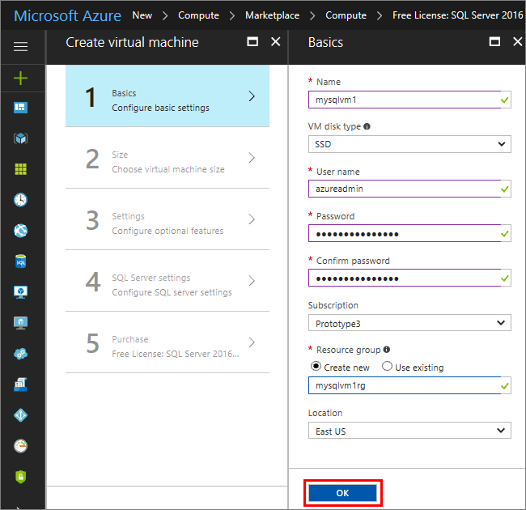

## 2. Choose virtual machine size

On the **Size** step, choose a virtual machine size in the **Choose a size** window. The window initially displays recommended machine sizes based on the image you selected.

> [!IMPORTANT]
> The estimated monthly cost displayed on the **Choose a size** window does not include SQL Server licensing costs. This is the cost of the VM alone. For the Express and Developer editions of SQL Server, this is the total estimated cost. For other editions, see the [Windows Virtual Machines pricing page](https://azure.microsoft.com/pricing/details/virtual-machines/windows/) and select your target edition of SQL Server. Also see the [Pricing guidance for SQL Server Azure VMs](virtual-machines-windows-sql-server-pricing-guidance.md).

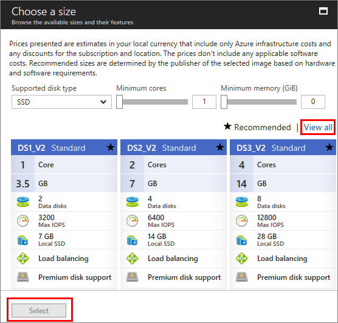

For production workloads, see the recommended machine sizes and configuration in [Performance best practices for SQL Server in Azure Virtual Machines](virtual-machines-windows-sql-performance.md). If you need a machine size that is not listed, click the **View all** button.

> [!NOTE]
> For more information about virtual machine sizes see, [Sizes for virtual machines](../sizes.md?toc=%2fazure%2fvirtual-machines%2fwindows%2ftoc.json).

Choose your machine size, and then click **Select**.

## 3. Configure optional features

On the **Settings** window, configure Azure storage, networking, and monitoring for the virtual machine.

* Under **Storage**, select **Yes** under use **Managed Disks**.

   > [!NOTE]
   > Microsoft recommends Managed Disks for SQL Server. Managed Disks handles storage behind the scenes. In addition, when virtual machines with Managed Disks are in the same availability set, Azure distributes the storage resources to provide appropriate redundancy. For additional information, see [Azure Managed Disks Overview](../../../storage/storage-managed-disks-overview.md). For specifics about managed disks in an availability set, see [Use managed disks for VMs in availability set](../manage-availability.md).

* Under **Network**, you can accept the automatically populated values. You can also click on each feature to manually configure the **Virtual network**, **Subnet**, **Public IP address**, and **Network Security Group**. For the purposes of this tutorial, keep the default values.

* Azure enables **Monitoring** by default with the same storage account designated for the VM. You can change these settings here.

* Under **Availability set**, you can leave the default of **none** for this tutorial. If you plan to set up SQL AlwaysOn Availability Groups, configure the availability to avoid recreating the virtual machine.  For more information, see [Manage the Availability of Virtual Machines](../manage-availability.md?toc=%2fazure%2fvirtual-machines%2fwindows%2ftoc.json).

When you are done configuring these settings, click **OK**.

## 4. Configure SQL server settings
On the **SQL Server settings** window, configure specific settings and optimizations for SQL Server. The settings that you can configure for SQL Server include the following.

| Setting |
| --- |
| [Connectivity](#connectivity) |
| [Authentication](#authentication) |
| [Storage configuration](#storage-configuration) |
| [Automated Patching](#automated-patching) |
| [Automated Backup](#automated-backup) |
| [Azure Key Vault Integration](#azure-key-vault-integration) |
| [R Services](#r-services) |

### Connectivity

Under **SQL connectivity**, specify the type of access you want to the SQL Server instance on this VM. For the purposes of this tutorial, select **Public (internet)** to allow connections to SQL Server from machines or services on the internet. With this option selected, Azure automatically configures the firewall and the network security group to allow traffic on port 1433.

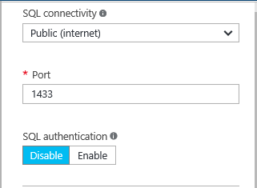

> [!TIP]
> By default, SQL Server listens on a well-known port, **1433**. For increased security, change the port in the previous dialog to listen on a non-default port, such as 1401. If you do this, you must connect using that port from any client tools, such as SSMS.

To connect to SQL Server via the internet, you also must enable SQL Server Authentication, which is described in the next section.

If you would prefer to not enable connections to the Database Engine via the internet, choose one of the following options:

* **Local (inside VM only)** to allow connections to SQL Server only from within the VM.
* **Private (within Virtual Network)** to allow connections to SQL Server from machines or services in the same virtual network.

In general, improve security by choosing the most restrictive connectivity that your scenario allows. But all the options are securable through Network Security Group rules and SQL/Windows Authentication. You can edit Network Security Group after the VM is created. For more information, see [Security Considerations for SQL Server in Azure Virtual Machines](virtual-machines-windows-sql-security.md).

> [!NOTE]
> The virtual machine image for SQL Server Express edition does not automatically enable the TCP/IP protocol. This is true even for the Public and  Private connectivity options. For Express edition, you must use SQL Server Configuration Manager to [manually enable the TCP/IP protocol](#configure-sql-server-to-listen-on-the-tcp-protocol) after creating the VM.

### Authentication

If you require SQL Server Authentication, click **Enable** under **SQL authentication**.

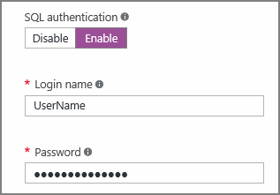

> [!NOTE]
> If you plan to access SQL Server over the internet (i.e. the Public connectivity option), you must enable SQL authentication here. Public access to the SQL Server requires the use of SQL Authentication.
> 
> 

If you enable SQL Server Authentication, specify a **Login name** and **Password**. This user name is configured as a SQL Server Authentication login and member of the **sysadmin** fixed server role. See [Choose an Authentication Mode](https://docs.microsoft.com/sql/relational-databases/security/choose-an-authentication-mode) for more information about Authentication Modes.

If you do not enable SQL Server Authentication, then you can use the local Administrator account on the VM to connect to the SQL Server instance.

### Storage configuration

Click **Storage configuration** to specify the storage requirements.

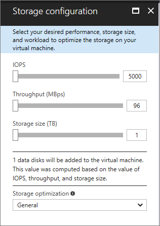

> [!NOTE]
> If you manually configured your VM to use standard storage, this option is not available. Automatic storage optimization is available only for Premium Storage.

> [!TIP]
> The number of stops and the upper limits of each slider is dependent on the size of VM you selected. A larger and more powerful VM is able to scale up more.

You can specify requirements as input/output operations per second (IOPs), throughput in MB/s, and total storage size. Configure these values by using the sliding scales. You can change these storage settings based on workload. The portal automatically calculates the number of disks to attach and configure based on these requirements.

Under **Storage optimized for**, select one of the following options:

* **General** is the default setting and supports most workloads.
* **Transactional** processing optimizes the storage for traditional database OLTP workloads.
* **Data warehousing** optimizes the storage for analytic and reporting workloads.

### Automated patching

**Automated patching** is enabled by default. Automated patching allows Azure to automatically patch SQL Server and the operating system. Specify a day of the week, time, and duration for a maintenance window. Azure performs patching in this maintenance window. The maintenance window schedule uses the VM locale for time. If you do not want Azure to automatically patch SQL Server and the operating system, click **Disable**.  

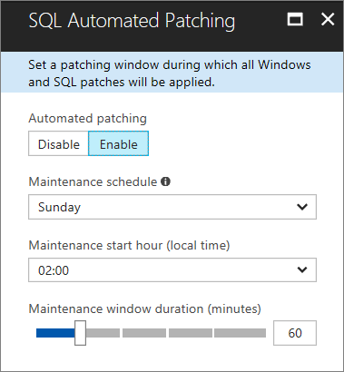

For more information, see [Automated Patching for SQL Server in Azure Virtual Machines](virtual-machines-windows-sql-automated-patching.md).

### Automated backup

Enable automatic database backups for all databases under **Automated backup**. Automated backup is disabled by default.

When you enable SQL automated backup, you can configure the following:

* Retention period (days) for backups
* Storage account to use for backups
* Encryption option and password for backups
* Backup system databases
* Configure backup schedule

To encrypt the backup, click **Enable**. Then specify the **Password**. Azure creates a certificate to encrypt the backups and uses the specified password to protect that certificate.

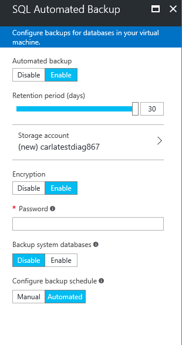

 For more information, see [Automated Backup for SQL Server in Azure Virtual Machines](virtual-machines-windows-sql-automated-backup.md).

### Azure Key Vault integration

To store security secrets in Azure for encryption, click **Azure key vault integration** and click **Enable**.

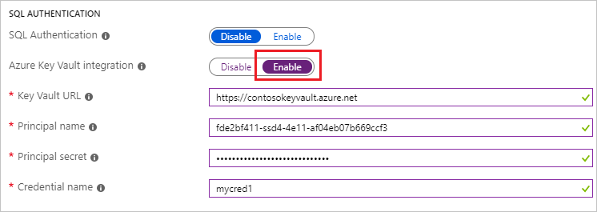

The following table lists the parameters required to configure Azure Key Vault Integration.

| PARAMETER | DESCRIPTION | EXAMPLE |
| --- | --- | --- |
| **Key Vault URL** |The location of the key vault. |https://contosokeyvault.vault.azure.net/ |
| **Principal name** |Azure Active Directory service principal name. This name is also referred to as the Client ID. |fde2b411-33d5-4e11-af04eb07b669ccf2 |
| **Principal secret** |Azure Active Directory service principal secret. This secret is also referred to as the Client Secret. |9VTJSQwzlFepD8XODnzy8n2V01Jd8dAjwm/azF1XDKM= |
| **Credential name** |**Credential name**: AKV Integration creates a credential within SQL Server, allowing the VM to have access to the key vault. Choose a name for this credential. |mycred1 |

For more information, see [Configure Azure Key Vault Integration for SQL Server on Azure VMs](virtual-machines-windows-ps-sql-keyvault.md).

### R services

You have the option to enable [SQL Server R Services](https://msdn.microsoft.com/library/mt604845.aspx). This enables you to use advanced analytics with SQL Server 2016. Click **Enable** on the **SQL Server Settings** window.

> [!NOTE]
> For SQL Server 2016 Developer Edition, this option is incorrectly disabled by the portal. For Developer edition, you must enable R Services manually after creating your VM.

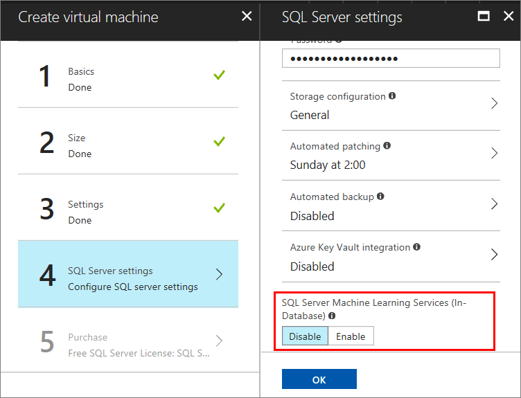

When you are finished configuring SQL Server settings, click **OK**.

## 5. Review the summary

On the **Summary** window, review the summary and click **Purchase** to create SQL Server, resource group, and resources specified for this VM.

You can monitor the deployment from the Azure portal. The **Notifications** button at the top of the screen shows basic status of the deployment.

> [!NOTE]
> To provide you with an idea on deployment times, I deployed a SQL VM to the East US region with default settings. This test deployment took a total of 26 minutes to complete. But you might experience a faster or slower deployment time based on your region and selected settings.

## Open the VM with Remote Desktop

Use the following steps to connect to the SQL Server virtual machine with Remote Desktop:

> [!INCLUDE [Connect to SQL Server VM with remote desktop](../../../../includes/virtual-machines-sql-server-remote-desktop-connect.md)]

After you connect to the SQL Server virtual machine, you can launch SQL Server Management Studio and connect with Windows Authentication using your local administrator credentials. If you enabled SQL Server Authentication, you can also connect with SQL Authentication using the SQL login and password you configured during provisioning.

Access to the machine enables you to directly change machine and SQL Server settings based on your requirements. For example, you could configure the firewall settings or change SQL Server configuration settings.

## Enable TCP/IP for Developer and Express editions

When provisioning a new SQL Server VM, Azure does not automatically enable the TCP/IP protocol for SQL Server Developer and Express editions. The steps below explain how to manually enable TCP/IP so that you can connect remotely by IP address.

The following steps use **SQL Server Configuration Manager** to enable the TCP/IP protocol for SQL Server Developer and Express editions.

> [!INCLUDE [Connect to SQL Server VM with remote desktop](../../../../includes/virtual-machines-sql-server-connection-tcp-protocol.md)]

## Connect to SQL Server remotely

In this tutorial, we selected **Public** access for the virtual machine and **SQL Server Authentication**. These settings automatically configured the virtual machine to allow SQL Server connections from any client over the internet (assuming they have the correct SQL login).

> [!NOTE]
> If you did not select Public during provisioning, then you can change your SQL connectivity settings through the portal after provisioning. For more information, see  [Change your SQL connectivity settings](virtual-machines-windows-sql-connect.md#change).

The following sections show how to connect to your SQL Server instance on your VM from a different computer over the internet.

> [!INCLUDE [Connect to SQL Server in a VM Resource Manager](../../../../includes/virtual-machines-sql-server-connection-steps-resource-manager.md)]

## Next Steps

For other information about using SQL Server in Azure, see [SQL Server on Azure Virtual Machines](virtual-machines-windows-sql-server-iaas-overview.md) and the [Frequently Asked Questions](virtual-machines-windows-sql-server-iaas-faq.md).