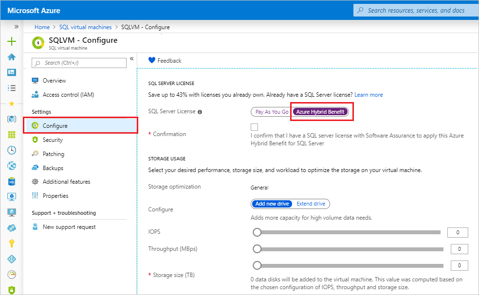

# Change the license model for a SQL Server virtual machine in Azure
This article describes how to change the license model for a SQL Server virtual machine (VM) in Azure by using the new SQL VM resource provider, **Microsoft.SqlVirtualMachine**.

There are two license models for a VM that's hosting SQL Server: pay-as-you-go and Azure Hybrid Benefit. You can modify the license model of your SQL Server VM by using the Azure portal, the Azure CLI, or PowerShell. 

The pay-as-you-go model means that the per-second cost of running the Azure VM includes the cost of the SQL Server license.
[Azure Hybrid Benefit](https://azure.microsoft.com/pricing/hybrid-benefit/) allows you to use your own SQL Server license with a VM that's running SQL Server. 

Azure Hybrid Benefit allows the use of SQL Server licenses with Software Assurance ("Qualified License") on Azure virtual machines. With Azure Hybrid Benefit, customers aren't charged for the use of a SQL Server license on a VM. But they must still pay for the cost of the underlying cloud compute (that is, the base rate), storage, and backups. They must also pay for I/O associated with their use of the services (as applicable).

According to the Microsoft Product Terms: "Customers must indicate that they are using Azure SQL Database (Managed Instance, Elastic Pool, and Single Database), Azure Data Factory, SQL Server Integration Services, or SQL Server Virtual Machines under Azure Hybrid Benefit for SQL Server when configuring workloads on Azure."

To indicate the use of Azure Hybrid Benefit for SQL Server on an Azure VM and be compliant, you have three options:

- Provision a virtual machine by using a bring-your-own-license SQL Server image from Azure Marketplace. This option is available only for customers who have an Enterprise Agreement.
- Provision a virtual machine by using a pay-as-you-go SQL Server image from Azure Marketplace and activate Azure Hybrid Benefit.
- Self-install SQL Server on an Azure VM, manually [register the SQL Server VM](virtual-machines-windows-sql-register-with-resource-provider.md), and activate Azure Hybrid Benefit.

The license type of SQL Server is set when the VM is provisioned. You can change it anytime afterward. Switching between license models incurs no downtime, does not restart the VM, adds no additional cost, and is effective immediately. In fact, activating Azure Hybrid Benefit *reduces* cost.

## Prerequisites

The use of the SQL VM resource provider requires the SQL Server IaaS extension. As such, you need the following:
- An [Azure subscription](https://azure.microsoft.com/free/).
- [Software Assurance](https://www.microsoft.com/licensing/licensing-programs/software-assurance-default). 
- A [SQL Server VM](https://docs.microsoft.com/azure/virtual-machines/windows/sql/virtual-machines-windows-portal-sql-server-provision) registered with the [SQL VM resource provider](virtual-machines-windows-sql-register-with-resource-provider.md).


## Change the license for VMs already registered with the resource provider 

# [Portal](#tab/azure-portal)

[!INCLUDE [windows-virtual-machines-sql-use-new-management-blade](../../../../includes/windows-virtual-machines-sql-new-resource.md)]

You can modify the license model directly from the portal: 

1. Open the [Azure portal](https://portal.azure.com) and open the [SQL virtual machines resource](virtual-machines-windows-sql-manage-portal.md#access-the-sql-virtual-machines-resource) for your SQL Server VM. 
1. Select **Configure** under **Settings**. 
1. Select the **Azure Hybrid Benefit** option, and select the check box to confirm that you have a SQL Server license with Software Assurance. 
1. Select **Apply** at the bottom of the **Configure** page. 




# [Azure CLI](#tab/azure-cli)

You can use the Azure CLI to change your license model.  

The following code snippet switches your pay-as-you-go license model to bring-your-own-license (or using Azure Hybrid Benefit):

```azurecli-interactive
# Switch your SQL Server VM license from pay-as-you-go to bring-your-own
# example: az sql vm update -n AHBTest -g AHBTest --license-type AHUB

az sql vm update -n <VMName> -g <ResourceGroupName> --license-type AHUB
```

The following code snippet switches your bring-your-own-license model to pay-as-you-go: 

```azurecli-interactive
# Switch your SQL Server VM license from bring-your-own to pay-as-you-go
# example: az sql vm update -n AHBTest -g AHBTest --license-type PAYG

az sql vm update -n <VMName> -g <ResourceGroupName> --license-type PAYG
```

# [PowerShell](#tab/azure-powershell)
You can use PowerShell to change your license model.

The following code snippet switches your pay-as-you-go license model to bring-your-own-license (or using Azure Hybrid Benefit):

```powershell-interactive
# Switch your SQL Server VM license from pay-as-you-go to bring-your-own
#example: $SqlVm = Get-AzResource -ResourceType Microsoft.SqlVirtualMachine/SqlVirtualMachines -ResourceGroupName AHBTest -ResourceName AHBTest
$SqlVm = Get-AzResource -ResourceType Microsoft.SqlVirtualMachine/SqlVirtualMachines -ResourceGroupName <resource_group_name> -ResourceName <VM_name>
$SqlVm.Properties.sqlServerLicenseType="AHUB"
<# the following code snippet is only necessary if using Azure Powershell version > 4
$SqlVm.Kind= "LicenseChange"
$SqlVm.Plan= [Microsoft.Azure.Management.ResourceManager.Models.Plan]::new()
$SqlVm.Sku= [Microsoft.Azure.Management.ResourceManager.Models.Sku]::new() #>
$SqlVm | Set-AzResource -Force 
```

The following code snippet switches your bring-your-own-license model to pay-as-you-go:

```powershell-interactive
# Switch your SQL Server VM license from bring-your-own to pay-as-you-go
#example: $SqlVm = Get-AzResource -ResourceType Microsoft.SqlVirtualMachine/SqlVirtualMachines -ResourceGroupName AHBTest -ResourceName AHBTest
$SqlVm = Get-AzResource -ResourceType Microsoft.SqlVirtualMachine/SqlVirtualMachines -ResourceGroupName <resource_group_name> -ResourceName <VM_name>
$SqlVm.Properties.sqlServerLicenseType="PAYG"
<# the following code snippet is only necessary if using Azure Powershell version > 4
$SqlVm.Kind= "LicenseChange"
$SqlVm.Plan= [Microsoft.Azure.Management.ResourceManager.Models.Plan]::new()
$SqlVm.Sku= [Microsoft.Azure.Management.ResourceManager.Models.Sku]::new() #>
$SqlVm | Set-AzResource -Force 
```
---

## Change the license for VMs not registered with the resource provider

If you provisioned a SQL Server VM from pay-as-you-go Azure Marketplace images, then the SQL Server license type will be pay-as-you-go. If you provisioned a SQL Server VM by using a bring-your-own-license image from Azure Marketplace, then the license type will be AHUB. All SQL Server VMs provisioned from default (pay-as-you-go) or bring-your-own-license Azure Marketplace images will automatically be registered with the SQL VM resource provider, so they can change the [license type](#change-the-license-for-vms-already-registered-with-the-resource-provider).

You are only eligible to self-install SQL Server on an Azure VM via Azure Hybrid Benefit. You should [register these VMs with the SQL VM resource provider](virtual-machines-windows-sql-register-with-resource-provider.md) by setting the SQL Server license as Azure Hybrid Benefit, to indicate the Azure Hybrid Benefit usage according to Microsoft Product Terms.

You can change the license type of a SQL Server VM as pay-as-you-go or Azure Hybrid Benefit only if the SQL Server VM is registered with the SQL VM resource provider. All SQL Server VMs should be registered with the resource provider for license compliance.

## Remarks

- Azure Cloud Solution Provider (CSP) customers can use the Azure Hybrid Benefit by first deploying a pay-as-you-go VM and then converting it to bring-your-own-license, if they have active Software Assurance.
- If you drop your SQL Server VM resource, you will go back to the hard-coded license setting of the image. 
- The ability to change the license model is a feature of the SQL VM resource provider. Deploying an Azure Marketplace image through the Azure portal automatically registers a SQL Server VM with the resource provider. But customers who are self-installing SQL Server will need to manually [register their SQL Server VM](virtual-machines-windows-sql-register-with-resource-provider.md). 
- Adding a SQL Server VM to an availability set requires re-creating the VM. As such, any VMs added to an availability set will go back to the default pay-as-you-go license type. Azure Hybrid Benefit will need to be enabled again. 


## Limitations

- Changing the license model is available only to customers who have Software Assurance.
- Changing the license model is supported only for the Standard and Enterprise editions of SQL Server. License changes for Express, Web, and Developer are unsupported. 
- Changing the license model is supported only for virtual machines deployed through the Azure Resource Manager model. VMs deployed through the classic model are not supported. You can migrate your VM from classic to the Resource Manager model and register it with the SQL VM resource provider. After the VM is registered with the SQL VM resource provider, license model changes will be available on the VM.
- Changing the license model is enabled only for public cloud installations.
- Changing the license model is supported only on virtual machines that have a single NIC (network interface). On virtual machines that have more than one NIC, you should first remove one of the NICs (by using the Azure portal) before you attempt the procedure. Otherwise, you'll get an error similar to the following: 
   
  `The virtual machine '\<vmname\>' has more than one NIC associated.` 
   
  Although you might be able to add the NIC back to the VM after you change the license model, operations done through the SQL Server configuration page in the Azure portal, like automatic patching and backup, will no longer be considered supported.

## Known errors

### The Resource 'Microsoft.SqlVirtualMachine/SqlVirtualMachines/\<resource-group>' under resource group '\<resource-group>' was not found.
This error occurs when you try to change the license model on a SQL Server VM that has not been registered with the SQL VM resource provider:

`The Resource 'Microsoft.SqlVirtualMachine/SqlVirtualMachines/\<resource-group>' under resource group '\<resource-group>' was not found. The property 'sqlServerLicenseType' cannot be found on this object. Verify that the property exists and can be set.`

You'll need to register the resource provider to your [subscription](virtual-machines-windows-sql-register-with-resource-provider.md#register-the-sql-vm-resource-provider-with-a-subscription), and then [register your SQL Server VM with the resource provider](virtual-machines-windows-sql-register-with-resource-provider.md). 

### Cannot validate argument on parameter 'Sku'
You might encounter this error when trying to change your SQL Server VM license model by using Azure PowerShell versions later than 4.0:

`Set-AzResource: Cannot validate argument on parameter 'Sku'. The argument is null or empty. Provide an argument that is not null or empty, and then try the command again.`

To resolve this error, uncomment these lines in the previously mentioned PowerShell code snippet when switching your license model:

  ```powershell-interactive
  # the following code snippet is necessary if using Azure Powershell version > 4
  $SqlVm.Kind= "LicenseChange"
  $SqlVm.Plan= [Microsoft.Azure.Management.ResourceManager.Models.Plan]::new()
  $SqlVm.Sku= [Microsoft.Azure.Management.ResourceManager.Models.Sku]::new()
  ```
  
Use the following code to verify your Azure PowerShell version:
  
  ```powershell-interactive
  Get-Module -ListAvailable -Name Azure -Refresh
  ```

## Next steps

For more information, see the following articles: 

* [Overview of SQL Server on a Windows VM](virtual-machines-windows-sql-server-iaas-overview.md)
* [FAQ for SQL Server on a Windows VM](virtual-machines-windows-sql-server-iaas-faq.md)
* [Pricing guidance for SQL Server on a Windows VM](virtual-machines-windows-sql-server-pricing-guidance.md)
* [Release notes for SQL Server on a Windows VM](virtual-machines-windows-sql-server-iaas-release-notes.md)


