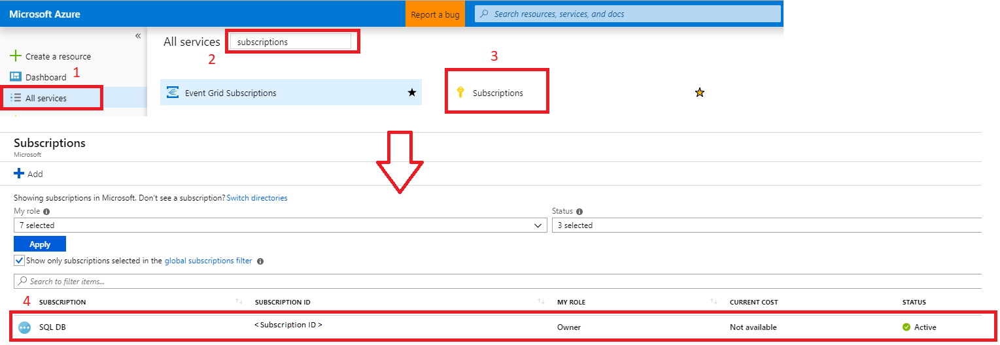

# How to change the licensing model for a SQL virtual machine in Azure
This article describes how to change the licensing model for a SQL Server virtual machine in Azure using the new SQL resource provider - **Microsoft.SqlVirtualMachine**. There are two licensing models for a virtual machine (VM) hosting SQL Server - pay-per-usage, and bring your own license (BYOL). And now, using either Powershell or Azure CLI, you can modify which licensing model your SQL VM uses. 

The **Pay-per-usage** model means that the per-second cost of running the Azure VM includes the cost of the SQL Server license.

The **Bring-your-own-license** model is also known as the [Azure Hybrid Benefit](https://azure.microsoft.com/pricing/hybrid-benefit/), and it allows you to use your own SQL Server license with a VM running SQL Server. For more information about prices, see [SQL VM pricing guide](https://docs.microsoft.com/azure/virtual-machines/windows/sql/virtual-machines-windows-sql-server-pricing-guidance).

Switching between the two license models incurs **no downtime**, does not restart the VM, adds **no additional cost** (in fact, activating AHB reduces cost) and is **effective immediately**. 


## Register legacy SQL VM with new resource provider
The ability to switch between licensing models is a feature provided by the new SQL VM resource provider (Microsoft.SqlVirtualMachine). At this time, to be able to switch your licensing model, you will first need to register the new provider to your subscription, and then register your legacy VM with the new SQL VM resource provider. 

  >[!IMPORTANT]
  > If you drop your SQL VM resource, you will go back to the hard coded license setting of the image. 

### Powershell

The following code first registers the new SQL resource provider with your subscription and then registers your legacy SQL VM with the new resource provider. 

```powershell
# connect to Azure
Connect-AzureRmAccount
Account: <account_name>

# Verify your subscription ID
Get-AzureRmContext

# Set the correct Azure Subscription ID
Set-AzureRmContext -SubscriptionId <Subscription_ID>

# Register the new SQL resource provider with your subscription
Register-AzureRmResourceProvider -ProviderNamespace Microsoft.SqlVirtualMachine

# Register your legacy SQL VM with the new resource provider
# example: $vm=Get-AzureRmVm -ResourceGroupName AHBTest -Name AHBTest​
$vm=Get-AzureRmVm -ResourceGroupName <ResourceGroupName> -Name <VMName>​
New-AzureRmResource -ResourceName $vm.Name ResourceGroupName $vm.ResourceGroupName -Location $vm.Location -ResourceType Microsoft.SqlVirtualMachine/sqlVirtualMachines -Properties @{virtualMachineResourceId=$vm.Id}
```

### Portal
You can also register the new SQL VM resource provider using the portal. To do so follow these steps:
1. Open the Azure portal and navigate to **All Services**. 
1. Navigate to **Subscriptions** and select the subscription of interest.  

  

1. In the **Subscriptions** blade, navigate to **Resource Provider**. 
1. Type `sql` in the filter to bring up the SQL-related resource providers. 
1. Select either *Register*, *Re-register*, or *Unregister* for the  **Microsoft.SqlVirtualMachine** provider depending on your desired action. 

  


## Use Powershell 
You can use Powershell to change your licensing model.  Be sure that your SQL VM has already been registered with the new SQL resource provider before switching the licensing model. 

This code snippet switches your pay-per-usage license model to BYOL (or using Azure Hybrid Benefit): 
```powershell
#example: $SqlVm = Get-AzureRmResource -ResourceType Microsoft.SqlVirtualMachine/SqlVirtualMachines -ResourceGroupName AHBTest -ResourceName AHBTest
$SqlVm = Get-AzureRmResource -ResourceType Microsoft.SqlVirtualMachine/SqlVirtualMachines -ResourceGroupName <resource_group_name> -ResourceName <VM_name>
$SqlVm.Properties.sqlServerLicenseType="AHUB"
$SqlVm | Set-AzureRmResource -Force 
``` 

This code snippet switches your BYOL model to pay-per-usage:
```powershell
#example: $SqlVm = Get-AzureRmResource -ResourceType Microsoft.SqlVirtualMachine/SqlVirtualMachines -ResourceGroupName AHBTest -ResourceName AHBTest
$SqlVm = Get-AzureRmResource -ResourceType Microsoft.SqlVirtualMachine/SqlVirtualMachines -ResourceGroupName <resource_group_name> -ResourceName <VM_name>
$SqlVm.Properties.sqlServerLicenseType="PAYG"
$SqlVm | Set-AzureRmResource -Force 
```

  >[!NOTE]
  > To switch between licenses, you must be using the new SQL VM resource provider. If you try to run these commands before registering your SQL VM with the new provider, you may encounter this error: `Get-AzureRmResource : The Resource 'Microsoft.SqlVirtualMachine/SqlVirtualMachines/AHBTest' under resource group 'AHBTest' was not found. The property 'sqlServerLicenseType' cannot be found on this object. Verify that the property exists and can be set. ` If you see this error, please [register your SQL VM with the new resource provider](#register-legacy-SQL-vm-with-new-resource-provider). 
 

## Use Azure CLI
You can use Azure CLI to change your licensing model.  Be sure that your SQL VM has already been registered with the new SQL resource provider before switching the licensing model. 

This code snippet switches your pay-per-usage license model to BYOL (or using Azure Hybrid Benefit):
```azurecli
az resource update -g <resource_group_name> -n <sql_virtual_machine_name> --resource-type "Microsoft.SqlVirtualMachine/SqlVirtualMachines" --set properties.sqlServerLicenseType=AHUB
# example: az resource update -g AHBTest -n AHBTest --resource-type "Microsoft.SqlVirtualMachine/SqlVirtualMachines" --set properties.sqlServerLicenseType=AHUB
```

This code snippet switches your BYOL model to pay-per-usage: 
```azurecli
az resource update -g <resource_group_name> -n <sql_virtual_machine_name> --resource-type "Microsoft.SqlVirtualMachine/SqlVirtualMachines" --set properties.sqlServerLicenseType=PAYG
# example: az resource update -g AHBTest -n AHBTest --resource-type "Microsoft.SqlVirtualMachine/SqlVirtualMachines" --set properties.sqlServerLicenseType=PAYG
```

  >[!NOTE]
  >To switch between licenses, you must be using the new SQL VM resource provider. If you try to run these commands before registering your SQL VM with the new provider, you may encounter this error: `The Resource 'Microsoft.SqlVirtualMachine/SqlVirtualMachines/AHBTest' under resource group 'AHBTest' was not found. ` If you see this error, please [register your SQL VM with the new resource provider](#register-legacy-SQL-vm-with-new-resource-provider). 

## View current licensing 

The following code snippet allows you to view your current licensing model for your SQL VM. 

```powershell
# View current licensing model for your SQL VM
#example: $SqlVm = Get-AzureRmResource -ResourceType Microsoft.SqlVirtualMachine/SqlVirtualMachines -ResourceGroupName <resource_group_name> -ResourceName <VM_name>
$SqlVm = Get-AzureRmResource -ResourceType Microsoft.SqlVirtualMachine/SqlVirtualMachines -ResourceGroupName <resource_group_name> -ResourceName <VM_name>
$SqlVm.Properties.sqlServerLicenseType
```

## Next steps

For more information, see the following articles: 

* [Overview of SQL Server on a Windows VM](virtual-machines-windows-sql-server-iaas-overview.md).
* [SQL Server on a Windows VM FAQ](virtual-machines-windows-sql-server-iaas-faq.md)
* [SQL Server on a windows VM pricing guidance](virtual-machines-windows-sql-server-pricing-guidance.md)
* [SQL Server on a Windows VM release notes](virtual-machines-windows-sql-server-iaas-release-notes.md)


