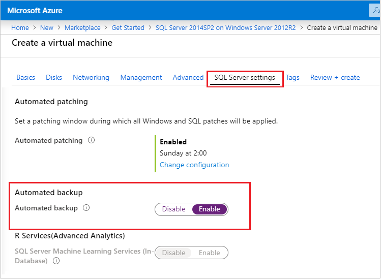
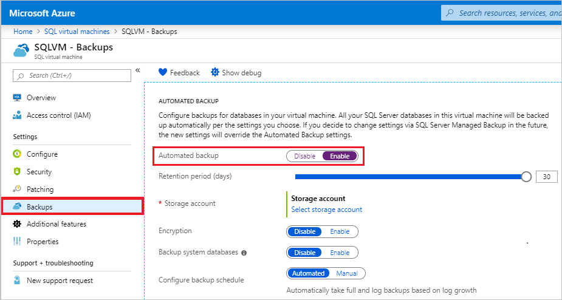

---
title: Automated Backup for SQL Server 2014 Azure Virtual Machines | Microsoft Docs
description: Explains the Automated Backup feature for SQL Server 2014 VMs running in Azure. This article is specific to VMs using the Resource Manager.
services: virtual-machines-windows
documentationcenter: na
author: rothja
manager: jhubbard
editor: ''
tags: azure-resource-manager

ms.assetid: bdc63fd1-db49-4e76-87d5-b5c6a890e53c
ms.service: virtual-machines-sql
ms.devlang: na
ms.topic: article
ms.tgt_pltfrm: vm-windows-sql-server
ms.workload: iaas-sql-server
ms.date: 07/05/2017
ms.author: jroth
---

# Automated Backup for SQL Server 2014 Virtual Machines (Resource Manager)

> [!div class="op_single_selector"]
> * [SQL Server 2014](virtual-machines-windows-sql-automated-backup.md)
> * [SQL Server 2016](virtual-machines-windows-sql-automated-backup-v2.md)

Automated Backup automatically configures [Managed Backup to Microsoft Azure](https://msdn.microsoft.com/library/dn449496.aspx) for all existing and new databases on an Azure VM running SQL Server 2014 Standard or Enterprise. This enables you to configure regular database backups that utilize durable Azure blob storage. Automated Backup depends on the [SQL Server IaaS Agent Extension](virtual-machines-windows-sql-server-agent-extension.md).

[!INCLUDE [learn-about-deployment-models](../../../../includes/learn-about-deployment-models-rm-include.md)]

## Prerequisites
To use Automated Backup, consider the following prerequisites:

**Operating System**:

- Windows Server 2012
- Windows Server 2012 R2
- Windows Server 2016

**SQL Server version/edition**:

- SQL Server 2014 Standard
- SQL Server 2014 Enterprise

> [!IMPORTANT]
> Automated Backup works with SQL Server 2014. If you are using SQL Server 2016, you can use Automated Backup v2 to back up your databases. For more information, see [Automated Backup v2 for SQL Server 2016 Azure Virtual Machines](virtual-machines-windows-sql-automated-backup-v2.md).

**Database configuration**:

- Target databases must use the full recovery model. For more information about the impact of the full recovery model on backups, see [Backup Under the Full Recovery Model](https://technet.microsoft.com/library/ms190217.aspx).
- Target databases must be on the default SQL Server instance. The SQL Server IaaS Extension does not support named instances.

**Azure deployment model**:

- Resource Manager

**Azure PowerShell**:

- [Install the latest Azure PowerShell commands](/powershell/azure/overview) if you plan to configure Automated Backup with PowerShell.

> [!NOTE]
> Automated Backup relies on the SQL Server IaaS Agent Extension. Current SQL virtual machine gallery images add this extension by default. For more information, see [SQL Server IaaS Agent Extension](virtual-machines-windows-sql-server-agent-extension.md).

## Settings

The following table describes the options that can be configured for Automated Backup. The actual configuration steps vary depending on whether you use the Azure portal or Azure Windows PowerShell commands.

| Setting | Range (Default) | Description |
| --- | --- | --- |
| **Automated Backup** | Enable/Disable (Disabled) | Enables or disables Automated Backup for an Azure VM running SQL Server 2014 Standard or Enterprise. |
| **Retention Period** | 1-30 days (30 days) | The number of days to retain a backup. |
| **Storage Account** | Azure storage account | An Azure storage account to use for storing Automated Backup files in blob storage. A container is created at this location to store all backup files. The backup file naming convention includes the date, time, and machine name. |
| **Encryption** | Enable/Disable (Disabled) | Enables or disables encryption. When encryption is enabled, the certificates used to restore the backup are located in the specified storage account in the same `automaticbackup` container using the same naming convention. If the password changes, a new certificate is generated with that password, but the old certificate remains to restore prior backups. |
| **Password** | Password text | A password for encryption keys. This is only required if encryption is enabled. In order to restore an encrypted backup, you must have the correct password and related certificate that was used at the time the backup was taken. |

## Configuration in the Portal

You can use the Azure portal to configure Automated Backup during provisioning or for existing SQL Server 2014 VMs.

### New VMs

Use the Azure portal to configure Automated Backup when you create a new SQL Server 2014 Virtual Machine in the Resource Manager deployment model.

In the **SQL Server settings** blade, select **Automated backup**. The following Azure portal screenshot shows the **SQL Automated Backup** blade.



For context, see the complete topic on [provisioning a SQL Server virtual machine in Azure](virtual-machines-windows-portal-sql-server-provision.md).

### Existing VMs

For existing SQL Server virtual machines, select your SQL Server virtual machine. Then select the **SQL Server configuration** section of the **Settings** blade.



In the **SQL Server configuration** blade, click the **Edit** button in the Automated backup section.


When finished, click the **OK** button on the bottom of the **SQL Server configuration** blade to save your changes.

If you are enabling Automated Backup for the first time, Azure configures the SQL Server IaaS Agent in the background. During this time, the Azure portal might not show that Automated Backup is configured. Wait several minutes for the agent to be installed, configured. After that the Azure portal will reflect the new settings.

> [!NOTE]
> You can also configure Automated Backup using a template. For more information, see [Azure quickstart template for Automated Backup](https://github.com/Azure/azure-quickstart-templates/tree/master/101-vm-sql-existing-autobackup-update).

## Configuration with PowerShell

You can use PowerShell to configure Automated Backup. Before you begin, you must:

- [Download and install the latest Azure PowerShell](http://aka.ms/webpi-azps).
- Open Windows PowerShell and associate it with your account. You can do this by following the steps in the [Configure your subscription](https://docs.microsoft.com/azure/virtual-machines/windows/sql/virtual-machines-windows-ps-sql-create#configure-your-subscription) section of the provisioning topic.

### Install the SQL IaaS Extension
If you provisioned a SQL Server virtual machine from the Azure portal, the SQL Server IaaS Extension should already be installed. You can determine if it is installed for your VM by calling **Get-AzureRmVM** command and examining the **Extensions** property.

```powershell
$vmname = "vmname"
$resourcegroupname = "resourcegroupname"

(Get-AzureRmVM -Name $vmname -ResourceGroupName $resourcegroupname).Extensions
```

If the SQL Server IaaS Agent extension is installed, you should see it listed as “SqlIaaSAgent” or “SQLIaaSExtension”. **ProvisioningState** for the extension should also show “Succeeded”.

If it is not installed or failed to be provisioned, you can install it with the following command. In addition to the VM name and resource group, you must also specify the region (**$region**) that your VM is located in.

```powershell
$region = “EASTUS2”
Set-AzureRmVMSqlServerExtension -VMName $vmname `
    -ResourceGroupName $resourcegroupname -Name "SQLIaasExtension" `
    -Version "1.2" -Location $region
```

### <a id="verifysettings"></a> Verify current settings

If you enabled automated backup during provisioning, you can use PowerShell to check your current configuration. Run the **Get-AzureRmVMSqlServerExtension** command and examine the **AutoBackupSettings** property:

```powershell
(Get-AzureRmVMSqlServerExtension -VMName $vmname -ResourceGroupName $resourcegroupname).AutoBackupSettings
```

You should get output similar to the following:

```
Enable                      : False
EnableEncryption            : False
RetentionPeriod             : -1
StorageUrl                  : NOTSET
StorageAccessKey            : 
Password                    : 
BackupSystemDbs             : False
BackupScheduleType          : 
FullBackupFrequency         : 
FullBackupStartTime         : 
FullBackupWindowHours       : 
LogBackupFrequency          : 
```

If your output shows that **Enable** is set to **False**, then you have to enable automated backup. The good news is that you enable and configure Automated Backup in the same way. See the next section for this information.

> [!NOTE] 
> If you check the settings immediately after making a change, it is possible that you will get back the old configuration values. Wait a few minutes and check the settings again to make sure that your changes were applied.

### Configure Automated Backup
You can use PowerShell to enable Automated Backup as well as to modify its configuration and behavior at any time.

First, select or create a storage account for the backup files. The following script selects a storage account or creates it if it does not exist.

```powershell
$storage_accountname = “yourstorageaccount”
$storage_resourcegroupname = $resourcegroupname

$storage = Get-AzureRmStorageAccount -ResourceGroupName $resourcegroupname `
    -Name $storage_accountname -ErrorAction SilentlyContinue
If (-Not $storage)
    { $storage = New-AzureRmStorageAccount -ResourceGroupName $storage_resourcegroupname `
    -Name $storage_accountname -SkuName Standard_GRS -Location $region }
```

> [!NOTE]
> Automated Backup does not support storing backups in premium storage, but it can take backups from VM disks which use Premium Storage.

Then use the **New-AzureRmVMSqlServerAutoBackupConfig** command to enable and configure the Automated Backup settings to store backups in the Azure storage account. In this example, the backups are set to be retained for 10 days. The second command, **Set-AzureRmVMSqlServerExtension**, updates the specified Azure VM with these settings.

```powershell
$autobackupconfig = New-AzureRmVMSqlServerAutoBackupConfig -Enable `
    -RetentionPeriodInDays 10 -StorageContext $storage.Context `
    -ResourceGroupName $storage_resourcegroupname

Set-AzureRmVMSqlServerExtension -AutoBackupSettings $autobackupconfig `
    -VMName $vmname -ResourceGroupName $resourcegroupname
```

It could take several minutes to install and configure the SQL Server IaaS Agent.

> [!NOTE]
> There are other settings for **New-AzureRmVMSqlServerAutoBackupConfig** that apply only to SQL Server 2016 and Automated Backup v2. SQL Server 2014 does not support the following settings: **BackupSystemDbs**, **BackupScheduleType**, **FullBackupFrequency**, **FullBackupStartHour**, **FullBackupWindowInHours**, and **LogBackupFrequencyInMinutes**. If you attempt to configure these settings on a SQL Server 2014 virtual machine, there is no error, but the settings do not get applied. If you want to use these settings on a SQL Server 2016 virtual machine, see [Automated Backup v2 for SQL Server 2016 Azure Virtual Machines](virtual-machines-windows-sql-automated-backup-v2.md).

To enable encryption, modify the previous script to pass the **EnableEncryption** parameter along with a password (secure string) for the **CertificatePassword** parameter. The following script enables the Automated Backup settings in the previous example and adds encryption.

```powershell
$password = "P@ssw0rd"
$encryptionpassword = $password | ConvertTo-SecureString -AsPlainText -Force

$autobackupconfig = New-AzureRmVMSqlServerAutoBackupConfig -Enable `
    -EnableEncryption -CertificatePassword $encryptionpassword `
    -RetentionPeriodInDays 10 -StorageContext $storage.Context `
    -ResourceGroupName $storage_resourcegroupname

Set-AzureRmVMSqlServerExtension -AutoBackupSettings $autobackupconfig `
    -VMName $vmname -ResourceGroupName $resourcegroupname
```

To confirm your settings are applied, [verify the Automated Backup configuration](#verifysettings).

### Disable Automated Backup

To disable Automated Backup, run the same script without the **-Enable** parameter to the **New-AzureRmVMSqlServerAutoBackupConfig** command. The absence of the **-Enable** parameter signals the command to disable the feature. As with installation, it can take several minutes to disable Automated Backup.

```powershell
$autobackupconfig = New-AzureRmVMSqlServerAutoBackupConfig -ResourceGroupName $storage_resourcegroupname

Set-AzureRmVMSqlServerExtension -AutoBackupSettings $autobackupconfig `
    -VMName $vmname -ResourceGroupName $resourcegroupname
```

### Example script

The following script provides a set of variables that you can customize to enable and configure Automated Backup for your VM. In your case, you might need to customize the script based on your requirements. For example, you would have to make changes if you wanted to disable the backup of system databases or enable encryption.

```powershell
$vmname = "yourvmname"
$resourcegroupname = "vmresourcegroupname"
$region = “Azure region name such as EASTUS2”
$storage_accountname = “storageaccountname”
$storage_resourcegroupname = $resourcegroupname
$retentionperiod = 10

# ResourceGroupName is the resource group which is hosting the VM where you are deploying the SQL IaaS Extension

Set-AzureRmVMSqlServerExtension -VMName $vmname `
    -ResourceGroupName $resourcegroupname -Name "SQLIaasExtension" `
    -Version "1.2" -Location $region

# Creates/use a storage account to store the backups

$storage = Get-AzureRmStorageAccount -ResourceGroupName $resourcegroupname `
    -Name $storage_accountname -ErrorAction SilentlyContinue
If (-Not $storage)
    { $storage = New-AzureRmStorageAccount -ResourceGroupName $storage_resourcegroupname `
    -Name $storage_accountname -SkuName Standard_GRS -Location $region }

# Configure Automated Backup settings

$autobackupconfig = New-AzureRmVMSqlServerAutoBackupConfig -Enable `
    -RetentionPeriodInDays $retentionperiod -StorageContext $storage.Context `
    -ResourceGroupName $storage_resourcegroupname

# Apply the Automated Backup settings to the VM

Set-AzureRmVMSqlServerExtension -AutoBackupSettings $autobackupconfig `
    -VMName $vmname -ResourceGroupName $resourcegroupname
```

## Next steps

Automated Backup configures Managed Backup on Azure VMs. So it is important to [review the documentation for Managed Backup](https://msdn.microsoft.com/library/dn449496.aspx) to understand the behavior and implications.

You can find additional backup and restore guidance for SQL Server on Azure VMs in the following topic: [Backup and Restore for SQL Server in Azure Virtual Machines](virtual-machines-windows-sql-backup-recovery.md).

For information about other available automation tasks, see [SQL Server IaaS Agent Extension](virtual-machines-windows-sql-server-agent-extension.md).

For more information about running SQL Server on Azure VMs, see [SQL Server on Azure Virtual Machines overview](virtual-machines-windows-sql-server-iaas-overview.md).

