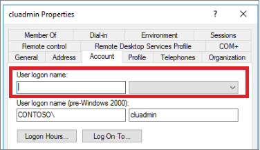

# Use Azure Quickstart Templates to configure Always On availability group for SQL Server on an Azure VM
This article describes how to use the Azure Quickstart Templates to partially automate the deployment of an Always On availability group configuration for SQL Server Virtual Machines in Azure. There are two Azure Quickstart Templates that are used in this process. 

   | Template | Description |
   | --- | --- |
   | [101-sql-vm-ag-setup](https://github.com/Azure/azure-quickstart-templates/tree/master/101-sql-vm-ag-setup) | Creates the Windows Failover Cluster and joins the SQL Server VMs to it. |
   | [101-sql-vm-aglistener-setup](https://github.com/Azure/azure-quickstart-templates/tree/master/101-sql-vm-aglistener-setup) | Creates the availability group listener and configures the Internal Load Balancer. This template can only be used if the Windows Failover Cluster was created with the **101-sql-vm-ag-setup** template. |
   | &nbsp; | &nbsp; |

Other parts of the availability group configuration must be done manually, such as creating the availability group, and creating the Internal Load Balancer. This article provides the sequence of automated and manual steps.
 

## Prerequisites 
To automate the setup of an Always On availability group using quickstart templates, you must already have the following prerequisites: 
- An [Azure Subscription](https://azure.microsoft.com/free/).
- A resource group with a domain controller. 
- One or more domain-joined [VMs in Azure running SQL Server 2016 (or greater) Enterprise edition](https://docs.microsoft.com/azure/virtual-machines/windows/sql/virtual-machines-windows-portal-sql-server-provision) in the same availability set or availability zone that have been [registered with the SQL VM resource provider](virtual-machines-windows-sql-register-with-resource-provider.md).  
- Two available (not used by any entity) IP addresses, one for the Internal Load Balancer, and one for the availability group listener within the same subnet as the availability group. If an existing load balancer is being used, then only one available IP address is needed.  

## Permissions
The following permissions are necessary to configure the Always On availability group using Azure Quickstart Templates: 

- An existing domain user account that has permission to 'Create Computer Object' in the domain.  For example, a domain admin account typically has sufficient permission (ex: account@domain.com). _This account should also be part of the local administrator group on each VM to create the cluster._
- The domain user account that controls the SQL Server service. 


## Step 1 - Create the WSFC and join SQL Server VMs to the cluster using quickstart template 
Once your SQL Server VMs have been registered with the SQL VM new resource provider, you can join your SQL Server VMs into *SqlVirtualMachineGroups*. This resource defines the metadata of the Windows Failover Cluster, including the version, edition, Fully Qualified Domain Name, AD accounts to manage both the cluster and SQL Service, and the Storage Account as the Cloud Witness. Adding SQL Server VMs to the *SqlVirtualMachineGroups* resource group bootstraps the Windows Failover Cluster Service to create the cluster and then joins those SQL Server VMs to that cluster. This step is automated with the **101-sql-vm-ag-setup** quickstart template and can be implemented with the following steps:

1. Navigate to the [**101-sql-vm-ag-setup**](https://github.com/Azure/azure-quickstart-templates/tree/master/101-sql-vm-ag-setup) quickstart template and select **Deploy to Azure** to launch the quickstart template within the Azure portal.
1. Fill out the required fields to configure the Windows Failover Cluster metadata. The optional fields can be left blank.

    The following table shows the values necessary for the template: 

   | **Field** | Value |
   | --- | --- |
   | **Subscription** |  The subscription where your SQL Server VMs exist. |
   |**Resource group** | The resource group where your SQL Server VMs reside. | 
   |**Failover Cluster Name** | The desired name for your new Windows Failover Cluster. |
   | **Existing Vm List** | The SQL Server VMs you want to participate in the availability group, and as such, be part of this new cluster. Separate these values with a comma and a space (ex: SQLVM1, SQLVM2). |
   | **SQL Server Version** | Select the SQL Server version of your SQL Server VMs from the drop-down. Currently only SQL 2016 and SQL 2017 images are supported. |
   | **Existing Fully Qualified Domain Name** | The existing FQDN for the domain in which your SQL Server VMs reside. |
   | **Existing Domain Account** | An existing domain user account that has permission to 'Create Computer Object' in the domain as the [CNO](/windows-server/failover-clustering/prestage-cluster-adds) is created during template deployment. For example, a domain admin account typically has sufficient permission (ex: account@domain.com). *This account should also be part of the local administrator group on each VM to create the cluster.*| 
   | **Domain Account Password** | The password for the previously mentioned domain user account. | 
   | **Existing Sql Service Account** | The domain user account that controls the [SQL Server service](/sql/database-engine/configure-windows/configure-windows-service-accounts-and-permissions) during availability group deployment (ex: account@domain.com). |
   | **Sql Service Password** | The password used by the domain user account that controls the SQL Server service. |
   | **Cloud Witness Name** | This is a new Azure storage account that will be created and used for the cloud witness. This name could  be modified. |
   | **\_artifacts Location** | This field is set by default and should not be modified. |
   | **\_artifacts Location Sas Token** | This field is left intentionally blank. |
   | &nbsp; | &nbsp; |

1. If you agree to the terms and conditions, select the checkbox next to **I Agree to the terms and conditions stated above** and select **Purchase** to finalize the Quickstart template deployment. 
1. To monitor your deployment, either select the deployment from the **Notifications** bell icon in your top navigation banner or navigate to your **Resource Group** in the Azure portal, select **Deployments** in the **Settings** field, and choose the 'Microsoft.Template' deployment. 

   >[!NOTE]
   > Credentials provided during template deployment are only stored for the length of the deployment. After deployment completes, those passwords are removed, and you will be asked to provide them again should you add further SQL Server VMs to the cluster. 


## Step 2 - Manually create the availability group 
Manually create the availability group as you normally would, using either [SQL Server Management Studio](/sql/database-engine/availability-groups/windows/use-the-availability-group-wizard-sql-server-management-studio), [PowerShell](/sql/database-engine/availability-groups/windows/create-an-availability-group-sql-server-powershell), or [Transact-SQL](/sql/database-engine/availability-groups/windows/create-an-availability-group-transact-sql). 

  >[!IMPORTANT]
  > Do **not** create a listener at this time because this is automated by the **101-sql-vm-aglistener-setup**  quickstart template in Step 4. 

## Step 3 - Manually create the Internal Load Balancer (ILB)
The Always On availability group (AG) listener requires an Internal Azure Load Balancer (ILB). The ILB provides a “floating” IP address for the AG listener that allows for faster failover and reconnection. If the SQL Server VMs in an availability group are part of the same availability set, then you can use a Basic Load Balancer; otherwise, you need to use a Standard Load Balancer.  **The ILB should be in the same vNet as the SQL Server VM instances.** The ILB only needs to be created, the rest of the configuration (such as the backend pool, health probe, and load-balancing rules) is handled by the **101-sql-vm-aglistener-setup** quickstart template in Step 4. 

1. In the Azure portal, open the resource group that contains the SQL Server virtual machines. 
2. In the resource group, click **Add**.
3. Search for **load balancer** and then, in the search results, select **Load Balancer**, which is published by **Microsoft**.
4. On the **Load Balancer** blade, click **Create**.
5. In the **Create load balancer** dialog box, configure the load balancer as follows:

   | Setting | Value |
   | --- | --- |
   | **Name** |A text name representing the load balancer. For example, **sqlLB**. |
   | **Type** |**Internal**: Most implementations use an internal load balancer, which allows applications within the same virtual network to connect to the availability group.  </br> **External**: Allows applications to connect to the availability group through a public Internet connection. |
   | **Virtual network** | Select the virtual network that the SQL Server instances are in. |
   | **Subnet** | Select the subnet that the SQL Server instances are in. |
   | **IP address assignment** |**Static** |
   | **Private IP address** | Specify an available IP address from the subnet. |
   | **Subscription** |If you have multiple subscriptions, this field might appear. Select the subscription that you want to associate with this resource. It is normally the same subscription as all the resources for the availability group. |
   | **Resource group** |Select the resource group that the SQL Server instances are in. |
   | **Location** |Select the Azure location that the SQL Server instances are in. |
   | &nbsp; | &nbsp; |

6. Select **Create**. 


  >[!IMPORTANT]
  > The public IP resource for each SQL Server VM should have a standard SKU to be compatible with the Standard Load Balancer. To determine the SKU of your VM's public IP resource, navigate to your **Resource Group**, select your **Public IP Address** resource for the desired SQL Server VM, and locate the value under **SKU** of the **Overview** pane. 

## Step 4 - Create the AG listener and configure the ILB with the quickstart template

Create the availability group listener and configure the Internal Load Balancer (ILB) automatically with the **101-sql-vm-aglistener-setup**  quickstart template as it provisions the Microsoft.SqlVirtualMachine/SqlVirtualMachineGroups/AvailabilityGroupListener resource. The  **101-sql-vm-aglistener-setup** quickstart template, via the SQL VM resource provider, does the following actions:

 - Creates a new frontend IP resource (based on the IP address value provided during deployment) for the listener. 
 - Configures the network settings for the cluster and ILB. 
 - Configures the ILB backend pool, health probe, and load-balancing rules.
 - Creates the AG listener with the given IP address and name.
 
   >[!NOTE]
   > The **101-sql-vm-aglistener-setup** can only be used if the Windows Failover Cluster was created with the **101-sql-vm-ag-setup** template.
   
   
To configure the ILB and create the AG listener, do the following:
1. Navigate to the [**101-sql-vm-aglistener-setup**](https://github.com/Azure/azure-quickstart-templates/tree/master/101-sql-vm-aglistener-setup) quickstart template and select **Deploy to Azure** to launch the quickstart template within the Azure portal.
1. Fill out the required fields to configure the ILB, and create the availability group listener. The optional fields can be left blank. 

    The following table shows the values necessary for the template: 

   | **Field** | Value |
   | --- | --- |
   |**Resource group** | The resource group where your SQL Server VMs and availability group exist. | 
   |**Existing Failover Cluster Name** | The name of the cluster that your SQL Server VMs are joined to. |
   | **Existing Sql Availability Group**| The name of the availability group that your SQL Server VMs are a part of. |
   | **Existing Vm List** | The names of the SQL Server VMs that are part of the previously mentioned availability group. The names should be separated by a comma and a space (ex: SQLVM1, SQLVM2). |
   | **Listener** | The DNS name you would like to assign to the listener. By default, this template specifies the name 'aglistener' but it can be changed. The name should not exceed 15 characters. |
   | **Listener Port** | The port you want the listener to  use. Typically, this port should be the default port of 1433, and as such, this is the port number specified by this template. However, if your default port has been changed, then the listener port should use that value instead. | 
   | **Listener IP** | The IP you want the listener to use.  This IP address will be created during template deployment, so provide an IP address that is not already in use.  |
   | **Existing Subnet** | The *name* of the internal subnet of your SQL Server VMs (ex: default). This value can be determined by navigating to your **Resource Group**, selecting your **vNet**, selecting **Subnets** under the **Settings** pane, and copying the value under **Name**. |
   | **Existing Internal Load Balancer** | The name of the ILB that you created in Step 3. |
   | **Probe Port** | The probe port that you want the ILB to use. The template uses 59999 by default but this value can be changed. |
   | &nbsp; | &nbsp; |

1. If you agree to the terms and conditions, select the checkbox next to **I Agree to the terms and conditions stated above** and select **Purchase** to finalize the quickstart template deployment. 
1. To monitor your deployment, either select the deployment from the **Notifications** bell icon in your top navigation banner or navigate to your **Resource Group** in the Azure portal, select **Deployments** in the **Settings** field, and choose the 'Microsoft.Template' deployment. 

   >[!NOTE]
   >If your deployment fails half way through, you will need to manually [remove the newly created listener](#remove-availability-group-listener) using PowerShell before redeploying the **101-sql-vm-aglistener-setup** quickstart template. 

## Remove availability group listener
If you later need to remove the availability group listener configured by the template, you must go through the SQL VM resource provider. Since the listener is registered through the SQL VM resource provider, just deleting it via SQL Server Management Studio is insufficient. It actually should be deleted through the SQL VM resource provider using PowerShell. Doing so removes the AG listener metadata from the SQL VM resource provider, and physically deletes the listener from the availability group. 

The following code snippet deletes the SQL availability group listener from both the SQL resource provider, and from your availability group: 

```powershell
# Remove the AG listener
# example: Remove-AzResource -ResourceId '/subscriptions/a1a11a11-1a1a-aa11-aa11-1aa1a11aa11a/resourceGroups/SQLAG-RG/providers/Microsoft.SqlVirtualMachine/SqlVirtualMachineGroups/Cluster/availabilitygrouplisteners/aglistener' -Force
Remove-AzResource -ResourceId '/subscriptions/<SubscriptionID>/resourceGroups/<resource-group-name>/providers/Microsoft.SqlVirtualMachine/SqlVirtualMachineGroups/<cluster-name>/availabilitygrouplisteners/<listener-name>' -Force
```
 
## Common errors
This section discusses some known issues and their possible resolution. 

### Availability group listener for availability group '\<AG-Name>' already exists
The selected availability group used in the AG listener Azure Quickstart Template already contains a listener, either physically within the availability group, or as metadata within the SQL VM resource provider.  Remove the listener using [PowerShell](#remove-availability-group-listener) before redeploying the **101-sql-vm-aglistener-setup** quickstart template. 

### Connection only works from primary replica
This behavior is likely from a failed **101-sql-vm-aglistener-setup** template deployment leaving the ILB configuration in an inconsistent state. Verify that the backend pool lists the availability set, and that rules exist for the health probe and for the load-balancing rules. If anything is missing, then the ILB configuration is an inconsistent state. 

To resolve this behavior, remove the listener using [PowerShell](#remove-availability-group-listener), delete the Internal Load Balancer via the Azure portal, and start again at Step 3. 

### BadRequest - Only SQL virtual machine list can be updated
This error may occur when deploying the **101-sql-vm-aglistener-setup** template if the listener was deleted via SQL Server Management Studio (SSMS), but was not deleted from the SQL VM resource provider. Deleting the listener via SSMS does not remove the metadata of the listener from the SQL VM resource provider; the listener must be deleted from the resource provider using [PowerShell](#remove-availability-group-listener). 

### Domain account does not exist
This error can be caused by one of two reasons. Either the domain account specified really does not exist, or it is missing the [User Principal Name (UPN)](/windows/desktop/ad/naming-properties#userprincipalname) data. The **101-sql-vm-ag-setup** template expects a domain account in the UPN form (i.e. user@domain.com), but some domain accounts may be missing it. This can typically happen when a local user has been migrated to be the first domain administrator account when the server was promoted to a domain controller, or when a user was created through PowerShell. 

 Verify that the account does exist. If it does, you may be running into the second situation. To resolve this, do the following:

1. On the domain controller, open the **Active Directory Users and Computers** window from the **Tools** option in **Server Manager**. 
2. Navigate to the account by selecting **Users** on the left pane.
3. Right-click the desired account, and select **Properties**.
4. Select the **Account** tab and verify if the **User logon name** is blank. If it is, this is the cause of your error. 

    

5. Fill in the **User logon name** to match the name of the user, and select the proper domain from the drop-down. 
6. Select **Apply** to save your changes, and close the dialog box by selecting **OK**. 

   Once these changes are made, attempt to deploy the Azure Quickstart Template once more. 


## Next steps

For more information, see the following articles: 

* [Overview of SQL Server VM](virtual-machines-windows-sql-server-iaas-overview.md)
* [SQL Server VM FAQ](virtual-machines-windows-sql-server-iaas-faq.md)
* [SQL Server VM pricing guidance](virtual-machines-windows-sql-server-pricing-guidance.md)
* [SQL Server VM release notes](virtual-machines-windows-sql-server-iaas-release-notes.md)
* [Switching licensing models for a SQL Server VM](virtual-machines-windows-sql-ahb.md)


