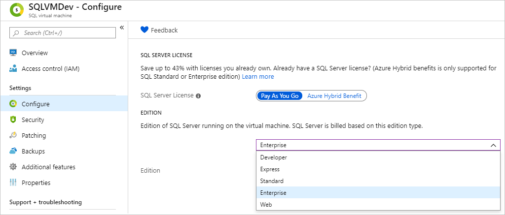

# How to perform an in-place upgrade of SQL Server edition on Azure VM

This article describes how to change the edition of SQL Server for an existing SQL Server on a Windows virtual machine in Azure. 

The edition of SQL Server is determined by the product key, and is specified with the installation process. The edition dictates what [features](/sql/sql-server/editions-and-components-of-sql-server-2017) are available within the SQL Server product. You can change the SQL Server edition with the installation media and either downgrade to reduce cost or upgrade to enable more features.

If you updated the edition of SQL Server using the installation media after registering with the SQL VM resource provider, then to update the Azure billing accordingly you should set the SQL Server Edition Property of the SQL VM resource as follows:

1. Sign into the [Azure portal](https://portal.azure.com). 
1. Navigate to your SQL Server virtual machine resource. 
1. Under **Settings**, select **Configure** and then select your desired edition of SQL Server from the drop-down under **Edition**. 

   

1. Review the warning notifying you that you must change SQL Server edition first, and that edition property must match SQL Server edition. 
1. Select **Apply** to apply your edition metadata changes. 

## Prerequisites

To do an in-place change of the edition of SQL Server, you will need the following: 

- An [Azure subscription](https://azure.microsoft.com/free/).
- A Windows [SQL Server VM](https://docs.microsoft.com/azure/virtual-machines/windows/sql/virtual-machines-windows-portal-sql-server-provision) registered with the [SQL VM resource provider](virtual-machines-windows-sql-register-with-resource-provider.md).
- Setup media with the desired edition of SQL Server. Customers who have [software assurance](https://www.microsoft.com/licensing/licensing-programs/software-assurance-default) can obtain their installation media from the [Volume Licensing Center](https://www.microsoft.com/Licensing/servicecenter/default.aspx). Customers do not have software assurance can use the setup media from a marketplace SQL Server VM image that has their desired edition.

## Upgrade edition

  > [!WARNING]
  > - **Upgrading the edition of SQL Server will restart the service for SQL Server, as well as any associated services, such as Analysis Services and R Services.** 

To upgrade the edition of SQL Server, obtain the SQL Server setup media for the desired edition of SQL Server, and then do the following:

1. Launch Setup.exe from the SQL Server installation media. 
1. Navigate to **Maintenance** and choose the **Edition Upgrade** option. 

   

1. Select **Next** until you reach the **Ready to upgrade edition** page, and then select **Upgrade**. The setup window may hang for a few minutes while the change is taking effect, and then you will see a **Complete** page confirming that your edition upgrade is complete. 

After SQL Server edition is upgraded, you should modify the "Edition" property of the Sql Virtual Machine on Azure portal as shown above; this will update the metadata and billing associated with this VM.

## Downgrade edition

  > [!WARNING]
  > - **Downgrading the edition of SQL Server requires completely uninstalling SQL Server, which may incur additional downtime**. 

To downgrade the edition of SQL Server, you will need to completely uninstall SQL Server, and reinstall it again with the desired edition setup media. 

You can downgrade the edition of SQL Server by following these steps:

1. Back up all databases, including the system databases. 
1. Move system databases (master, model, and msdb) to a new location. 
1. Completely uninstall SQL Server and all associated services. 
1. Restart the virtual machine. 
1. Install SQL Server using the media with the desired edition of SQL Server.
1. Install the latest service packs and cumulative updates.  
1. Replace the new system databases that were created during installation with the system databases you previously moved to a different location. 

Once the SQL Server edition is downgraded, you should modify the 'Edition' property of the SQL virtual machine within the Azure portal as shown above; this will update the metadata and billing associated with this VM.

## Remarks

 - The edition property for the SQL Server VM must match the edition of the SQL Server installed to the virtual machine for all SQL Virtual Machines including both PAYG and BYOL license types.
 - If you drop your SQL Server VM resource, you will go back to the hard-coded edition setting of the image.
  - The ability to change the edition is a feature of the SQL VM resource provider. Deploying a marketplace image through the Azure portal automatically registers a SQL Server VM with the resource provider. However, customers who are self-installing SQL Server will need to manually [register their SQL Server VM](virtual-machines-windows-sql-register-with-resource-provider.md).
- Adding a SQL Server VM to an availability set requires recreating the VM. As such, any VMs added to an availability set will go back to the default edition and the edition will need to be modified again.

## Next steps

For more information, see the following articles: 

* [Overview of SQL Server on a Windows VM](virtual-machines-windows-sql-server-iaas-overview.md)
* [SQL Server on a Windows VM FAQ](virtual-machines-windows-sql-server-iaas-faq.md)
* [SQL Server on a Windows VM pricing guidance](virtual-machines-windows-sql-server-pricing-guidance.md)
* [SQL Server on a Windows VM release notes](virtual-machines-windows-sql-server-iaas-release-notes.md)

