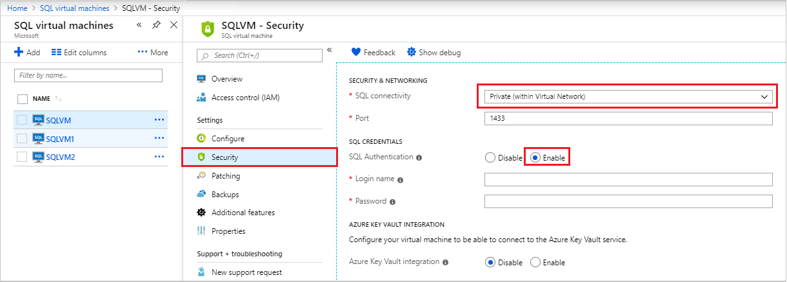

# Connect to a SQL Server Virtual Machine on Azure

## Overview

This topic describes how to connect to your SQL Server instance running on an Azure virtual machine. It covers some [general connectivity scenarios](#connection-scenarios) and then provides [steps in the portal for changing connectivity settings](#change). If you need to troubleshoot or configure connectivity outside of the portal, see the [manual configuration](#manual) at the end of this topic. 

If you would rather have a full walk-through of both provisioning and connectivity, see [Provisioning a SQL Server Virtual Machine on Azure](virtual-machines-windows-portal-sql-server-provision.md).

## Connection scenarios

The way a client connects to SQL Server running on a Virtual Machine differs depending on the location of the client and the networking configuration.

If you provision a SQL Server VM in the Azure portal, you have the option of specifying the type of **SQL connectivity**.


Your options for connectivity include:

| Option | Description |
|---|---|
| **Public** | Connect to SQL Server over the internet |
| **Private** | Connect to SQL Server in the same virtual network |
| **Local** | Connect to SQL Server locally on the same virtual machine | 

The following sections explain the **Public** and **Private** options in more detail.

## Connect to SQL Server over the Internet

If you want to connect to your SQL Server database engine from the Internet, select **Public** for the **SQL connectivity** type in the portal during provisioning. The portal automatically does the following steps:

* Enables the TCP/IP protocol for SQL Server.
* Configures a firewall rule to open the SQL Server TCP port (default 1433).
* Enables SQL Server Authentication, required for public access.
* Configures the network security group on the VM to all TCP traffic on the SQL Server port.

> [!IMPORTANT]
> The virtual machine images for the SQL Server Developer and Express editions do not automatically enable the TCP/IP protocol. For Developer and Express editions, you must use SQL Server Configuration Manager to [manually enable the TCP/IP protocol](#manualtcp) after creating the VM.

Any client with internet access can connect to the SQL Server instance by specifying either the public IP address of the virtual machine or any DNS label assigned to that IP address. If the SQL Server port is 1433, you do not need to specify it in the connection string. The following connection string connects to a SQL VM with a DNS label of `sqlvmlabel.eastus.cloudapp.azure.com` using SQL Authentication (you could also use the public IP address).

```
Server=sqlvmlabel.eastus.cloudapp.azure.com;Integrated Security=false;User ID=<login_name>;Password=<your_password>
```

Although this enables connectivity for clients over the internet, this does not imply that anyone can connect to your SQL Server. Outside clients have to the correct username and password. However, for additional security, you can avoid the well-known port 1433. For example, if you configured SQL Server to listen on port 1500 and established proper firewall and network security group rules, you could connect by appending the port number to the Server name. The following example alters the previous one by adding a custom port number, **1500**, to the server name:

```
Server=sqlvmlabel.eastus.cloudapp.azure.com,1500;Integrated Security=false;User ID=<login_name>;Password=<your_password>"
```

> [!NOTE]
> When you query SQL Server in a VM over the internet, all outgoing data from the Azure datacenter is subject to normal [pricing on outbound data transfers](https://azure.microsoft.com/pricing/details/data-transfers/).

## Connect to SQL Server within a virtual network

When you choose **Private** for the **SQL connectivity** type in the portal, Azure configures most of the settings identical to **Public**. The one difference is that there is no network security group rule to allow outside traffic on the SQL Server port (default 1433).

> [!IMPORTANT]
> The virtual machine images for the SQL Server Developer and Express editions do not automatically enable the TCP/IP protocol. For Developer and Express editions, you must use SQL Server Configuration Manager to [manually enable the TCP/IP protocol](#manualtcp) after creating the VM.

Private connectivity is often used in conjunction with [Virtual Network](../../../virtual-network/virtual-networks-overview.md), which enables several scenarios. You can connect VMs in the same virtual network, even if those VMs exist in different resource groups. And with a [site-to-site VPN](../../../vpn-gateway/vpn-gateway-howto-site-to-site-resource-manager-portal.md), you can create a hybrid architecture that connects VMs with on-premises networks and machines.

Virtual networks also enable you to join your Azure VMs to a domain. This is the only way to use Windows Authentication to SQL Server. The other connection scenarios require SQL Authentication with user names and passwords.

Assuming that you have configured DNS in your virtual network, you can connect to your SQL Server instance by specifying the SQL Server VM computer name in the connection string. The following example also assumes that Windows Authentication has also been configured and that the user has been granted access to the SQL Server instance.

```
Server=mysqlvm;Integrated Security=true
```

## <a id="change"></a> Change SQL connectivity settings

[!INCLUDE [windows-virtual-machines-sql-use-new-management-blade](../../../../includes/windows-virtual-machines-sql-new-resource.md)]

You can change the connectivity settings for your SQL Server virtual machine in the Azure portal.

1. In the Azure portal, select **SQL virtual machines**.

2. Select your SQL Server VM.

3. Under **Settings**, select **Security**.

4. Change the **SQL connectivity level** to your required setting. You can optionally use this area to change the SQL Server port or the SQL Authentication settings.

   

5. Wait several minutes for the update to complete.

   

## <a id="manualtcp"></a> Enable TCP/IP for Developer and Express editions

When changing SQL Server connectivity settings, Azure does not automatically enable the TCP/IP protocol for SQL Server Developer and Express editions. The steps below explain how to manually enable TCP/IP so that you can connect remotely by IP address.

First, connect to the SQL Server machine with remote desktop.

[!INCLUDE [Connect to SQL Server VM with remote desktop](../../../../includes/virtual-machines-sql-server-remote-desktop-connect.md)]

Next, enable the TCP/IP protocol with **SQL Server Configuration Manager**.

[!INCLUDE [Connect to SQL Server VM with remote desktop](../../../../includes/virtual-machines-sql-server-connection-tcp-protocol.md)]

## Connect with SSMS

The following steps show how to create an optional DNS Label for your Azure VM and then connect with SQL Server Management Studio (SSMS).

[!INCLUDE [Connect to SQL Server in a VM Resource Manager](../../../../includes/virtual-machines-sql-server-connection-steps-resource-manager.md)]

## <a id="manual"></a> Manual configuration and troubleshooting

Although the portal provides options to automatically configure connectivity, it is useful to know how to manually configure connectivity. Understanding the requirements can also aid troubleshooting.

The following table lists the requirements to connect to SQL Server running in an Azure VM.

| Requirement | Description |
|---|---|
| [Enable SQL Server Authentication mode](https://docs.microsoft.com/sql/database-engine/configure-windows/change-server-authentication-mode#SSMSProcedure) | SQL Server Authentication is needed to connect to the VM remotely unless you have configured Active Directory on a Virtual Network. |
| [Create a SQL login](https://docs.microsoft.com/sql/relational-databases/security/authentication-access/create-a-login) | If you are using SQL Authentication, you need a SQL Login with a user name and password that also has permissions to your target database. |
| [Enable TCP/IP protocol](#manualtcp) | SQL Server must allow connections over TCP. |
| [Enable firewall rule for the SQL Server port](https://docs.microsoft.com/sql/database-engine/configure-windows/configure-a-windows-firewall-for-database-engine-access) | The firewall on the VM must allow inbound traffic on the SQL Server port (default 1433). |
| [Create a network security group rule for TCP 1433](../../../virtual-network/manage-network-security-group.md#create-a-security-rule) | You must allow the VM to receive traffic on the SQL Server port (default 1433) if you want to connect over the internet. Local and virtual-network-only connections do not require this. This is the only step required in the Azure portal. |

> [!TIP]
> The steps in the table above are done for you when you configure connectivity in the portal. Only use these steps to confirm your configuration or to setup connectivity manually for SQL Server.

## Next Steps

To see provisioning instructions along with these connectivity steps, see [Provisioning a SQL Server Virtual Machine on Azure](virtual-machines-windows-portal-sql-server-provision.md).

For other topics related to running SQL Server in Azure VMs, see [SQL Server on Azure Virtual Machines](virtual-machines-windows-sql-server-iaas-overview.md).