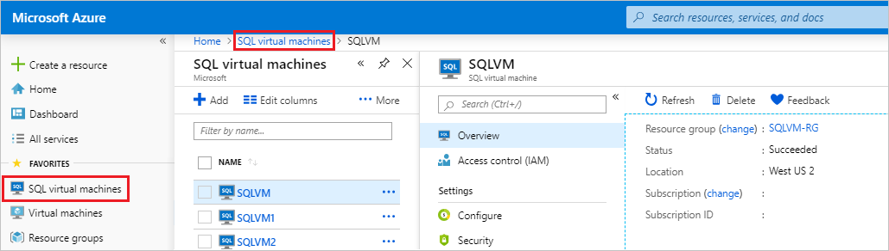
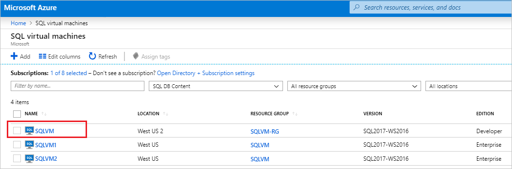
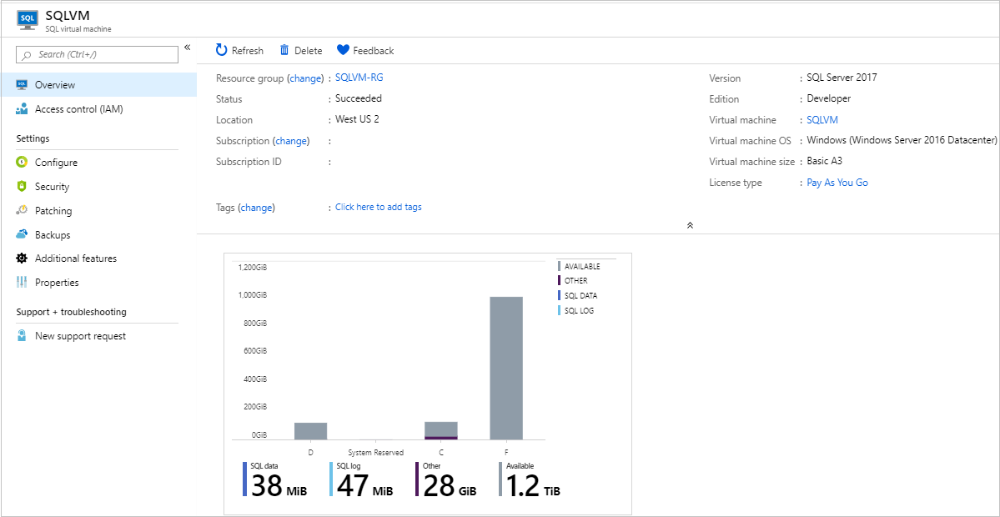
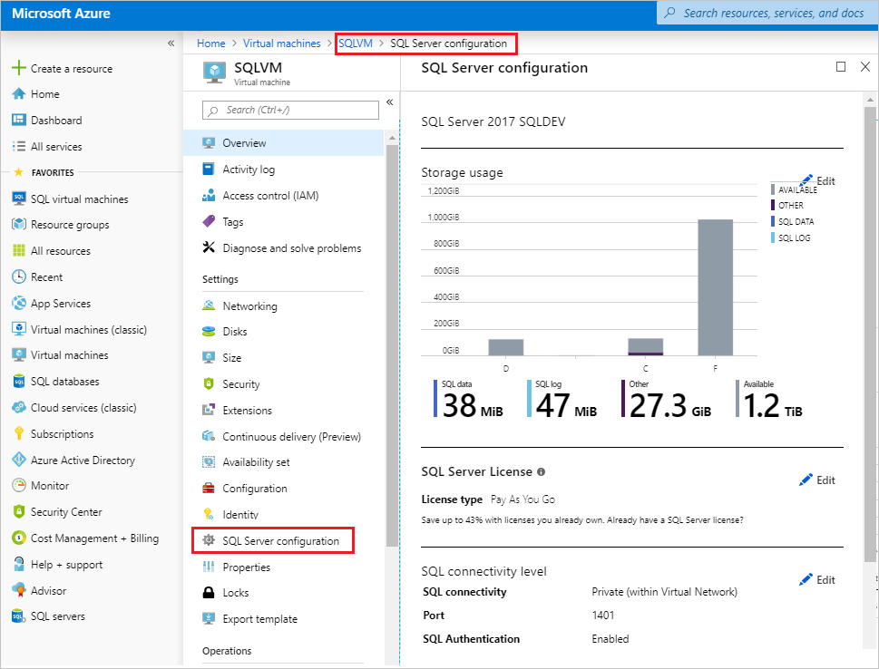

# Manage SQL Server VMs in Azure using the Azure portal

There is a new access point to manage your SQL Server VM on Azure using the [Azure portal](https://portal.azure.com). 

The **SQL virtual machines** resource is now an independent management service that allows you to view all of your SQL Server VMs simultaneously and modify settings dedicated to SQL Server: 

## Remarks

- The **SQL virtual machines** resource is the recommended method to view and manage your SQL Server VMs. However, currently, the **SQL virtual machines** resource does not support the management of [end of support (EOS)](virtual-machines-windows-sql-server-2008-eos-extend-support.md) SQL Server VMs. To manage settings for your EOS SQL Server VMs, use the deprecated [SQL Server configuration tab](#access-sql-server-configuration-tab) instead. 
- The **SQL virtual machines** resource is only available to SQL Server VMs that have [registered with the SQL VM resource provider](virtual-machines-windows-sql-register-with-resource-provider.md). 

## Access SQL virtual machine resource
To access the SQL virtual machines resource, do the following:

1. Open the [Azure portal](https://portal.azure.com). 
1. Select **All Services**. 
1. Type `SQL virtual machines` in the search box.
1. (Optional): Select the star next to **SQL virtual machines** to add this option to your Favorites menu. 
1. Select **SQL virtual machines**. 

   

1. This will list all SQL Server VMs available within the subscription. Select the one you would like to manage to launch the **SQL virtual machines** resource. Use the search box if your SQL Server VM is not readily apparent. 

Selecting your SQL Server VM will open the **SQL virtual machines** resource: 

  > [!TIP]
  > The **SQL virtual machines** resource is for dedicated SQL Server settings. Select the name of the VM in the **Virtual machine** field to navigate to settings that are specific to the VM, but not exclusive to SQL Server. 

## Access SQL Server configuration tab
The SQL Server configuration tab has been deprecated. At this time, it is the only method to manage  [end of support (EOS)](virtual-machines-windows-sql-server-2008-eos-extend-support.md) SQL Server VMs, and SQL Server VMs that have not been [registered with the SQL VM resource provider](virtual-machines-windows-sql-register-with-resource-provider.md).

To access the deprecated SQL server configuration tab, you'll need to navigate to the **Virtual machines** resource. To do so, do the following:

1. Open the [Azure portal](https://portal.azure.com). 
1. Select **All Services**. 
1. Type `virtual machines` in the search box.
1. (Optional): Select the star next to **Virtual machines** to add this option to your Favorites menu. 
1. Select **Virtual machines**. 

   

1. This will list all virtual machines in the subscription. Select the one you would like to manage to launch the **Virtual machine** resource. Use the search box if your SQL Server VM is not readily apparent. 
1. Select **SQL Server configuration** in the **Settings** pane to manage your SQL Server. 

## Next steps

For more information, see the following articles: 

* [Overview of SQL Server on a Windows VM](virtual-machines-windows-sql-server-iaas-overview.md)
* [SQL Server on a Windows VM FAQ](virtual-machines-windows-sql-server-iaas-faq.md)
* [SQL Server on a Windows VM pricing guidance](virtual-machines-windows-sql-server-pricing-guidance.md)
* [SQL Server on a Windows VM release notes](virtual-machines-windows-sql-server-iaas-release-notes.md)

