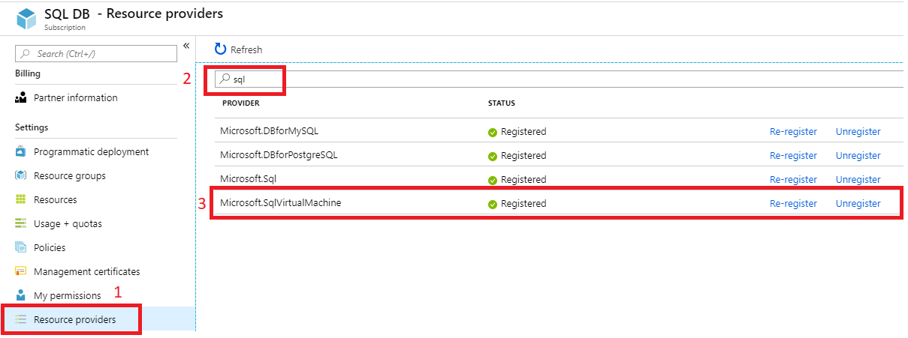

# Register SQL Server virtual machine in Azure with the SQL VM resource provider

This article describes how to register your Azure SQL Server virtual machine (VM) with the SQL VM resource provider. 

Deploying a SQL Server VM marketplace image through the Azure portal automatically registers the SQL Server VM with the resource provider. However, If you choose to self-install SQL Server on an Azure Virtual Machine instead of choosing an image from the Azure Marketplace, then you should register your SQL Server VM with the resource provider today for:

-  **Compliance** – Per the Microsoft Product Terms, customers using the [Azure Hybrid Benefit](https://azure.microsoft.com/pricing/hybrid-benefit/) must indicate to Microsoft when using the Azure Hybrid Benefit - and to do so, they must register with the SQL VM resource provider. 

-  **Feature benefits** - Registering your SQL Server VM with the resource provider unlocks [auto patching](virtual-machines-windows-sql-automated-patching.md), [auto backup](virtual-machines-windows-sql-automated-backup-v2.md), monitoring and manageability capabilities, as well as [licensing](virtual-machines-windows-sql-ahb.md) and [edition](virtual-machines-windows-sql-change-edition.md) flexibility. Previously, these were only available to SQL Server VM images from the Azure Marketplace.

Self-installing SQL Server on an Azure VM or provisioning an Azure VM from a custom VHD with SQL Server is compliant through Azure Hybrid Benefit for SQL Server with the condition that customers indicate that use to Microsoft by registering with SQL VM resource provider. 

To utilize the SQL VM resource provider, you must also register the SQL VM resource provider with your subscription. This can be accomplished with the Azure portal, Azure CLI, and PowerShell. 

## Prerequisites

To register your SQL Server VM with the resource provider, you will need the following: 

- An [Azure subscription](https://azure.microsoft.com/free/).
- A [SQL Server VM](https://docs.microsoft.com/azure/virtual-machines/windows/sql/virtual-machines-windows-portal-sql-server-provision). 
- [Azure CLI](/cli/azure/install-azure-cli) and [PowerShell](/powershell/azure/new-azureps-module-az). 

## Register with SQL VM resource provider
If the [SQL IaaS Extension](virtual-machines-windows-sql-server-agent-extension.md) is already installed on the VM, then registering with SQL VM resource provider is simply creating a metadata resource of type Microsoft.SqlVirtualMachine/SqlVirtualMachines. Below is the code snippet to register with SQL VM resource provider if the SQL IaaS Extension is already installed on the VM. You need to provide the type of SQL Server license desired when registering with SQL VM resource provider as either 'PAYG 'or 'AHUB'. 

Register SQL Server VM using PowerShell with the following code snippet:

  ```powershell-interactive
     // Get the existing  Compute VM
     $vm = Get-AzVM -Name <vm_name> -ResourceGroupName <resource_group_name>
          
     // Register with SQL VM resource provider
     New-AzResource -Name $vm.Name -ResourceGroupName $vm.ResourceGroupName -Location $vm.Location `
        -ResourceType Microsoft.SqlVirtualMachine/SqlVirtualMachines `
        -Properties @{virtualMachineResourceId=$vm.Id;sqlLicenseType='AHUB'}  
  
  ```

If the SQL IaaS Extension is not installed on the VM, then you can register with SQL VM resource provider by specifying the lightweight SQL management mode. In lightweight SQL management mode, SQL VM resource provider will auto install SQL IaaS Extension in [lightweight mode](virtual-machines-windows-sql-server-agent-extension.md#install-in-lightweight-mode) and verify SQL Server instance metadata; this will not restart SQL Server service. You need to provide the type of SQL Server license desired when registering with SQL VM resource provider as either 'PAYG 'or 'AHUB'. 

Register SQL Server VM in lightweight SQL management mode using PowerShell with the following code snippet:

  ```powershell-interactive
     // Get the existing  Compute VM
     $vm = Get-AzVM -Name <vm_name> -ResourceGroupName <resource_group_name>
          
     // Register SQL VM with 'Lightweight' SQL IaaS agent
     New-AzResource -Name $vm.Name -ResourceGroupName $vm.ResourceGroupName -Location $vm.Location `
        -ResourceType Microsoft.SqlVirtualMachine/SqlVirtualMachines `
        -Properties @{virtualMachineResourceId=$vm.Id;sqlLicenseType='AHUB';sqlManagement='LightWeight'}  
  
  ```
Registering with the SQL VM resource provider in [lightweight mode](virtual-machines-windows-sql-server-agent-extension.md#install-in-lightweight-mode) will assure compliance and enable flexible licensing as well as in-place SQL Server edition updates. Failover Cluster Instances and multi-instance deployments can be registered with SQL VM resource provider only in lightweight mode. You can follow the directions found on Azure portal to upgrade to [full mode](virtual-machines-windows-sql-server-agent-extension.md#full-mode-installation) and enable comprehensive manageability feature set with a SQL Server restart anytime. 

## Register SQL Server 2008/R2 on Windows Server 2008 VMs

SQL Server 2008 and 2008 R2 installed on Windows Server 2008 can be registered with the SQL VM resource provide in the [NoAgent](virtual-machines-windows-sql-server-agent-extension.md) mode. This option assures compliance and allows the SQL Server VM to be monitored in the Azure portal with limited functionality.

The following table details the acceptable values for the parameters provided during registration:

| Parameter | Acceptable values                                 |
| :------------------| :--------------------------------------- |
| **sqlLicenseType** | `'AHUB'`, or `'PAYG'`                    |
| **sqlImageOffer**  | `'SQL2008-WS2008'` or `'SQL2008R2-WS2008`|
| &nbsp;             | &nbsp;                                   |


To register your SQL Server 2008 or 2008 R2 on Windows Server 2008 instance, use the following Powershell code snippet:  

  ```powershell-interactive
     // Get the existing  Compute VM
     $vm = Get-AzVM -Name <vm_name> -ResourceGroupName <resource_group_name>
          
    New-AzResource -Name $vm.Name -ResourceGroupName $vm.ResourceGroupName -Location $vm.Location `
      -ResourceType Microsoft.SqlVirtualMachine/SqlVirtualMachines `
      -Properties @{virtualMachineResourceId=$vm.Id;sqlLicenseType='AHUB'; `
       sqlManagement='NoAgent';sqlImageSku='Standard';sqlImageOffer='SQL2008R2-WS2008'}
  ```


## Verify registration status
You can verify if your SQL Server has already been registered with the SQL VM resource provider using the Azure portal, Azure CLI, or PowerShell. 

# [Azure Portal](#tab/azure-portal)
To verify the status of registration using the Azure portal, do the following.

1. Sign into the [Azure portal](https://portal.azure.com). 
1. Navigate to your [SQL virtual machines](virtual-machines-windows-sql-manage-portal.md).
1. Select your SQL Server VM from the list. If your SQL Server VM is not listed here, it is likely your SQL Server VM has not been registered with the SQL VM resource provider. 
1. View the value under `Status`. If `Status = Succeeded`, then the SQL Server VM has been registered with the SQL VM resource provider successfully. 

    

# [AZ CLI](#tab/bash)

Verify current SQL Server VM registration status with the following AZ CLI command. `ProvisioningState` will show `Succeeded` if registration was successful. 

  ```azurecli-interactive
  az sql vm show -n <vm_name> -g <resource_group>
  ```


# [PowerShell](#tab/powershell)

Verify current SQL Server VM registration status with the following PowerShell cmdlet. `ProvisioningState` will show `Succeeded` if registration was successful. 

  ```powershell-interactive
  Get-AzResource -ResourceName <vm_name> -ResourceGroupName <resource_group> -ResourceType Microsoft.SqlVirtualMachine/sqlVirtualMachines
  ```
An error indicates that the SQL Server VM has not been registered with the resource provider. 

---

## Register SQL VM resource provider with subscription 

To register your SQL Server VM with the SQL VM resource provider, you must register the resource provider to your subscription. You can do so with the Azure portal, or Azure CLI.

# [Azure Portal](#tab/azure-portal)


The following steps will register the SQL VM resource provider to your Azure subscription using the Azure portal. 

1. Open the Azure portal and navigate to **All Services**. 
1. Navigate to **Subscriptions** and select the subscription of interest.  
1. On the **Subscriptions** page, navigate to **Resource providers**. 
1. Type `sql` in the filter to bring up the SQL-related resource providers. 
1. Select either *Register*, *Re-register*, or *Unregister* for the  **Microsoft.SqlVirtualMachine** provider depending on your desired action. 

   

# [AZ CLI](#tab/bash)

The following code snippet will register the SQL VM resource provider to your Azure subscription. 

```azurecli-interactive
# Register the new SQL VM resource provider to your subscription 
az provider register --namespace Microsoft.SqlVirtualMachine 
```

# [PowerShell](#tab/powershell)

The following PowerShell code snippet will register the SQL VM resource provider to your Azure subscription.

```powershell-interactive
# Register the new SQL VM resource provider to your subscription
Register-AzResourceProvider -ProviderNamespace Microsoft.SqlVirtualMachine
```
---

## Remarks

 - The SQL VM resource provider only supports SQL Server VMs deployed using the 'Resource Manager'. SQL Server VMs deployed using the 'classic model' are not supported. 
 - The SQL VM resource provider only supports SQL Server VMs deployed to the public cloud. Deployments to the private, or government cloud, are not supported. 

## Next steps

For more information, see the following articles: 

* [Overview of SQL Server on a Windows VM](virtual-machines-windows-sql-server-iaas-overview.md)
* [SQL Server on a Windows VM FAQ](virtual-machines-windows-sql-server-iaas-faq.md)
* [SQL Server on a Windows VM pricing guidance](virtual-machines-windows-sql-server-pricing-guidance.md)
* [SQL Server on a Windows VM release notes](virtual-machines-windows-sql-server-iaas-release-notes.md)


