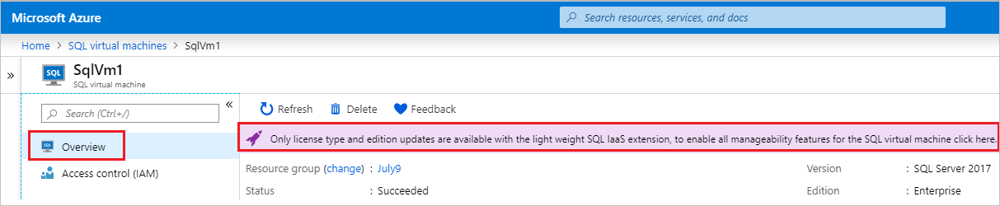
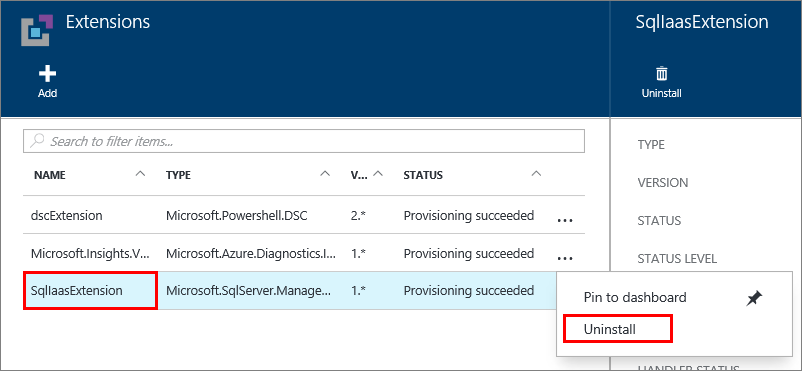

# Automate management tasks on Azure Virtual Machines with the SQL Server IaaS Agent Extension
> [!div class="op_single_selector"]
> * [Resource Manager](virtual-machines-windows-sql-server-agent-extension.md)
> * [Classic](../sqlclassic/virtual-machines-windows-classic-sql-server-agent-extension.md)

The SQL Server IaaS Agent Extension (SqlIaasExtension) runs on Azure virtual machines to automate administration tasks. This article provides an overview and the services supported by the extension as well as instructions for installation, status, and removal.

[!INCLUDE [learn-about-deployment-models](../../../../includes/learn-about-deployment-models-rm-include.md)]

To view the classic version of this article, see [SQL Server Agent Extension for SQL Server VMs Classic](../sqlclassic/virtual-machines-windows-classic-sql-server-agent-extension.md).

There are three SQL manageability modes for the SQL IaaS extension: **Full**, **Lightweight**, and **NoAgent**. 

- **Full** mode delivers all functionality, but requires a restart of the SQL Server and SA permissions. This is the option that is installed by default and should be used for managing a SQL Server VM with a single instance. 

- **Lightweight** does not require the restart of SQL Server, but only supports changing the license type and edition of SQL Server. This option should be used for SQL Server VMs with multiple instances, or participating in a failover cluster instance (FCI). 

- **NoAgent** is dedicated for SQL Server 2008 and SQL Server 2008 R2 installed on Windows Server 2008. For information on utilizing `NoAgent` mode for your Windows Server 2008 image, see [Windows Server 2008 registration](virtual-machines-windows-sql-register-with-resource-provider.md#register-sql-server-2008r2-on-windows-server-2008-vms). 

## Supported services
The SQL Server IaaS Agent Extension supports the following administration tasks:

| Administration feature | Description |
| --- | --- |
| **SQL Automated Backup** |Automates the scheduling of backups for all databases for either the default instance or a [properly installed](virtual-machines-windows-sql-server-iaas-faq.md#administration) named instance of SQL Server on the VM. For more information, see [Automated backup for SQL Server in Azure Virtual Machines (Resource Manager)](virtual-machines-windows-sql-automated-backup.md). |
| **SQL Automated Patching** |Configures a maintenance window during which important Windows updates to your VM can take place, so  you can avoid updates during peak times for your workload. For more information, see [Automated patching for SQL Server in Azure Virtual Machines (Resource Manager)](virtual-machines-windows-sql-automated-patching.md). |
| **Azure Key Vault Integration** |Enables you to automatically install and configure Azure Key Vault on your SQL Server VM. For more information, see [Configure Azure Key Vault Integration for SQL Server on Azure VMs (Resource Manager)](virtual-machines-windows-ps-sql-keyvault.md). |

Once installed and running, the SQL Server IaaS Agent Extension makes these administration features available on the SQL Server panel of the virtual machine in the Azure portal and through Azure PowerShell for SQL Server marketplace images, and through Azure PowerShell for manual installations of the extension. 

## Prerequisites
Requirements to use the SQL Server IaaS Agent Extension on your VM:

**Operating System**:

* Windows Server 2008 R2
* Windows Server 2012
* Windows Server 2012 R2
* Windows Server 2016
* Windows Server 2019 

**SQL Server versions**:

* SQL Server 2008 
* SQL Server 2008 R2
* SQL Server 2012
* SQL Server 2014
* SQL Server 2016
* SQL Server 2017

**Azure PowerShell**:

* [Download and configure the latest Azure PowerShell commands](/powershell/azure/overview)

[!INCLUDE [updated-for-az.md](../../../../includes/updated-for-az.md)]


## Change Management Modes

You can view the current mode of your SQL IaaS agent by using PowerShell: 

  ```powershell-interactive
     //Get the SqlVirtualMachine
     $sqlvm = Get-AzResource -Name $vm.Name  -ResourceGroupName $vm.ResourceGroupName  -ResourceType Microsoft.SqlVirtualMachine/SqlVirtualMachines
     $sqlvm.Properties.sqlManagement
  ```

For SQL Server VMs that have the *NoAgent* or *lightweight* IaaS extension installed, you can upgrade the mode to *full* using the Azure portal. It is not possible to downgrade - to do so, you will need to completely uninstall the SQL IaaS extension and install it again. 

To upgrade agent mode to *full*, do the following: 

1. Sign into the [Azure portal](https://portal.azure.com).
1. Navigate to your [SQL virtual machines](virtual-machines-windows-sql-manage-portal.md#access-sql-virtual-machine-resource) resource. 
1. Select your SQL Server virtual machine and select **Overview**. 
1. For SQL VMs with the *NoAgent* or *lightweight* IaaS modes, select the message for **Only license type and edition updates are available with the SQL IaaS extension**.

    

1. Agree to **restart the SQL Server service** by selecting the checkbox, and then select **Confirm** to upgrade your IaaS mode to 'full'. 

    

##  Installation
The SQL IaaS extension is installed when you register your SQL Server VM with the [SQL VM resource provider](virtual-machines-windows-sql-register-with-resource-provider.md#register-with-sql-vm-resource-provider). However, if necessary, the SQL IaaS agent can also be installed manually using *full* or *lightweight* mode installation. 

The *full* SQL Server IaaS Agent Extension is automatically installed when you provision one of the SQL Server virtual machine gallery images using the Azure portal. 

### Full mode installation
The *full* SQL IaaS extension offers full manageability for a single instance on the SQL Server VM. If there is a default instance, then the extension will work with the default instance, and it will not support managing other instances. If there is no default instance but only one named instance, then it will manage the named instance. If there is no default instance and there are multiple named instances, then the extension will fail to install. 

Installing the *full* mode of the SQL IaaS will restart the SQL Server service. To avoid restarting the SQL Server service, install the *lightweight* mode with limited manageability instead. 

Install SQL IaaS agent with *full* mode using PowerShell:

  ```powershell-interactive
     // Get the existing  Compute VM
     $vm = Get-AzVM -Name <vm_name> -ResourceGroupName <resource_group_name>
          
     // Register SQL VM with 'Full' SQL IaaS agent
     New-AzResource -Name $vm.Name -ResourceGroupName $vm.ResourceGroupName -Location $vm.Location `
        -ResourceType Microsoft.SqlVirtualMachine/SqlVirtualMachines `
        -Properties @{virtualMachineResourceId=$vm.Id;sqlServerLicenseType='AHUB';sqlManagement='Full'}  
  
  ```

| Parameter | Acceptable values                        |
| :------------------| :-------------------------------|
| **sqlServerLicenseType** | `'AHUB'`, or `'PAYG'`     |
| &nbsp;             | &nbsp;                          |


> [!WARNING]
> - If the extension is not already installed, installing the **full** extension restarts the SQL Server service. Use **lightweight** mode to avoid restarting the SQL Server service. 
> - Updating the SQL IaaS extension does not restart the SQL Server service. 

#### Install on a VM with a single named SQL Server instance
The SQL IaaS extension will work with a named instance on a SQL Server if the default instance is uninstalled and the IaaS extension is reinstalled.

To use a named instance of SQL Server, do the following:
   1. Deploy a SQL Server VM from the marketplace. 
   1. Uninstall the IaaS extension from within the [Azure portal](https://portal.azure.com).
   1. Uninstall SQL Server completely within the SQL Server VM.
   1. Install SQL Server with a named instance within the SQL Server VM. 
   1. Install the IaaS extension from within the Azure portal.  


### Install in Lightweight mode
Lightweight mode will not restart your SQL Server service, but it offers limited functionality. 

Install SQL IaaS agent with *lightweight* mode using PowerShell:


  ```powershell-interactive
     // Get the existing  Compute VM
     $vm = Get-AzVM -Name <vm_name> -ResourceGroupName <resource_group_name>
          
     // Register SQL VM with 'Lightweight' SQL IaaS agent
     New-AzResource -Name $vm.Name -ResourceGroupName $vm.ResourceGroupName -Location $vm.Location `
        -ResourceType Microsoft.SqlVirtualMachine/SqlVirtualMachines `
        -Properties @{virtualMachineResourceId=$vm.Id;sqlServerLicenseType='AHUB';sqlManagement='LightWeight'}  
  
  ```

| Parameter | Acceptable values                        |
| :------------------| :-------------------------------|
| **sqlServerLicenseType** | `'AHUB'`, or `'PAYG'`     |
| &nbsp;             | &nbsp;                          |


## Get Status of SQL IaaS Extension
One way to verify that the extension is installed is to view the agent status in the Azure portal. Select **All settings** in the virtual machine window, and then click on **Extensions**. You should see the **SqlIaasExtension** extension listed.


You can also use the **Get-AzVMSqlServerExtension** Azure PowerShell cmdlet.

   ```powershell-interactive
   Get-AzVMSqlServerExtension -VMName "vmname" -ResourceGroupName "resourcegroupname"
   ```

The previous command confirms the agent is installed and provides general status information. You can also get specific status information about Automated Backup and Patching with the following commands.

   ```powershell-interactive
    $sqlext = Get-AzVMSqlServerExtension -VMName "vmname" -ResourceGroupName "resourcegroupname"
    $sqlext.AutoPatchingSettings
    $sqlext.AutoBackupSettings
   ```

## Removal
In the Azure portal, you can uninstall the extension by clicking the ellipsis on the **Extensions** window of your virtual machine properties. Then click **Delete**.



You can also use the **Remove-AzVMSqlServerExtension** PowerShell cmdlet.

   ```powershell-interactive
    Remove-AzVMSqlServerExtension -ResourceGroupName "resourcegroupname" -VMName "vmname" -Name "SqlIaasExtension"
   ```

## Next steps
Begin using one of the services supported by the extension. For more information, see the articles referenced in the [Supported services](#supported-services) section of this article.

For more information about running SQL Server on Azure Virtual Machines, see [SQL Server on Azure Virtual Machines overview](virtual-machines-windows-sql-server-iaas-overview.md).

