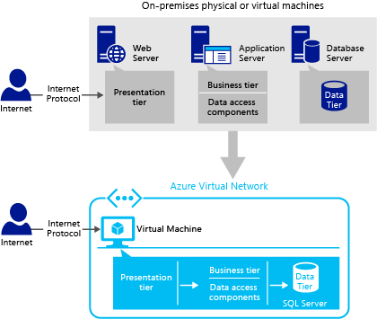
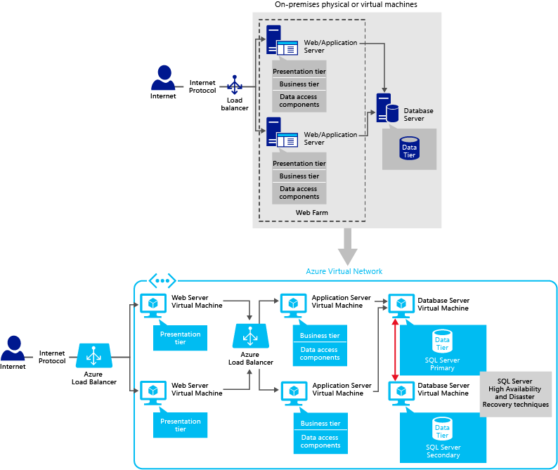
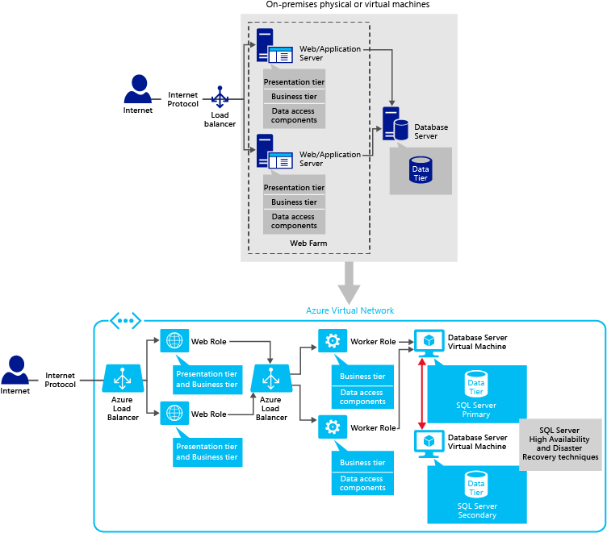
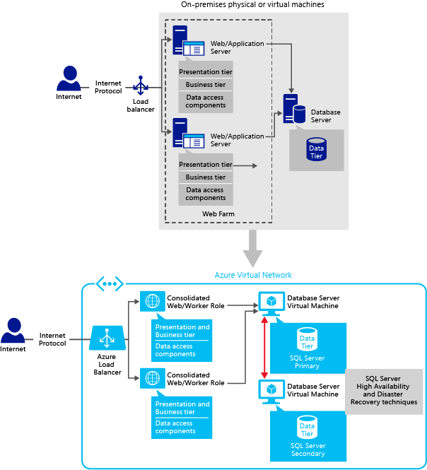

# Application Patterns and Development Strategies for SQL Server in Azure Virtual Machines
[!INCLUDE [learn-about-deployment-models](../../../../includes/learn-about-deployment-models-both-include.md)]

## Summary:
Determining which application pattern or patterns to use for your SQL-Server-based applications in Azure environment is an important design decision and it requires a solid understanding of how SQL Server and each infrastructure component of Azure work together. With SQL Server in Azure Infrastructure Services, you can easily migrate, maintain, and monitor your existing SQL Server applications built-on Windows Server to virtual machines in Azure.

The goal of this article is to provide solution architects and developers a foundation for good application architecture and design, which they can follow when migrating existing applications to Azure as well as developing new applications in Azure.

For each application pattern, you will find an on-premises scenario, its respective cloud-enabled solution, and the related technical recommendations. In addition, the article discusses Azure-specific development strategies so that you can design your applications correctly. Due to the many possible application patterns, it’s recommended that architects and developers should choose the most appropriate pattern for their applications and users.

**Technical Contributors:** Luis Carlos Vargas Herring, Madhan Arumugam Ramakrishnan

**Technical Reviewers:** Corey Sanders, Drew McDaniel, Narayan Annamalai, Nir Mashkowski, Sanjay Mishra, Silvano Coriani, Stefan Schackow, Tim Hickey, Tim Wieman, Xin Jin

## Introduction
You can develop many types of n-tier applications by separating the components of the different application layers on different machines as well as in separate components. For example, you can place the client application and business rules components in one machine, front-end web tier and data access tier components in another machine, and a back-end database tier in another machine. This kind of structuring helps isolate each tier from each other. If you change where data comes from, you don’t need to change the client or web application but only the data access tier components.

A typical *n-tier* application includes the presentation tier, the business tier, and the data tier:

| Tier | Description |
| --- | --- |
| **Presentation** |The *presentation tier* (web tier, front-end tier) is the layer in which users interact with an application. |
| **Business** |The *business tier* (middle tier) is the layer that the presentation tier and the data tier use to communicate with each other and includes the core functionality of the system. |
| **Data** |The *data tier* is basically the server that stores an application's data (for example, a server running SQL Server). |

Application layers describe the logical groupings of the functionality and components in an application; whereas tiers describe the physical distribution of the functionality and components on separate physical servers, computers, networks, or remote locations. The layers of an application may reside on the same physical computer (the same tier) or may be distributed over separate computers (n-tier), and the components in each layer communicate with components in other layers through well-defined interfaces. You can think of the term tier as referring to physical distribution patterns such as two-tier, three-tier, and n-tier. A **2-tier application pattern** contains two application tiers: application server and database server. The direct communication happens between the application server and the database server. The application server contains both web-tier and business-tier components. In **3-tier application pattern**, there are three application tiers: web server, application server, which contains the business logic tier and/or business tier data access components, and the database server. The communication between the web server and the database server happens over the application server. For detailed information on application layers and tiers, see [Microsoft Application Architecture Guide](https://msdn.microsoft.com/library/ff650706.aspx).

Before you start reading this article, you should have knowledge on the fundamental concepts of SQL Server and Azure. For information, see [SQL Server Books Online](https://msdn.microsoft.com/library/bb545450.aspx), [SQL Server in Azure Virtual Machines](virtual-machines-windows-sql-server-iaas-overview.md) and [Azure.com](https://azure.microsoft.com/).

This article describes several application patterns that can be suitable for your simple applications as well as the highly complex enterprise applications. Before detailing each pattern, we recommend that you should familiarize yourself with the available data storage services in Azure, such as [Azure Storage](../../../storage/common/storage-introduction.md), [Azure SQL Database](../../../sql-database/sql-database-technical-overview.md), and [SQL Server in an Azure Virtual Machine](virtual-machines-windows-sql-server-iaas-overview.md). To make the best design decisions for your applications, understand when to use which data storage service clearly.

### Choose SQL Server in an Azure Virtual Machine, when:
* You need control on SQL Server and Windows. For example, this might include the SQL Server version, special hotfixes, performance configuration, etc.
* You need a full compatibility with SQL Server on-premises and want to move existing applications to Azure as-is.
* You want to leverage the capabilities of the Azure environment but Azure SQL Database does not support all the features that your application requires. This could include the following areas:
  
  * **Database size**: At the time this article was updated, SQL Database supports a database of up to 1 TB of data. If your application requires more than 1 TB of data and you don’t want to implement custom sharding solutions, it’s recommended that you use SQL Server in an Azure Virtual Machine. For the latest information, see [Scaling Out Azure SQL Database](https://msdn.microsoft.com/library/azure/dn495641.aspx), [DTU-Based Purchasing Model](../../../sql-database/sql-database-service-tiers-dtu.md), and [vCore-Based Purchasing Model](../../../sql-database/sql-database-service-tiers-vcore.md)(preview).
  * **HIPAA compliance**: Healthcare customers and Independent Software Vendors (ISVs) might choose [SQL Server in Azure Virtual Machines](virtual-machines-windows-sql-server-iaas-overview.md) instead of [Azure SQL Database](../../../sql-database/sql-database-technical-overview.md) because SQL Server in an Azure Virtual Machine is covered by HIPAA Business Associate Agreement (BAA). For information on compliance, see [Microsoft Azure Trust Center: Compliance](https://azure.microsoft.com/support/trust-center/compliance/).
  * **Instance-level features**: At this time, SQL Database doesn’t support features that live outside of the database (such as Linked Servers, Agent jobs, FileStream, Service Broker, etc.). For more information, see [Azure SQL Database Guidelines and Limitations](https://msdn.microsoft.com/library/azure/ff394102.aspx).

## 1-tier (simple): single virtual machine
In this application pattern, you deploy your SQL Server application and database to a standalone virtual machine in Azure. The same virtual machine contains your client/web application, business components, data access layer, and the database server. The presentation, business, and data access code are logically separated but are physically located in a single-server machine. Most customers start with this application pattern and then, they scale out by adding more web roles or virtual machines to their system.

This application pattern is useful when:

* You want to perform a simple migration to Azure platform to evaluate whether the platform answers your application’s requirements or not.
* You want to keep all the application tiers hosted in the same virtual machine in the same Azure data center to reduce the latency between tiers.
* You want to quickly provision development and test environments for short periods of time.
* You want to perform stress testing for varying workload levels but at the same time you do not want to own and maintain many physical machines all the time.

The following diagram demonstrates a simple on-premises scenario and how you can deploy its cloud enabled solution in a single virtual machine in Azure.

Deploying the business layer (business logic and data access components) on the same physical tier as the presentation layer can maximize application performance, unless you must use a separate tier due to scalability or security concerns.

Since this is a very common pattern to start with, you might find the following article on migration useful for moving your data to your SQL Server VM: [Migrating a Database to SQL Server on an Azure VM](virtual-machines-windows-migrate-sql.md).

## 3-tier (simple): multiple virtual machines
In this application pattern, you deploy a 3-tier application in Azure by placing each application tier in a different virtual machine. This provides a flexible environment for an easy scale-up and scale-out scenarios. When one virtual machine contains your client/web application, the other one hosts your business components, and the other one hosts the database server.

This application pattern is useful when:

* You want to perform a migration of complex database applications to Azure Virtual Machines.
* You want different application tiers to be hosted in different regions. For example, you might have shared databases that are deployed to multiple regions for reporting purposes.
* You want to move enterprise applications from on-premises virtualized platforms to Azure Virtual Machines. For a detailed discussion on enterprise applications, see [What is an Enterprise Application](https://msdn.microsoft.com/library/aa267045.aspx).
* You want to quickly provision development and test environments for short periods of time.
* You want to perform stress testing for varying workload levels but at the same time you do not want to own and maintain many physical machines all the time.

The following diagram demonstrates how you can place a simple 3-tier application in Azure by placing each application tier in a different virtual machine.

In this application pattern, there is only one virtual machine (VM) in each tier. If you have multiple VMs in Azure, we recommend that you set up a virtual network. [Azure Virtual Network](../../../virtual-network/virtual-networks-overview.md) creates a trusted security boundary and also allows VMs to communicate among themselves over the private IP address. In addition, always make sure that all Internet connections only go to the presentation tier. When following this application pattern, manage the network security group rules to control access. For more information, see [Allow external access to your VM using the Azure portal](../nsg-quickstart-portal.md?toc=%2fazure%2fvirtual-machines%2fwindows%2ftoc.json).

In the diagram, Internet Protocols can be TCP, UDP, HTTP, or HTTPS.

> [!NOTE]
> Setting up a virtual network in Azure is free of charge. However, you are charged for the VPN gateway that connects to on-premises. This charge is based on the amount of time that connection is provisioned and available.
> 
> 

## 2-tier and 3-tier with presentation tier scale-out
In this application pattern, you deploy 2-tier or 3-tier database application to Azure Virtual Machines by placing each application tier in a different virtual machine. In addition, you scale out the presentation tier due to increased volume of incoming client requests.

This application pattern is useful when:

* You want to move enterprise applications from on-premises virtualized platforms to Azure Virtual Machines.
* You want to scale out the presentation tier due to increased volume of incoming client requests.
* You want to quickly provision development and test environments for short periods of time.
* You want to perform stress testing for varying workload levels but at the same time you do not want to own and maintain many physical machines all the time.
* You want to own an infrastructure environment that can scale up and down on demand.

The following diagram demonstrates how you can place the application tiers in multiple virtual machines in Azure by scaling out the presentation tier due to increased volume of incoming client requests. As seen in the diagram, Azure Load Balancer is responsible for distributing traffic across multiple virtual machines and also determining which web server to connect to. Having multiple instances of the web servers behind a load balancer ensures the high availability of the presentation tier.

### Best practices for 2-tier, 3-tier, or n-tier patterns that have multiple VMs in one tier
It’s recommended that you place the virtual machines that belong to the same tier in the same cloud service and in the same the availability set. For example, place a set of web servers in **CloudService1** and **AvailabilitySet1** and a set of database servers in **CloudService2** and **AvailabilitySet2**. An availability set in Azure enables you to place the high availability nodes into separate fault domains and upgrade domains.

To leverage multiple VM instances of a tier, you need to configure Azure Load Balancer between application tiers. To configure Load Balancer in each tier, create a load-balanced endpoint on each tier’s VMs separately. For a specific tier, first create VMs in the same cloud service. This ensures that they have the same public Virtual IP address. Next, create an endpoint on one of the virtual machines on that tier. Then, assign the same endpoint to the other virtual machines on that tier for load balancing. By creating a load-balanced set, you distribute traffic across multiple virtual machines and also allow the Load Balancer to determine which node to connect when a backend VM node fails. For example, having multiple instances of the web servers behind a load balancer ensures the high availability of the presentation tier.

As a best practice, always make sure that all internet connections first go to the presentation tier. The presentation layer accesses the business tier, and then the business tier accesses the data tier. For more information on how to allow access to the presentation layer, see [Allow external access to your VM using the Azure portal](../nsg-quickstart-portal.md?toc=%2fazure%2fvirtual-machines%2fwindows%2ftoc.json).

Note that the Load Balancer in Azure works similar to load balancers in an on-premises environment. For more information, see [Load balancing for Azure infrastructure services](../tutorial-load-balancer.md?toc=%2fazure%2fvirtual-machines%2fwindows%2ftoc.json).

In addition, we recommend that you set up a private network for your virtual machines by using Azure Virtual Network. This allows them to communicate among themselves over the private IP address. For more information, see [Azure Virtual Network](../../../virtual-network/virtual-networks-overview.md).

## 2-tier and 3-tier with business tier scale-out
In this application pattern, you deploy 2-tier or 3-tier database application to Azure Virtual Machines by placing each application tier in a different virtual machine. In addition, you might want to distribute the application server components to multiple virtual machines due to the complexity of your application.

This application pattern is useful when:

* You want to move enterprise applications from on-premises virtualized platforms to Azure Virtual Machines.
* You want to distribute the application server components to multiple virtual machines due to the complexity of your application.
* You want to move business logic heavy on-premises LOB (line-of-business) applications to Azure Virtual Machines. LOB applications are a set of critical computer applications that are vital to running an enterprise, such as accounting, human resources (HR), payroll, supply chain management, and resource planning applications.
* You want to quickly provision development and test environments for short periods of time.
* You want to perform stress testing for varying workload levels but at the same time you do not want to own and maintain many physical machines all the time.
* You want to own an infrastructure environment that can scale up and down on demand.

The following diagram demonstrates an on-premises scenario and its cloud enabled solution. In this scenario, you place the application tiers in multiple virtual machines in Azure by scaling out the business tier, which contains the business logic tier and data access components. As seen in the diagram, Azure Load Balancer is responsible for distributing traffic across multiple virtual machines and also determining which web server to connect to. Having multiple instances of the application servers behind a load balancer ensures the high availability of the business tier. For more information, see [Best practices for 2-tier, 3-tier, or n-tier application patterns that have multiple virtual machines in one tier](#best-practices-for-2-tier-3-tier-or-n-tier-patterns-that-have-multiple-vms-in-one-tier).

## 2-tier and 3-tier with presentation and business tiers scale-out and HADR
In this application pattern, you deploy 2-tier or 3-tier database application to Azure Virtual Machines by distributing the presentation tier (web server) and the business tier (application server) components to multiple virtual machines. In addition, you implement high-availability and disaster recovery solutions for your databases in Azure virtual machines.

This application pattern is useful when:

* You want to move enterprise applications from virtualized platforms on-premises to Azure by implementing SQL Server high availability and disaster recovery capabilities.
* You want to scale out the presentation tier and the business tier due to increased volume of incoming client requests and the complexity of your application.
* You want to quickly provision development and test environments for short periods of time.
* You want to perform stress testing for varying workload levels but at the same time you do not want to own and maintain many physical machines all the time.
* You want to own an infrastructure environment that can scale up and down on demand.

The following diagram demonstrates an on-premises scenario and its cloud enabled solution. In this scenario, you scale out the presentation tier and the business tier components in multiple virtual machines in Azure. In addition, you implement high availability and disaster recovery (HADR) techniques for SQL Server databases in Azure.

Running multiple copies of an application in different VMs make sure that you are load balancing requests across them. When you have multiple virtual machines, you need to make sure that all your VMs are accessible and running at one point in time. If you configure load balancing, Azure Load Balancer tracks the health of VMs and directs incoming calls to the healthy functioning VM nodes properly. For information on how to set up load balancing of the virtual machines, see [Load balancing for Azure infrastructure services](../tutorial-load-balancer.md?toc=%2fazure%2fvirtual-machines%2fwindows%2ftoc.json). Having multiple instances of web and application servers behind a load balancer ensures the high availability of the presentation and business tiers.

### Best practices for application patterns requiring SQL HADR
When you set up SQL Server high availability and disaster recovery solutions in Azure Virtual Machines, setting up a virtual network for your virtual machines using [Azure Virtual Network](../../../virtual-network/virtual-networks-overview.md) is mandatory.  Virtual machines within a Virtual Network will have a stable private IP address even after a service downtime, thus you can avoid the update time required for DNS name resolution. In addition, the virtual network allows you to extend your on-premises network to Azure and creates a trusted security boundary. For example, if your application has corporate domain restrictions (such as, Windows authentication, Active Directory), setting up [Azure Virtual Network](../../../virtual-network/virtual-networks-overview.md) is necessary.

Most of customers, who are running production code on Azure, are keeping both primary and secondary replicas in Azure.

For comprehensive information and tutorials on high availability and disaster recovery techniques, see [High Availability and Disaster Recovery for SQL Server in Azure Virtual Machines](virtual-machines-windows-sql-high-availability-dr.md).

## 2-tier and 3-tier using Azure VMs and Cloud Services
In this application pattern, you deploy 2-tier or 3-tier application to Azure by using both [Azure Cloud Services](../../../cloud-services/cloud-services-choose-me.md) (web and worker roles - Platform as a Service (PaaS)) and [Azure Virtual Machines](../overview.md?toc=%2fazure%2fvirtual-machines%2fwindows%2ftoc.json) (Infrastructure as a Service (IaaS)). Using [Azure Cloud Services](https://azure.microsoft.com/documentation/services/cloud-services/) for the presentation tier/business tier and SQL Server in [Azure Virtual Machines](../overview.md?toc=%2fazure%2fvirtual-machines%2fwindows%2ftoc.json) for the data tier is beneficial for most applications running on Azure. The reason is that having a compute instance running on Cloud Services provides an easy management, deployment, monitoring, and scale-out.

With Cloud Services, Azure maintains the infrastructure for you, performs routine maintenance, patches the operating systems, and attempts to recover from service and hardware failures. When your application needs scale-out, automatic, and manual scale-out options are available for your cloud service project by increasing or decreasing the number of instances or virtual machines that are used by your application. In addition, you can use on-premises Visual Studio to deploy your application to a cloud service project in Azure.

In summary, if you don’t want to own extensive administrative tasks for the presentation/business tier and your application does not require any complex configuration of software or the operating system, use Azure Cloud Services. If Azure SQL Database does not support all the features you are looking for, use SQL Server in an Azure Virtual Machine for the data tier. Running an application on Azure Cloud Services and storing data in Azure Virtual Machines combines the benefits of both services. For a detailed comparison, see the section in this topic on [Comparing development strategies in Azure](#comparing-web-development-strategies-in-azure).

In this application pattern, the presentation tier includes a web role, which is a Cloud Services component running in the Azure execution environment and it is customized for web application programming as supported by IIS and ASP.NET. The business or backend tier includes a worker role, which is a Cloud Services component running in the Azure execution environment and it is useful for generalized development, and may perform background processing for a web role. The database tier resides in a SQL Server virtual machine in Azure. The communication between the presentation tier and the database tier happens directly or over the business tier – worker role components.

This application pattern is useful when:

* You want to move enterprise applications from virtualized platforms on-premises to Azure by implementing SQL Server high availability and disaster recovery capabilities.
* You want to own an infrastructure environment that can scale up and down on demand.
* Azure SQL Database does not support all the features that your application or database needs.
* You want to perform stress testing for varying workload levels but at the same time you do not want to own and maintain many physical machines all the time.

The following diagram demonstrates an on-premises scenario and its cloud enabled solution. In this scenario, you place the presentation tier in web roles, the business tier in worker roles but the data tier in virtual machines in Azure. Running multiple copies of the presentation tier in different web roles ensures to load balance requests across them. When you combine Azure Cloud Services with Azure Virtual Machines, we recommend that you set up [Azure Virtual Network](../../../virtual-network/virtual-networks-overview.md) as well. With [Azure Virtual Network](../../../virtual-network/virtual-networks-overview.md), you can have stable and persistent private IP addresses within the same cloud service in the cloud. Once you define a virtual network for your virtual machines and cloud services, they can start communicating among themselves over the private IP address. In addition, having virtual machines and Azure web/worker roles in the same [Azure Virtual Network](../../../virtual-network/virtual-networks-overview.md) provides low latency and more secure connectivity. For more information, see [What is a cloud service](../../../cloud-services/cloud-services-choose-me.md).

As seen in the diagram, Azure Load Balancer distributes traffic across multiple virtual machines and also determines which web server or application server to connect to. Having multiple instances of the web and application servers behind a load balancer ensures the high availability of the presentation tier and the business tier. For more information, see [Best practices for application patterns requiring SQL HADR](#best-practices-for-application-patterns-requiring-sql-hadr).

Another approach to implement this application pattern is to use a consolidated web role that contains both presentation tier and business tier components as shown in the following diagram. This application pattern is useful for applications that require stateful design. Since Azure provides stateless compute nodes on web and worker roles, we recommend that you implement a logic to store session state using one of the following technologies: [Azure Caching](https://azure.microsoft.com/documentation/services/azure-cache-for-redis/), [Azure Table Storage](../../../cosmos-db/table-storage-how-to-use-dotnet.md) or [Azure SQL Database](../../../sql-database/sql-database-technical-overview.md).

## Pattern with Azure VMs, Azure SQL Database, and Azure App Service (Web Apps)
The primary goal of this application pattern is to show you how to combine Azure infrastructure as a service (IaaS) components with Azure platform-as-a-service components (PaaS) in your solution. This pattern is focused on Azure SQL Database for relational data storage. It does not include SQL Server in an Azure virtual machine, which is part of the Azure infrastructure as a service offering.

In this application pattern, you deploy a database application to Azure by placing the presentation and business tiers in the same virtual machine and accessing a database in Azure SQL Database (SQL Database) servers. You can implement the presentation tier by using traditional IIS-based web solutions. Or, you can implement a combined presentation and business tier by using [Azure App Service](https://azure.microsoft.com/documentation/services/app-service/web/).

This application pattern is useful when:

* You already have an existing SQL Database server configured in Azure and you want to test your application quickly.
* You want to test the capabilities of Azure environment.
* You want to quickly provision development and test environments for short periods of time.
* Your business logic and data access components can be self-contained within a web application.

The following diagram demonstrates an on-premises scenario and its cloud enabled solution. In this scenario, you place the application tiers in a single virtual machine in Azure and access data in Azure SQL Database.

If you choose to implement a combined web and application tier by using Azure Web Apps, we recommend that you keep the middle-tier or application tier as dynamic-link libraries (DLLs) in the context of a web application.

In addition, review the recommendations given in the [Comparing web development strategies in Azure](#comparing-web-development-strategies-in-azure) section at the end of this article to learn more about programming techniques.

## N-tier hybrid application pattern
In n-tier hybrid application pattern, you implement your application in multiple tiers distributed between on-premises and Azure. Therefore, you create a flexible and reusable hybrid system, which you can modify or add a specific tier without changing the other tiers. To extend your corporate network to the cloud, you use [Azure Virtual Network](../../../virtual-network/virtual-networks-overview.md) service.

This hybrid application pattern is useful when:

* You want to build applications that run partly in the cloud and partly on-premises.
* You want to migrate some or all elements of an existing on-premises application to the cloud.
* You want to move enterprise applications from on-premises virtualized platforms to Azure.
* You want to own an infrastructure environment that can scale up and down on demand.
* You want to quickly provision development and test environments for short periods of time.
* You want a cost effective way to take backups for enterprise database applications.

The following diagram demonstrates an n-tier hybrid application pattern that spans across on-premises and Azure. As shown in the diagram, on-premises infrastructure includes [Active Directory Domain Services](https://technet.microsoft.com/library/hh831484.aspx) domain controller to support user authentication and authorization. Note that the diagram demonstrates a scenario, where some parts of the data tier live in an on-premises data center whereas some parts of the data tier live in Azure. Depending on your application’s needs, you can implement several other hybrid scenarios. For example, you might keep the presentation tier and the business tier in an on-premises environment but the data tier in Azure.

In Azure, you can use Active Directory as a standalone cloud directory for your organization, or you can also integrate existing on-premises Active Directory with [Azure Active Directory](https://azure.microsoft.com/documentation/services/active-directory/). As seen in the diagram, the business tier components can access to multiple data sources, such as to [SQL Server in Azure](virtual-machines-windows-sql-server-iaas-overview.md) via a private internal IP address, to on-premises SQL Server via [Azure Virtual Network](../../../virtual-network/virtual-networks-overview.md), or to [SQL Database](../../../sql-database/sql-database-technical-overview.md) using the .NET Framework data provider technologies. In this diagram, Azure SQL Database is an optional data storage service.

In n-tier hybrid application pattern, you can implement the following workflow in the order specified:

1. Identify enterprise database applications that need to be moved up to cloud by using the [Microsoft Assessment and Planning (MAP) Toolkit](https://microsoft.com/map). The MAP Toolkit gathers inventory and performance data from computers you are considering for virtualization and provides recommendations on capacity and assessment planning.
2. Plan the resources and configuration needed in the Azure platform, such as storage accounts and virtual machines.
3. Set up network connectivity between the corporate network on-premises and [Azure Virtual Network](../../../virtual-network/virtual-networks-overview.md). To set up the connection between the corporate network on-premises and a virtual machine in Azure, use one of the following two methods:
   
   1. Establish a connection between on-premises and Azure via public end points on a virtual machine in Azure. This method provides an easy setup and enables you to use SQL Server authentication in your virtual machine. In addition, set up your network security group rules to control public traffic to the VM. For more information, see [Allow external access to your VM using the Azure portal](../nsg-quickstart-portal.md?toc=%2fazure%2fvirtual-machines%2fwindows%2ftoc.json).
   2. Establish a connection between on-premises and Azure via Azure Virtual Private network (VPN) tunnel. This method allows you to extend domain policies to a virtual machine in Azure. In addition, you can set up firewall rules and use Windows authentication in your virtual machine. Currently, Azure supports secure site-to-site VPN and point-to-site VPN connections:
      
      * With secure site-to-site connection, you can establish network connectivity between your on-premises network and your virtual network in Azure. It is recommended for connecting your on-premises data center environment to Azure.
      * With secure point-to-site connection, you can establish network connectivity between your virtual network in Azure and your individual computers running anywhere. It is mostly recommended for development and test purposes.
      
      For information on how to connect to SQL Server in Azure, see [Connect to a SQL Server Virtual Machine on Azure](virtual-machines-windows-sql-connect.md).
4. Set up scheduled jobs and alerts that back up on-premises data in a virtual machine disk in Azure. For more information, see [SQL Server Backup and Restore with Azure Blob Storage Service](https://msdn.microsoft.com/library/jj919148.aspx) and [Backup and Restore for SQL Server in Azure Virtual Machines](virtual-machines-windows-sql-backup-recovery.md).
5. Depending on your application’s needs, you can implement one of the following three common scenarios:
   
   1. You can keep your web server, application server, and insensitive data in a database server in Azure whereas you keep the sensitive data on-premises.
   2. You can keep your web server and application server on-premises whereas the database server in a virtual machine in Azure.
   3. You can keep your database server, web server, and application server on-premises whereas you keep the database replicas in virtual machines in Azure. This setting allows the on-premises web servers or reporting applications to access the database replicas in Azure. Therefore, you can achieve to lower the workload in an on-premises database. We recommend that you implement this scenario for heavy read workloads and developmental purposes. For information on creating database replicas in Azure, see AlwaysOn Availability Groups at [High Availability and Disaster Recovery for SQL Server in Azure Virtual Machines](virtual-machines-windows-sql-high-availability-dr.md).

## Comparing web development strategies in Azure
To implement and deploy a multi-tier SQL Server-based application in Azure, you can use one of the following two programming methods:

* Set up a traditional web server (IIS - Internet Information Services) in Azure and access databases in SQL Server in Azure Virtual Machines.
* Implement and deploy a cloud service to Azure. Then, make sure that this cloud service can access databases in SQL Server in Azure Virtual machines. A cloud service can include multiple web and worker roles.

The following table provides a comparison of traditional web development with Azure Cloud Services and Azure Web Apps with respect to SQL Server in Azure Virtual Machines. The table includes Azure Web Apps as it is possible to use SQL Server in Azure VM as a data source for Azure Web Apps via its public virtual IP address or DNS name.

|  | Traditional web development in Azure Virtual Machines | Cloud Services in Azure | Web Hosting with Azure Web Apps |
| --- | --- | --- | --- |
| **Application Migration from on-premises** |Existing applications as-is. |Applications need web and worker roles. |Existing applications as-is but suited for self-contained web applications and web services that require quick scalability. |
| **Development and Deployment** |Visual Studio, WebMatrix, Visual Web Developer, WebDeploy, FTP, TFS, IIS Manager, PowerShell. |Visual Studio, Azure SDK, TFS, PowerShell. Each cloud service has two environments to which you can deploy your service package and configuration: staging and production. You can deploy a cloud service to the staging environment to test it before you promote it to production. |Visual Studio, WebMatrix, Visual Web Developer, FTP, GIT, BitBucket, CodePlex, DropBox, GitHub, Mercurial, TFS, Web Deploy, PowerShell. |
| **Administration and Setup** |You are responsible for administrative tasks on the application, data, firewall rules, virtual network, and operating system. |You are responsible for administrative tasks on the application, data, firewall rules, and virtual network. |You are responsible for administrative tasks on the application and data only. |
| **High Availability and Disaster Recovery (HADR)** |We recommend that you place virtual machines in the same availability set and in the same cloud service. Keeping your VMs in the same availability set allows Azure to place the high availability nodes into separate fault domains and upgrade domains. Similarly, keeping your VMs in the same cloud service enables load balancing and VMs can communicate directly with one another over the local network within an Azure data center.  You are responsible for implementing a high availability and disaster recovery solution for SQL Server in Azure Virtual Machines to avoid any downtime. For supported HADR technologies, see [High Availability and Disaster Recovery for SQL Server in Azure Virtual Machines](virtual-machines-windows-sql-high-availability-dr.md).  You are responsible for backing up your own data and application.  Azure can move your virtual machines if the host machine in the data center fails due to hardware issues. In addition, there could be planned downtime of your VM when the host machine is updated for security or software updates. Therefore, we recommend that you maintain at least two VMs in each application tier to ensure the continuous availability. Azure does not provide SLA for a single virtual machine. |Azure manages the failures resulting from the underlying hardware or operating system software. We recommend that you implement multiple instances of a web or worker role to ensure the high availability of your application. For information, see [Cloud Services, Virtual Machines, and Virtual Network Service Level Agreement](https://azure.microsoft.com/support/legal/sla/virtual-machines/v1_8/).  You are responsible for backing up your own data and application.  For databases residing in a SQL Server database in an Azure VM, you are responsible for implementing a high availability and disaster recovery solution to avoid any downtime. For supported HDAR technologies, see High Availability and Disaster Recovery for SQL Server in Azure Virtual Machines.  **SQL Server Database Mirroring**: Use with Azure Cloud Services (web/worker roles). SQL Server VMs and a cloud service project can be in the same Azure Virtual Network. If SQL Server VM is not in the same Virtual Network, you need to create a SQL Server Alias to route communication to the instance of SQL Server. In addition, the alias name must match the SQL Server name. |High Availability is inherited from Azure worker roles, Azure blob storage, and Azure SQL Database. For example, Azure Storage maintains three replicas of all blob, table, and queue data. At any one time, Azure SQL Database keeps three replicas of data running—one primary replica and two secondary replicas. For more information, see [Azure Storage](https://azure.microsoft.com/documentation/services/storage/) and [Azure SQL Database](../../../sql-database/sql-database-technical-overview.md).  When using SQL Server in Azure VM as a data source for Azure Web Apps, keep in mind that Azure Web Apps does not support Azure Virtual Network. In other words, all connections from Azure Web Apps to SQL Server VMs in Azure must go through public end points of virtual machines. This might cause some limitations for high availability and disaster recovery scenarios. For example, the client application on Azure Web Apps connecting to SQL Server VM with database mirroring would not be able to connect to the new primary server as database mirroring requires that you set up Azure Virtual Network between SQL Server host VMs in Azure. Therefore, using **SQL Server Database Mirroring** with Azure Web Apps is not supported currently.  **SQL Server AlwaysOn Availability Groups**: You can set up AlwaysOn Availability Groups when using Azure Web Apps with SQL Server VMs in Azure. But you need to configure AlwaysOn Availability Group Listener to route the communication to the primary replica via public load-balanced endpoints. |
| **cross-premises Connectivity** |You can use Azure Virtual Network to connect to on-premises. |You can use Azure Virtual Network to connect to on-premises. |Azure Virtual Network is supported. For more information, see [Web Apps Virtual Network Integration](https://azure.microsoft.com/blog/2014/09/15/azure-websites-virtual-network-integration/). |
| **Scalability** |Scale-up is available by increasing the virtual machine sizes or adding more disks. For more information about virtual machine sizes, see [Virtual Machine Sizes for Azure](../sizes.md?toc=%2fazure%2fvirtual-machines%2fwindows%2ftoc.json).  **For Database Server**: Scale-out is available via database partitioning techniques and SQL Server AlwaysOn Availability groups.  For heavy read workloads, you can use [AlwaysOn Availability Groups](https://msdn.microsoft.com/library/hh510230.aspx) on multiple secondary nodes as well as SQL Server Replication.  For heavy write workloads, you can implement horizontal partitioning data across multiple physical servers to provide application scale-out.  In addition, you can implement a scale-out by using [SQL Server with Data Dependent Routing](https://technet.microsoft.com/library/cc966448.aspx). With Data Dependent Routing (DDR), you need to implement the partitioning mechanism in the client application, typically in the business tier layer, to route the database requests to multiple SQL Server nodes. The business tier contains mappings to how the data is partitioned and which node contains the data.  You can scale applications that are running virtual machines. For more information, see [How to Scale an Application](../../../cloud-services/cloud-services-how-to-scale-portal.md).  **Important Note**: The **AutoScale** feature in Azure allows you to automatically increase or decrease the Virtual Machines that are used by your application. This feature guarantees that the end-user experience is not affected negatively during peak periods, and VMs are shut down when the demand is low. It’s recommended that you do not set the AutoScale option for your cloud service if it includes SQL Server VMs. The reason is that the AutoScale feature lets Azure to turn on a virtual machine when the CPU usage in that VM is higher than some threshold, and to turn off a virtual machine when the CPU usage goes lower than it. The AutoScale feature is useful for stateless applications, such as web servers, where any VM can manage the workload without any references to any previous state. However, the AutoScale feature is not useful for stateful applications, such as SQL Server, where only one instance allows writing to the database. |Scale-up is available by using multiple web and worker roles. For more information about virtual machine sizes for web roles and worker roles, see [Configure Sizes for Cloud Services](../../../cloud-services/cloud-services-sizes-specs.md).  When using **Cloud Services**, you can define multiple roles to distribute processing and also achieve flexible scaling of your application. Each cloud service includes one or more web roles and/or worker roles, each with its own application files and configuration. You can scale-up a cloud service by increasing the number of role instances (virtual machines) deployed for a role and scale-down a cloud service by decreasing the number of role instances. For detailed information, see [Azure Execution Models](../../../cloud-services/cloud-services-choose-me.md).  Scale-out is available via built-in Azure high availability support through [Cloud Services, Virtual Machines, and Virtual Network Service Level Agreement](https://azure.microsoft.com/support/legal/sla/virtual-machines/v1_8/) and Load Balancer.  For a multi-tier application, we recommend that you connect web/worker roles application to database server VMs via Azure Virtual Network. In addition, Azure provides load balancing for VMs in the same cloud service, spreading user requests across them. Virtual machines connected in this way can communicate directly with one another over the local network within an Azure data center.  You can set up **AutoScale** on the Azure portal as well as the schedule times. For more information, see [How to configure auto scaling for a Cloud Service in the portal](../../../cloud-services/cloud-services-how-to-scale-portal.md). |**Scale up and down**: You can increase/decrease the size of the instance (VM) reserved for your web site.  Scale out: You can add more reserved instances (VMs) for your web site.  You can set up **AutoScale** on the portal as well as the schedule times. For more information, see [How to Scale Web Apps](../../../app-service/web-sites-scale.md). |

For more information on choosing between these programming methods, see [Azure Web Apps, Cloud Services, and VMs: When to use which](/azure/architecture/guide/technology-choices/compute-decision-tree).

## Next Steps
For more information on running SQL Server in Azure Virtual machines, see [SQL Server on Azure Virtual Machines Overview](virtual-machines-windows-sql-server-iaas-overview.md).

