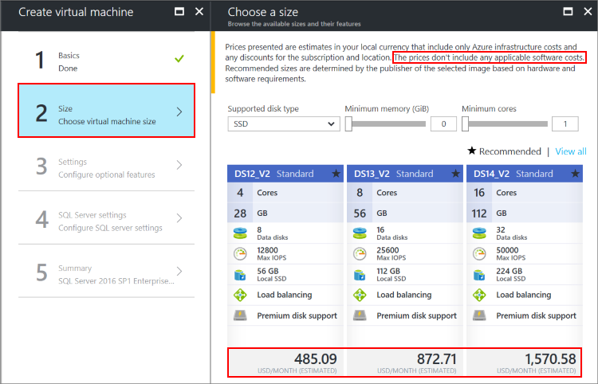
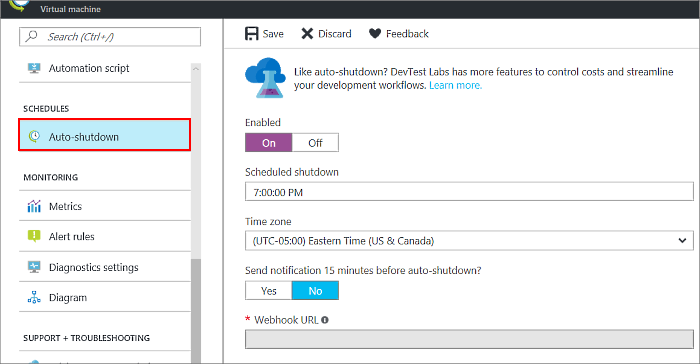

# Pricing guidance for SQL Server Azure VMs

This article provides pricing guidance for [SQL Server virtual machines](virtual-machines-windows-sql-server-iaas-overview.md) in Azure. There are several options that affect cost, and it is important to pick the right image that balances costs with business requirements.

> [!TIP]
> If you only need to find out a cost estimate for a specific combination of SQL Server edition and virtual machine size, see the pricing page for [Windows](https://azure.microsoft.com/pricing/details/virtual-machines/windows) or [Linux](https://azure.microsoft.com/pricing/details/virtual-machines/linux). Select your platform and SQL Server edition from the **OS/Software** list.
>
> 
>
> Or use the [pricing calculator](https://azure.microsoft.com/pricing/#explore-cost) to add and configure a virtual machine. 

## Free-licensed SQL Server editions

If you want to develop, test, or build a proof of concept, then use the freely licensed **SQL Server Developer edition**. This edition has all the features of SQL Server Enterprise edition, allowing you to build and test any type of application. However, you cannot run the Developer edition in production. A SQL Server Developer edition VM only incurs charges for the cost of the VM, because there are no associated SQL Server licensing costs.

If you want to run a lightweight workload in production (<4 cores, <1 GB memory, <10 GB/database), use the freely licensed **SQL Server Express edition**. A SQL Server Express edition VM also only incurs charges for the cost of the VM.

For these development/test and lightweight production workloads, you can also save money by choosing a smaller VM size that matches these workloads. The DS1v2 might be a good choice in some scenarios.

To create a SQL Server 2017 Azure VM with one of these images, see the following links:

| Platform | Freely licensed images |
|---|---|
| Windows Server 2016 | [SQL Server 2017 Developer Azure VM](https://portal.azure.com/#create/Microsoft.FreeSQLServerLicenseSQLServer2017DeveloperonWindowsServer2016) [SQL Server 2017 Express Azure VM](https://portal.azure.com/#create/Microsoft.FreeSQLServerLicenseSQLServer2017ExpressonWindowsServer2016) |
| Red Hat Enterprise Linux | [SQL Server 2017 Developer Azure VM](https://portal.azure.com/#create/Microsoft.FreeSQLServerLicenseSQLServer2017DeveloperonRedHatEnterpriseLinux74) [SQL Server 2017 Express Azure VM](https://portal.azure.com/#create/Microsoft.FreeSQLServerLicenseSQLServer2017ExpressonRedHatEnterpriseLinux74) |
| SUSE Linux Enterprise Server | [SQL Server 2017 Developer Azure VM](https://portal.azure.com/#create/Microsoft.FreeSQLServerLicenseSQLServer2017DeveloperonSLES12SP2) [SQL Server 2017 Express Azure VM](https://portal.azure.com/#create/Microsoft.FreeSQLServerLicenseSQLServer2017ExpressonSLES12SP2) |
| Ubuntu | [SQL Server 2017 Developer Azure VM](https://portal.azure.com/#create/Microsoft.FreeSQLServerLicenseSQLServer2017DeveloperonUbuntuServer1604LTS) [SQL Server 2017 Express Azure VM](https://portal.azure.com/#create/Microsoft.FreeSQLServerLicenseSQLServer2017ExpressonUbuntuServer1604LTS) |

## Paid SQL Server editions

If you have a non-lightweight production workload, use one of the following SQL Server editions:

| SQL Server Edition | Workload |
|-----|-----|
| Web | Small web sites |
| Standard | Small to medium workloads |
| Enterprise | Large or mission-critical workloads|

You have two options to pay for SQL Server licensing for these editions: *pay per usage* or *bring your own license (BYOL)*.

## Pay per usage

**Paying the SQL Server license per usage** means that the per-second cost of running the Azure VM includes the cost of the SQL Server license. You can see the pricing for the different SQL Server editions (Web, Standard, Enterprise) in the Azure VM pricing page for [Windows](https://azure.microsoft.com/pricing/details/virtual-machines/windows) or [Linux](https://azure.microsoft.com/pricing/details/virtual-machines/linux).

The cost is the same for all versions of SQL Server (2012 SP3 to 2017). The per-second licensing cost depends on the number of VM vCPUs.

Paying the SQL Server licensing per usage is recommended for:

- **Temporary or periodic workloads**. For example, an app that needs to support an event for a couple of months every year, or business analysis on Mondays.

- **Workloads with unknown lifetime or scale**. For example, an app that may not be required in a few months, or which may require more, or less compute power, depending on demand.

To create a SQL Server 2017 Azure VM with one of these pay-per-usage images, see the following links:

| Platform | Licensed images |
|---|---|
| Windows Server 2016 | [SQL Server 2017 Web Azure VM](https://portal.azure.com/#create/Microsoft.SQLServer2017WebonWindowsServer2016) [SQL Server 2017 Standard Azure VM](https://portal.azure.com/#create/Microsoft.SQLServer2017StandardonWindowsServer2016) [SQL Server 2017 Enterprise Azure VM](https://portal.azure.com/#create/Microsoft.SQLServer2017EnterpriseWindowsServer2016) |
| Red Hat Enterprise Linux | [SQL Server 2017 Web Azure VM](https://portal.azure.com/#create/Microsoft.SQLServer2017WebonRedHatEnterpriseLinux74) [SQL Server 2017 Standard Azure VM](https://portal.azure.com/#create/Microsoft.SQLServer2017StandardonRedHatEnterpriseLinux74) [SQL Server 2017 Enterprise Azure VM](https://portal.azure.com/#create/Microsoft.SQLServer2017EnterpriseonRedHatEnterpriseLinux74) |
| SUSE Linux Enterprise Server | [SQL Server 2017 Web Azure VM](https://portal.azure.com/#create/Microsoft.SQLServer2017WebonSLES12SP2) [SQL Server 2017 Standard Azure VM](https://portal.azure.com/#create/Microsoft.SQLServer2017StandardonSLES12SP2) [SQL Server 2017 Enterprise Azure VM](https://portal.azure.com/#create/Microsoft.SQLServer2017EnterpriseonSLES12SP2) |
| Ubuntu | [SQL Server 2017 Web Azure VM](https://portal.azure.com/#create/Microsoft.SQLServer2017WebonUbuntuServer1604LTS) [SQL Server 2017 Standard Azure VM](https://portal.azure.com/#create/Microsoft.SQLServer2017StandardonUbuntuServer1604LTS) [SQL Server 2017 Enterprise Azure VM](https://portal.azure.com/#create/Microsoft.SQLServer2017EnterpriseonUbuntuServer1604LTS) |

> [!IMPORTANT]
> When you create a SQL Server virtual machine in the portal, the **Choose a size** window shows an estimated cost. It is important to note that this estimate is only the compute costs for running the VM along with any OS licensing costs (Windows or third-party Linux operating systems).
>
> 
>
>It does not include additional SQL Server licensing costs for Web, Standard, and Enterprise editions. To get the most accurate pricing estimate, select your operating system and SQL Server edition on the pricing page for [Windows](https://azure.microsoft.com/pricing/details/virtual-machines/windows/) or [Linux](https://azure.microsoft.com/pricing/details/virtual-machines/linux/).

##  Bring your own license (BYOL)

**Bringing your own SQL Server license through License Mobility**, also referred to as **BYOL**, means using an existing SQL Server Volume License with Software Assurance in an Azure VM. A SQL Server VM using BYOL only charges for the cost of running the VM, not for SQL Server licensing, given that you have already acquired licenses and Software Assurance through a Volume Licensing program.

> [!IMPORTANT]
> BYOL images require an Enterprise Agreement with Software Assurance. They are not available as a part of the Azure Cloud Solution Partner (CSP) at this time.

> [!NOTE]
> The BYOL images are currently only available for Windows virtual machines. However, you can manually install SQL Server on a Linux-only VM. See the guidelines in the [Linux SQL VM FAQ](../../linux/sql/sql-server-linux-faq.md).

Bringing your own SQL licensing through License Mobility is recommended for:

- **Continuous workloads**. For example, an app that needs to support business operations 24x7.

- **Workloads with known lifetime and scale**. For example, an app that is required for the whole year and which demand has been forecasted.

To use BYOL with a SQL Server VM, you must have a license for SQL Server Standard or Enterprise and [Software Assurance](https://www.microsoft.com/en-us/licensing/licensing-programs/software-assurance-default.aspx#tab=1), which is a required option through some volume licensing programs and an optional purchase with others. The pricing level provided through Volume Licensing programs varies, based on the type of agreement and the quantity and or commitment to SQL Server. But as a rule of thumb, bringing your own license for continuous production workloads has the following benefits:

| BYOL benefit | Description |
|-----|-----|
| **Cost savings** | Bringing your own SQL Server license is more cost effective than paying it per usage if a workload runs continuously SQL Server Standard or Enterprise for *more than 10 months*. |
| **Long-term savings** | On average, it is *30% cheaper per year* to buy or renew a SQL Server license for the first 3 years. Furthermore, after 3 years, you don’t need to renew the license anymore, just pay for Software Assurance. At that point, it is *200% cheaper*. |
| **Free passive secondary replica** | Another benefit of bringing your own license is the [free licensing for one passive secondary replica](https://azure.microsoft.com/pricing/licensing-faq/) per SQL Server for high availability purposes. This cuts in half the licensing cost of a highly available SQL Server deployment (for example, using Always On Availability Groups). The rights to run the passive secondary are provided through the Fail-Over Servers Software Assurance benefit. |

To create a SQL Server 2017 Azure VM with one of these bring-your-own-license images, see the VMs prefixed with "{BYOL}":

- [SQL Server 2017 Enterprise Azure VM](https://portal.azure.com/#create/Microsoft.BYOLSQLServer2017EnterpriseWindowsServer2016)
- [SQL Server 2017 Standard Azure VM](https://portal.azure.com/#create/Microsoft.BYOLSQLServer2017StandardonWindowsServer2016)

> [!IMPORTANT]
> Let us know within 10 days how many SQL Server licenses you are using in Azure. The links to the previous images have instructions on how to do this.

> [!NOTE]
> It is not possible to change the licensing model of a pay-per-second SQL Server VM to use your own license. In this case, you must create a new BYOL VM and migrate your databases to the new VM.

## Reduce costs

To avoid unnecessary costs, choose an optimal virtual machine size and consider intermittent shutdowns for non-continuous workloads.

###  Correctly size your VM

The licensing cost of SQL Server is directly related to the number of vCPUs. Choose a VM size that matches your expected needs for CPU, memory, storage, and I/O bandwidth. For a complete list of machine size options, see [Windows VM sizes](https://docs.microsoft.com/azure/virtual-machines/windows/sizes) and [Linux VM sizes](https://docs.microsoft.com/azure/virtual-machines/linux/sizes?toc=%2fazure%2fvirtual-machines%2flinux%2ftoc.json).

There are new machine sizes that work well with certain types of SQL Server workloads. These machines sizes maintain high levels of memory, storage, and I/O bandwidth, but they have a lower virtualized core count. For example, consider the following example:

| VM Size | vCPUs | Memory | Max Disks | Max I/O Throughput | SQL licensing costs | Total costs (Compute + licensing) |
|---|---|---|---|---|---|---|
| **Standard_DS14v2** | 16 | 112 GB | 32 | 51,200 IOPS or 768 MB/s | | |
| **Standard_DS14-4v2** | 4 | 112 GB | 32 | 51,200 IOPS or 768 MB/s | 75% lower | 57% lower |

> [!IMPORTANT]
> This is a point-in-time example. For the most recent specifications, refer to the machine sizes articles and the Azure pricing page for [Windows](https://azure.microsoft.com/pricing/details/virtual-machines/windows/) and [Linux](https://azure.microsoft.com/pricing/details/virtual-machines/linux/).

In the previous example, you can see that the specifications for **Standard_DS14v2** and **Standard_DS14-4v2** are identical except for vCPUs. The suffix **-4v2** at the end of the **Standard_DS14-4v2** machine size indicates the number of active vCPUs. Because SQL Server licensing costs are tied to the number of vCPUs, this significantly reduces the cost of the VM in scenarios where the extra vCPUs are not needed. This is one example, and there are many machine sizes with constrained vCPUs that are identified with this suffix pattern. For more information, see the blog post [Announcing new Azure VM sizes for more cost-effective database work](https://azure.microsoft.com/blog/announcing-new-azure-vm-sizes-for-more-cost-effective-database-workloads/).

### Shut down your VM when possible

If you are using any workloads that do not run continuously, consider shutting down the virtual machine during the inactive periods. You only pay for what you use.

For example, if you are simply trying out SQL Server on an Azure VM, you would not want to incur charges by accidentally leaving it running for weeks. One solution is to use the [automatic shutdown feature](https://azure.microsoft.com/blog/announcing-auto-shutdown-for-vms-using-azure-resource-manager/).

Automatic shutdown is part of a larger set of similar features provided by [Azure DevTest Labs](https://azure.microsoft.com/services/devtest-lab).

For other workflows, consider automatically shutting down and restarting Azure VMs with a scripting solution, such as [Azure Automation](https://azure.microsoft.com/services/automation/).

> [!IMPORTANT]
> Shutting down and deallocating your VM is the only way to avoid charges. Simply stopping or using power options to shut down the VM still incurs usage charges.

## Next steps

For general Azure pricing guidance, see [Prevent unexpected costs with Azure billing and cost management](../../../billing/billing-getting-started.md). For the latest Virtual Machines pricing, including SQL Server, see the Azure VM Azure pricing page for [Windows VMs](https://azure.microsoft.com/pricing/details/virtual-machines/windows/) and [Linux VMs](https://azure.microsoft.com/pricing/details/virtual-machines/linux/).

For an overview of SQL Server running on Azure Virtual Machines, see the following articles:

- [Overview of SQL Server on Windows VMs](virtual-machines-windows-sql-server-iaas-overview.md)
- [Overview of SQL Server on Linux VMs](../../linux/sql/sql-server-linux-virtual-machines-overview.md)