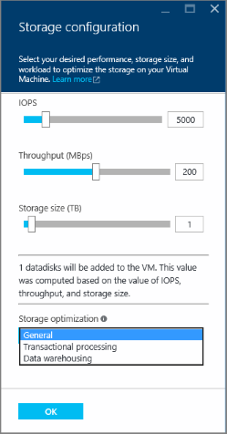
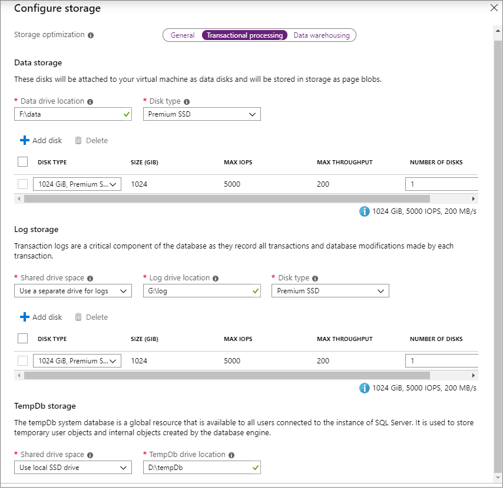
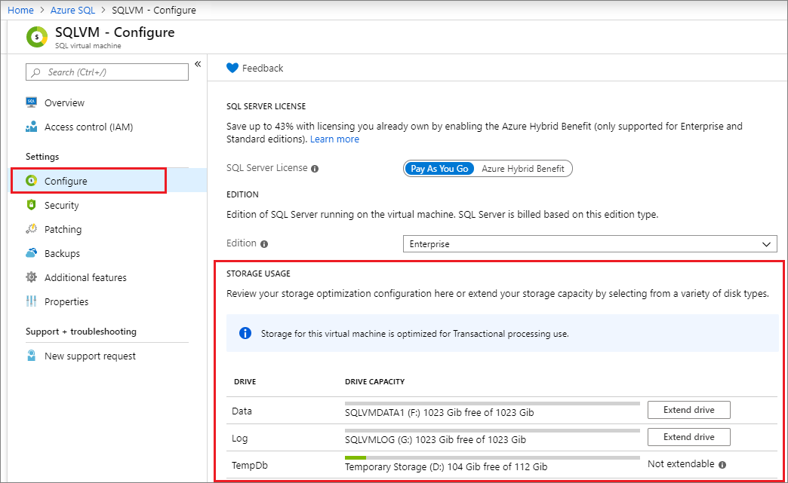

# Storage configuration for SQL Server VMs

When you configure a SQL Server virtual machine image in Azure, the Portal helps to automate your storage configuration. This includes attaching storage to the VM, making that storage accessible to SQL Server, and configuring it to optimize for your specific performance requirements.

This topic explains how Azure configures storage for your SQL Server VMs both during provisioning and for existing VMs. This configuration is based on the [performance best practices](virtual-machines-windows-sql-performance.md) for Azure VMs running SQL Server.

[!INCLUDE [learn-about-deployment-models](../../../../includes/learn-about-deployment-models-rm-include.md)]

## Prerequisites

To use the automated storage configuration settings, your virtual machine requires the following characteristics:

* Provisioned with a [SQL Server gallery image](virtual-machines-windows-sql-server-iaas-overview.md#payasyougo).
* Uses the [Resource Manager deployment model](../../../azure-resource-manager/management/deployment-models.md).
* Uses [premium SSDs](../disks-types.md).

## New VMs

The following sections describe how to configure storage for new SQL Server virtual machines.

### Azure portal

When provisioning an Azure VM using a SQL Server gallery image, select **Change configuration** on the **SQL Server Settings** tab to open the Performance Optimized Storage Configuration page. You can either leave the values at default, or modify the type of disk configuration that best suits your needs based on your workload. 

Select the type of workload you're deploying your SQL Server for under **Storage optimization**. With the **General** optimization option, by default you will have one data disk with 5000 max IOPS, and you will use this same drive for your data, transaction log, and TempDB storage. Selecting either **Transactional processing** (OLTP) or **Data warehousing** will create a separate disk for data, a separate disk for the transaction log, and use local SSD for TempDB. There are no storage differences between **Transactional processing** and **Data warehousing**, but it does change your [stripe configuration, and trace flags](#workload-optimization-settings). Choosing premium storage  sets the caching to *ReadOnly* for the data drive, and *None* for the log drive as per [SQL Server VM performance best practices](virtual-machines-windows-sql-performance.md). 

The disk configuration is completely customizable so that you can configure the storage topology, disk type and IOPs you need for your SQL Server VM workload. You also have the ability to use UltraSSD (preview) as an option for the **Disk type** if your SQL Server VM is in one of the supported regions (East US 2, SouthEast Asia and North Europe) and you've enabled [ultra disks for your subscription](/azure/virtual-machines/windows/disks-enable-ultra-ssd).  

Additionally, you have the ability to set the caching for the disks. Azure VMs have a multi-tier caching technology called [Blob Cache](/azure/virtual-machines/windows/premium-storage-performance#disk-caching) when used with [Premium Disks](/azure/virtual-machines/windows/disks-types#premium-ssd). Blob Cache uses a combination of the Virtual Machine RAM and local SSD for caching. 

Disk caching for Premium SSD can be *ReadOnly*, *ReadWrite* or *None*. 

- *ReadOnly* caching is highly beneficial for SQL Server data files that are stored on Premium Storage. *ReadOnly* caching brings low read latency, high read IOPS, and throughput as, reads are performed from cache, which os within the VM memory and local SSD. These reads are much faster than reads from data disk, which is from the Azure blob storage. Premium storage does not count the reads served from cache towards the disk IOPS and throughput. Therefore, your applicable is able to achieve higher total IOPS ant throughput. 
- *None* cache configuration should be used for the disks hosting SQL Server Log file as the log file is written sequentially and does not benefit from *ReadOnly* caching. 
- *ReadWrite* caching should not be used to host SQL Server files as SQL Server does not support data consistency with the *ReadWrite* cache. Writes waste capacity of the *ReadOnly* blob cache and latencies slightly increase if writes go through *ReadOnly* blob cache layers. 

   > [!TIP]
   > Be sure that your storage configuration matches the limitations imposed by the the selected VM size. Choosing storage parameters that exceed the performance cap of the VM size will result in error: `The desired performance might not be reached due to the maximum virtual machine disk performance cap.`. Either decrease the IOPs by changing the disk type, or increase the performance cap limitation by increasing the VM size. 

Based on your choices, Azure performs the following storage configuration tasks after creating the VM:

* Creates and attaches premium SSDs to the virtual machine.
* Configures the data disks to be accessible to SQL Server.
* Configures the data disks into a storage pool based on the specified size and performance (IOPS and throughput) requirements.
* Associates the storage pool with a new drive on the virtual machine.
* Optimizes this new drive based on your specified workload type (Data warehousing, Transactional processing, or General).

For further details on how Azure configures storage settings, see the [Storage configuration section](#storage-configuration). For a full walkthrough of how to create a SQL Server VM in the Azure portal, see [the provisioning tutorial](virtual-machines-windows-portal-sql-server-provision.md).

### Resource Manage templates

If you use the following Resource Manager templates, two premium data disks are attached by default, with no storage pool configuration. However, you can customize these templates to change the number of premium data disks that are attached to the virtual machine.

* [Create VM with Automated Backup](https://github.com/Azure/azure-quickstart-templates/tree/master/201-vm-sql-full-autobackup)
* [Create VM with Automated Patching](https://github.com/Azure/azure-quickstart-templates/tree/master/201-vm-sql-full-autopatching)
* [Create VM with AKV Integration](https://github.com/Azure/azure-quickstart-templates/tree/master/201-vm-sql-full-keyvault)

### Quickstart template

You can use the following quickstart template to deploy a SQL Server VM using storage optimization. 

* [Create VM with storage optimization](https://github.com/Azure/azure-quickstart-templates/tree/master/101-sql-vm-new-storage/)
* [Create VM using UltraSSD](https://github.com/Azure/azure-quickstart-templates/tree/master/101-sql-vm-new-storage-ultrassd)

## Existing VMs

[!INCLUDE [windows-virtual-machines-sql-use-new-management-blade](../../../../includes/windows-virtual-machines-sql-new-resource.md)]

For existing SQL Server VMs, you can modify some storage settings in the Azure portal. Open your [SQL virtual machines resource](virtual-machines-windows-sql-manage-portal.md#access-the-sql-virtual-machines-resource), and select **Overview**. The SQL Server Overview page shows the current storage usage of your VM. All drives that exist on your VM are displayed in this chart. For each drive, the storage space displays in four sections:

* SQL data
* SQL log
* Other (non-SQL storage)
* Available

To modify the storage settings, select **Configure** under **Settings**. 

You can modify the disk settings for the drives that were configured during the SQL Server VM creation process. Selecting **Extend drive** opens the drive modification page, allowing you to change the disk type, as well as add additional disks. 

## Storage configuration

This section provides a reference for the storage configuration changes that Azure automatically performs during SQL VM provisioning or configuration in the Azure portal.

* Azure configures a storage pool from storage selected from your VM. The next section of this topic provides details about storage pool configuration.
* Automatic storage configuration always uses [premium SSDs](../disks-types.md) P30 data disks. Consequently, there is a 1:1 mapping between your selected number of Terabytes and the number of data disks attached to your VM.

For pricing information, see the [Storage pricing](https://azure.microsoft.com/pricing/details/storage) page on the **Disk Storage** tab.

### Creation of the storage pool

Azure uses the following settings to create the storage pool on SQL Server VMs.

| Setting | Value |
| --- | --- |
| Stripe size |256 KB (Data warehousing); 64 KB (Transactional) |
| Disk sizes |1 TB each |
| Cache |Read |
| Allocation size |64 KB NTFS allocation unit size |
| Recovery | Simple recovery (no resiliency) |
| Number of columns |Number of data disks up to 81 |

1 After the storage pool is created, you cannot alter the number of columns in the storage pool.

## Workload optimization settings

The following table describes the three workload type options available and their corresponding optimizations:

| Workload type | Description | Optimizations |
| --- | --- | --- |
| **General** |Default setting that supports most workloads |None |
| **Transactional processing** |Optimizes the storage for traditional database OLTP workloads |Trace Flag 1117 Trace Flag 1118 |
| **Data warehousing** |Optimizes the storage for analytic and reporting workloads |Trace Flag 610 Trace Flag 1117 |

> [!NOTE]
> You can only specify the workload type when you provision a SQL virtual machine by selecting it in the storage configuration step.

## Next steps

For other topics related to running SQL Server in Azure VMs, see [SQL Server on Azure Virtual Machines](virtual-machines-windows-sql-server-iaas-overview.md).
