# Configure Always On availability group in Azure Virtual Machines (classic)
> [!div class="op_single_selector"]
> * [Classic: UI](../classic/portal-sql-alwayson-availability-groups.md)
> * [Classic: PowerShell](../classic/ps-sql-alwayson-availability-groups.md)
 

Before you begin, consider that you can now complete this task in Azure Resource Manager model. We recommend Azure Resource Manager model for new deployments. See [SQL Server Always On availability groups on Azure virtual machines](../sql/virtual-machines-windows-portal-sql-availability-group-overview.md).

> [!IMPORTANT] 
> Microsoft recommends that most new deployments use the Resource Manager model. Azure has two different deployment models to create and work with resources: [Resource Manager and classic](../../../azure-resource-manager/resource-manager-deployment-model.md). This article explains how to use the classic deployment model. 

To complete this task with the Azure Resource Manager model, see [SQL Server Always On availability groups on Azure virtual machines](../sql/virtual-machines-windows-portal-sql-availability-group-overview.md).

This end-to-end tutorial shows you how to implement availability groups by using SQL Server Always On running on Azure Virtual Machines.

At the end of the tutorial, your SQL Server Always On solution in Azure will consist of the following elements:

* A virtual network that contains multiple subnets and includes a frontend and a backend subnet
* A domain controller with an Active Directory (Azure AD) domain
* Two virtual machines that run SQL Server and are deployed to the backend subnet and joined to the Azure AD domain
* A three-node failover cluster with the Node Majority quorum model
* An availability group that has two synchronous-commit replicas of an availability database

The following illustration is a graphical representation of the solution.

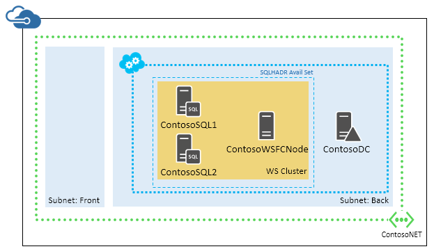

Note that this is one possible configuration. For example, you can minimize the number of virtual machines for a two-replica availability group. This configuration saves on compute hours in Azure by using the domain controller as the quorum file share witness in a two-node cluster. This method reduces the virtual machine count by one from the illustrated configuration.

This tutorial assumes the following:

* You already have an Azure account.
* You already know how to use the GUI in the virtual machine gallery to provision a classic virtual machine that runs SQL Server.
* You already have a solid understanding of Always On availability groups. For more information, see [Always On Availability Groups (SQL Server)](https://msdn.microsoft.com/library/hh510230.aspx).

> [!NOTE]
> If you are interested in using Always On availability groups with SharePoint, also see [Configure SQL Server 2012 Always On Availability Groups for SharePoint 2013](https://technet.microsoft.com/library/jj715261.aspx).
> 
> 

## Create the virtual network and domain controller server
You begin with a new Azure trial account. After you set up your account, you should be on the home screen of the Azure classic portal.

1. Click the **New** button at the left corner of the bottom of the page, as shown in the following screenshot.
   
    
2. Click **Network Services** > **Virtual Network** > **Custom Create**, as shown in the following screenshot.
   
    
3. In the **CREATE A VIRTUAL NETWORK** dialog box, create a new virtual network by stepping through the pages and using the settings in the following table. 
   
   | Page | Settings |
   | --- | --- |
   | Virtual Network Details |**NAME = ContosoNET** **REGION = West US** |
   | DNS Servers and VPN Connectivity |None |
   | Virtual Network Address Spaces |Settings are shown in the following screenshot:  |
4. Create the virtual machine that you will use as the domain controller (DC). Click **New** > **Compute** > **Virtual Machine** > **From Gallery**, as shown in the following screenshot.
   
    
5. In the **CREATE A VIRTUAL MACHINE** dialog box, configure a new virtual machine by stepping through the pages and using the settings in the following table. 
   
   | Page | Settings |
   | --- | --- |
   | Select the virtual machine operating system |Windows Server 2012 R2 Datacenter |
   | Virtual machine configuration |**VERSION RELEASE DATE** = (latest) **VIRTUAL MACHINE NAME** = ContosoDC **TIER** = STANDARD **SIZE** = A2 (2 cores) **NEW USER NAME** = AzureAdmin **NEW PASSWORD** = Contoso!000 **CONFIRM** = Contoso!000 |
   | Virtual machine configuration |**CLOUD SERVICE** = Create a new cloud service **CLOUD SERVICE DNS NAME** = A unique cloud service name **DNS NAME** = A unique name (ex: ContosoDC123) **REGION/AFFINITY GROUP/VIRTUAL NETWORK** = ContosoNET **VIRTUAL NETWORK SUBNETS** = Back(10.10.2.0/24) **STORAGE ACCOUNT** = Use an automatically generated storage account **AVAILABILITY SET** = (None) |
   | Virtual machine options |Use defaults |

After you configure the new virtual machine, wait for the virtual machine to be provsioned. This process takes some time to finish. If you click the **Virtual Machine** tab in the Azure classic portal, you can see ContosoDC cycling states from **Starting (Provisioning)** to **Stopped**, **Starting**, **Running (Provisioning)**, and finally **Running**.

The DC server is now successfully provisioned. Next, you will configure the Active Directory domain on this DC server.

## Configure the domain controller
In the following steps, you configure the ContosoDC machine as a domain controller for corp.contoso.com.

1. In the portal, select the **ContosoDC** machine. On the **Dashboard** tab, click **Connect** to open a remote desktop (RDP) file for remote desktop access.
   
    
2. Sign in with your configured administrator account (**\AzureAdmin**) and password (**Contoso!000**).
3. By default, the **Server Manager** dashboard should be displayed.
4. Click the **Add roles and features** link on the dashboard.
   
    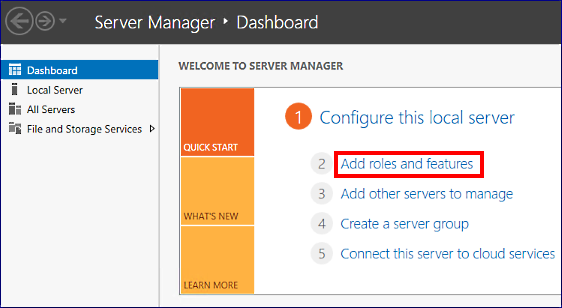
5. Click **Next** until you get to the **Server Roles** section.
6. Select the **Active Directory Domain Services** and **DNS Server** roles. When prompted, add more features that these roles require.
   
   > [!NOTE]
   > You will get a validation warning that there is no static IP address. If you are testing the configuration, click **Continue**. For production scenarios [use PowerShell to set the static IP address of the domain controller machine](../../../virtual-network/virtual-networks-reserved-private-ip.md).
   > 
   > 
   
    
7. Click **Next** until you reach the **Confirmation** section. Select the **Restart the destination server automatically if required** check box.
8. Click **Install**.
9. After the features are installed, return to the **Server Manager** dashboard.
10. Select the new **AD DS** option on the left pane.
11. Click the **More** link on the yellow warning bar.
    
     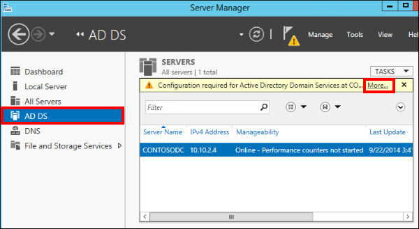
12. In the **Action** column of the **All Server Task Details** dialog box, click **Promote this server to a domain controller**.
13. In the **Active Directory Domain Services Configuration Wizard**, use the following values:
    
    | Page | Setting |
    | --- | --- |
    | Deployment Configuration |**Add a new forest** = Selected **Root domain name** = corp.contoso.com |
    | Domain Controller Options |**Password** = Contoso!000 **Confirm Password** = Contoso!000 |
14. Click **Next** to go through the other pages in the wizard. On the **Prerequisites Check** page, verify that you see the following message: **All prerequisite checks passed successfully**. Note that you should review all applicable warning messages, but it is possible to continue with the installation.
15. Click **Install**. The **ContosoDC** virtual machine will automatically reboot.

## Configure domain accounts
The next steps configure the Active Directory accounts for later use.

1. Sign back in to the **ContosoDC** machine.
2. In **Server Manager**, click **Tools** > **Active Directory Administrative Center**.
   
    
3. In the **Active Directory Administrative Center**, select **corp (local)** in the left pane.
4. On the right **Tasks** pane, click **New** > **User**. Use the following settings:
   
   | Setting | Value |
   | --- | --- |
   | **First Name** |Install |
   | **User SamAccountName** |Install |
   | **Password** |Contoso!000 |
   | **Confirm password** |Contoso!000 |
   | **Other password options** |Selected |
   | **Password never expires** |Checked |
5. Click **OK** to create the **Install** user. This account will be used to configure the failover cluster and the availability group.
6. Create two additional users, **CORP\SQLSvc1** and **CORP\SQLSvc2**, with the same steps. These accounts will be used for the SQL Server instances. Next, you need to give **CORP\Install** the necessary permissions to configure Windows failover clustering.
7. In the **Active Directory Administrative Center**, click **corp (local)** in the left pane. In the **Tasks** pane, click **Properties**.
   
    
8. Select **Extensions**, and then click the **Advanced** button on the **Security** tab.
9. In the **Advanced Security Settings for corp** dialog box, click **Add**.
10. Click **Select a principal**, search for **CORP\Install**, and then click **OK**.
11. Select the **Read all properties** and **Create Computer objects** permissions.
    
     
12. Click **OK**, and then click **OK** again. Close the corp properties window.

Now that you configured Active Directory and the user objects, you will create three SQL Server virtual machines and join them to this domain.

## Create the SQL Server virtual machines
Create three virtual machines. One is for a cluster node and two are for SQL Server. To create each of the virtual machines, go back to the Azure classic portal, click **New** > **Compute** > **Virtual Machine** > **From Gallery**. Then, use the templates in the following table to help you create the virtual machines.

| Page | VM1 | VM2 | VM3 |
| --- | --- | --- | --- |
| Select the virtual machine operating system |**Windows Server 2012 R2 Datacenter** |**SQL Server 2014 RTM Enterprise** |**SQL Server 2014 RTM Enterprise** |
| Virtual machine configuration |**VERSION RELEASE DATE** = (latest) **VIRTUAL MACHINE NAME** = ContosoWSFCNode **TIER** = STANDARD **SIZE** = A2 (2 cores) **NEW USER NAME** = AzureAdmin **NEW PASSWORD** = Contoso!000 **CONFIRM** = Contoso!000 |**VERSION RELEASE DATE** = (latest) **VIRTUAL MACHINE NAME** = ContosoSQL1 **TIER** = STANDARD **SIZE** = A3 (4 cores) **NEW USER NAME** = AzureAdmin **NEW PASSWORD** = Contoso!000 **CONFIRM** = Contoso!000 |**VERSION RELEASE DATE** = (latest) **VIRTUAL MACHINE NAME** = ContosoSQL2 **TIER** = STANDARD **SIZE** = A3 (4 cores) **NEW USER NAME** = AzureAdmin **NEW PASSWORD** = Contoso!000 **CONFIRM** = Contoso!000 |
| Virtual machine configuration |**CLOUD SERVICE** = Previously Created Unique Cloud Service DNS Name (ex: ContosoDC123) **REGION/AFFINITY GROUP/VIRTUAL NETWORK** = ContosoNET **VIRTUAL NETWORK SUBNETS** = Back(10.10.2.0/24) **STORAGE ACCOUNT** = Use an automatically generated storage account **AVAILABILITY SET** = Create an availability set **AVAILABILITY SET NAME** = SQLHADR |**CLOUD SERVICE** = Previously Created Unique Cloud Service DNS Name (ex: ContosoDC123) **REGION/AFFINITY GROUP/VIRTUAL NETWORK** = ContosoNET **VIRTUAL NETWORK SUBNETS** = Back(10.10.2.0/24) **STORAGE ACCOUNT** = Use an automatically generated storage account **AVAILABILITY SET** = SQLHADR (You can also configure the availability set after the machine has been created. All three machines should be assigned to the SQLHADR availability set.) |**CLOUD SERVICE** = Previously Created Unique Cloud Service DNS Name (ex: ContosoDC123) **REGION/AFFINITY GROUP/VIRTUAL NETWORK** = ContosoNET **VIRTUAL NETWORK SUBNETS** = Back(10.10.2.0/24) **STORAGE ACCOUNT** = Use an automatically generated storage account **AVAILABILITY SET** = SQLHADR (You can also configure the availability set after the machine has been created. All three machines should be assigned to the SQLHADR availability set.) |
| Virtual machine options |Use defaults |Use defaults |Use defaults |

 

> [!NOTE]
> The previous configuration suggests STANDARD tier virtual machines, because BASIC tier machines do not support load-balanced endpoints. You need load-balanced endpoints later to create an availability group listener. Also, the machine sizes that are suggested here are meant for testing availability groups in Azure Virtual Machines. For the best performance on production workloads, see the recommendations for SQL Server machine sizes and configuration in [Performance best practices for SQL Server in Azure Virtual Machines](../sql/virtual-machines-windows-sql-performance.md).
> 
> 

After the three virtual machines are fully provisioned, you need to join them to the **corp.contoso.com** domain and grant CORP\Install administrative rights to the machines. To do this, use the following steps for each of the three virtual machines.

1. First, change the preferred DNS server address. Download each virtual machine's RDP file to your local directory by selecting the virtual machine in the list and clicking the **Connect** button. To select a virtual machine, click anywhere but the first cell in the row, as shown in the following screenshot.
   
    
2. Open the RDP file that you downloaded, and sign in to the virtual machine by using your configured administrator account (**BUILTIN\AzureAdmin**) and password (**Contoso!000**).
3. After you sign in, you should see the **Server Manager** dashboard. Click **Local Server** in the left pane.
4. Click the **IPv4 address assigned by DHCP, IPv6 enabled** link.
5. In the **Network Connections** dialog box, click the network icon.
   
    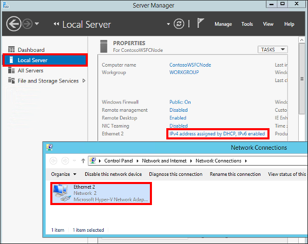
6. On the command bar, click **Change the settings of this connection**. (Depending on the size of your window, you might have to click the double right arrow to see this command).
7. Select **Internet Protocol Version 4 (TCP/IPv4)**, and then click **Properties**.
8. Select **Use the following DNS server addresses** and then specify **10.10.2.4** in **Preferred DNS server**.
9. The **10.10.2.4** address is the address that's assigned to a virtual machine in the 10.10.2.0/24 subnet in an Azure virtual network. That virtual machine is **ContosoDC**. To verify **ContosoDC**'s IP address, use **nslookup contosodc** in the command prompt window, as shown in the following screenshot.
   
    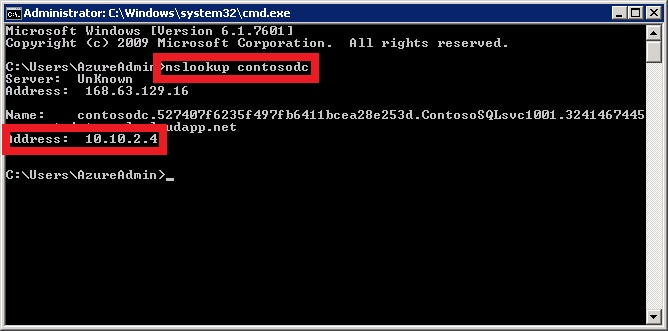
10. Click **OK** > **Close** to commit the changes. You can now join the virtual machine to **corp.contoso.com**.
11. Back in the **Local Server** window, click the **WORKGROUP** link.
12. In the **Computer Name** section, click **Change**.
13. Select the **Domain** check box, type **corp.contoso.com** in the text box, and then click **OK**.
14. In the **Windows Security** dialog box, specify the credentials for the default domain administrator account (**CORP\AzureAdmin**) and the password (**Contoso!000**).
15. When you see the "Welcome to the corp.contoso.com domain" message, click **OK**.
16. Click **Close** > **Restart Now** in the dialog box.

### Add the Corp\Install user as an administrator on each virtual machine
1. Wait until the virtual machine restarts, and then open the RDP file again to sign in to the virtual machine by using the **BUILTIN\AzureAdmin** account.
2. In **Server Manager** click **Tools** > **Computer Management**.
   
    
3. In the **Computer Management** dialog box, expand **Local Users and Groups**, and then click **Groups**.
4. Double-click the **Administrators** group.
5. In the **Administrators Properties** dialog box, click the **Add** button.
6. Enter the user **CORP\Install**, and then click **OK**. When prompted for credentials, use the **AzureAdmin** account with the **Contoso!000** password.
7. Click **OK** to close the **Administrator Properties** dialog box.

### Add the Failover Clustering feature to each virtual machine
1. In the **Server Manager** dashboard, click **Add roles and features**.
2. In the **Add Roles and Features Wizard**, click **Next** until you get to the **Features** page.
3. Select **Failover Clustering**. When prompted, add other dependent features.
   
    
4. Click **Next**, and then click **Install** on the **Confirmation** page.
5. When the **Failover Clustering** feature installation is finished, click **Close**.
6. Sign out of the virtual machine.
7. Repeat the steps in this section for all three servers: **ContosoWSFCNode**, **ContosoSQL1**, and **ContosoSQL2**.

The SQL Server virtual machines are now provisioned and running, but each has the default options for SQL Server.

## Create the failover cluster
In this section, you create the failover cluster that will host the availability group that you will create later. By now, you should have done the following to each of the three virtual machines that you will use in the failover cluster:

* Fully provisioned the virtual machine in Azure
* Joined the virtual machine to the domain
* Added **CORP\Install** to the local Administrators group
* Added the failover clustering feature

All these are prerequisites on each virtual machine before you can join it to the failover cluster.

Also, note that the Azure virtual network does not behave in the same way as an on-premises network. You need to create the cluster in the following order:

1. Create a single-node cluster on one node (**ContosoSQL1**).
2. Modify the cluster IP address to an unused IP address (**10.10.2.101**).
3. Bring the cluster name online.
4. Add the other nodes (**ContosoSQL2** and **ContosoWSFCNode**).

Use the following steps to complete the tasks that fully configure the cluster.

1. Open the RDP file for **ContosoSQL1**, and sign in by using the domain account **CORP\Install**.
2. In the **Server Manager** dashboard, click **Tools** > **Failover Cluster Manager**.
3. In the left pane, right-click **Failover Cluster Manager**, and then click **Create a Cluster**, as shown in the following screenshot.
   
    
4. In the Create Cluster Wizard, create a one-node cluster by stepping through the pages and using the settings in the following table:
   
   | Page | Settings |
   | --- | --- |
   | Before You Begin |Use defaults |
   | Select Servers |Type **ContosoSQL1** in **Enter server name** and click **Add** |
   | Validation Warning |Select **No. I do not require support from Microsoft for this cluster, and therefore do not want to run the validation tests. When I click Next, continue creating the cluster**. |
   | Access Point for Administering the Cluster |Type **Cluster1** in **Cluster Name** |
   | Confirmation |Use defaults unless you are using Storage Spaces. See the warning following this table. |
   
   > [!WARNING]
   > If you are using [Storage Spaces](https://technet.microsoft.com/library/hh831739), which groups multiple disks into storage pools, you must clear the **Add all eligible storage to the cluster** check box on the **Confirmation** page. If you do not clear this option, the virtual disks will be detached during the clustering process. As a result, they will also not appear in Disk Manager or Explorer until the storage spaces are removed from the cluster and reattached by using PowerShell.
   > 
   > 
5. In the left pane, expand **Failover Cluster Manager**, and then click **Cluster1.corp.contoso.com**.
6. In the center pane, scroll down to the **Cluster Core Resources** section, and expand the **Name: Clutser1** details. You should see both the **Name** and the **IP Address** resources in the **Failed** state. The IP address resource cannot be brought online because the cluster is assigned the same IP address as the machine itself, which is a duplicate address.
7. Right-click the failed **IP Address** resource, and then click **Properties**.
   
    
8. Select **Static IP Address**, specify **10.10.2.101** in the **Address** text box, and then click **OK**.
9. In the **Cluster Core Resources** section, right-click **Name: Cluster1**, and then click **Bring Online**. Wait until both resources are online. When the cluster name resource comes online, the DC server is updated with a new Active Directory computer account. This Active Directory account will be used to run the availability group clustered service later.
10. Add the remaining nodes to the cluster. In the browser tree, right-click **Cluster1.corp.contoso.com**, and then click **Add Node**, as shown in the following screenshot.
    
     
11. In the **Add Node Wizard**, click **Next** on the **Select Servers** page, add **ContosoSQL2** and **ContosoWSFCNode** to the list by typing the server name in **Enter server name** and then clicking **Add**. When you are done, click **Next**.
12. On the **Validation Warning** page, click **No**, although in a production scenario, you should perform the validation tests. Then, click **Next**.
13. On the **Confirmation** page, click **Next** to add the nodes.
    
    > [!WARNING]
    > If you are using [Storage Spaces](https://technet.microsoft.com/library/hh831739), which groups multiple disks into storage pools, you must clear the **Add all eligible storage to the cluster** check box. If you do not clear this option, the virtual disks will be detached during the clustering process. As a result, they will also not appear in Disk Manager or Explorer until the storage spaces are removed from cluster and reattached using PowerShell.
    > 
    > 
14. After the nodes are added to the cluster, click **Finish**. Failover Cluster Manager should now show that your cluster has three nodes and list them in the **Nodes** container.
15. Sign out of the remote desktop session.

## Prepare the SQL Server instances for availability groups
In this section, you will do the following on both **ContosoSQL1** and **contosoSQL2**:

* Add a login for **NT AUTHORITY\System** with necessary permissions set to the default SQL Server instance.
* Add **CORP\Install** as a sysadmin role to the default SQL Server instance.
* Open the firewall for remote access of SQL Server.
* Enable the Always On availability groups feature.
* Change the SQL Server service account to **CORP\SQLSvc1** and **CORP\SQLSvc2**, respectively.

These actions can be performed in any order. Nevertheless, the following steps will walk through them in order. Follow the steps for both **ContosoSQL1** and **ContosoSQL2**:

1. If you have not signed out of the remote desktop session for the virtual machine, do so now.
2. Open the RDP files for **ContosoSQL1** and **ContosoSQL2**, and sign in as **BUILTIN\AzureAdmin**.
3. Add **NT AUTHORITY\System** to the SQL Server logins with necessary permissions. Open **SQL Server Management Studio**.
4. Click **Connect** to connect to the default SQL Server instance.
5. In **Object Explorer**, expand **Security**, and then expand **Logins**.
6. Right-click the **NT AUTHORITY\System** login, and then click **Properties**.
7. On the **Securables** page, for the local server, select **Grant** for the following permissions, and then click **OK**.
   
   * Alter any availability group
   * Connect SQL
   * View server state
8. Add **CORP\Install** as a **sysadmin** role to the default SQL Server instance. In **Object Explorer**, right-click **Logins**, and then click **New Login**.
9. Type **CORP\Install** in **Login name**.
10. On the **Server Roles** page, select **sysadmin**, and then click **OK**. After you create the login, you can see it by expanding **Logins** in **Object Explorer**.
11. To create a firewall rule for SQL Server, on the **Start** screen, open **Windows Firewall with Advanced Security**.
12. In the left pane, select **Inbound Rules**. In the right pane, click **New Rule**.
13. On the **Rule Type** page, click **Program** > **Next**.
14. On the **Program** page, select **This program path**, type **%ProgramFiles%\Microsoft SQL Server\MSSQL12.MSSQLSERVER\MSSQL\Binn\sqlservr.exe** in the text box, and then click **Next**. If you are following these directions but using SQL Server 2012, the SQL Server directory is **MSSQL11.MSSQLSERVER**.
15. On the **Action** page, keep **Allow the connection** selected, and then click **Next**.
16. On the **Profile** page, accept the default settings, and then click **Next**.
17. On the **Name** page, specify a rule name, such as **SQL Server (Program Rule)**, in the **Name** text box, then click **Finish**.
18. To enable the **Always On Availability Groups** feature, on the **Start** screen, open **SQL Server Configuration Manager**.
19. In the browser tree, click **SQL Server Services**, right-click the **SQL Server (MSSQLSERVER)** service, and then click **Properties**.
20. Click the **Always On High Availability** tab, select **Enable Always On Availability Groups**, as shown in the following screenshot, and then click **Apply**. Click **OK** in the dialog box, and do not close the **Properties** dialog box yet. You will restart the SQL Server service after you change the service account.
    
     
21. To change the SQL Server service account, click the **Log On** tab, type **CORP\SQLSvc1** (for **ContosoSQL1**) or **CORP\SQLSvc2** (for **ContosoSQL2**) in **Account Name**, fill in and confirm the password, and then click **OK**.
22. In the dialog box that opens, click **Yes** to restart the SQL Server service. After the SQL Server service restarts, changes that you made in the **Properties** dialog box are effective.
23. Sign out of the virtual machines.

## Create the availability group
You are now ready to configure an availability group. Below is an outline of what you will do:

* Create a new database (**MyDB1**) on **ContosoSQL1**.
* Take both a full backup and a transaction log backup of the database.
* Restore the full and log backups to **ContosoSQL2** with the **NORECOVERY** option.
* Create the availability group (**AG1**) with synchronous commit, automatic failover, and readable secondary replicas.

### Create the MyDB1 database on ContosoSQL1
1. If you have not already signed out of the remote desktop sessions for **ContosoSQL1** and **ContosoSQL2**, do so now.
2. Open the RDP file for **ContosoSQL1**, and sign in as **CORP\Install**.
3. In **File Explorer**, under **C:\\**, create a directory named **backup**. You will use this directory to back up and restore your database.
4. Right-click the new directory, point to **Share with**, and then click **Specific people**, as shown in the following screenshot.
   
    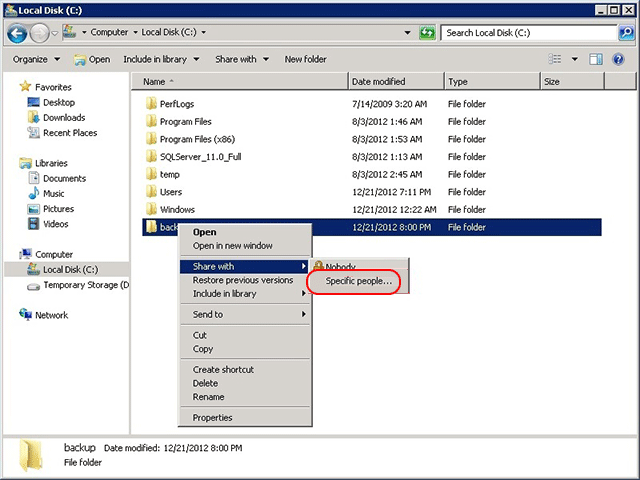
5. Add **CORP\SQLSvc1**, and then give it the **Read/Write** permission. Add **CORP\SQLSvc2**, and then give it the **Read** permission, as shown in the following screenshot, and then click **Share**. After the file-sharing process is finished, click **Done**.
   
    
6. To create the database, from the **Start** menu, open **SQL Server Management Studio**, and then click **Connect** to connect to the default SQL Server instance.
7. In **Object Explorer**, right-click **Databases**, and then click **New Database**.
8. In **Database name**, type **MyDB1**, and then click **OK**.

### Make a full backup of MyDB1 and restore it on ContosoSQL2
1. To make a full backup of the database, in **Object Explorer**, expand **Databases**, right-click **MyDB1**, point to **Tasks**, and then click **Back Up**.
2. In the **Source** section, keep **Backup type** set to **Full**. In the **Destination** section, click **Remove** to remove the default file path for the backup file.
3. In the **Destination** section, click **Add**.
4. In the **File name** text box, type **\\ContosoSQL1\backup\MyDB1.bak**, click **OK**, and then click **OK** again to back up the database. When the backup operation finishes, click **OK** again to close the dialog box.
5. To make a transaction log backup of the database, in **Object Explorer**, expand **Databases**, right-click **MyDB1**, point to **Tasks**, and then click **Back Up**.
6. In **Backup type**, select **Transaction Log**. Keep the **Destination** file path set to the one you specified earlier, and then click **OK**. After the backup operation finishes, click **OK** again.
7. To restore the full and transaction log backups on **ContosoSQL2**, open the RDP file for **ContosoSQL2**, and sign in as **CORP\Install**. Leave the remote desktop session for **ContosoSQL1** open.
8. From the **Start** menu, open **SQL Server Management Studio**, and then click **Connect** to connect to the default SQL Server instance.
9. In **Object Explorer**, right-click **Databases**, and then click **Restore Database**.
10. In the **Source** section, select **Device**, and click the ellipsis **…** button.
11. In **Select backup devices**, click **Add**.
12. In **Backup file location**, type **\\ContosoSQL1\backup**, click **Refresh**, select **MyDB1.bak**, click **OK**, and then click **OK** again. You should now see the full backup and the log backup in the **Backup sets to restore** pane.
13. Go to the **Options** page, select **RESTORE WITH NORECOVERY** in **Recovery state**, and then click **OK** to restore the database. After the restore operation finishes, click **OK**.

### Create the availability group
1. Go back to the remote desktop session for **ContosoSQL1**. In **Object Explorer** in SQL Server Management Studio, right-click **Always On High Availability**, and then click **New Availability Group Wizard**, as shown in the following screenshot.
   
    
2. On the **Introduction** page, click **Next**. On the **Specify Availability Group Name** page, type **AG1** in **Availability group name**, then click **Next** again.
   
    
3. On the **Select Databases** page, select **MyDB1**, and then click **Next**. The database meets the prerequisites for an availability group because you have taken at least one full backup on the intended primary replica.
   
    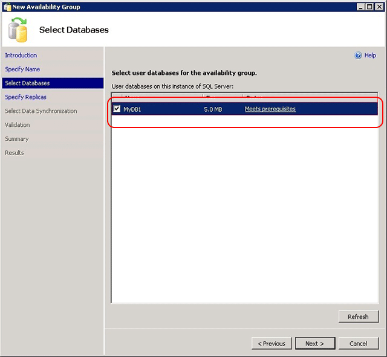
4. on the **Specify Replicas** page, click **Add Replica**.
   
    
5. In the **Connect to Server** dialog box, type **ContosoSQL2** in **Server name**, and then click **Connect**.
   
    
6. Back on the **Specify Replicas** page, you should now see **ContosoSQL2** listed in **Available Replicas**. Configure the replicas as shown in the following screenshot. When you are finished, click **Next**.
   
    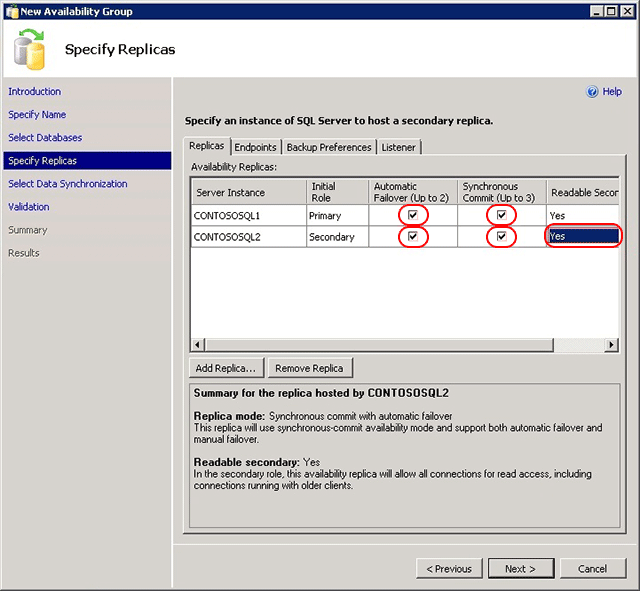
7. On the **Select Initial Data Synchronization** page, select **Join only**, and then click **Next**. You already performed data synchronization manually when you made the full and transaction backups on **ContosoSQL1** and restored them on **ContosoSQL2**. You can choose not to perform the backup and restore operations on your database and instead select **Full** to let the New Availability Group Wizard perform data synchronization for you. However, we do not recommend this option for very large databases that are found in some enterprises.
   
    
8. On the **Validation** page, click **Next**. This page should look similar to the following screenshot. There is a warning for the listener configuration because you have not configured an availability group listener. You can ignore this warning, because this tutorial does not configure a listener. To configure the listener after you complete this tutorial, see [Configure an ILB listener for Always On Availability Groups in Azure](../classic/ps-sql-int-listener.md).
   
    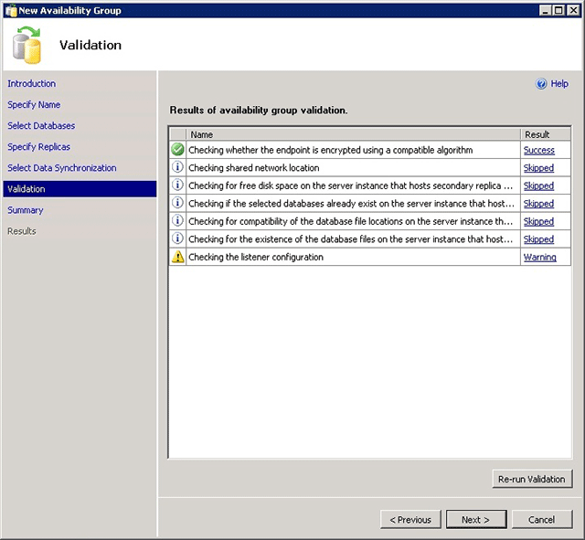
9. On the **Summary** page, click **Finish**, and then wait while the wizard configures the new availability group. On the **Progress** page, you can click **More details** to view the detailed progress. After the wizard finishes, inspect the **Results** page to verify that the availability group is successfully created, as shown in the following screenshot, and then click **Close** to exit the wizard.
   
    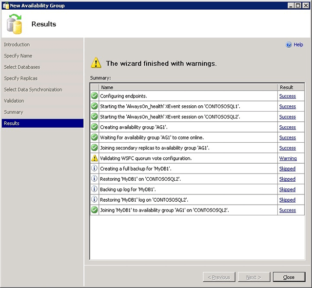
10. In **Object Explorer**, expand **Always On High Availability**, and then expand **Availability Groups**. You should now see the new availability group in this container. Right-click **AG1 (Primary)**, and then click **Show Dashboard**.
    
     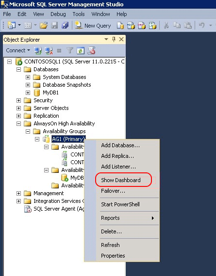
11. Your **Always On Dashboard** should look similar to the one in the following screenshot. You can see the replicas, the failover mode of each replica, and the synchronization state.
    
     
12. Return to **Server Manager**, click **Tools**, and then open **Failover Cluster Manager**.
13. Expand **Cluster1.corp.contoso.com**, and then expand **Services and applications**. Select **Roles** and note that the **AG1** availability group role has been created. Note that AG1 does not have an IP address by which database clients can connect to the availability group, because you did not configure a listener. You can connect directly to the primary node for read-write operations and the secondary node for read-only queries.
    
     

> [!WARNING]
> Do not try to fail over the availability group from the Failover Cluster Manager. All failover operations should be performed from within **Always On Dashboard** in SQL Server Management Studio. For more information, see [Restrictions on Using The Failover Cluster Manager with Availability Groups](https://msdn.microsoft.com/library/ff929171.aspx).
> 
> 

## Next steps
You have now successfully implemented SQL Server Always On by creating an availability group in Azure. To configure a listener for this availability group, see [Configure an ILB listener for Always On availability groups in Azure](../classic/ps-sql-int-listener.md).

For other information about using SQL Server in Azure, see [SQL Server on Azure Virtual Machines](../sql/virtual-machines-windows-sql-server-iaas-overview.md).

