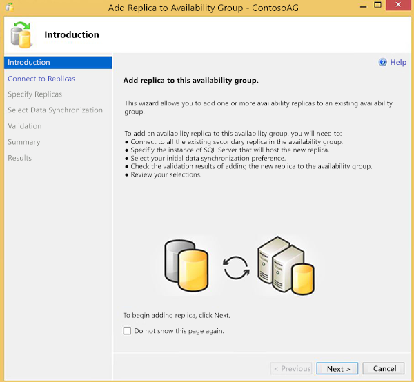
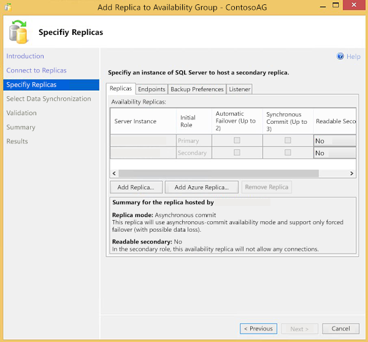
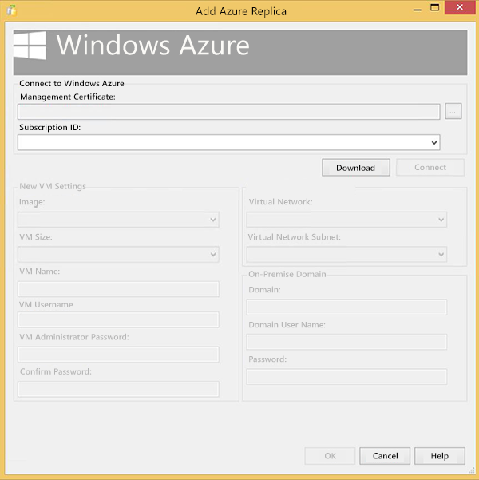
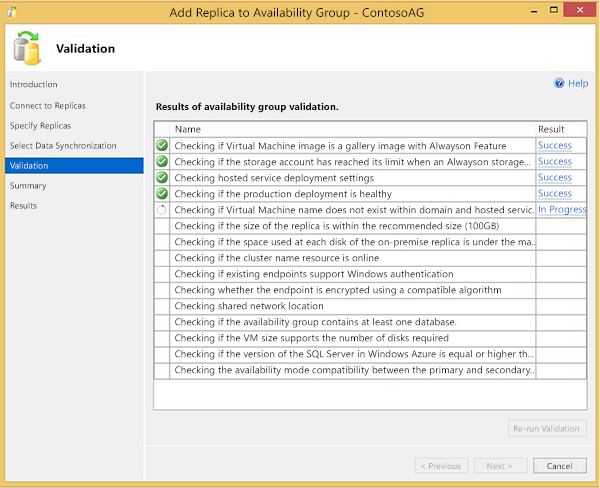

# Extend on-premises Always On Availability Groups to Azure
Always On Availability Groups provide high availability for groups of database by adding secondary replicas. These replicas allow failing over databases in case of a failure. In addition they can be used to offload read workloads or backup tasks.

You can extend on-premises Availability Groups to Microsoft Azure by provisioning one or more Azure VMs with SQL Server and then adding them as replicas to your on-premises Availability Groups.

This tutorial assumes you have the following:

* An active Azure subscription. You can [sign up for a free trial](https://azure.microsoft.com/pricing/free-trial/).
* An existing Always On Availability Group on-premises. For more information on Availability Groups, see [Always On Availability Groups](https://msdn.microsoft.com/library/hh510230.aspx).
* Connectivity between the on-premises network and your Azure virtual network. For more information about creating this virtual network, see [Create a Site-to-Site connection using the Azure portal (classic)](../../../vpn-gateway/vpn-gateway-howto-site-to-site-classic-portal.md).

> [!IMPORTANT] 
> Azure has two different deployment models for creating and working with resources: [Resource Manager and Classic](../../../azure-resource-manager/management/deployment-models.md). This article covers using the Classic deployment model. Microsoft recommends that most new deployments use the Resource Manager model.

## Add Azure Replica Wizard
This section shows you how to use the **Add Azure Replica Wizard** to extend your Always On Availability Group solution to include Azure replicas.

> [!IMPORTANT]
> The **Add Azure Replica Wizard** only supports virtual machines created with the Classic deployment model. New VM deployments should use the newer Resource Manager model. If you are using VMs with Resource Manager, then you must manually add the secondary Azure replica using Transact-SQL commands (not shown here). This wizard will not work in the Resource Manager scenario.

1. From within SQL Server Management Studio, expand **Always On High Availability** > **Availability Groups** > **[Name of your Availability Group]**.
2. Right-click **Availability Replicas**, then click **Add Replica**.
3. By default, the **Add Replica to Availability Group Wizard** is displayed. Click **Next**.  If you have selected the **Do not show this page again** option at the bottom of the page during a previous launch of this wizard, this screen will not be displayed.
   
    
4. You will be required to connect to all existing secondary replicas. You can click on **Connect…** beside each replica or you can click **Connect All…** at the bottom of the screen. After authentication, click **Next** to advance to the next screen.
5. On the **Specify Replicas** page, multiple tabs are listed across the top: **Replicas**, **Endpoints**, **Backup Preferences**, and **Listener**. From the **Replicas** tab, click **Add Azure Replica…** to launch the Add Azure Replica Wizard.
   
    
6. Select an existing Azure Management Certificate from the local Windows certificate store if you have installed one before. Select or enter the id of an Azure subscription if you have used one before. You can click Download to download and install an Azure Management Certificate and download the list of subscriptions using an Azure account.
   
    
7. You will populate each field on the page with values that will be used to create the Azure Virtual Machine (VM) that will host the replica.
   
   | Setting | Description |
   | --- | --- |
   | **Image** |Select the desired combination of OS and SQL Server |
   | **VM Size** |Select the size of VM that best suits your business needs |
   | **VM Name** |Specify a unique name for the new VM. The name must contain between 3 and 15 characters, can contain only letters, numbers, and hyphens, and must start with a letter and end with either a letter or number. |
   | **VM Username** |Specify a user name that will become the administrator account on the VM |
   | **VM Administrator Password** |Specify a password for the new account |
   | **Confirm Password** |Confirm the password of the new account |
   | **Virtual Network** |Specify the Azure virtual network that the new VM should use. For more information on virtual networks, see [Virtual Network Overview](../../../virtual-network/virtual-networks-overview.md). |
   | **Virtual Network Subnet** |Specify the virtual network subnet that the new VM should use |
   | **Domain** |Confirm the pre-populated value for the domain is correct |
   | **Domain User Name** |Specify an account that is in the local administrators group on the local cluster nodes |
   | **Password** |Specify the password for the domain user name |
8. Click **OK** to validate the deployment settings.
9. Legal terms are displayed next. Read and click **OK** if you agree to these terms.
10. The **Specify Replicas** page is displayed again. Verify the settings for the new Azure replica on the **Replicas**, **Endpoints**, and **Backup Preferences** tabs. Modify settings to meet your business requirements.  For more information on the parameters contained on these tabs, see [Specify Replicas Page (New Availability Group Wizard/Add Replica Wizard)](https://msdn.microsoft.com/library/hh213088.aspx).Note that listeners cannot be created using the Listener tab for Availability Groups that contain Azure replicas. In addition, if a listener has already been created prior to launching the Wizard, you will receive a message indicating that it is not supported in Azure. We will look at how to create listeners in the **Create an Availability Group Listener** section.
    
     
11. Click **Next**.
12. Select the data synchronization method you want to use on the **Select Initial Data Synchronization** page and click **Next**. For most scenarios, select **Full Data Synchronization**. For more information on data synchronization methods, see [Select Initial Data Synchronization Page (Always On Availability Group Wizards)](https://msdn.microsoft.com/library/hh231021.aspx).
13. Review the results on the **Validation** page. Correct outstanding issues and re-run the validation if necessary. Click **Next**.
    
     
14. Review the settings on the **Summary** page, then click **Finish**.
15. The provisioning process begins. When the wizard completes successfully, click **Close** to exit out of the wizard.

> [!NOTE]
> The Add Azure Replica Wizard creates a log file in Users\User Name\AppData\Local\SQL Server\AddReplicaWizard. This log file can be used to troubleshoot failed Azure replica deployments. If the Wizard fails executing any action, all previous operations are rolled back, including deleting the provisioned VM.
> 
> 

## Create an availability group listener
After the availability group has been created, you should create a listener for clients to connect to the replicas. Listeners direct incoming connections to either the primary or a read-only secondary replica. For more information on listeners, see [Configure an ILB listener for Always On Availability Groups in Azure](../classic/ps-sql-int-listener.md).

## Next steps
In addition to using the **Add Azure Replica Wizard** to extend your Always On Availability Group to Azure, you might also move some SQL Server workloads completely to Azure. To get started, see [Provisioning a SQL Server Virtual Machine on Azure](../../../azure-sql/virtual-machines/windows/create-sql-vm-portal.md).

For other topics related to running SQL Server in Azure VMs, see [SQL Server on Azure Virtual Machines](../../../azure-sql/virtual-machines/windows/sql-server-on-azure-vm-iaas-what-is-overview.md).

