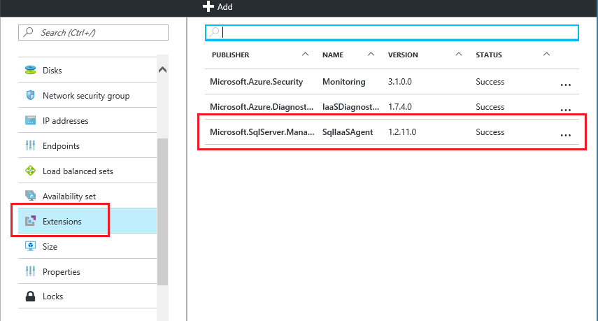

# Automate management tasks on Azure Virtual Machines with the SQL Server Agent Extension (Classic)
> [!div class="op_single_selector"]
> * [Resource Manager](../sql/virtual-machines-windows-sql-server-agent-extension.md)
> * [Classic](../classic/sql-server-agent-extension.md)
> 
>
 
The SQL Server IaaS Agent Extension (SQLIaaSAgent) runs on Azure virtual machines to automate administration tasks. This topic provides an overview of the services supported by the extension as well as instructions for installation, status, and removal.

> [!IMPORTANT] 
> Azure has two different deployment models for creating and working with resources: [Resource Manager and Classic](../../../azure-resource-manager/resource-manager-deployment-model.md). This article covers using the Classic deployment model. Microsoft recommends that most new deployments use the Resource Manager model. To view the Resource Manager version of this article, see [SQL Server Agent Extension for SQL Server VMs Resource Manager](../sql/virtual-machines-windows-sql-server-agent-extension.md).

## Supported services
The SQL Server IaaS Agent Extension supports the following administration tasks:

| Administration feature | Description |
| --- | --- |
| **SQL Automated Backup** |Automates the scheduling of backups for all databases for the default instance of SQL Server in the VM. For more information, see [Automated backup for SQL Server in Azure Virtual Machines (Classic)](../classic/sql-automated-backup.md). |
| **SQL Automated Patching** |Configures a maintenance window during which important Windows updates to your VM can take place, so  you can avoid updates during peak times for your workload. For more information, see [Automated patching for SQL Server in Azure Virtual Machines (Classic)](../classic/sql-automated-patching.md). |
| **Azure Key Vault Integration** |Enables you to automatically install and configure Azure Key Vault on your SQL Server VM. For more information, see [Configure Azure Key Vault Integration for SQL Server on Azure VMs (Classic)](../classic/ps-sql-keyvault.md). |

## Prerequisites
Requirements to use the SQL Server IaaS Agent Extension on your VM:

### Operating System:
* Windows Server 2012
* Windows Server 2012 R2
* Windows Server 2016

### SQL Server versions:
* SQL Server 2012
* SQL Server 2014
* SQL Server 2016

### Azure PowerShell:
[Download and configure the latest Azure PowerShell commands](/powershell/azure/overview).

Start Windows PowerShell, and connect it to your Azure subscription with the **Add-AzureAccount** command.

    Add-AzureAccount

If you have multiple subscriptions, use **Select-AzureSubscription** to select the subscription that contains your target classic VM.

    Select-AzureSubscription -SubscriptionName <subscriptionname>

At this point, you can get a list of the classic virtual machines and their associated service names with the **Get-AzureVM** command.

    Get-AzureVM

## Installation
For classic VMs, you must use PowerShell to install the SQL Server IaaS Agent Extension and configure its associated services. Use the **Set-AzureVMSqlServerExtension** PowerShell cmdlet to install the extension. For example, the following command installs the extension on a Windows Server VM (classic) and names it "SQLIaaSExtension".

    Get-AzureVM -ServiceName <vmservicename> -Name <vmname> | Set-AzureVMSqlServerExtension -ReferenceName "SQLIaasExtension" -Version "1.2" | Update-AzureVM

If you update to the latest version of the SQL IaaS Agent Extension, you must restart your virtual machine after updating the extension.

> [!NOTE]
> Classic virtual machines do not have an option to install and configure the SQL IaaS Agent Extension through the portal.

> [!NOTE]
> The SQL Server IaaS Agent Extension is only supported on [SQL Server VM gallery images](../sql/virtual-machines-windows-sql-server-iaas-overview.md#get-started-with-sql-vms) (pay-as-you-go or bring-your-own-license). It is not supported if you manually install SQL Server on an OS-only Windows Server virtual machine or if you deploy a customized SQL Server VM VHD. In these cases, it might be possible to install and manage the extension manually by using PowerShell, but it is strongly recommended to instead install a SQL Server VM gallery image and then customize it.

## Status
One way to verify that the extension is installed is to view the agent status in the Azure Portal. Select a virtual machine listed in the virtual machine blade, and then click on **Extensions**. You should see the **SQLIaaSAgent** extension listed.

You can also use the **Get-AzureVMSqlServerExtension** Azure Powershell cmdlet.

    Get-AzureVM –ServiceName "service" –Name "vmname" | Get-AzureVMSqlServerExtension

## Removal
In the Azure Portal, you can uninstall the extension by clicking the ellipsis on the **Extensions** blade of your virtual machine properties. Then click **Uninstall**.

You can also use the **Remove-AzureVMSqlServerExtension** Powershell cmdlet.

    Get-AzureVM –ServiceName "service" –Name "vmname" | Remove-AzureVMSqlServerExtension | Update-AzureVM

## Next Steps
Begin using one of the services supported by the extension. For more details, see the topics referenced in the [Supported services](#supported-services) section of this article.

For more information about running SQL Server on Azure Virtual Machines, see [SQL Server on Azure Virtual Machines overview](../sql/virtual-machines-windows-sql-server-iaas-overview.md).

