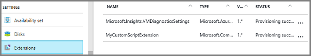
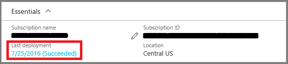

# Virtual machines in an Azure Resource Manager template

**Applies to:** :heavy_check_mark: Windows VMs

This article describes aspects of an Azure Resource Manager template that apply to virtual machines. This article doesn't describe a complete template for creating a virtual machine; for that you need resource definitions for storage accounts, network interfaces, public IP addresses, and virtual networks. For more information about how these resources can be defined together, see the [Resource Manager template walkthrough](../../azure-resource-manager/templates/quickstart-create-templates-use-the-portal.md).

There are many [templates in the gallery](https://azure.microsoft.com/resources/templates/?term=VM) that include the VM resource. Not all elements that can be included in a template are described here.

This example shows a typical resource section of a template for creating a specified number of VMs:

```json
"resources": [
  {
    "apiVersion": "2016-04-30-preview",
    "type": "Microsoft.Compute/virtualMachines",
    "name": "[concat('myVM', copyindex())]",
    "location": "[resourceGroup().location]",
    "copy": {
      "name": "virtualMachineLoop",
      "count": "[parameters('numberOfInstances')]"
    },
    "dependsOn": [
      "[concat('Microsoft.Network/networkInterfaces/myNIC', copyindex())]"
    ],
    "properties": {
      "hardwareProfile": {
        "vmSize": "Standard_DS1"
      },
      "osProfile": {
        "computername": "[concat('myVM', copyindex())]",
        "adminUsername": "[parameters('adminUsername')]",
        "adminPassword": "[parameters('adminPassword')]"
      },
      "storageProfile": {
        "imageReference": {
          "publisher": "MicrosoftWindowsServer",
          "offer": "WindowsServer",
          "sku": "2012-R2-Datacenter",
          "version": "latest"
        },
        "osDisk": {
          "name": "[concat('myOSDisk', copyindex())]",
          "caching": "ReadWrite",
          "createOption": "FromImage"
        },
        "dataDisks": [
          {
            "name": "[concat('myDataDisk', copyindex())]",
            "diskSizeGB": "100",
            "lun": 0,
            "createOption": "Empty"
          }
        ]
      },
      "networkProfile": {
        "networkInterfaces": [
          {
            "id": "[resourceId('Microsoft.Network/networkInterfaces',
              concat('myNIC', copyindex()))]"
          }
        ]
      },
      "diagnosticsProfile": {
        "bootDiagnostics": {
          "enabled": "true",
          "storageUri": "[concat('https://', variables('storageName'), '.blob.core.windows.net')]"
        }
      }
    },
    "resources": [
      {
        "name": "Microsoft.Insights.VMDiagnosticsSettings",
        "type": "extensions",
        "location": "[resourceGroup().location]",
        "apiVersion": "2016-03-30",
        "dependsOn": [
          "[concat('Microsoft.Compute/virtualMachines/myVM', copyindex())]"
        ],
        "properties": {
          "publisher": "Microsoft.Azure.Diagnostics",
          "type": "IaaSDiagnostics",
          "typeHandlerVersion": "1.5",
          "autoUpgradeMinorVersion": true,
          "settings": {
            "xmlCfg": "[base64(concat(variables('wadcfgxstart'),
            variables('wadmetricsresourceid'),
            concat('myVM', copyindex()),
            variables('wadcfgxend')))]",
            "storageAccount": "[variables('storageName')]"
          },
          "protectedSettings": {
            "storageAccountName": "[variables('storageName')]",
            "storageAccountKey": "[listkeys(variables('accountid'),
              '2015-06-15').key1]",
            "storageAccountEndPoint": "https://core.windows.net"
          }
        }
      },
      {
        "name": "MyCustomScriptExtension",
        "type": "extensions",
        "apiVersion": "2016-03-30",
        "location": "[resourceGroup().location]",
        "dependsOn": [
          "[concat('Microsoft.Compute/virtualMachines/myVM', copyindex())]"
        ],
        "properties": {
          "publisher": "Microsoft.Compute",
          "type": "CustomScriptExtension",
          "typeHandlerVersion": "1.7",
          "autoUpgradeMinorVersion": true,
          "settings": {
            "fileUris": [
              "[concat('https://', variables('storageName'),
                '.blob.core.windows.net/customscripts/start.ps1')]"
            ],
            "commandToExecute": "powershell.exe -ExecutionPolicy Unrestricted -File start.ps1"
          }
        }
      }
    ]
  }
]
```

> [!NOTE]
>This example relies on a storage account that was previously created. You could create the storage account by deploying it from the template. The example also relies on a network interface and its dependent resources that would be defined in the template. These resources are not shown in the example.
>
>

## API Version

When you deploy resources using a template, you have to specify a version of the API to use. The example shows the virtual machine resource using this apiVersion element:

```json
"apiVersion": "2016-04-30-preview",
```

The version of the API you specify in your template affects which properties you can define in the template. In general, you should select the most recent API version when creating templates. For existing templates, you can decide whether you want to continue using an earlier API version, or update your template for the latest version to take advantage of new features.

Use these opportunities for getting the latest API versions:

- REST API - [List all resource providers](/rest/api/resources/providers)
- PowerShell - [Get-AzResourceProvider](/powershell/module/az.resources/get-azresourceprovider)
- Azure CLI - [az provider show](/cli/azure/provider)

## Parameters and variables

[Parameters](../../azure-resource-manager/templates/syntax.md) make it easy for you to specify values for the template when you run it. This parameters section is used in the example:

```json
"parameters": {
  "adminUsername": { "type": "string" },
  "adminPassword": { "type": "securestring" },
  "numberOfInstances": { "type": "int" }
},
```

When you deploy the example template, you enter values for the name and password of the administrator account on each VM and the number of VMs to create. You have the option of specifying parameter values in a separate file that's managed with the template, or providing values when prompted.

[Variables](../../azure-resource-manager/templates/syntax.md) make it easy for you to set up values in the template that are used repeatedly throughout it or that can change over time. This variables section is used in the example:

```json
"variables": {
  "storageName": "mystore1",
  "accountid": "[concat('/subscriptions/', subscription().subscriptionId,
    '/resourceGroups/', resourceGroup().name,
  '/providers/','Microsoft.Storage/storageAccounts/', variables('storageName'))]",
  "wadlogs": "<WadCfg>
    <DiagnosticMonitorConfiguration overallQuotaInMB=\"4096\" xmlns=\"http://schemas.microsoft.com/ServiceHosting/2010/10/DiagnosticsConfiguration\">
      <DiagnosticInfrastructureLogs scheduledTransferLogLevelFilter=\"Error\"/>
      <WindowsEventLog scheduledTransferPeriod=\"PT1M\" >
        <DataSource name=\"Application!*[System[(Level = 1 or Level = 2)]]\" />
        <DataSource name=\"Security!*[System[(Level = 1 or Level = 2)]]\" />
        <DataSource name=\"System!*[System[(Level = 1 or Level = 2)]]\" />
      </WindowsEventLog>",
  "wadperfcounters": "<PerformanceCounters scheduledTransferPeriod=\"PT1M\">
      <PerformanceCounterConfiguration counterSpecifier=\"\\Process(_Total)\\Thread Count\" sampleRate=\"PT15S\" unit=\"Count\">
        <annotation displayName=\"Threads\" locale=\"en-us\"/>
      </PerformanceCounterConfiguration>
    </PerformanceCounters>",
  "wadcfgxstart": "[concat(variables('wadlogs'), variables('wadperfcounters'),
    '<Metrics resourceId=\"')]",
  "wadmetricsresourceid": "[concat('/subscriptions/', subscription().subscriptionId,
    '/resourceGroups/', resourceGroup().name ,
    '/providers/', 'Microsoft.Compute/virtualMachines/')]",
  "wadcfgxend": "\"><MetricAggregation scheduledTransferPeriod=\"PT1H\"/>
    <MetricAggregation scheduledTransferPeriod=\"PT1M\"/>
    </Metrics></DiagnosticMonitorConfiguration>
    </WadCfg>"
},
```

When you deploy the example template, variable values are used for the name and identifier of the previously created storage account. Variables are also used to provide the settings for the diagnostic extension. Use the [best practices for creating Azure Resource Manager templates](../../azure-resource-manager/templates/best-practices.md) to help you decide how you want to structure the parameters and variables in your template.

## Resource loops

When you need more than one virtual machine for your application, you can use a copy element in a template. This optional element loops through creating the number of VMs that you specified as a parameter:

```json
"copy": {
  "name": "virtualMachineLoop",
  "count": "[parameters('numberOfInstances')]"
},
```

Also, notice in the example that the loop index is used when specifying some of the values for the resource. For example, if you entered an instance count of three, the names of the operating system disks are myOSDisk1, myOSDisk2, and myOSDisk3:

```json
"osDisk": {
  "name": "[concat('myOSDisk', copyindex())]",
  "caching": "ReadWrite",
  "createOption": "FromImage"
}
```

> [!NOTE]
>This example uses managed disks for the virtual machines.
>
>

Keep in mind that creating a loop for one resource in the template may require you to use the loop when creating or accessing other resources. For example, multiple VMs can't use the same network interface, so if your template loops through creating three VMs it must also loop through creating three network interfaces. When assigning a network interface to a VM, the loop index is used to identify it:

```json
"networkInterfaces": [ {
  "id": "[resourceId('Microsoft.Network/networkInterfaces',
    concat('myNIC', copyindex()))]"
} ]
```

## Dependencies

Most resources depend on other resources to work correctly. Virtual machines must be associated with a virtual network and to do that it needs a network interface. The [dependsOn](../../azure-resource-manager/templates/resource-dependency.md) element is used to make sure that the network interface is ready to be used before the VMs are created:

```json
"dependsOn": [
  "[concat('Microsoft.Network/networkInterfaces/', 'myNIC', copyindex())]"
],
```

Resource Manager deploys in parallel any resources that aren't dependent on another resource being deployed. Be careful when setting dependencies because you can inadvertently slow your deployment by specifying unnecessary dependencies. Dependencies can chain through multiple resources. For example, the network interface depends on the public IP address and virtual network resources.

How do you know if a dependency is required? Look at the values you set in the template. If an element in the virtual machine resource definition points to another resource that is deployed in the same template, you need a dependency. For example, your example virtual machine defines a network profile:

```json
"networkProfile": {
  "networkInterfaces": [ {
    "id": "[resourceId('Microsoft.Network/networkInterfaces',
      concat('myNIC', copyindex())]"
  } ]
},
```

To set this property, the network interface must exist. Therefore, you need a dependency. You also need to set a dependency when one resource (a child) is defined within another resource (a parent). For example, the diagnostic settings and custom script extensions are both defined as child resources of the virtual machine. They can't be created until the virtual machine exists. Therefore, both resources are marked as dependent on the virtual machine.

## Profiles

Several profile elements are used when defining a virtual machine resource. Some are required and some are optional. For example, the hardwareProfile, osProfile, storageProfile, and networkProfile elements are required, but the diagnosticsProfile is optional. These profiles define settings such as:

- [size](../sizes.md)
- [name](/azure/architecture/best-practices/resource-naming) and credentials
- disk and [operating system settings](cli-ps-findimage.md)
- [network interface](/previous-versions/azure/virtual-network/virtual-network-deploy-multinic-classic-ps)
- boot diagnostics

## Disks and images

In Azure, vhd files can represent [disks or images](../managed-disks-overview.md). When the operating system in a vhd file is specialized to be a specific VM, it's referred to as a disk. When the operating system in a vhd file is generalized to be used to create many VMs, it's referred to as an image.

### Create new virtual machines and new disks from a platform image

When you create a VM, you must decide what operating system to use. The imageReference element is used to define the operating system of a new VM. The example shows a definition for a Windows Server operating system:

```json
"imageReference": {
  "publisher": "MicrosoftWindowsServer",
  "offer": "WindowsServer",
  "sku": "2012-R2-Datacenter",
  "version": "latest"
},
```

If you want to create a Linux operating system, you might use this definition:

```json
"imageReference": {
  "publisher": "Canonical",
  "offer": "UbuntuServer",
  "sku": "20.04.2-LTS",
  "version": "latest"
},
```

> [!NOTE]
> Modify `publisher`, `offer`, `sku` and `version` values accordingly.

Configuration settings for the operating system disk are assigned with the osDisk element. The example defines a new managed disk with the caching mode set to **ReadWrite** and that the disk is being created from a [platform image](cli-ps-findimage.md):

```json
"osDisk": {
  "name": "[concat('myOSDisk', copyindex())]",
  "caching": "ReadWrite",
  "createOption": "FromImage"
},
```

### Create new virtual machines from existing managed disks

If you want to create virtual machines from existing disks, remove the imageReference and the osProfile elements and define these disk settings:

```json
"osDisk": {
  "osType": "Windows",
  "managedDisk": {
    "id": "[resourceId('Microsoft.Compute/disks', [concat('myOSDisk', copyindex())])]"
  },
  "caching": "ReadWrite",
  "createOption": "Attach"
},
```

### Create new virtual machines from a managed image

If you want to create a virtual machine from a managed image, change the imageReference element and define these disk settings:

```json
"storageProfile": {
  "imageReference": {
    "id": "[resourceId('Microsoft.Compute/images', 'myImage')]"
  },
  "osDisk": {
    "name": "[concat('myOSDisk', copyindex())]",
    "osType": "Windows",
    "caching": "ReadWrite",
    "createOption": "FromImage"
  }
},
```

### Attach data disks

You can optionally add data disks to the VMs. The [number of disks](../sizes.md) depends on the size of operating system disk that you use. With the size of the VMs set to Standard_DS1_v2, the maximum number of data disks that could be added to the them is two. In the example, one managed data disk is being added to each VM:

```json
"dataDisks": [
  {
    "name": "[concat('myDataDisk', copyindex())]",
    "diskSizeGB": "100",
    "lun": 0,
    "caching": "ReadWrite",
    "createOption": "Empty"
  }
],
```

## Extensions

Although [extensions](../extensions/features-windows.md) are a separate resource, they're closely tied to VMs. Extensions can be added as a child resource of the VM or as a separate resource. The example shows the [Diagnostics Extension](../extensions/diagnostics-template.md) being added to the VMs:

```json
{
  "name": "Microsoft.Insights.VMDiagnosticsSettings",
  "type": "extensions",
  "location": "[resourceGroup().location]",
  "apiVersion": "2016-03-30",
  "dependsOn": [
    "[concat('Microsoft.Compute/virtualMachines/myVM', copyindex())]"
  ],
  "properties": {
    "publisher": "Microsoft.Azure.Diagnostics",
    "type": "IaaSDiagnostics",
    "typeHandlerVersion": "1.5",
    "autoUpgradeMinorVersion": true,
    "settings": {
      "xmlCfg": "[base64(concat(variables('wadcfgxstart'),
      variables('wadmetricsresourceid'),
      concat('myVM', copyindex()),
      variables('wadcfgxend')))]",
      "storageAccount": "[variables('storageName')]"
    },
    "protectedSettings": {
      "storageAccountName": "[variables('storageName')]",
      "storageAccountKey": "[listkeys(variables('accountid'),
        '2015-06-15').key1]",
      "storageAccountEndPoint": "https://core.windows.net"
    }
  }
},
```

This extension resource uses the storageName variable and the diagnostic variables to provide values. If you want to change the data that is collected by this extension, you can add more performance counters to the wadperfcounters variable. You could also choose to put the diagnostics data into a different storage account than where the VM disks are stored.

There are many extensions that you can install on a VM, but the most useful is probably the [Custom Script Extension](../extensions/custom-script-windows.md). In the example, a PowerShell script named start.ps1 runs on each VM when it first starts:

```json
{
  "name": "MyCustomScriptExtension",
  "type": "extensions",
  "apiVersion": "2016-03-30",
  "location": "[resourceGroup().location]",
  "dependsOn": [
    "[concat('Microsoft.Compute/virtualMachines/myVM', copyindex())]"
  ],
  "properties": {
    "publisher": "Microsoft.Compute",
    "type": "CustomScriptExtension",
    "typeHandlerVersion": "1.7",
    "autoUpgradeMinorVersion": true,
    "settings": {
      "fileUris": [
        "[concat('https://', variables('storageName'),
          '.blob.core.windows.net/customscripts/start.ps1')]"
      ],
      "commandToExecute": "powershell.exe -ExecutionPolicy Unrestricted -File start.ps1"
    }
  }
}
```

The start.ps1 script can accomplish many configuration tasks. For example, the data disks that are added to the VMs in the example aren't initialized; you can use a custom script to initialize them. If you have multiple startup tasks to do, you can use the start.ps1 file to call other PowerShell scripts in Azure storage. The example uses PowerShell, but you can use any scripting method that is available on the operating system that you're using.

You can see the status of the installed extensions from the Extensions settings in the portal:



You can also get extension information by using the **Get-AzVMExtension** PowerShell command, the **vm extension get** Azure CLI command, or the **Get extension information** REST API.

## Deployments

When you deploy a template, Azure tracks the resources that you deployed as a group and automatically assigns a name to this deployed group. The name of the deployment is the same as the name of the template.

If you're curious about the status of resources in the deployment, view the resource group in the Azure portal:



It's not a problem to use the same template to create resources or to update existing resources. When you use commands to deploy templates, you have the opportunity to say which [mode](../../azure-resource-manager/templates/deploy-powershell.md) you want to use. The mode can be set to either **Complete** or **Incremental**. The default is to do incremental updates. Be careful when using the **Complete** mode because you may accidentally delete resources. When you set the mode to **Complete**, Resource Manager deletes any resources in the resource group that aren't in the template.

## Next Steps

- Create your own template using [Authoring Azure Resource Manager templates](../../azure-resource-manager/templates/syntax.md).
- Deploy the template that you created using [Create a Windows virtual machine with a Resource Manager template](ps-template.md).
- Learn how to manage the VMs that you created by reviewing [Create and manage Windows VMs with the Azure PowerShell module](tutorial-manage-vm.md).
- For the JSON syntax and properties of resource types in templates, see [Azure Resource Manager template reference](/azure/templates/).
