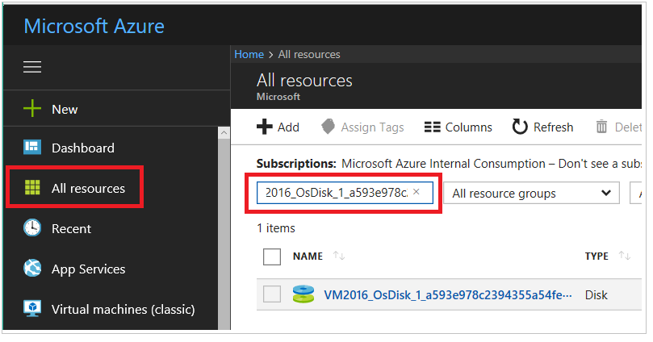
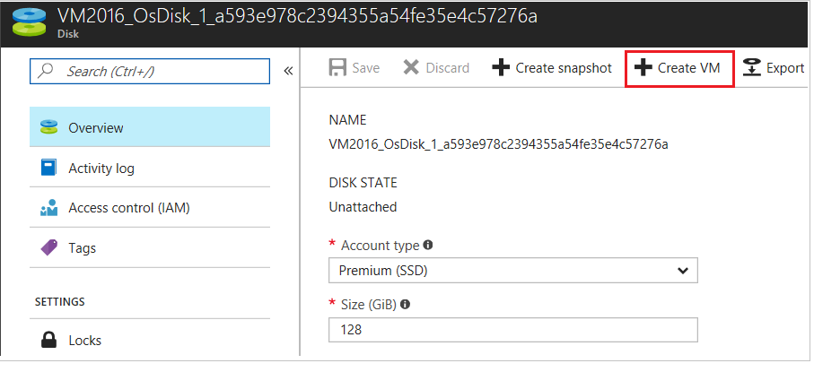

# How to troubleshoot a problem Azure VM by using nested virtualization in Azure

This article shows how to create a nested virtualization environment in Microsoft Azure, so you can mount the VHD of the problem VM on the Hyper-V Host (Recovery VM) for troubleshooting purpose.

## Prerequisite

To mount the problem VM, the Recovery VM must meet the following prerequisite:

-   The Recovery VM must be in the same location as the problem VM.

-   The Recovery VM must be in the same resource group as the problem VM.

-   The Recovery VM must use the same type of Storage Account (Standard or Premium) as the problem VM.

## Step 1 Create a recovery VM and install Hyper-V role

1.  Create a new Recovery VM:

    -  OS: Windows Server 2016 Datacenter

    -  Size: Any V3 series with at least two cores that support nested virtualization.

    -  Same Location, Storage Account, and Resource Group as the problem VM.

    -  Select the same storage type as the problem VM (Standard or Premium)

2.  After the Recovery VM is created, remote desktop to the Recovery VM.

3.  In Server Manager, select **Manage** > **Add Roles and Features**.

4.  In the **Installation Type** section, select **Role-based or feature-based installation**.

5.  In the **select destination server** section, make sure that the Recovery VM is selected.

6.  Select the **Hyper-V role** > **Add Features**.

7.  Select **Next** on the **Features** section.

8.  If a virtual switch is available, select it. Otherwise select **Next**.

9.  On the **Migration** section, select **Next**

10. On the **Default Stores** section, select **Next**.

11. Check the box to restart the server automatically if required.

12. Select **Install**.

13. Allow the server to install the Hyper-V role. This will take a few minutes and the server will reboot automatically.

## Step 2 Create the problem VM on the recovery VM’s Hyper-V server

1.  Delete the problem VM. Make sure that you keep all attached disks.

2.  Attach the OS disk of your problem machine as a data disk of the Recovery VM.

    1.  Once the problem VM is deleted, go to the Recovery VM.

    2.  Select **Disks** and then **Attach Existing**.

    3.  Browse to the location of the problem VM’s VHD.

    4.  Select the problem VMs VHD and click **OK**.

3.  Once the disk has successfully attached, remote desktop to the Recovery VM.

4.  Open Disk Management (diskmgmt.msc), make sure that the VHD of the problem VM is set to **Offline**.

5.  Open Hyper-V Manager: In **Server Manager**, select the **Hyper-V role**. Right-click the server and select the **Hyper-V Manager**.

6.  In the Hyper-V Manager, right-click the Recovery VM and select **New** > **Virtual Machine** > **Next**.

7.  Type a name the Virtual Machine and select **Next**

8.  Select **Generation 1**.

9.  Set the startup memory at 1024 MB or more.

10. If applicable select the Hyper-V Network Switch that was created. Else move to the next page.

11. Select **Attach a Virtual Hard Disk Later**.
    

12. Select **Finish** when the VM is created.

13. Right click on the VM that we just created and select **Settings**.

14. Select **IDE Controller 0**, select **Hard Drive**, and then click **Add**.
        

15. In **Physical Hard Disk**, select the VHD of the problem VM we attached to the Azure VM. f you do not see any disks listed. Check if the VHD is set to Offline by using Disk management.
      

17. Select **Apply** and **OK**.

18. Double-click on the VM and Start it

19. At this point, you can work on your VM as the On-Premises VM. You could follow any troubleshooting steps you need.

## Step 3 Recreate your Azure VM in Azure

1.  Once you get the VM back online shutdown the nested VM in the Hyper-V manager.

2.  Go back to the [Azure portal](https://portal.azure.com) and select the Recovery VM > Disks,  copy the name of the disk. We will use the name in the next step. Detach the Fixed VHD from the recovery VM.

3.  Go to **All resources**, search for the disk name, and then select the disk.
          

4. Click **Create vm**.
      

You can also use Azure PowerShell to create the VM from the disk. For more information, see [create the new VM from an existing disk](create-vm-specialized.md#create-the-new-vm). 

## New steps

If you are having issues connecting to your VM, see [Troubleshoot RDP connections to an Azure VM](troubleshoot-rdp-connection.md). For issues with accessing applications running on your VM, see [Troubleshoot application connectivity issues on a Windows VM](troubleshoot-app-connection.md).
