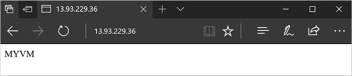

# How to customize a Windows virtual machine in Azure
To configure virtual machines (VMs) in a quick and consistent manner, some form of automation is typically desired. A common approach to customize a Windows VM is to use [Custom Script Extension for Windows](extensions-customscript.md). In this tutorial you learn how to:

> [!div class="checklist"]
> * Use the Custom Script Extension to install IIS
> * Create a VM that uses the Custom Script Extension
> * View a running IIS site after the extension is applied

This tutorial requires the Azure PowerShell module version 3.6 or later. Run ` Get-Module -ListAvailable AzureRM` to find the version. If you need to upgrade, see [Install Azure PowerShell module](/powershell/azure/install-azurerm-ps).


## Custom script extension overview
The Custom Script Extension downloads and executes scripts on Azure VMs. This extension is useful for post deployment configuration, software installation, or any other configuration / management task. Scripts can be downloaded from Azure storage or GitHub, or provided to the Azure portal at extension run time.

The Custom Script extension integrates with Azure Resource Manager templates, and can also be run using the Azure CLI, PowerShell, Azure portal, or the Azure Virtual Machine REST API.

You can use the Custom Script Extension with both Windows and Linux VMs.


## Create virtual machine
Before you can create a VM, create a resource group with [New-AzureRmResourceGroup](/powershell/module/azurerm.resources/new-azurermresourcegroup). The following example creates a resource group named *myResourceGroupAutomate* in the *EastUS* location:

```powershell
New-AzureRmResourceGroup -ResourceGroupName myResourceGroupAutomate -Location EastUS
```

Set an administrator username and password for the VMs with [Get-Credential](https://msdn.microsoft.com/powershell/reference/5.1/microsoft.powershell.security/Get-Credential):

```powershell
$cred = Get-Credential
```

Now you can create the VM with [New-AzureRmVM](/powershell/module/azurerm.compute/new-azurermvm). The following example creates the required virtual network components, the OS configuration, and then creates a VM named *myVM*:

```powershell
# Create a subnet configuration
$subnetConfig = New-AzureRmVirtualNetworkSubnetConfig `
    -Name mySubnet `
    -AddressPrefix 192.168.1.0/24

# Create a virtual network
$vnet = New-AzureRmVirtualNetwork `
    -ResourceGroupName myResourceGroupAutomate `
    -Location EastUS `
    -Name myVnet `
    -AddressPrefix 192.168.0.0/16 `
    -Subnet $subnetConfig

# Create a public IP address and specify a DNS name
$publicIP = New-AzureRmPublicIpAddress `
    -ResourceGroupName myResourceGroupAutomate `
    -Location EastUS `
    -AllocationMethod Static `
    -IdleTimeoutInMinutes 4 `
    -Name "myPublicIP"

# Create an inbound network security group rule for port 3389
$nsgRuleRDP = New-AzureRmNetworkSecurityRuleConfig `
    -Name myNetworkSecurityGroupRuleRDP  `
    -Protocol Tcp `
    -Direction Inbound `
    -Priority 1000 `
    -SourceAddressPrefix * `
    -SourcePortRange * `
    -DestinationAddressPrefix * `
    -DestinationPortRange 3389 `
    -Access Allow

# Create an inbound network security group rule for port 80
$nsgRuleWeb = New-AzureRmNetworkSecurityRuleConfig `
    -Name myNetworkSecurityGroupRuleWWW  `
    -Protocol Tcp `
    -Direction Inbound `
    -Priority 1001 `
    -SourceAddressPrefix * `
    -SourcePortRange * `
    -DestinationAddressPrefix * `
    -DestinationPortRange 80 `
    -Access Allow

# Create a network security group
$nsg = New-AzureRmNetworkSecurityGroup `
    -ResourceGroupName myResourceGroupAutomate `
    -Location EastUS `
    -Name myNetworkSecurityGroup `
    -SecurityRules $nsgRuleRDP,$nsgRuleWeb

# Create a virtual network card and associate with public IP address and NSG
$nic = New-AzureRmNetworkInterface `
    -Name myNic `
    -ResourceGroupName myResourceGroupAutomate `
    -Location EastUS `
    -SubnetId $vnet.Subnets[0].Id `
    -PublicIpAddressId $publicIP.Id `
    -NetworkSecurityGroupId $nsg.Id

# Create a virtual machine configuration
$vmConfig = New-AzureRmVMConfig -VMName myVM -VMSize Standard_DS2 | `
Set-AzureRmVMOperatingSystem -Windows -ComputerName myVM -Credential $cred | `
Set-AzureRmVMSourceImage -PublisherName MicrosoftWindowsServer `
    -Offer WindowsServer -Skus 2016-Datacenter -Version latest | `
Add-AzureRmVMNetworkInterface -Id $nic.Id

New-AzureRmVM -ResourceGroupName myResourceGroupAutomate -Location EastUS -VM $vmConfig
```

It takes a few minutes for the resources and VM to be created.


## Automate IIS install
Use [Set-AzureRmVMExtension](/powershell/module/azurerm.compute/set-azurermvmextension) to install the Custom Script Extension. The extension runs `powershell Add-WindowsFeature Web-Server` to install the IIS webserver and then updates the *Default.htm* page to show the hostname of the VM:

```powershell
Set-AzureRmVMExtension -ResourceGroupName myResourceGroupAutomate `
    -ExtensionName IIS `
    -VMName myVM `
    -Publisher Microsoft.Compute `
    -ExtensionType CustomScriptExtension `
    -TypeHandlerVersion 1.4 `
    -SettingString '{"commandToExecute":"powershell Add-WindowsFeature Web-Server; powershell Add-Content -Path \"C:\\inetpub\\wwwroot\\Default.htm\" -Value $($env:computername)"}' `
    -Location EastUS
```


## Test web site
Obtain the public IP address of your load balancer with [Get-AzureRmPublicIPAddress](/powershell/module/azurerm.network/get-azurermpublicipaddress). The following example obtains the IP address for *myPublicIP* created earlier:

```powershell
Get-AzureRmPublicIPAddress `
    -ResourceGroupName myResourceGroupAutomate `
    -Name myPublicIP | select IpAddress
```

You can then enter the public IP address in to a web browser. The website is displayed, including the hostname of the VM that the load balancer distributed traffic to as in the following example:




## Next steps

In this tutorial, you automated the IIS install on a VM. You learned how to:

> [!div class="checklist"]
> * Use the Custom Script Extension to install IIS
> * Create a VM that uses the Custom Script Extension
> * View a running IIS site after the extension is applied

Advance to the next tutorial to learn how to create custom VM images.

> [!div class="nextstepaction"]
> [Create custom VM images](./tutorial-custom-images.md)
