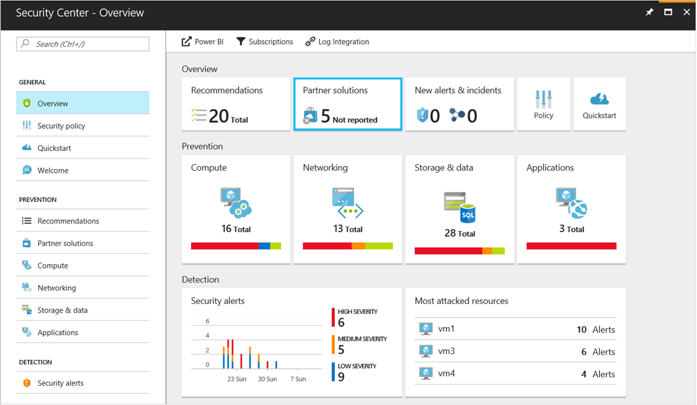
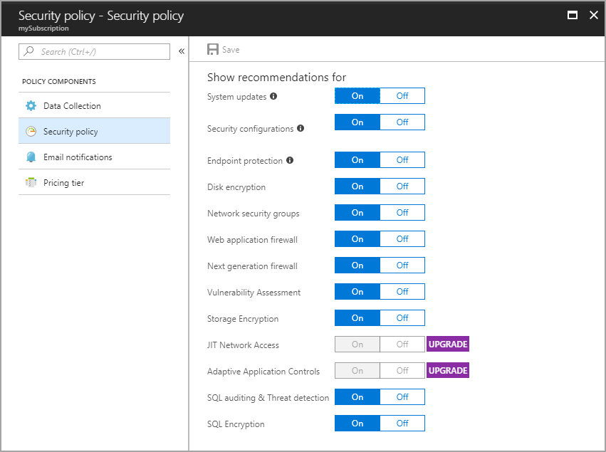
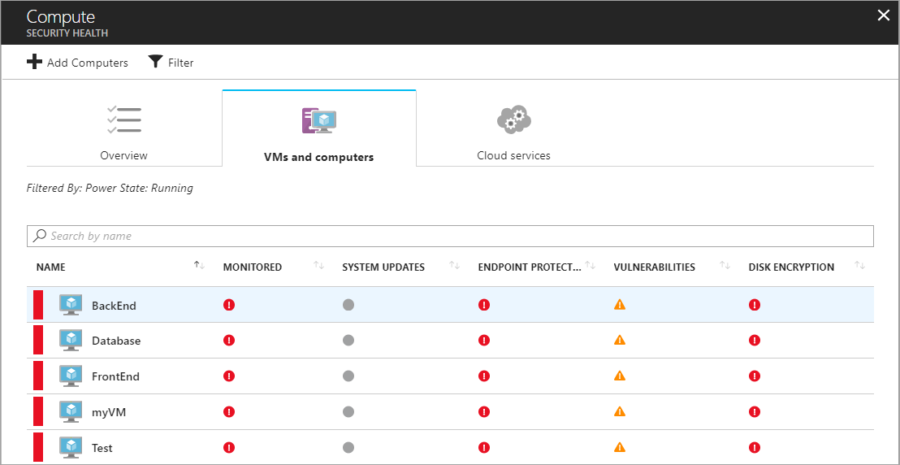
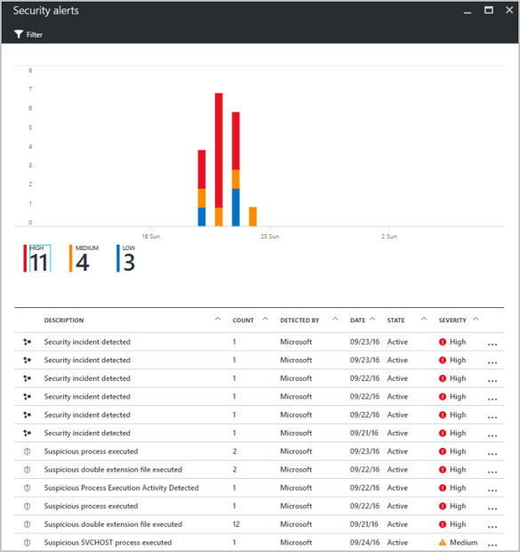

# Monitor VM security with the Azure Security Center

Azure security center helps you gain visibility into the configuration of Azure resource as related to security practices. It also provides integrated security monitoring, which can detect threats that may otherwise go unnoticed. In this tutorial you learn about Azure Security Center and how to:
 
> [!div class="checklist"]
> * Configure data collection
> * Configure security policies
> * View and fix configuration health issues
> * Review detected threats  

## Security Center overview

Azure security center helps identify potential VM configuration issues and targeted security threats. Examples include identifying VMs with missing network security groups, unencrypted disks, and brute force RDP attacks. This information is presented on the Azure security center dashboard in easy to read graphs.

The Azure security center dashboard can be accessed by clicking **Security Center** on the left-hand navigation pane of the Azure portal. The dashboard provides a high-level view of resource health, security alerts, and configuration recommendations. From here, you can view the security health of your Azure environment, find a count of current recommendations, and view the current state of threat alerts. Each of these high-level charts can be expanded, which provides more detail into the area of focus.

Azure security center extends beyond data discovery by providing recommendations for detected issues. For instance, if a VM has been deployed without an attached network security group, a recommendation is created that includes remediation steps. These recommendations also provide remediation automation without leaving the context of Azure security center.  

## Configure data collection

Before you can gain visibility into VM security configurations, Azure security center data collection needs to be configured. This involves enabling data collection and creating and Azure storage account to hold the collected data. 

1. From the Azure security center dashboard, click **Security Policy** and select your subscription. 
2. Under **Data collection**, select *On*.
3. Click **Choose a storage account** and create a new storage account. Select **OK** when done.
4. Click **Save** on the **Security Policy** blade. 

When this action is completed, the Azure security center data collection agent is installed on all virtual machines, and data collection begins. 

## Configure security policy

A security policy defines the security policy items for which data is collected and recommendations are made. By default, Azure resources are evaluated against all policy items. Individual policy items can be disabled globally for all Azure resource, or disabled per resource group. This configuration gives you’re the ability to apply different security policies to different sets of Azure resources. For in-depth information on Azure security center security policies, see [Set security policies in Azure security center](../../security-center/security-center-policies.md). 

To configure a security policy for all Azure resources:

1. From the Azure security center dashboard, click **Security Policy** and then select your subscription. 
2. Click **Prevention policy**.
3. Enable or disable the policies items that need to be applied to all Azure resources.
4. Click **OK** when done.
5. Click **Save** on the **Security Policy** blade. 

To configure a policy for a specific resource group, follow the same steps, however instead of selecting the subscription on the security policy blade, select a resource group. When configuring the policy, select *Unique* under **Inheritance**. If you would like to disable data collection for a specific resource group, this configuration can also be made here.

In the following example, a unique policy has been created for the resource group named *myResoureGroup*. In this policy, both disk encryption and web application firewall recommendations have been disabled.

## View VM configuration health

Once data collection has been enabled, and a security policy configured, Azure security center begins to provided alerts and recommendations. As VMs are deployed, the data collection agent is installed, and Azure security center is populated with data for these new VMs. For in-depth information on VM configuration health, see [Protecting your virtual machines in Azure Security Center](../../security-center/security-center-virtual-machine-recommendations.md). 

As data is collected, the resource health for each VM and related Azure resource is aggregated and presented in an easy to read chart. To view resource health, return to the Azure security center dashboard. Under **Resource security health**, click **Compute**. Finally, on the **Compute** blade, click **Virtual machines**. This view provides a summary of the configuration status for all VMs.

Selecting each VM displays all recommendations for that VM. recommendations are detailed in the next section of this tutorial.

## Remediate configuration issues

Once Azure security center begins to populate with configuration data, recommendations are made against the configured security policy. For instance, if a VM has been configured without an associated network security group, a recommendation is made to create one. To see a list of all recommendations: 

1. From the Azure security center dashboard, click **Recommendations**.
3. Select a specific recommendation, a blade opens with a list of all resources for which the recommendation applies.
4. Select a specific resource for which you would like to address.
5. Follow the on-screen instructions for remediation steps. 

In many cases, Azure security center provides actionable steps for addressing the recommendation without leaving the context of Azure security center. For instance, in the following example, an NSG was detected with an unrestricted inbound rule. From this recommendation, the **Edit inbound rules** button can be selected, which provides the proper UI needed to modify the rule. 

As recommendations are remediated, they are marked as resolved. 

## View detected threats

In addition to resource configuration recommendations, Azure security center also provides threat detection alerts. The security alert feature aggregates data collected from each VM, Azure networking logs, and connected partner solutions to detect security threats against Azure resources. For in-depth information on Azure security center threat detection capabilities, see [Azure security center detection capabilities](../../security-center/security-center-detection-capabilities.md).

The security alerts feature requires that the Azure security center pricing tier is increased from *Free** to *Standard**. When doing so, a 30-day **Free Trial** is available. To change the pricing tier:  

1. From the Azure security center dashboard, click **Security Policy** and then select your subscription.
2. Click **Pricing tier**.
3. Select the new tier, and click **Select**.
5. Click **Save** on the **Security Policy** blade. 

Once enabled, the security alerts graph begins to populate as security threats are detected.

Select an alert to view information such as a description of the threat, detection time, threat attempts, and recommended remediation. In this example, an RDP brute force attack was detected with 294 failed RDP attempts and a recommended resolution is provided.

## Next steps
In this tutorial, you configured and reviewed VMs with Azure Security Center. You learned how to:

> [!div class="checklist"]
> * Configure data collection
> * Configure security policies
> * View and fix configuration health issues
> * Review detected threats

Follow this link to see pre-built virtual machine script samples.

> [!div class="nextstepaction"]
> [Windows virtual machine script samples](./powershell-samples.md)
