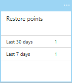
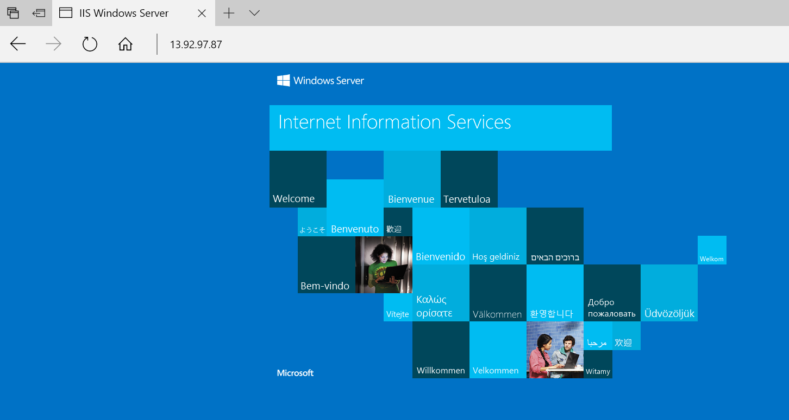
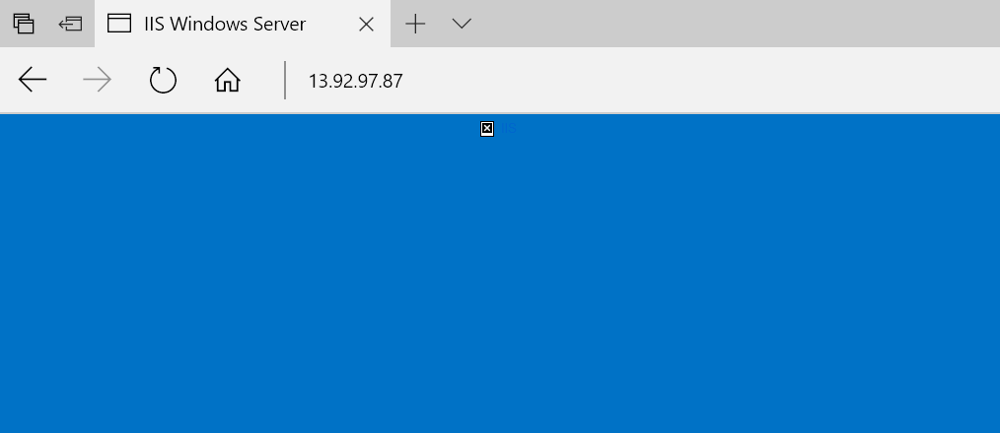

# Tutorial: Back up and restore files for Windows virtual machines in Azure

You can protect your data by taking backups at regular intervals. Azure Backup creates recovery points that are stored in geo-redundant recovery vaults. When you restore from a recovery point, you can restore the whole VM or specific files. This article explains how to restore a single file to a VM running Windows Server and IIS. If you don't already have a VM to use, you can create one using the [Windows quickstart](quick-create-portal.md). In this tutorial you learn how to:

> [!div class="checklist"]
> * Create a backup of a VM
> * Schedule a daily backup
> * Restore a file from a backup

## Backup overview

When the Azure Backup service initiates a backup job, it triggers the backup extension to take a point-in-time snapshot. The Azure Backup service uses the [VMSnapshot extension](https://docs.microsoft.com/azure/virtual-machines/extensions/vmsnapshot-windows). The extension is installed during the first VM backup if the VM is running. If the VM is not running, the Backup service takes a snapshot of the underlying storage (since no application writes occur while the VM is stopped).

When taking a snapshot of Windows VMs, the Backup service coordinates with the Volume Shadow Copy Service (VSS) to get a consistent snapshot of the virtual machine's disks. Once the Azure Backup service takes the snapshot, the data is transferred to the vault. To maximize efficiency, the service identifies and transfers only the blocks of data that have changed since the previous backup.

When the data transfer is complete, the snapshot is removed and a recovery point is created.

## Create a backup
Create a simple scheduled daily backup to a Recovery Services Vault. 

1. Sign in to the [Azure portal](https://portal.azure.com/).
1. In the menu on the left, select **Virtual machines**. 
1. From the list, select a VM to back up.
1. On the VM blade, in the **Operations** section, click **Backup**. The **Enable backup** blade opens.
1. In **Recovery Services vault**, click **Create new** and provide the name for the new vault. A new vault is created in the same resource group and location as the virtual machine.
1. Under **Choose backup policy**, keep the default **(New) DailyPolicy**, and then click **Enable Backup**.
1. To create an initial recovery point, on the **Backup** blade click **Backup now**.
1. On the **Backup Now** blade, click the calendar icon, use the calendar control to choose how long the restore point is retained, and click **OK**.
1. In the **Backup** blade for your VM, you'll see the number of restore points that are complete.

    
    
The first backup takes about 20 minutes. Proceed to the next part of this tutorial after your backup is finished.

## Recover a file

If you accidentally delete or make changes to a file, you can use File Recovery to recover the file from your backup vault. File Recovery uses a script that runs on the VM, to mount the recovery point as local drive. These drives remain mounted for 12 hours so that you can copy files from the recovery point and restore them to the VM.  

In this example, we show how to recover the image file that is used in the default web page for IIS. 

1. Open a browser and connect to the IP address of the VM to show the default IIS page.

    

1. Connect to the VM.
1. On the VM, open **File Explorer** and navigate to \inetpub\wwwroot and delete the file **iisstart.png**.
1. On your local computer, refresh the browser to see that the image on the default IIS page is gone.

    

1. On your local computer, open a new tab and go the [Azure portal](https://portal.azure.com).
1. In the menu on the left, select **Virtual machines** and select the VM from the list.
1. On the VM blade, in the **Operations** section, click **Backup**. The **Backup** blade opens. 
1. In the menu at the top of the blade, select **File Recovery**. The **File Recovery** blade opens.
1. In **Step 1: Select recovery point**, select a recovery point from the drop-down.
1. In **Step 2: Download script to browse and recover files**, click the **Download Executable** button. Copy the password for the file and save it somewhere safe.
1. On your local computer, open **File Explorer** and navigate to your **Downloads** folder and copy the downloaded .exe file. The filename is prefixed by your VM name. 
1. On your VM (using the RDP connection), paste the .exe file to the Desktop of your VM. 
1. Navigate to the desktop of your VM and double-click on the .exe. A command prompt will start. The program mounts the recovery point as a file share that you can access. When it is finished creating the share, type **q** to close the command prompt.
1. On your VM, open **File Explorer** and navigate to the drive letter that was used for the file share.
1. Navigate to \inetpub\wwwroot and copy **iisstart.png** from the file share and paste it into \inetpub\wwwroot. For example, copy F:\inetpub\wwwroot\iisstart.png and paste it into c:\inetpub\wwwroot to recover the file.
1. On your local computer, open the browser tab where you are connected to the IP address of the VM showing the IIS default page. Press CTRL + F5 to refresh the browser page. You should now see that the image has been restored.
1. On your local computer, go back to the browser tab for the Azure portal and in **Step 3: Unmount the disks after recovery** click the **Unmount Disks** button. If you forget to do this step, the connection to the mountpoint is automatically closed after 12 hours. After those 12 hours, you need to download a new script to create a new mount point.

## Next steps

In this tutorial, you learned how to:

> [!div class="checklist"]
> * Create a backup of a VM
> * Schedule a daily backup
> * Restore a file from a backup

Advance to the next tutorial to learn about monitoring virtual machines.

> [!div class="nextstepaction"]
> [Govern virtual machines](tutorial-govern-resources.md)

