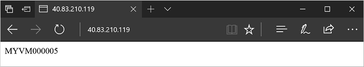

---
title: Tutorial - Create a virtual machine scale set for Windows in Azure | Microsoft Docs
description: In this tutorial, you learn how to use Azure PowerShell to create and deploy a highly available application on Windows VMs using a virtual machine scale set
services: virtual-machine-scale-sets
documentationcenter: ''
author: cynthn
manager: gwallace
editor: ''
tags: azure-resource-manager

ms.assetid: ''
ms.service: virtual-machine-scale-sets
ms.workload: infrastructure-services
ms.tgt_pltfrm: na
ms.devlang:
ms.topic: tutorial
ms.date: 11/30/2018
ms.author: cynthn
ms.custom: mvc

#Customer intent: As an IT administrator, I want to learn about autoscaling VMs in Azure so that I can deploy a highly-available and scalable infrastructure.
---

# Tutorial: Create a virtual machine scale set and deploy a highly available app on Windows with Azure PowerShell
A virtual machine scale set allows you to deploy and manage a set of identical, autoscaling virtual machines. You can scale the number of VMs in the scale set manually. You can also define rules to autoscale based on resource usage such as CPU, memory demand, or network traffic. In this tutorial, you deploy a virtual machine scale set in Azure and learn how to:

> [!div class="checklist"]
> * Use the Custom Script Extension to define an IIS site to scale
> * Create a load balancer for your scale set
> * Create a virtual machine scale set
> * Increase or decrease the number of instances in a scale set
> * Create autoscale rules

## Launch Azure Cloud Shell

The Azure Cloud Shell is a free interactive shell that you can use to run the steps in this article. It has common Azure tools preinstalled and configured to use with your account. 

To open the Cloud Shell, just select **Try it** from the upper right corner of a code block. You can also launch Cloud Shell in a separate browser tab by going to [https://shell.azure.com/powershell](https://shell.azure.com/powershell). Select **Copy** to copy the blocks of code, paste it into the Cloud Shell, and press enter to run it.

## Scale Set overview
A virtual machine scale set allows you to deploy and manage a set of identical, autoscaling virtual machines. VMs in a scale set are distributed across logic fault and update domains in one or more *placement groups*. Placement groups are groups of similarly configured VMs, similar to [availability sets](tutorial-availability-sets.md).

VMs are created as needed in a scale set. You define autoscale rules to control how and when VMs are added or removed from the scale set. These rules can trigger based on metrics such as CPU load, memory usage, or network traffic.

Scale sets support up to 1,000 VMs when you use an Azure platform image. For workloads with significant installation or VM customization requirements, you may wish to [Create a custom VM image](tutorial-custom-images.md). You can create up to 300 VMs in a scale set when using a custom image.


## Create a scale set
Create a virtual machine scale set with [New-AzVmss](https://docs.microsoft.com/powershell/module/az.compute/new-azvmss). The following example creates a scale set named *myScaleSet* that uses the *Windows Server 2016 Datacenter* platform image. The Azure network resources for virtual network, public IP address, and load balancer are automatically created. When prompted, you can set your own administrative credentials for the VM instances in the scale set:

```azurepowershell-interactive
New-AzVmss `
  -ResourceGroupName "myResourceGroupScaleSet" `
  -Location "EastUS" `
  -VMScaleSetName "myScaleSet" `
  -VirtualNetworkName "myVnet" `
  -SubnetName "mySubnet" `
  -PublicIpAddressName "myPublicIPAddress" `
  -LoadBalancerName "myLoadBalancer" `
  -UpgradePolicyMode "Automatic"
```

It takes a few minutes to create and configure all the scale set resources and VMs.


## Deploy sample application
To test your scale set, install a basic web application. The Azure Custom Script Extension is used to download and run a script that installs IIS on the VM instances. This extension is useful for post deployment configuration, software installation, or any other configuration / management task. For more information, see the [Custom Script Extension overview](extensions-customscript.md).

Use the Custom Script Extension to install a basic IIS web server. Apply the Custom Script Extension that installs IIS as follows:

```azurepowershell-interactive
# Define the script for your Custom Script Extension to run
$publicSettings = @{
    "fileUris" = (,"https://raw.githubusercontent.com/Azure-Samples/compute-automation-configurations/master/automate-iis.ps1");
    "commandToExecute" = "powershell -ExecutionPolicy Unrestricted -File automate-iis.ps1"
}

# Get information about the scale set
$vmss = Get-AzVmss `
  -ResourceGroupName "myResourceGroupScaleSet" `
  -VMScaleSetName "myScaleSet"

# Use Custom Script Extension to install IIS and configure basic website
Add-AzVmssExtension -VirtualMachineScaleSet $vmss `
  -Name "customScript" `
  -Publisher "Microsoft.Compute" `
  -Type "CustomScriptExtension" `
  -TypeHandlerVersion 1.8 `
  -Setting $publicSettings

# Update the scale set and apply the Custom Script Extension to the VM instances
Update-AzVmss `
  -ResourceGroupName "myResourceGroupScaleSet" `
  -Name "myScaleSet" `
  -VirtualMachineScaleSet $vmss
```

## Allow traffic to application

To allow access to the basic web application, create a network security group with [New-AzNetworkSecurityRuleConfig](https://docs.microsoft.com/powershell/module/az.network/new-aznetworksecurityruleconfig) and [New-AzNetworkSecurityGroup](https://docs.microsoft.com/powershell/module/az.network/new-aznetworksecuritygroup). For more information, see [Networking for Azure virtual machine scale sets](../../virtual-machine-scale-sets/virtual-machine-scale-sets-networking.md).

```azurepowershell-interactive
# Get information about the scale set
$vmss = Get-AzVmss `
  -ResourceGroupName "myResourceGroupScaleSet" `
  -VMScaleSetName "myScaleSet"

#Create a rule to allow traffic over port 80
$nsgFrontendRule = New-AzNetworkSecurityRuleConfig `
  -Name myFrontendNSGRule `
  -Protocol Tcp `
  -Direction Inbound `
  -Priority 200 `
  -SourceAddressPrefix * `
  -SourcePortRange * `
  -DestinationAddressPrefix * `
  -DestinationPortRange 80 `
  -Access Allow

#Create a network security group and associate it with the rule
$nsgFrontend = New-AzNetworkSecurityGroup `
  -ResourceGroupName  "myResourceGroupScaleSet" `
  -Location EastUS `
  -Name myFrontendNSG `
  -SecurityRules $nsgFrontendRule

$vnet = Get-AzVirtualNetwork `
  -ResourceGroupName  "myResourceGroupScaleSet" `
  -Name myVnet

$frontendSubnet = $vnet.Subnets[0]

$frontendSubnetConfig = Set-AzVirtualNetworkSubnetConfig `
  -VirtualNetwork $vnet `
  -Name mySubnet `
  -AddressPrefix $frontendSubnet.AddressPrefix `
  -NetworkSecurityGroup $nsgFrontend

Set-AzVirtualNetwork -VirtualNetwork $vnet

# Update the scale set and apply the Custom Script Extension to the VM instances
Update-AzVmss `
  -ResourceGroupName "myResourceGroupScaleSet" `
  -Name "myScaleSet" `
  -VirtualMachineScaleSet $vmss
```

## Test your scale set
To see your scale set in action, get the public IP address of your load balancer with [Get-AzPublicIPAddress](https://docs.microsoft.com/powershell/module/az.network/get-azpublicipaddress). The following example displays the IP address for *myPublicIP* created as part of the scale set:

```azurepowershell-interactive
Get-AzPublicIPAddress `
  -ResourceGroupName "myResourceGroupScaleSet" `
  -Name "myPublicIPAddress" | select IpAddress
```

Enter the public IP address in to a web browser. The web app is displayed, including the hostname of the VM that the load balancer distributed traffic to:



To see the scale set in action, you can force-refresh your web browser to see the load balancer distribute traffic across all the VMs running your app.


## Management tasks
Throughout the lifecycle of the scale set, you may need to run one or more management tasks. Additionally, you may want to create scripts that automate various lifecycle-tasks. Azure PowerShell provides a quick way to do those tasks. Here are a few common tasks.

### View VMs in a scale set
To view a list of VM instances in a scale set, use [Get-AzVmssVM](https://docs.microsoft.com/powershell/module/az.compute/get-azvmssvm) as follows:

```azurepowershell-interactive
Get-AzVmssVM `
  -ResourceGroupName "myResourceGroupScaleSet" `
  -VMScaleSetName "myScaleSet"
```

The following example output shows two VM instances in the scale set:

```powershell
ResourceGroupName                 Name Location             Sku InstanceID ProvisioningState
-----------------                 ---- --------             --- ---------- -----------------
MYRESOURCEGROUPSCALESET   myScaleSet_0   eastus Standard_DS1_v2          0         Succeeded
MYRESOURCEGROUPSCALESET   myScaleSet_1   eastus Standard_DS1_v2          1         Succeeded
```

To view additional information about a specific VM instance, add the `-InstanceId` parameter to [Get-AzVmssVM](https://docs.microsoft.com/powershell/module/az.compute/get-azvmssvm). The following example views information about VM instance *1*:

```azurepowershell-interactive
Get-AzVmssVM `
  -ResourceGroupName "myResourceGroupScaleSet" `
  -VMScaleSetName "myScaleSet" `
  -InstanceId "1"
```


### Increase or decrease VM instances
To see the number of instances you currently have in a scale set, use [Get-AzVmss](https://docs.microsoft.com/powershell/module/az.compute/get-azvmss) and query on *sku.capacity*:

```azurepowershell-interactive
Get-AzVmss -ResourceGroupName "myResourceGroupScaleSet" `
  -VMScaleSetName "myScaleSet" | `
  Select -ExpandProperty Sku
```

You can then manually increase or decrease the number of virtual machines in the scale set with [Update-AzVmss](https://docs.microsoft.com/powershell/module/az.compute/update-azvmss). The following example sets the number of VMs in your scale set to *3*:

```azurepowershell-interactive
# Get current scale set
$scaleset = Get-AzVmss `
  -ResourceGroupName "myResourceGroupScaleSet" `
  -VMScaleSetName "myScaleSet"

# Set and update the capacity of your scale set
$scaleset.sku.capacity = 3
Update-AzVmss -ResourceGroupName "myResourceGroupScaleSet" `
    -Name "myScaleSet" `
    -VirtualMachineScaleSet $scaleset
```

If takes a few minutes to update the specified number of instances in your scale set.


### Configure autoscale rules
Rather than manually scaling the number of instances in your scale set, you define autoscale rules. These rules monitor the instances in your scale set and respond accordingly based on metrics and thresholds you define. The following example scales out the number of instances by one when the average CPU load is greater than 60% over a 5-minute period. If the average CPU load then drops below 30% over a 5-minute period, the instances are scaled in by one instance:

```azurepowershell-interactive
# Define your scale set information
$mySubscriptionId = (Get-AzSubscription)[0].Id
$myResourceGroup = "myResourceGroupScaleSet"
$myScaleSet = "myScaleSet"
$myLocation = "East US"
$myScaleSetId = (Get-AzVmss -ResourceGroupName $myResourceGroup -VMScaleSetName $myScaleSet).Id 

# Create a scale up rule to increase the number instances after 60% average CPU usage exceeded for a 5-minute period
$myRuleScaleUp = New-AzAutoscaleRule `
  -MetricName "Percentage CPU" `
  -MetricResourceId $myScaleSetId `
  -Operator GreaterThan `
  -MetricStatistic Average `
  -Threshold 60 `
  -TimeGrain 00:01:00 `
  -TimeWindow 00:05:00 `
  -ScaleActionCooldown 00:05:00 `
  -ScaleActionDirection Increase `
  -ScaleActionValue 1

# Create a scale down rule to decrease the number of instances after 30% average CPU usage over a 5-minute period
$myRuleScaleDown = New-AzAutoscaleRule `
  -MetricName "Percentage CPU" `
  -MetricResourceId $myScaleSetId `
  -Operator LessThan `
  -MetricStatistic Average `
  -Threshold 30 `
  -TimeGrain 00:01:00 `
  -TimeWindow 00:05:00 `
  -ScaleActionCooldown 00:05:00 `
  -ScaleActionDirection Decrease `
  -ScaleActionValue 1

# Create a scale profile with your scale up and scale down rules
$myScaleProfile = New-AzAutoscaleProfile `
  -DefaultCapacity 2  `
  -MaximumCapacity 10 `
  -MinimumCapacity 2 `
  -Rule $myRuleScaleUp,$myRuleScaleDown `
  -Name "autoprofile"

# Apply the autoscale rules
Add-AzAutoscaleSetting `
  -Location $myLocation `
  -Name "autosetting" `
  -ResourceGroup $myResourceGroup `
  -TargetResourceId $myScaleSetId `
  -AutoscaleProfile $myScaleProfile
```

For more design information on the use of autoscale, see [autoscale best practices](/azure/architecture/best-practices/auto-scaling).


## Next steps
In this tutorial, you created a virtual machine scale set. You learned how to:

> [!div class="checklist"]
> * Use the Custom Script Extension to define an IIS site to scale
> * Create a load balancer for your scale set
> * Create a virtual machine scale set
> * Increase or decrease the number of instances in a scale set
> * Create autoscale rules

Advance to the next tutorial to learn more about load balancing concepts for virtual machines.

> [!div class="nextstepaction"]
> [Load balance virtual machines](tutorial-load-balancer.md)
