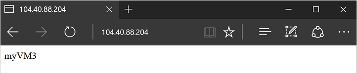

# Tutorial: Load balance Windows virtual machines in Azure to create a highly available application with Azure PowerShell
Load balancing provides a higher level of availability by spreading incoming requests across multiple virtual machines. In this tutorial, you learn about the different components of the Azure load balancer that distribute traffic and provide high availability. You learn how to:

> [!div class="checklist"]
> * Create an Azure load balancer
> * Create a load balancer health probe
> * Create load balancer traffic rules
> * Use the Custom Script Extension to create a basic IIS site
> * Create virtual machines and attach to a load balancer
> * View a load balancer in action
> * Add and remove VMs from a load balancer

## Azure load balancer overview
An Azure load balancer is a Layer-4 (TCP, UDP) load balancer that provides high availability by distributing incoming traffic among healthy VMs. A load balancer health probe monitors a given port on each VM and only distributes traffic to an operational VM.

You define a front-end IP configuration that contains one or more public IP addresses. This front-end IP configuration allows your load balancer and applications to be accessible over the Internet. 

Virtual machines connect to a load balancer using their virtual network interface card (NIC). To distribute traffic to the VMs, a back-end address pool contains the IP addresses of the virtual (NICs) connected to the load balancer.

To control the flow of traffic, you define load balancer rules for specific ports and protocols that map to your VMs.

## Launch Azure Cloud Shell

The Azure Cloud Shell is a free interactive shell that you can use to run the steps in this article. It has common Azure tools preinstalled and configured to use with your account. 

To open the Cloud Shell, just select **Try it** from the upper right corner of a code block. You can also launch Cloud Shell in a separate browser tab by going to [https://shell.azure.com/powershell](https://shell.azure.com/powershell). Select **Copy** to copy the blocks of code, paste it into the Cloud Shell, and press enter to run it.

## Create Azure load balancer
This section details how you can create and configure each component of the load balancer. Before you can create your load balancer, create a resource group with [New-AzResourceGroup](https://docs.microsoft.com/powershell/module/az.resources/new-azresourcegroup). The following example creates a resource group named *myResourceGroupLoadBalancer* in the *EastUS* location:

```azurepowershell-interactive
New-AzResourceGroup `
  -ResourceGroupName "myResourceGroupLoadBalancer" `
  -Location "EastUS"
```

### Create a public IP address
To access your app on the Internet, you need a public IP address for the load balancer. Create a public IP address with [New-AzPublicIpAddress](https://docs.microsoft.com/powershell/module/az.network/new-azpublicipaddress). The following example creates a public IP address named *myPublicIP* in the *myResourceGroupLoadBalancer* resource group:

```azurepowershell-interactive
$publicIP = New-AzPublicIpAddress `
  -ResourceGroupName "myResourceGroupLoadBalancer" `
  -Location "EastUS" `
  -AllocationMethod "Static" `
  -Name "myPublicIP"
```

### Create a load balancer
Create a frontend IP pool with [New-AzLoadBalancerFrontendIpConfig](https://docs.microsoft.com/powershell/module/az.network/new-azloadbalancerfrontendipconfig). The following example creates a frontend IP pool named *myFrontEndPool* and attaches the *myPublicIP* address: 

```azurepowershell-interactive
$frontendIP = New-AzLoadBalancerFrontendIpConfig `
  -Name "myFrontEndPool" `
  -PublicIpAddress $publicIP
```

Create a backend address pool with [New-AzLoadBalancerBackendAddressPoolConfig](https://docs.microsoft.com/powershell/module/az.network/new-azloadbalancerbackendaddresspoolconfig). The VMs attach to this backend pool in the remaining steps. The following example creates a backend address pool named *myBackEndPool*:

```azurepowershell-interactive
$backendPool = New-AzLoadBalancerBackendAddressPoolConfig `
  -Name "myBackEndPool"
```

Now, create the load balancer with [New-AzLoadBalancer](https://docs.microsoft.com/powershell/module/az.network/new-azloadbalancer). The following example creates a load balancer named *myLoadBalancer* using the frontend and backend IP pools created in the preceding steps:

```azurepowershell-interactive
$lb = New-AzLoadBalancer `
  -ResourceGroupName "myResourceGroupLoadBalancer" `
  -Name "myLoadBalancer" `
  -Location "EastUS" `
  -FrontendIpConfiguration $frontendIP `
  -BackendAddressPool $backendPool
```

### Create a health probe
To allow the load balancer to monitor the status of your app, you use a health probe. The health probe dynamically adds or removes VMs from the load balancer rotation based on their response to health checks. By default, a VM is removed from the load balancer distribution after two consecutive failures at 15-second intervals. You create a health probe based on a protocol or a specific health check page for your app. 

The following example creates a TCP probe. You can also create custom HTTP probes for more fine grained health checks. When using a custom HTTP probe, you must create the health check page, such as *healthcheck.aspx*. The probe must return an **HTTP 200 OK** response for the load balancer to keep the host in rotation.

To create a TCP health probe, you use [Add-AzLoadBalancerProbeConfig](https://docs.microsoft.com/powershell/module/az.network/add-azloadbalancerprobeconfig). The following example creates a health probe named *myHealthProbe* that monitors each VM on *TCP* port *80*:

```azurepowershell-interactive
Add-AzLoadBalancerProbeConfig `
  -Name "myHealthProbe" `
  -LoadBalancer $lb `
  -Protocol tcp `
  -Port 80 `
  -IntervalInSeconds 15 `
  -ProbeCount 2
```

To apply the health probe, update the load balancer with [Set-AzLoadBalancer](https://docs.microsoft.com/powershell/module/az.network/set-azloadbalancer):

```azurepowershell-interactive
Set-AzLoadBalancer -LoadBalancer $lb
```

### Create a load balancer rule
A load balancer rule is used to define how traffic is distributed to the VMs. You define the front-end IP configuration for the incoming traffic and the back-end IP pool to receive the traffic, along with the required source and destination port. To make sure only healthy VMs receive traffic, you also define the health probe to use.

Create a load balancer rule with [Add-AzLoadBalancerRuleConfig](https://docs.microsoft.com/powershell/module/az.network/add-azloadbalancerruleconfig). The following example creates a load balancer rule named *myLoadBalancerRule* and balances traffic on *TCP* port *80*:

```azurepowershell-interactive
$probe = Get-AzLoadBalancerProbeConfig -LoadBalancer $lb -Name "myHealthProbe"

Add-AzLoadBalancerRuleConfig `
  -Name "myLoadBalancerRule" `
  -LoadBalancer $lb `
  -FrontendIpConfiguration $lb.FrontendIpConfigurations[0] `
  -BackendAddressPool $lb.BackendAddressPools[0] `
  -Protocol Tcp `
  -FrontendPort 80 `
  -BackendPort 80 `
  -Probe $probe
```

Update the load balancer with [Set-AzLoadBalancer](https://docs.microsoft.com/powershell/module/az.network/set-azloadbalancer):

```azurepowershell-interactive
Set-AzLoadBalancer -LoadBalancer $lb
```

## Configure virtual network
Before you deploy some VMs and can test your balancer, create the supporting virtual network resources. For more information about virtual networks, see the [Manage Azure Virtual Networks](tutorial-virtual-network.md) tutorial.

### Create network resources
Create a virtual network with [New-AzVirtualNetwork](https://docs.microsoft.com/powershell/module/az.network/new-azvirtualnetwork). The following example creates a virtual network named *myVnet* with *mySubnet*:

```azurepowershell-interactive
# Create subnet config
$subnetConfig = New-AzVirtualNetworkSubnetConfig `
  -Name "mySubnet" `
  -AddressPrefix 192.168.1.0/24

# Create the virtual network
$vnet = New-AzVirtualNetwork `
  -ResourceGroupName "myResourceGroupLoadBalancer" `
  -Location "EastUS" `
  -Name "myVnet" `
  -AddressPrefix 192.168.0.0/16 `
  -Subnet $subnetConfig
```

Virtual NICs are created with [New-AzNetworkInterface](https://docs.microsoft.com/powershell/module/az.network/new-aznetworkinterface). The following example creates three virtual NICs. (One virtual NIC for each VM you create for your app in the following steps). You can create additional virtual NICs and VMs at any time and add them to the load balancer:

```azurepowershell-interactive
for ($i=1; $i -le 3; $i++)
{
   New-AzNetworkInterface `
     -ResourceGroupName "myResourceGroupLoadBalancer" `
     -Name myVM$i `
     -Location "EastUS" `
     -Subnet $vnet.Subnets[0] `
     -LoadBalancerBackendAddressPool $lb.BackendAddressPools[0]
}
```


## Create virtual machines
To improve the high availability of your app, place your VMs in an availability set.

Create an availability set with [New-AzAvailabilitySet](https://docs.microsoft.com/powershell/module/az.compute/new-azavailabilityset). The following example creates an availability set named *myAvailabilitySet*:

```azurepowershell-interactive
$availabilitySet = New-AzAvailabilitySet `
  -ResourceGroupName "myResourceGroupLoadBalancer" `
  -Name "myAvailabilitySet" `
  -Location "EastUS" `
  -Sku aligned `
  -PlatformFaultDomainCount 2 `
  -PlatformUpdateDomainCount 2
```

Set an administrator username and password for the VMs with [Get-Credential](https://msdn.microsoft.com/powershell/reference/5.1/microsoft.powershell.security/Get-Credential):

```azurepowershell-interactive
$cred = Get-Credential
```

Now you can create the VMs with [New-AzVM](https://docs.microsoft.com/powershell/module/az.compute/new-azvm). The following example creates three VMs and the required virtual network components if they do not already exist:

```azurepowershell-interactive
for ($i=1; $i -le 3; $i++)
{
    New-AzVm `
        -ResourceGroupName "myResourceGroupLoadBalancer" `
        -Name "myVM$i" `
        -Location "East US" `
        -VirtualNetworkName "myVnet" `
        -SubnetName "mySubnet" `
        -SecurityGroupName "myNetworkSecurityGroup" `
        -OpenPorts 80 `
        -AvailabilitySetName "myAvailabilitySet" `
        -Credential $cred `
        -AsJob
}
```

The `-AsJob` parameter creates the VM as a background task, so the PowerShell prompts return to you. You can view details of background jobs with the `Job` cmdlet. It takes a few minutes to create and configure all three VMs.


### Install IIS with Custom Script Extension
In a previous tutorial on [How to customize a Windows virtual machine](tutorial-automate-vm-deployment.md), you learned how to automate VM customization with the Custom Script Extension for Windows. You can use the same approach to install and configure IIS on your VMs.

Use [Set-AzVMExtension](https://docs.microsoft.com/powershell/module/az.compute/set-azvmextension) to install the Custom Script Extension. The extension runs `powershell Add-WindowsFeature Web-Server` to install the IIS webserver and then updates the *Default.htm* page to show the hostname of the VM:

```azurepowershell-interactive
for ($i=1; $i -le 3; $i++)
{
   Set-AzVMExtension `
     -ResourceGroupName "myResourceGroupLoadBalancer" `
     -ExtensionName "IIS" `
     -VMName myVM$i `
     -Publisher Microsoft.Compute `
     -ExtensionType CustomScriptExtension `
     -TypeHandlerVersion 1.8 `
     -SettingString '{"commandToExecute":"powershell Add-WindowsFeature Web-Server; powershell Add-Content -Path \"C:\\inetpub\\wwwroot\\Default.htm\" -Value $($env:computername)"}' `
     -Location EastUS
}
```

## Test load balancer
Obtain the public IP address of your load balancer with [Get-AzPublicIPAddress](https://docs.microsoft.com/powershell/module/az.network/get-azpublicipaddress). The following example obtains the IP address for *myPublicIP* created earlier:

```azurepowershell-interactive
Get-AzPublicIPAddress `
  -ResourceGroupName "myResourceGroupLoadBalancer" `
  -Name "myPublicIP" | select IpAddress
```

You can then enter the public IP address in to a web browser. The website is displayed, including the hostname of the VM that the load balancer distributed traffic to as in the following example:



To see the load balancer distribute traffic across all three VMs running your app, you can force-refresh your web browser.


## Add and remove VMs
You may need to perform maintenance on the VMs running your app, such as installing OS updates. To deal with increased traffic to your app, you may need to add additional VMs. This section shows you how to remove or add a VM from the load balancer.

### Remove a VM from the load balancer
Get the network interface card with [Get-AzNetworkInterface](https://docs.microsoft.com/powershell/module/az.network/get-aznetworkinterface), then set the *LoadBalancerBackendAddressPools* property of the virtual NIC to *$null*. Finally, update the virtual NIC.:

```azurepowershell-interactive
$nic = Get-AzNetworkInterface `
    -ResourceGroupName "myResourceGroupLoadBalancer" `
    -Name "myVM2"
$nic.Ipconfigurations[0].LoadBalancerBackendAddressPools=$null
Set-AzNetworkInterface -NetworkInterface $nic
```

To see the load balancer distribute traffic across the remaining two VMs running your app you can force-refresh your web browser. You can now perform maintenance on the VM, such as installing OS updates or performing a VM reboot.

### Add a VM to the load balancer
After performing VM maintenance, or if you need to expand capacity, set the *LoadBalancerBackendAddressPools* property of the virtual NIC to the *BackendAddressPool* from [Get-AzLoadBalancer](https://docs.microsoft.com/powershell/module/az.network/get-azloadbalancer):

Get the load balancer:

```azurepowershell-interactive
$lb = Get-AzLoadBalancer `
    -ResourceGroupName myResourceGroupLoadBalancer `
    -Name myLoadBalancer 
$nic.IpConfigurations[0].LoadBalancerBackendAddressPools=$lb.BackendAddressPools[0]
Set-AzNetworkInterface -NetworkInterface $nic
```

## Next steps

In this tutorial, you created a load balancer and attached VMs to it. You learned how to:

> [!div class="checklist"]
> * Create an Azure load balancer
> * Create a load balancer health probe
> * Create load balancer traffic rules
> * Use the Custom Script Extension to create a basic IIS site
> * Create virtual machines and attach to a load balancer
> * View a load balancer in action
> * Add and remove VMs from a load balancer

Advance to the next tutorial to learn how to manage VM networking.

> [!div class="nextstepaction"]
> [Manage VMs and virtual networks](./tutorial-virtual-network.md)
