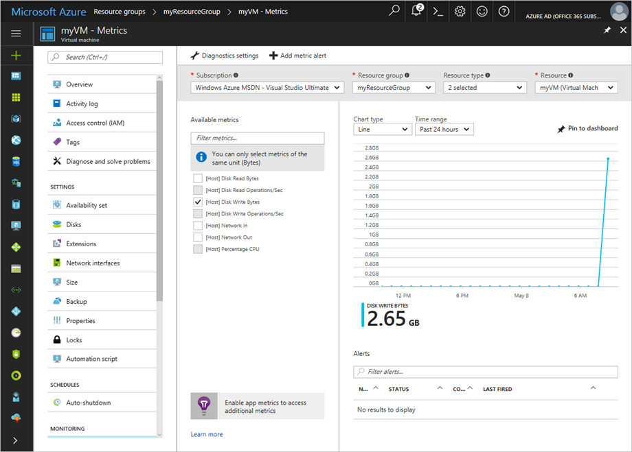

# Tutorial: Monitor a Windows virtual machine in Azure

Azure monitoring uses agents to collect boot and performance data from Azure VMs, store this data in Azure storage, and make it accessible through portal, the Azure PowerShell module, and Azure CLI. Advanced monitoring is delivered with Azure Monitor for VMs by collecting performance metrics, discover application components installed on the VM, and includes performance charts and dependency map.

In this tutorial, you learn how to:

> [!div class="checklist"]
> * Enable boot diagnostics on a VM
> * View boot diagnostics
> * View VM host metrics
> * Enable Azure Monitor for VMs
> * View VM performance metrics
> * Create an alert

## Launch Azure Cloud Shell

The Azure Cloud Shell is a free interactive shell that you can use to run the steps in this article. It has common Azure tools preinstalled and configured to use with your account. 

To open the Cloud Shell, just select **Try it** from the upper right corner of a code block. You can also launch Cloud Shell in a separate browser tab by going to [https://shell.azure.com/powershell](https://shell.azure.com/powershell). Select **Copy** to copy the blocks of code, paste it into the Cloud Shell, and press enter to run it.

## Create virtual machine

To configure Azure monitoring and update management in this tutorial, you need a Windows VM in Azure. First, set an administrator username and password for the VM with [Get-Credential](https://msdn.microsoft.com/powershell/reference/5.1/microsoft.powershell.security/Get-Credential):

```azurepowershell-interactive
$cred = Get-Credential
```

Now create the VM with [New-AzVM](https://docs.microsoft.com/powershell/module/az.compute/new-azvm). The following example creates a VM named *myVM* in the *EastUS* location. If they do not already exist, the resource group *myResourceGroupMonitorMonitor* and supporting network resources are created:

```azurepowershell-interactive
New-AzVm `
    -ResourceGroupName "myResourceGroupMonitor" `
    -Name "myVM" `
    -Location "East US" `
    -Credential $cred
```

It takes a few minutes for the resources and VM to be created.

## View boot diagnostics

As Windows virtual machines boot up, the boot diagnostic agent captures screen output that can be used for troubleshooting purpose. This capability is enabled by default. The captured screenshots are stored in an Azure storage account, which is also created by default.

You can get the boot diagnostic data with the [Get-​Azure​Rm​VM​Boot​Diagnostics​Data](https://docs.microsoft.com/powershell/module/az.compute/get-azvmbootdiagnosticsdata) command. In the following example, boot diagnostics are downloaded to the root of the *c:\* drive.

```powershell
Get-AzVMBootDiagnosticsData -ResourceGroupName "myResourceGroupMonitor" -Name "myVM" -Windows -LocalPath "c:\"
```

## View host metrics

A Windows VM has a dedicated Host VM in Azure that it interacts with. Metrics are automatically collected for the Host and can be viewed in the Azure portal.

1. In the Azure portal, click **Resource Groups**, select **myResourceGroupMonitor**, and then select **myVM** in the resource list.
2. Click **Metrics** on the VM blade, and then select any of the Host metrics under **Available metrics** to see how the Host VM is performing.

    

## Enable advanced monitoring

To enable monitoring of your Azure VM with Azure Monitor for VMs:

1. In the Azure portal, click **Resource Groups**, select **myResourceGroupMonitor**, and then select **myVM** in the resource list.

2. On the VM page, in the **Monitoring** section, select **Insights (preview)**.

3. On the **Insights (preview)** page, select **Try now**.

    

4. On the **Azure Monitor Insights Onboarding** page, if you have an existing Log Analytics workspace in the same subscription, select it in the drop-down list.  

    The list preselects the default workspace and location where the VM is deployed in the subscription. 

    >[!NOTE]
    >To create a new Log Analytics workspace to store the monitoring data from the VM, see [Create a Log Analytics workspace](../../azure-monitor/learn/quick-create-workspace.md). Your Log Analytics workspace must belong to one of the [supported regions](../../azure-monitor/insights/vminsights-enable-overview.md#log-analytics).

After you've enabled monitoring, you might need to wait several minutes before you can view the performance metrics for the VM.


## View VM performance metrics

Azure Monitor for VMs includes a set of performance charts that target several key performance indicators (KPIs) to help you determine how well a virtual machine is performing. To access from your VM, perform the following steps.

1. In the Azure portal, click **Resource Groups**, select **myResourceGroupMonitor**, and then select **myVM** in the resource list.

2. On the VM page, in the **Monitoring** section, select **Insights (preview)**.

3. Select the **Performance** tab.

This page not only includes performance utilization charts, but also a table showing for each logical disk discovered, its capacity, utilization, and total average by each measure.

## Create alerts

You can create alerts based on specific performance metrics. Alerts can be used to notify you when average CPU usage exceeds a certain threshold or available free disk space drops below a certain amount, for example. Alerts are displayed in the Azure portal or can be sent via email. You can also trigger Azure Automation runbooks or Azure Logic Apps in response to alerts being generated.

The following example creates an alert for average CPU usage.

1. In the Azure portal, click **Resource Groups**, select **myResourceGroupMonitor**, and then select **myVM** in the resource list.

2. Click **Alert rules** on the VM blade, then click **Add metric alert** across the top of the alerts blade.

3. Provide a **Name** for your alert, such as *myAlertRule*

4. To trigger an alert when CPU percentage exceeds 1.0 for five minutes, leave all the other defaults selected.

5. Optionally, check the box for *Email owners, contributors, and readers* to send email notification. The default action is to present a notification in the portal.

6. Click the **OK** button.

## Next steps

In this tutorial, you configured and viewed performance of your VM. You learned how to:

> [!div class="checklist"]
> * Create a resource group and VM
> * Enable boot diagnostics on the VM
> * View boot diagnostics
> * View host metrics
> * Enable Azure Monitor for VMs
> * View VM metrics
> * Create an alert

Advance to the next tutorial to learn about Azure Security Center.

> [!div class="nextstepaction"]
> [Manage VM security](../../security/fundamentals/overview.md)
