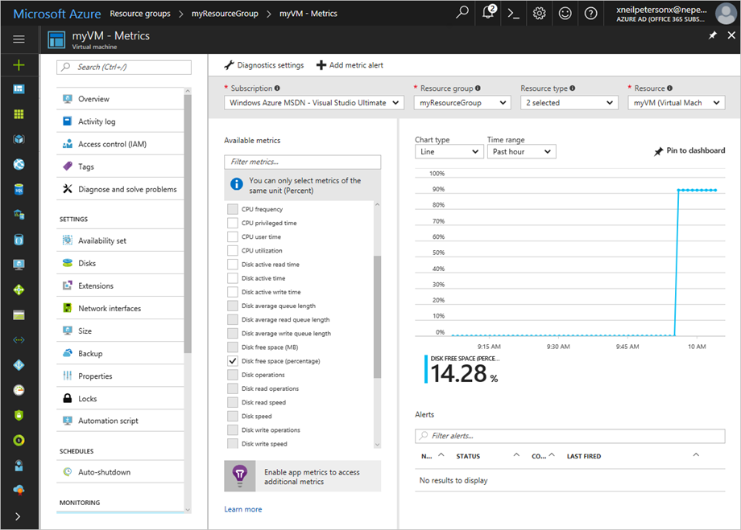

# Monitor a Windows Virtual Machine with Azure PowerShell

Azure monitoring uses agents to collect boot and performance data from Azure VMs, stores this data in Azure storage, and makes it accessible through portal, the Azure PowerShell module, and the Azure CLI. In this tutorial, you learn how to:

> [!div class="checklist"]
> * Enable boot diagnostics on a VM
> * View boot diagnostics
> * View VM host metrics
> * Install the diagnostics extension
> * View VM metrics
> * Create an alert
> * Set up advanced monitoring

This tutorial requires the Azure PowerShell module version 3.6 or later. Run ` Get-Module -ListAvailable AzureRM` to find the version. If you need to upgrade, see [Install Azure PowerShell module](/powershell/azure/install-azurerm-ps).

To complete the example in this tutorial, you must have an existing virtual machine. If needed, this [script sample](../scripts/virtual-machines-windows-powershell-sample-create-vm.md) can create one for you. When working through the tutorial, replace the resource group and VM names where needed.

## View boot diagnostics

As Windows virtual machines boot up, the boot diagnostic agent captures screen output that can be used for troubleshooting purpose. This capability is enabled by default. The capture screen shots are stored in an Azure storage account which is also created by default. 

You can get the boot diagnostic data with the [Get-​Azure​Rm​VM​Boot​Diagnostics​Data](https://docs.microsoft.com/powershell/module/azurerm.compute/get-azurermvmbootdiagnosticsdata) command. In the following example, the boot diagnostics is downloaded to the root of the *c:\* drive. 

```powershell
Get-AzureRmVMBootDiagnosticsData -ResourceGroupName myResourceGroup -Name myVM -Windows -LocalPath "c:\"
```

## View host metrics

A Windows VM has a dedicated Host VM in Azure that it interacts with. Metrics are automatically collected for the Host VM that you can easily view in the Azure portal.

1. In the Azure portal, click **Resource Groups**, select **myResourceGroup**, and then select **myVM** in the resource list.
2. Click **Metrics** on the VM blade, and then select any of the Host metrics under **Available metrics** to see how the Host VM is performing.


## Install diagnostics extension

[Azure Diagnostics](https://docs.microsoft.com/azure/monitoring-and-diagnostics/monitoring-overview-of-diagnostic-logs) enables the collection of diagnostic data from a VM.

When installing the diagnostic extension, a configuration file is required that defines the collected metrics. When creating this file, you need the name of a storage account to hold the diagnostic data, and the Id of your Azure subscription.

Use the [Get-AzureRmStorageAccount](/powershell/module/azurerm.storage/get-azurermstorageaccount) command to get the name of the storage account. In this example, the storage account that was auto created for boot diagnostics is used.

```powershell
Get-AzureRmStorageAccount -ResourceGroupName myResourceGroup | Select StorageAccountName
```

Use the [Get-AzureRmSubscription](/powershell/module/azurerm.profile/get-azurermsubscription) command to get your Azure subscription Id.

```powershell
Get-AzureRmSubscription | Select SubscriptionId
```

Create a file named diagnosticsconfig.xml. In this example, the file is stored on the root of the *c:\* drive.

```powershell
New-Item -ItemType File c:\diagnosticsconfig.xml
```

Copy this XML into the *diagnosticsconfig.xml * file.

```xml
<?xml version="1.0" encoding="utf-8"?>
  <PublicConfig xmlns="http://schemas.microsoft.com/ServiceHosting/2010/10/DiagnosticsConfiguration">
    <WadCfg>
      <DiagnosticMonitorConfiguration overallQuotaInMB="4096">
        <DiagnosticInfrastructureLogs scheduledTransferLogLevelFilter="Error"/>
        <PerformanceCounters scheduledTransferPeriod="PT1M">
        <PerformanceCounterConfiguration counterSpecifier="\Processor(_Total)\% Processor Time" sampleRate="PT15S" unit="Percent">
          <annotation displayName="CPU utilization" locale="en-us"/>
        </PerformanceCounterConfiguration>
        <PerformanceCounterConfiguration counterSpecifier="\Processor(_Total)\% Privileged Time" sampleRate="PT15S" unit="Percent">
          <annotation displayName="CPU privileged time" locale="en-us"/>
        </PerformanceCounterConfiguration>
        <PerformanceCounterConfiguration counterSpecifier="\Processor(_Total)\% User Time" sampleRate="PT15S" unit="Percent">
          <annotation displayName="CPU user time" locale="en-us"/>
        </PerformanceCounterConfiguration>
        <PerformanceCounterConfiguration counterSpecifier="\Processor Information(_Total)\Processor Frequency" sampleRate="PT15S" unit="Count">
          <annotation displayName="CPU frequency" locale="en-us"/>
        </PerformanceCounterConfiguration>
        <PerformanceCounterConfiguration counterSpecifier="\System\Processes" sampleRate="PT15S" unit="Count">
          <annotation displayName="Processes" locale="en-us"/>
        </PerformanceCounterConfiguration>
        <PerformanceCounterConfiguration counterSpecifier="\Process(_Total)\Thread Count" sampleRate="PT15S" unit="Count">
          <annotation displayName="Threads" locale="en-us"/>
        </PerformanceCounterConfiguration>
        <PerformanceCounterConfiguration counterSpecifier="\Process(_Total)\Handle Count" sampleRate="PT15S" unit="Count">
          <annotation displayName="Handles" locale="en-us"/>
        </PerformanceCounterConfiguration>
        <PerformanceCounterConfiguration counterSpecifier="\Memory\% Committed Bytes In Use" sampleRate="PT15S" unit="Percent">
          <annotation displayName="Memory usage" locale="en-us"/>
        </PerformanceCounterConfiguration>
        <PerformanceCounterConfiguration counterSpecifier="\Memory\Available Bytes" sampleRate="PT15S" unit="Bytes">
          <annotation displayName="Memory available" locale="en-us"/>
        </PerformanceCounterConfiguration>
        <PerformanceCounterConfiguration counterSpecifier="\Memory\Committed Bytes" sampleRate="PT15S" unit="Bytes">
          <annotation displayName="Memory committed" locale="en-us"/>
        </PerformanceCounterConfiguration>
        <PerformanceCounterConfiguration counterSpecifier="\Memory\Commit Limit" sampleRate="PT15S" unit="Bytes">
          <annotation displayName="Memory commit limit" locale="en-us"/>
        </PerformanceCounterConfiguration>
        <PerformanceCounterConfiguration counterSpecifier="\Memory\Pool Paged Bytes" sampleRate="PT15S" unit="Bytes">
          <annotation displayName="Memory paged pool" locale="en-us"/>
        </PerformanceCounterConfiguration>
        <PerformanceCounterConfiguration counterSpecifier="\Memory\Pool Nonpaged Bytes" sampleRate="PT15S" unit="Bytes">
          <annotation displayName="Memory non-paged pool" locale="en-us"/>
        </PerformanceCounterConfiguration>
        <PerformanceCounterConfiguration counterSpecifier="\PhysicalDisk(_Total)\% Disk Time" sampleRate="PT15S" unit="Percent">
          <annotation displayName="Disk active time" locale="en-us"/>
        </PerformanceCounterConfiguration>
        <PerformanceCounterConfiguration counterSpecifier="\PhysicalDisk(_Total)\% Disk Read Time" sampleRate="PT15S" unit="Percent">
          <annotation displayName="Disk active read time" locale="en-us"/>
        </PerformanceCounterConfiguration>
        <PerformanceCounterConfiguration counterSpecifier="\PhysicalDisk(_Total)\% Disk Write Time" sampleRate="PT15S" unit="Percent">
          <annotation displayName="Disk active write time" locale="en-us"/>
        </PerformanceCounterConfiguration>
        <PerformanceCounterConfiguration counterSpecifier="\PhysicalDisk(_Total)\Disk Transfers/sec" sampleRate="PT15S" unit="CountPerSecond">
          <annotation displayName="Disk operations" locale="en-us"/>
        </PerformanceCounterConfiguration>
        <PerformanceCounterConfiguration counterSpecifier="\PhysicalDisk(_Total)\Disk Reads/sec" sampleRate="PT15S" unit="CountPerSecond">
          <annotation displayName="Disk read operations" locale="en-us"/>
        </PerformanceCounterConfiguration>
        <PerformanceCounterConfiguration counterSpecifier="\PhysicalDisk(_Total)\Disk Writes/sec" sampleRate="PT15S" unit="CountPerSecond">
          <annotation displayName="Disk write operations" locale="en-us"/>
        </PerformanceCounterConfiguration>
        <PerformanceCounterConfiguration counterSpecifier="\PhysicalDisk(_Total)\Disk Bytes/sec" sampleRate="PT15S" unit="BytesPerSecond">
          <annotation displayName="Disk speed" locale="en-us"/>
        </PerformanceCounterConfiguration>
        <PerformanceCounterConfiguration counterSpecifier="\PhysicalDisk(_Total)\Disk Read Bytes/sec" sampleRate="PT15S" unit="BytesPerSecond">
          <annotation displayName="Disk read speed" locale="en-us"/>
        </PerformanceCounterConfiguration>
        <PerformanceCounterConfiguration counterSpecifier="\PhysicalDisk(_Total)\Disk Write Bytes/sec" sampleRate="PT15S" unit="BytesPerSecond">
          <annotation displayName="Disk write speed" locale="en-us"/>
        </PerformanceCounterConfiguration>
        <PerformanceCounterConfiguration counterSpecifier="\PhysicalDisk(_Total)\Avg. Disk Queue Length" sampleRate="PT15S" unit="Count">
          <annotation displayName="Disk average queue length" locale="en-us"/>
        </PerformanceCounterConfiguration>
        <PerformanceCounterConfiguration counterSpecifier="\PhysicalDisk(_Total)\Avg. Disk Read Queue Length" sampleRate="PT15S" unit="Count">
          <annotation displayName="Disk average read queue length" locale="en-us"/>
        </PerformanceCounterConfiguration>
        <PerformanceCounterConfiguration counterSpecifier="\PhysicalDisk(_Total)\Avg. Disk Write Queue Length" sampleRate="PT15S" unit="Count">
          <annotation displayName="Disk average write queue length" locale="en-us"/>
        </PerformanceCounterConfiguration>
        <PerformanceCounterConfiguration counterSpecifier="\LogicalDisk(_Total)\% Free Space" sampleRate="PT15S" unit="Percent">
          <annotation displayName="Disk free space (percentage)" locale="en-us"/>
        </PerformanceCounterConfiguration>
        <PerformanceCounterConfiguration counterSpecifier="\LogicalDisk(_Total)\Free Megabytes" sampleRate="PT15S" unit="Count">
          <annotation displayName="Disk free space (MB)" locale="en-us"/>
        </PerformanceCounterConfiguration>
      </PerformanceCounters>
      <Metrics resourceId="/subscriptions/{subscriptionId}/resourceGroups/myResourceGroup/providers/Microsoft.Compute/virtualMachines/myVM" >
          <MetricAggregation scheduledTransferPeriod="PT1H"/>
          <MetricAggregation scheduledTransferPeriod="PT1M"/>
      </Metrics>
      <WindowsEventLog scheduledTransferPeriod="PT1M">
        <DataSource name="Application!*[System[(Level = 1 or Level = 2)]]"/>
        <DataSource name="Security!*[System[(Level = 1 or Level = 2)]"/>
        <DataSource name="System!*[System[(Level = 1 or Level = 2)]]"/>
      </WindowsEventLog>
        </DiagnosticMonitorConfiguration>
      </WadCfg>
      <StorageAccount>mydiagnosticsstorage</StorageAccount>
  </PublicConfig>
```
Update this line, replacing *{subscriptionId}* with your subscription Id. 

```xml
<Metrics resourceId="/subscriptions/{subscriptionId}/resourceGroups/myResourceGroup/providers/Microsoft.Compute/virtualMachines/myVM" >
```

When completed, it should look like this.

```xml
<Metrics resourceId="/subscriptions/aaaaaaaa-bbbb-cccc-dddd-eeeeeeeeeeee/resourceGroups/myResourceGroup/providers/Microsoft.Compute/virtualMachines/myVM" >
```

Finally, update this line, replacing *mydiagnosticsstorage* with the name of your storage account. 

```xml
<StorageAccount>mydiagnosticsstorage</StorageAccount>
```

Now you can install the diagnostic extension with the [Set-AzureRmVMDiagnosticsExtension](https://docs.microsoft.com/powershell/module/azurerm.compute/set-azurermvmdiagnosticsextension) command.

```powershell
Set-AzureRmVMDiagnosticsExtension ` 
  -ResourceGroupName myResourceGroup `
  -VMName myVM `
  -DiagnosticsConfigurationPath c:\diagnosticsPubConfig.xml
```

## View VM metrics

You can view the VM metrics in the same way that you viewed the Host VM metrics:

1. In the Azure portal, click **Resource Groups**, select **myResourceGroup**, and then select **myVM** in the resource list.
2. To see how the VM is performing, click **Metrics** on the VM blade, and then select any of the diagnostics metrics under **Available metrics** 



## Create alerts

Azure activity alerts provide automation in response to diagnostic data. For example, a rule can be configured to fire after CPU utilization has been higher than 50% over a specified amount of time. This alert can send an email, an SMS message, or send an HTTP post to a rest endpoint. Azure Automation Runbooks, and / or Azure logic apps can also be configured to fire because of an alert.

Use the [New-AzureRmAlertRuleEmail](https://docs.microsoft.com/powershell/module/azurerm.insights/new-azurermalertruleemail) command to configure an alert action, in this case that the alert should send an email. This example configures the Azure service owners as the recipient of the alert email. 

```powershell
$action = New-AzureRmAlertRuleEmail -SendToServiceOwners
```

Next, use the [Add-AzureRmMetricAlertRule](https://docs.microsoft.com/powershell/module/azurerm.insights/add-azurermmetricalertrule) to create an alert rule. This example creates a times span of 5 minutes. The rule is then created which defines that if CPU utilization is greater than 1 for the time span of 5 minutes, the alert will fire.

```powershell
$vmName = "myVM"
$resourceGroup = "myResourceGroup"
$subscriptionId = Get-AzureRmSubscription | Select SubscriptionId

$time = New-TimeSpan -Minutes 5

Add-AzureRmMetricAlertRule -ResourceGroup $resourceGroup `
  -WindowSize $time `
  -Operator GreaterThan `
  -Threshold 1 `
  -TargetResourceId "/subscriptions/$subscriptionId/resourceGroups/myResourceGroupMonitor/providers/Microsoft.Compute/virtualMachines/$vmName" `
  -MetricName "Percentage CPU" `
  -TimeAggregationOperator Total `
  -Location eastus `
  -Name cpu-alert `
  -Actions $action
```

## Advanced monitoring 

You can do more advanced monitoring of your VM by using [Operations Management Suite](https://docs.microsoft.com/azure/operations-management-suite/operations-management-suite-overview). If you haven't already done so, you can sign up for a [free trial](https://www.microsoft.com/en-us/cloud-platform/operations-management-suite-trial) of Operations Management Suite.

When you have access to the OMS portal, you can find the workspace key and workspace identifier on the Settings blade. Replace <workspace-key> and <workspace-id> with the values for from your OMS workspace and then you can use [Set-AzureRmVMExtension](https://docs.microsoft.com/powershell/module/azurerm.compute/set-azurermvmextension) to add the OMS extension to the VM:

```powershell
Set-AzureRmVMExtension -ResourceGroupName myResourceGroup `
  -ExtensionName "Microsoft.EnterpriseCloud.Monitoring" `
  -VMName myVM `
  -Publisher "Microsoft.EnterpriseCloud.Monitoring" `
  -ExtensionType "MicrosoftMonitoringAgent" `
  -TypeHandlerVersion 1.0 `
  -Settings @{"workspaceId" = "<workspace-id>"} `
  -ProtectedSettings @{"workspaceKey" = "<workspace-key>"} `
  -Location eastus
```

On the Log Search blade of the OMS portal, you should see `myVM` such as what is shown in the following picture:


## Next steps
In this tutorial, you configured and reviewed VMs with Azure Security Center. You learned how to:

> [!div class="checklist"]
> * Create a virtual network
> * Create a resource group and VM 
> * Enable boot diagnostics on the VM
> * View boot diagnostics
> * View host metrics
> * Install the diagnostics extension
> * View VM metrics
> * Create an alert
> * Set up advanced monitoring

Advance to the next tutorial to learn about Azure security center.

> [!div class="nextstepaction"]
> [Manage VM security](./tutorial-azure-security.md)