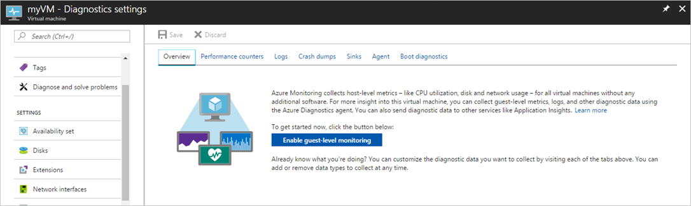
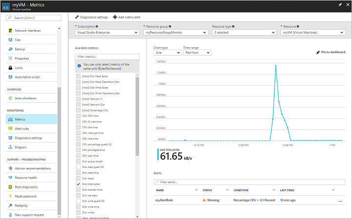

# Monitor a Windows Virtual Machine with Azure PowerShell

Azure monitoring uses agents to collect boot and performance data from Azure VMs, store this data in Azure storage, and make it accessible through portal, the Azure PowerShell module, and the Azure CLI. In this tutorial, you learn how to:

> [!div class="checklist"]
> * Enable boot diagnostics on a VM
> * View boot diagnostics
> * View VM host metrics
> * Install the diagnostics extension
> * View VM metrics
> * Create an alert
> * Set up advanced monitoring

This tutorial requires the Azure PowerShell module version 3.6 or later. Run ` Get-Module -ListAvailable AzureRM` to find the version. If you need to upgrade, see [Install Azure PowerShell module](/powershell/azure/install-azurerm-ps).

To complete the example in this tutorial, you must have an existing virtual machine. If needed, this [script sample](../scripts/virtual-machines-windows-powershell-sample-create-vm.md) can create one for you. When working through the tutorial, replace the resource group, VM name, and location where needed.

## View boot diagnostics

As Windows virtual machines boot up, the boot diagnostic agent captures screen output that can be used for troubleshooting purpose. This capability is enabled by default. The captured screen shots are stored in an Azure storage account, which is also created by default. 

You can get the boot diagnostic data with the [Get-​Azure​Rm​VM​Boot​Diagnostics​Data](https://docs.microsoft.com/powershell/module/azurerm.compute/get-azurermvmbootdiagnosticsdata) command. In the following example, boot diagnostics are downloaded to the root of the *c:\* drive. 

```powershell
Get-AzureRmVMBootDiagnosticsData -ResourceGroupName myResourceGroup -Name myVM -Windows -LocalPath "c:\"
```

## View host metrics

A Windows VM has a dedicated Host VM in Azure that it interacts with. Metrics are automatically collected for the Host and can be viewed in the Azure portal.

1. In the Azure portal, click **Resource Groups**, select **myResourceGroup**, and then select **myVM** in the resource list.
2. Click **Metrics** on the VM blade, and then select any of the Host metrics under **Available metrics** to see how the Host VM is performing.

    

## Install diagnostics extension

The basic host metrics are available, but to see more granular and VM-specific metrics, you to need to install the Azure diagnostics extension on the VM. The Azure diagnostics extension allows additional monitoring and diagnostics data to be retrieved from the VM. You can view these performance metrics and create alerts based on how the VM performs. The diagnostic extension is installed through the Azure portal as follows:

1. In the Azure portal, click **Resource Groups**, select **myResourceGroup**, and then select **myVM** in the resource list.
2. Click **Diagnosis settings**. The list shows that *Boot diagnostics* are already enabled from the previous section. Click the check box for *Basic metrics*.
3. Click the **Enable guest-level monitoring** button.

    

## View VM metrics

You can view the VM metrics in the same way that you viewed the host VM metrics:

1. In the Azure portal, click **Resource Groups**, select **myResourceGroup**, and then select **myVM** in the resource list.
2. To see how the VM is performing, click **Metrics** on the VM blade, and then select any of the diagnostics metrics under **Available metrics**.

    

## Create alerts

You can create alerts based on specific performance metrics. Alerts can be used to notify you when average CPU usage exceeds a certain threshold or available free disk space drops below a certain amount, for example. Alerts are displayed in the Azure portal or can be sent via email. You can also trigger Azure Automation runbooks or Azure Logic Apps in response to alerts being generated.

The following example creates an alert for average CPU usage.

1. In the Azure portal, click **Resource Groups**, select **myResourceGroup**, and then select **myVM** in the resource list.
2. Click **Alert rules** on the VM blade, then click **Add metric alert** across the top of the alerts blade.
4. Provide a **Name** for your alert, such as *myAlertRule*
5. To trigger an alert when CPU percentage exceeds 1.0 for five minutes, leave all the other defaults selected.
6. Optionally, check the box for *Email owners, contributors, and readers* to send email notification. The default action is to present a notification in the portal.
7. Click the **OK** button.

## Advanced monitoring 

You can do more advanced monitoring of your VM by using [Operations Management Suite](https://docs.microsoft.com/azure/operations-management-suite/operations-management-suite-overview). If you haven't already done so, you can sign up for a [free trial](https://www.microsoft.com/en-us/cloud-platform/operations-management-suite-trial) of Operations Management Suite.

When you have access to the OMS portal, you can find the workspace key and workspace identifier on the Settings blade. Use the [Set-AzureRmVMExtension](https://docs.microsoft.com/powershell/module/azurerm.compute/set-azurermvmextension) cmmand to to add the OMS extension to the VM. Update the variable values in the below sample to reflect you OMS workspace key and workspace Id.  

```powershell
$omsId = "<Replace with your OMS Id>"
$omsKey = "<Replace with your OMS key>"

Set-AzureRmVMExtension -ResourceGroupName myResourceGroup `
  -ExtensionName "Microsoft.EnterpriseCloud.Monitoring" `
  -VMName myVM `
  -Publisher "Microsoft.EnterpriseCloud.Monitoring" `
  -ExtensionType "MicrosoftMonitoringAgent" `
  -TypeHandlerVersion 1.0 `
  -Settings @{"workspaceId" = $omsId} `
  -ProtectedSettings @{"workspaceKey" = $omsKey} `
  -Location eastus
```

After a few minutes, you should see the new VM in the OMS workspace. 


## Next steps
In this tutorial, you configured and reviewed VMs with Azure Security Center. You learned how to:

> [!div class="checklist"]
> * Create a virtual network
> * Create a resource group and VM 
> * Enable boot diagnostics on the VM
> * View boot diagnostics
> * View host metrics
> * Install the diagnostics extension
> * View VM metrics
> * Create an alert
> * Set up advanced monitoring

Advance to the next tutorial to learn about Azure security center.

> [!div class="nextstepaction"]
> [Manage VM security](./tutorial-azure-security.md)