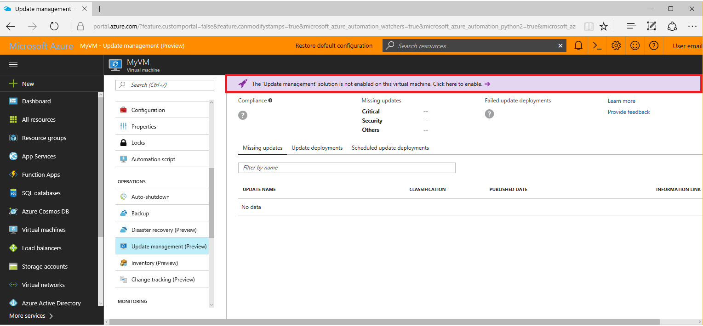
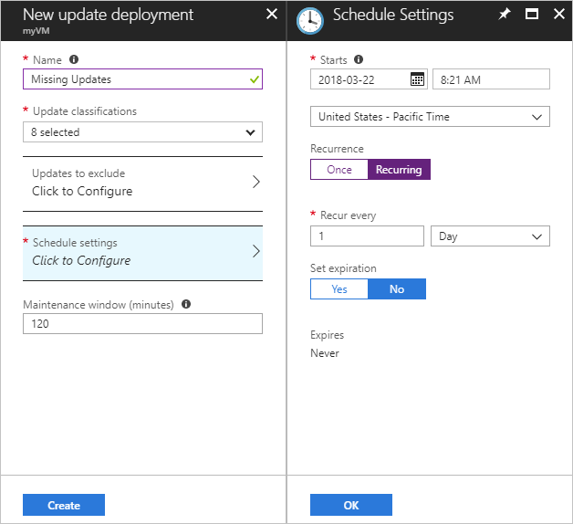

# Monitor and update a Windows Virtual Machine with Azure PowerShell

Azure monitoring uses agents to collect boot and performance data from Azure VMs, store this data in Azure storage, and make it accessible through portal, the Azure PowerShell module, and the Azure CLI. Update management allows you to manage updates and patches for your Azure Windows VMs.

In this tutorial, you learn how to:

> [!div class="checklist"]
> * Enable boot diagnostics on a VM
> * View boot diagnostics
> * View VM host metrics
> * Install the diagnostics extension
> * View VM metrics
> * Create an alert
> * Manage Windows updates
> * Set up advanced monitoring

This tutorial requires the Azure PowerShell module version 3.6 or later. Run ` Get-Module -ListAvailable AzureRM` to find the version. If you need to upgrade, see [Install Azure PowerShell module](/powershell/azure/install-azurerm-ps).

To complete the example in this tutorial, you must have an existing virtual machine. If needed, this [script sample](../scripts/virtual-machines-windows-powershell-sample-create-vm.md) can create one for you. When working through the tutorial, replace the resource group, VM name, and location where needed.

## View boot diagnostics

As Windows virtual machines boot up, the boot diagnostic agent captures screen output that can be used for troubleshooting purpose. This capability is enabled by default. The captured screen shots are stored in an Azure storage account, which is also created by default. 

You can get the boot diagnostic data with the [Get-​Azure​Rm​VM​Boot​Diagnostics​Data](https://docs.microsoft.com/powershell/module/azurerm.compute/get-azurermvmbootdiagnosticsdata) command. In the following example, boot diagnostics are downloaded to the root of the *c:\* drive. 

```powershell
Get-AzureRmVMBootDiagnosticsData -ResourceGroupName myResourceGroup -Name myVM -Windows -LocalPath "c:\"
```

## View host metrics

A Windows VM has a dedicated Host VM in Azure that it interacts with. Metrics are automatically collected for the Host and can be viewed in the Azure portal.

1. In the Azure portal, click **Resource Groups**, select **myResourceGroup**, and then select **myVM** in the resource list.
2. Click **Metrics** on the VM blade, and then select any of the Host metrics under **Available metrics** to see how the Host VM is performing.

    

## Install diagnostics extension

The basic host metrics are available, but to see more granular and VM-specific metrics, you to need to install the Azure diagnostics extension on the VM. The Azure diagnostics extension allows additional monitoring and diagnostics data to be retrieved from the VM. You can view these performance metrics and create alerts based on how the VM performs. The diagnostic extension is installed through the Azure portal as follows:

1. In the Azure portal, click **Resource Groups**, select **myResourceGroup**, and then select **myVM** in the resource list.
2. Click **Diagnosis settings**. The list shows that *Boot diagnostics* are already enabled from the previous section. Click the check box for *Basic metrics*.
3. Click the **Enable guest-level monitoring** button.

    

## View VM metrics

You can view the VM metrics in the same way that you viewed the host VM metrics:

1. In the Azure portal, click **Resource Groups**, select **myResourceGroup**, and then select **myVM** in the resource list.
2. To see how the VM is performing, click **Metrics** on the VM blade, and then select any of the diagnostics metrics under **Available metrics**.

    

## Create alerts

You can create alerts based on specific performance metrics. Alerts can be used to notify you when average CPU usage exceeds a certain threshold or available free disk space drops below a certain amount, for example. Alerts are displayed in the Azure portal or can be sent via email. You can also trigger Azure Automation runbooks or Azure Logic Apps in response to alerts being generated.

The following example creates an alert for average CPU usage.

1. In the Azure portal, click **Resource Groups**, select **myResourceGroup**, and then select **myVM** in the resource list.
2. Click **Alert rules** on the VM blade, then click **Add metric alert** across the top of the alerts blade.
4. Provide a **Name** for your alert, such as *myAlertRule*
5. To trigger an alert when CPU percentage exceeds 1.0 for five minutes, leave all the other defaults selected.
6. Optionally, check the box for *Email owners, contributors, and readers* to send email notification. The default action is to present a notification in the portal.
7. Click the **OK** button.

## Manage Windows updates

Update management allows you to manage updates and patches for your Azure Windows VMs.
Directly from your VM, you can quickly assess the status of available updates, schedule installation of required updates, and review deployment results to verify updates were applied successfully to the VM.

For pricing information, see [Automation pricing for Update management](https://azure.microsoft.com/pricing/details/automation/)

### Enable Update management

Enable Update management for your VM:
 
1. On the left-hand side of the screen, select **Virtual machines**.
2. From the list, select a VM.
3. On the VM screen, in the **Operations** section, click **Update management**. The **Enable Update Management** screen opens.

Validation is performed to determine if Update management is enabled for this VM. The validation includes checks for a Log Analytics workspace and linked Automation account, and if the solution is in the workspace.

A Log Analytics workspace is used to collect data that is generated by features and services such as Update management. The workspace provides a single location to review and analyze data from multiple sources. To perform additional action on VMs that require updates, Azure Automation allows you to run scripts against VMs, such as to download and apply updates.

The validation process also checks to see if the VM is provisioned with the Microsoft Monitoring Agent (MMA) and hybrid worker. This agent is used to communicate with the VM and obtain information about the update status. 

If these prerequisites are not met, a banner appears that gives you the option to enable the solution.



Click the banner to enable the solution. If any of the following prerequisites were found to be missing after the validation, they will be automatically added:

* [Log Analytics](../../log-analytics/log-analytics-overview.md) workspace
* [Automation](../../automation/automation-offering-get-started.md)
* A [Hybrid runbook worker](../../automation/automation-hybrid-runbook-worker.md) is enabled on the VM

The **Enable Update Management** screen opens. Configure the settings, and click **Enable**.


Enabling the solution can take up to 15 minutes, and during this time you should not close the browser window. After the solution is enabled, information about missing updates on the VM flows to Log Analytics.
It can take between 30 minutes and 6 hours for the data to be available for analysis.

### View update assessment

After **Update management** is enabled, the **Update management** screen appears. You can see a list of missing updates on the **Missing updates** tab.

 

### Schedule an update deployment

To install updates, schedule a deployment that follows your release schedule and service window.
You can choose which update types to include in the deployment. For example, you can include critical or security updates and exclude update rollups.

Schedule a new Update Deployment for the VM by clicking **Schedule update deployment** at the top of the **Update management** screen. 
In the **New update deployment** screen, specify the following information:

* **Name** - Provide a unique name to identify the update deployment.
* **Update classification** - Select the types of software the update deployment included in the deployment. The classification types are:
  * Critical updates
  * Security updates
  * Update rollups
  * Feature packs
  * Service packs
  * Definition updates
  * Tools
  * Updates

* **Schedule settings** - You can either accept the default date and time, which is 30 minutes after current time, or specify a different time.
  You can also specify whether the deployment occurs once or set up a recurring schedule. Click the Recurring option under Recurrence to set up a recurring schedule.

  

* **Maintenance window (minutes)** - Specify the period of time you want the update deployment to occur within.  This helps ensure changes are performed within your defined service windows.

After you have completed configuring the schedule, click **Create** button and you return to the status dashboard.
Notice that the **Scheduled** table shows the deployment schedule you created.

> [!WARNING]
> For updates that require a reboot, the VM is restarted automatically.

### View results of an update deployment

After the scheduled deployment is started, you can see the status for that deployment on the **Update deployments** tab on the **Update management** screen.
If it is currently running, it's status shows as **In progress**. After it completes, if successful, it changes to **Succeeded**.
If there is a failure with one or more updates in the deployment, the status is **Partially failed**.
Click the completed update deployment to see the dashboard for that update deployment.

   

In **Update results** tile is a summary of the total number of updates and deployment results on the VM.
In the table to the right is a detailed breakdown of each update and the installation results, which could be one of the following values:

* **Not attempted** - the update was not installed because there was insufficient time available based on the maintenance window duration defined.
* **Succeeded** - the update succeeded
* **Failed** - the update failed

Click **All logs** to see all log entries that the deployment created.

Click the **Output** tile to see job stream of the runbook responsible for managing the update deployment on the target VM.

Click **Errors** to see detailed information about any errors from the deployment.

## Advanced monitoring 

You can do more advanced monitoring of your VM by using [Operations Management Suite](https://docs.microsoft.com/azure/operations-management-suite/operations-management-suite-overview). If you haven't already done so, you can sign up for a [free trial](https://www.microsoft.com/en-us/cloud-platform/operations-management-suite-trial) of Operations Management Suite.

When you have access to the OMS portal, you can find the workspace key and workspace identifier on the Settings blade. Use the [Set-AzureRmVMExtension](https://docs.microsoft.com/powershell/module/azurerm.compute/set-azurermvmextension) command to add the OMS extension to the VM. Update the variable values in the below sample to reflect you OMS workspace key and workspace Id.  

```powershell
$omsId = "<Replace with your OMS Id>"
$omsKey = "<Replace with your OMS key>"

Set-AzureRmVMExtension -ResourceGroupName myResourceGroup `
  -ExtensionName "Microsoft.EnterpriseCloud.Monitoring" `
  -VMName myVM `
  -Publisher "Microsoft.EnterpriseCloud.Monitoring" `
  -ExtensionType "MicrosoftMonitoringAgent" `
  -TypeHandlerVersion 1.0 `
  -Settings @{"workspaceId" = $omsId} `
  -ProtectedSettings @{"workspaceKey" = $omsKey} `
  -Location eastus
```

After a few minutes, you should see the new VM in the OMS workspace. 


## Next steps
In this tutorial, you configured and reviewed VMs with Azure Security Center. You learned how to:

> [!div class="checklist"]
> * Create a virtual network
> * Create a resource group and VM 
> * Enable boot diagnostics on the VM
> * View boot diagnostics
> * View host metrics
> * Install the diagnostics extension
> * View VM metrics
> * Create an alert
> * Manage Windows updates
> * Set up advanced monitoring

Advance to the next tutorial to learn about Azure security center.

> [!div class="nextstepaction"]
> [Manage VM security](./tutorial-azure-security.md)