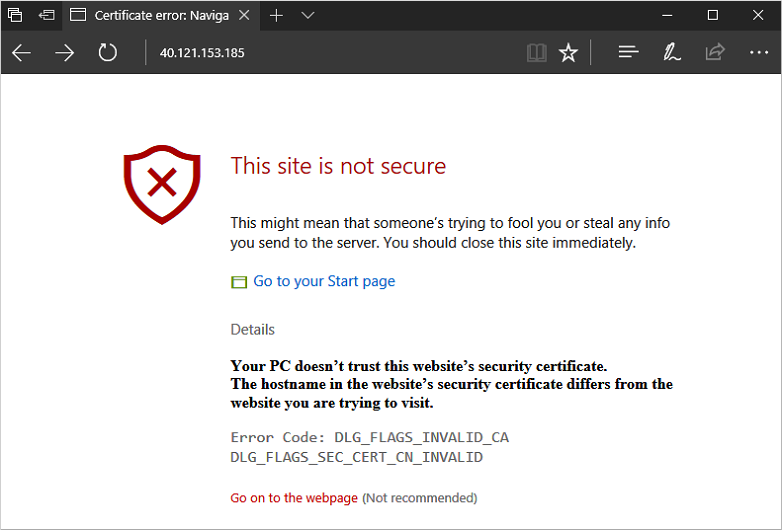

---
title: Tutorial - Secure a Windows web server with SSL certificates in Azure | Microsoft Docs
description: In this tutorial, you learn how to use Azure PowerShell to secure a Windows virtual machine that runs the IIS web server with SSL certificates stored in Azure Key Vault.
services: virtual-machines-windows
documentationcenter: virtual-machines
author: cynthn
manager: jeconnoc
editor: tysonn
tags: azure-resource-manager

ms.assetid: 
ms.service: virtual-machines-windows
ms.devlang: na
ms.topic: tutorial
ms.tgt_pltfrm: vm-windows
ms.workload: infrastructure
ms.date: 02/09/2018
ms.author: cynthn
ms.custom: mvc

#Customer intent: As an IT administrator or developer, I want to learn how to secure a web server with SSL certificates so that I can protect my customer data on web applications that I build and run.
---

# Tutorial: Secure a web server on a Windows virtual machine in Azure with SSL certificates stored in Key Vault

To secure web servers, a Secure Sockets Layer (SSL) certificate can be used to encrypt web traffic. These SSL certificates can be stored in Azure Key Vault, and allow secure deployments of certificates to Windows virtual machines (VMs) in Azure. In this tutorial you learn how to:

> [!div class="checklist"]
> * Create an Azure Key Vault
> * Generate or upload a certificate to the Key Vault
> * Create a VM and install the IIS web server
> * Inject the certificate into the VM and configure IIS with an SSL binding

[!INCLUDE [cloud-shell-powershell.md](../../../includes/cloud-shell-powershell.md)]

If you choose to install and use the PowerShell locally, this tutorial requires the Azure PowerShell module version 5.7.0 or later. Run `Get-Module -ListAvailable AzureRM` to find the version. If you need to upgrade, see [Install Azure PowerShell module](/powershell/azure/install-azurerm-ps). If you are running PowerShell locally, you also need to run `Connect-AzureRmAccount` to create a connection with Azure.


## Overview
Azure Key Vault safeguards cryptographic keys and secrets, such certificates or passwords. Key Vault helps streamline the certificate management process and enables you to maintain control of keys that access those certificates. You can create a self-signed certificate inside Key Vault, or upload an existing, trusted certificate that you already own.

Rather than using a custom VM image that includes certificates baked-in, you inject certificates into a running VM. This process ensures that the most up-to-date certificates are installed on a web server during deployment. If you renew or replace a certificate, you don't also have to create a new custom VM image. The latest certificates are automatically injected as you create additional VMs. During the whole process, the certificates never leave the Azure platform or are exposed in a script, command-line history, or template.


## Create an Azure Key Vault
Before you can create a Key Vault and certificates, create a resource group with [New-AzureRmResourceGroup](/powershell/module/azurerm.resources/new-azurermresourcegroup). The following example creates a resource group named *myResourceGroupSecureWeb* in the *East US* location:

```azurepowershell-interactive
$resourceGroup = "myResourceGroupSecureWeb"
$location = "East US"
New-AzureRmResourceGroup -ResourceGroupName $resourceGroup -Location $location
```

Next, create a Key Vault with [New-​Azure​Rm​Key​Vault](/powershell/module/azurerm.keyvault/new-azurermkeyvault). Each Key Vault requires a unique name, and should be all lower case. Replace `mykeyvault` in the following example with your own unique Key Vault name:

```azurepowershell-interactive
$keyvaultName="mykeyvault"
New-AzureRmKeyVault -VaultName $keyvaultName `
    -ResourceGroup $resourceGroup `
    -Location $location `
    -EnabledForDeployment
```

## Generate a certificate and store in Key Vault
For production use, you should import a valid certificate signed by trusted provider with [Import-​Azure​Key​Vault​Certificate](/powershell/module/azurerm.keyvault/import-azurekeyvaultcertificate). For this tutorial, the following example shows how you can generate a self-signed certificate with [Add-AzureKeyVaultCertificate](/powershell/module/azurerm.keyvault/add-azurekeyvaultcertificate) that uses the default certificate policy from [New-AzureKeyVaultCertificatePolicy](/powershell/module/azurerm.keyvault/new-azurekeyvaultcertificatepolicy). 

```azurepowershell-interactive
$policy = New-AzureKeyVaultCertificatePolicy `
    -SubjectName "CN=www.contoso.com" `
    -SecretContentType "application/x-pkcs12" `
    -IssuerName Self `
    -ValidityInMonths 12

Add-AzureKeyVaultCertificate `
    -VaultName $keyvaultName `
    -Name "mycert" `
    -CertificatePolicy $policy 
```


## Create a virtual machine
Set an administrator username and password for the VM with [Get-Credential](https://msdn.microsoft.com/powershell/reference/5.1/microsoft.powershell.security/Get-Credential):

```azurepowershell-interactive
$cred = Get-Credential
```

Now you can create the VM with [New-AzureRmVM](/powershell/module/azurerm.compute/new-azurermvm). The following example creates a VM named *myVM* in the *EastUS* location. If they do not already exist, the supporting network resources are created. To allow secure web traffic, the cmdlet also opens port *443*.

```azurepowershell-interactive
# Create a VM
New-AzureRmVm `
    -ResourceGroupName $resourceGroup `
    -Name "myVM" `
    -Location $location `
    -VirtualNetworkName "myVnet" `
    -SubnetName "mySubnet" `
    -SecurityGroupName "myNetworkSecurityGroup" `
    -PublicIpAddressName "myPublicIpAddress" `
    -Credential $cred `
    -OpenPorts 443

# Use the Custom Script Extension to install IIS
Set-AzureRmVMExtension -ResourceGroupName $resourceGroup `
    -ExtensionName "IIS" `
    -VMName "myVM" `
    -Location $location `
    -Publisher "Microsoft.Compute" `
    -ExtensionType "CustomScriptExtension" `
    -TypeHandlerVersion 1.8 `
    -SettingString '{"commandToExecute":"powershell Add-WindowsFeature Web-Server -IncludeManagementTools"}'
```

It takes a few minutes for the VM to be created. The last step uses the Azure Custom Script Extension to install the IIS web server with [Set-AzureRmVmExtension](/powershell/module/azurerm.compute/set-azurermvmextension).


## Add a certificate to VM from Key Vault
To add the certificate from Key Vault to a VM, obtain the ID of your certificate with [Get-AzureKeyVaultSecret](/powershell/module/azurerm.keyvault/get-azurekeyvaultsecret). Add the certificate to the VM with [Add-AzureRmVMSecret](/powershell/module/azurerm.compute/add-azurermvmsecret):

```azurepowershell-interactive
$certURL=(Get-AzureKeyVaultSecret -VaultName $keyvaultName -Name "mycert").id

$vm=Get-AzureRmVM -ResourceGroupName $resourceGroup -Name "myVM"
$vaultId=(Get-AzureRmKeyVault -ResourceGroupName $resourceGroup -VaultName $keyVaultName).ResourceId
$vm = Add-AzureRmVMSecret -VM $vm -SourceVaultId $vaultId -CertificateStore "My" -CertificateUrl $certURL

Update-AzureRmVM -ResourceGroupName $resourceGroup -VM $vm
```


## Configure IIS to use the certificate
Use the Custom Script Extension again with [Set-AzureRmVMExtension](/powershell/module/azurerm.compute/set-azurermvmextension) to update the IIS configuration. This update applies the certificate injected from Key Vault to IIS and configures the web binding:

```azurepowershell-interactive
$PublicSettings = '{
    "fileUris":["https://raw.githubusercontent.com/Azure-Samples/compute-automation-configurations/master/secure-iis.ps1"],
    "commandToExecute":"powershell -ExecutionPolicy Unrestricted -File secure-iis.ps1"
}'

Set-AzureRmVMExtension -ResourceGroupName $resourceGroup `
    -ExtensionName "IIS" `
    -VMName "myVM" `
    -Location $location `
    -Publisher "Microsoft.Compute" `
    -ExtensionType "CustomScriptExtension" `
    -TypeHandlerVersion 1.8 `
    -SettingString $publicSettings
```


### Test the secure web app
Obtain the public IP address of your VM with [Get-AzureRmPublicIPAddress](https://docs.microsoft.com/powershell/module/azurerm.network/get-azurermpublicipaddress). The following example obtains the IP address for `myPublicIP` created earlier:

```azurepowershell-interactive
Get-AzureRmPublicIPAddress -ResourceGroupName $resourceGroup -Name "myPublicIPAddress" | select "IpAddress"
```

Now you can open a web browser and enter `https://<myPublicIP>` in the address bar. To accept the security warning if you used a self-signed certificate, select **Details** and then **Go on to the webpage**:



Your secured IIS website is then displayed as in the following example:


## Next steps
In this tutorial, you secured an IIS web server with an SSL certificate stored in Azure Key Vault. You learned how to:

> [!div class="checklist"]
> * Create an Azure Key Vault
> * Generate or upload a certificate to the Key Vault
> * Create a VM and install the IIS web server
> * Inject the certificate into the VM and configure IIS with an SSL binding

Follow this link to see pre-built virtual machine script samples.

> [!div class="nextstepaction"]
> [Windows virtual machine script samples](./powershell-samples.md)
