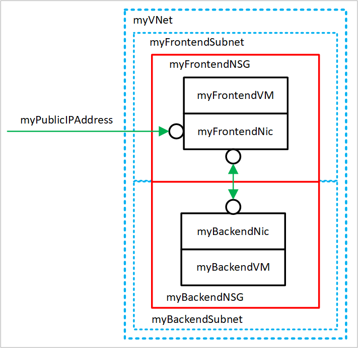

# Tutorial: Create and manage Azure virtual networks for Windows virtual machines with Azure PowerShell

**Applies to:** :heavy_check_mark: Windows VMs

Azure virtual machines use Azure networking for internal and external network communication. This tutorial walks through deploying two virtual machines and configuring Azure networking for these VMs. The examples in this tutorial assume that the VMs are hosting a web application with a database back-end, however an application isn't deployed in the tutorial. In this tutorial, you learn how to:

> [!div class="checklist"]
> * Create a virtual network and subnet
> * Create a public IP address
> * Create a front-end VM
> * Secure network traffic
> * Create back-end VM


## VM networking overview

Azure virtual networks enable secure network connections between virtual machines, the internet, and other Azure services such as Azure SQL Database. Virtual networks are broken down into logical segments called subnets. Subnets are used to control network flow, and as a security boundary. When deploying a VM, it generally includes a virtual network interface, which is attached to a subnet.

While completing this tutorial, you can see these resources created:



- *myVNet* - The virtual network that the VMs use to communicate with each other and the internet.
- *myFrontendSubnet* - The subnet in *myVNet* used by the front-end resources.
- *myPublicIPAddress* - The public IP address used to access *myFrontendVM* from the internet.
- *myFrontendNic* - The network interface used by *myFrontendVM* to communicate with *myBackendVM*.
- *myFrontendVM* - The VM used to communicate between the internet and *myBackendVM*.
- *myBackendNSG* - The network security group that controls communication between the *myFrontendVM* and *myBackendVM*.
- *myBackendSubnet* - The subnet associated with *myBackendNSG* and used by the back-end resources.
- *myBackendNic* - The network interface used by *myBackendVM* to communicate with *myFrontendVM*.
- *myBackendVM* - The VM that uses port 1433 to communicate with *myFrontendVM*.


## Launch Azure Cloud Shell

The Azure Cloud Shell is a free interactive shell that you can use to run the steps in this article. It has common Azure tools preinstalled and configured to use with your account. 

To open the Cloud Shell, just select **Try it** from the upper right corner of a code block. You can also launch Cloud Shell in a separate browser tab by going to [https://shell.azure.com/powershell](https://shell.azure.com/powershell). Select **Copy** to copy the blocks of code, paste it into the Cloud Shell, and press enter to run it.


## Create subnet 

For this tutorial, a single virtual network is created with two subnets. A front-end subnet for hosting a web application, and a back-end subnet for hosting a database server.

Before you can create a virtual network, create a resource group using [New-AzResourceGroup](/powershell/module/az.resources/new-azresourcegroup). The following example creates a resource group named *myRGNetwork* in the *EastUS* location:

```azurepowershell-interactive
New-AzResourceGroup -ResourceGroupName myRGNetwork -Location EastUS
```

Create a subnet configuration named *myFrontendSubnet* using [New-AzVirtualNetworkSubnetConfig](/powershell/module/az.network/new-azvirtualnetworksubnetconfig):

```azurepowershell-interactive
$frontendSubnet = New-AzVirtualNetworkSubnetConfig `
  -Name myFrontendSubnet `
  -AddressPrefix 10.0.0.0/24
```

And, create a subnet configuration named *myBackendSubnet*:

```azurepowershell-interactive
$backendSubnet = New-AzVirtualNetworkSubnetConfig `
  -Name myBackendSubnet `
  -AddressPrefix 10.0.1.0/24
```

## Create virtual network

Create a VNET named *myVNet* using *myFrontendSubnet* and *myBackendSubnet* using [New-AzVirtualNetwork](/powershell/module/az.network/new-azvirtualnetwork):

```azurepowershell-interactive
$vnet = New-AzVirtualNetwork `
  -ResourceGroupName myRGNetwork `
  -Location EastUS `
  -Name myVNet `
  -AddressPrefix 10.0.0.0/16 `
  -Subnet $frontendSubnet, $backendSubnet
```

At this point, a network has been created and segmented into two subnets, one for front-end services, and another for back-end services. In the next section, virtual machines are created and connected to these subnets.

## Create a public IP address

A public IP address allows Azure resources to be accessible on the internet. The allocation method of the public IP address can be configured as dynamic or static. By default, a public IP address is dynamically allocated. Dynamic IP addresses are released when a VM is deallocated. This behavior causes the IP address to change during any operation that includes a VM deallocation.

The allocation method can be set to static, which makes sure that the IP address stays assigned to a VM, even during a deallocated state. If you are using a static IP address, the IP address itself can't be specified. Instead, it's allocated from a pool of available addresses.

Create a public IP address named *myPublicIPAddress* using [New-AzPublicIpAddress](/powershell/module/az.network/new-azpublicipaddress):

```azurepowershell-interactive
$pip = New-AzPublicIpAddress `
  -ResourceGroupName myRGNetwork `
  -Location EastUS `
  -AllocationMethod Dynamic `
  -Name myPublicIPAddress
```

You could change the -AllocationMethod parameter to `Static` to assign a static public IP address.

## Create a front-end VM

For a VM to communicate in a virtual network, it needs a virtual network interface (NIC). Create a NIC using [New-AzNetworkInterface](/powershell/module/az.network/new-aznetworkinterface):

```azurepowershell-interactive
$frontendNic = New-AzNetworkInterface `
  -ResourceGroupName myRGNetwork `
  -Location EastUS `
  -Name myFrontend `
  -SubnetId $vnet.Subnets[0].Id `
  -PublicIpAddressId $pip.Id
```

Set the username and password needed for the administrator account on the VM using [Get-Credential](/powershell/module/microsoft.powershell.security/get-credential). You use these credentials to connect to the VM in additional steps:

```azurepowershell-interactive
$cred = Get-Credential
```

Create the VMs using [New-AzVM](/powershell/module/az.compute/new-azvm).

```azurepowershell-interactive
New-AzVM `
   -Credential $cred `
   -Name myFrontend `
   -PublicIpAddressName myPublicIPAddress `
   -ResourceGroupName myRGNetwork `
   -Location "EastUS" `
   -Size Standard_D1 `
   -SubnetName myFrontendSubnet `
   -VirtualNetworkName myVNet
```

## Secure network traffic

A network security group (NSG) contains a list of security rules that allow or deny network traffic to resources connected to Azure Virtual Networks (VNet). NSGs can be associated to subnets or individual network interfaces. An NSG that is associated with a network interface only applies to the associated VM. When an NSG is associated to a subnet, the rules apply to all resources connected to the subnet.

### Network security group rules

NSG rules define networking ports over which traffic is allowed or denied. The rules can include source and destination IP address ranges so that traffic is controlled between specific systems or subnets. NSG rules also include a priority (between 1—and 4096). Rules are evaluated in the order of priority. A rule with a priority of 100 is evaluated before a rule with priority 200.

All NSGs contain a set of default rules. The default rules can't be deleted, but because they are assigned the lowest priority, they can be overridden by the rules that you create.

- **Virtual network** - Traffic originating and ending in a virtual network is allowed both in inbound and outbound directions.
- **Internet** - Outbound traffic is allowed, but inbound traffic is blocked.
- **Load balancer** - Allow Azure’s load balancer to probe the health of your VMs and role instances. If you are not using a load balanced set, you can override this rule.

### Create network security groups

Create an inbound rule named *myFrontendNSGRule* to allow incoming web traffic on *myFrontendVM* using [New-AzNetworkSecurityRuleConfig](/powershell/module/az.network/new-aznetworksecurityruleconfig):

```azurepowershell-interactive
$nsgFrontendRule = New-AzNetworkSecurityRuleConfig `
  -Name myFrontendNSGRule `
  -Protocol Tcp `
  -Direction Inbound `
  -Priority 200 `
  -SourceAddressPrefix * `
  -SourcePortRange * `
  -DestinationAddressPrefix * `
  -DestinationPortRange 80 `
  -Access Allow
```

You can limit internal traffic to *myBackendVM* from only *myFrontendVM* by creating an NSG for the back-end subnet. The following example creates an NSG rule named *myBackendNSGRule*:

```azurepowershell-interactive
$nsgBackendRule = New-AzNetworkSecurityRuleConfig `
  -Name myBackendNSGRule `
  -Protocol Tcp `
  -Direction Inbound `
  -Priority 100 `
  -SourceAddressPrefix 10.0.0.0/24 `
  -SourcePortRange * `
  -DestinationAddressPrefix * `
  -DestinationPortRange 1433 `
  -Access Allow
```

Add a network security group named *myFrontendNSG* using [New-AzNetworkSecurityGroup](/powershell/module/az.network/new-aznetworksecuritygroup):

```azurepowershell-interactive
$nsgFrontend = New-AzNetworkSecurityGroup `
  -ResourceGroupName myRGNetwork `
  -Location EastUS `
  -Name myFrontendNSG `
  -SecurityRules $nsgFrontendRule
```

Now, add a network security group named *myBackendNSG* using New-AzNetworkSecurityGroup:

```azurepowershell-interactive
$nsgBackend = New-AzNetworkSecurityGroup `
  -ResourceGroupName myRGNetwork `
  -Location EastUS `
  -Name myBackendNSG `
  -SecurityRules $nsgBackendRule
```

Add the network security groups to the subnets:

```azurepowershell-interactive
$vnet = Get-AzVirtualNetwork `
  -ResourceGroupName myRGNetwork `
  -Name myVNet
$frontendSubnet = $vnet.Subnets[0]
$backendSubnet = $vnet.Subnets[1]
$frontendSubnetConfig = Set-AzVirtualNetworkSubnetConfig `
  -VirtualNetwork $vnet `
  -Name myFrontendSubnet `
  -AddressPrefix $frontendSubnet.AddressPrefix `
  -NetworkSecurityGroup $nsgFrontend
$backendSubnetConfig = Set-AzVirtualNetworkSubnetConfig `
  -VirtualNetwork $vnet `
  -Name myBackendSubnet `
  -AddressPrefix $backendSubnet.AddressPrefix `
  -NetworkSecurityGroup $nsgBackend
Set-AzVirtualNetwork -VirtualNetwork $vnet
```

## Create a back-end VM

The easiest way to create the back-end VM for this tutorial is by using a SQL Server image. This tutorial only creates the VM with the database server, but doesn't provide information about accessing the database.

Create *myBackendNic*:

```azurepowershell-interactive
$backendNic = New-AzNetworkInterface `
  -ResourceGroupName myRGNetwork `
  -Location EastUS `
  -Name myBackend `
  -SubnetId $vnet.Subnets[1].Id
```

Set the username and password needed for the administrator account on the VM with Get-Credential:

```azurepowershell-interactive
$cred = Get-Credential
```

Create *myBackendVM*.

```azurepowershell-interactive
New-AzVM `
   -Credential $cred `
   -Name myBackend `
   -ImageName "MicrosoftSQLServer:SQL2016SP1-WS2016:Enterprise:latest" `
   -ResourceGroupName myRGNetwork `
   -Location "EastUS" `
   -SubnetName MyBackendSubnet `
   -VirtualNetworkName myVNet
```

The image in this example has SQL Server installed, but it isn't used in this tutorial. It's included to show you how you can configure a VM to handle web traffic and a VM to handle database management.

## Next steps

In this tutorial, you created and secured Azure networks as related to virtual machines. 

> [!div class="checklist"]
> * Create a virtual network and subnet
> * Create a public IP address
> * Create a front-end VM
> * Secure network traffic
> * Create a back-end VM

To learn about protecting your VM disks, see [Backup and disaster recovery for disks](../backup-and-disaster-recovery-for-azure-iaas-disks.md).
