# Create a continuous integration pipeline with Visual Studio Team Services and IIS
To automate the build, test, and deployment phases of application development, you can use a continuous integration and deployment (CI/CD) pipeline. In this tutorial, you create a CI/CD pipeline using Visual Studio Team Services and a Windows virtual machine (VM) in Azure that runs IIS. You learn how to:

> [!div class="checklist"]
> * Publish an ASP.NET web application to a Team Services project
> * Create a build definition that is triggered by code commits
> * Install and configure IIS on a virtual machine in Azure
> * Add the IIS instance to a deployment group in Team Services
> * Create a release definition to publish new web deploy packages to IIS
> * Test the CI/CD pipeline

This tutorial requires the Azure PowerShell module version 3.6 or later. Run `Get-Module -ListAvailable AzureRM` to find the version. If you need to upgrade, see [Install Azure PowerShell module](/powershell/azure/install-azurerm-ps).


## Create project in Team Services
Visual Studio Team Services allows for easy collaboration and development without maintaining an on-premises code management solution. Team Services provides cloud code testing, build, and application insights. You can choose a version control repo and IDE that best fits your code development. For this tutorial, you can use a free account to create a basic ASP.NET web app and CI/CD pipeline. If you do not already have a Team Services account, [create one](http://go.microsoft.com/fwlink/?LinkId=307137).

To manage the code commit process, build definitions, and release definitions, create a project in Team Services as follows:

1. Open your Team Services dashboard in a web browser and choose **New project**.
2. Enter *myWebApp* for the **Project name**. Leave all other default values to use *Git* version control and *Agile* work item process.
3. Choose the option to **Share with** *Team Members*, then select **Create**.
5. Once your project has been created, choose the option to **Initialize with a README or gitignore**, then **Initialize**.
6. Inside your new project, choose **Dashboards** across the top, then select **Open in Visual Studio**.


## Create ASP.NET web application
In the previous step, you created a project in Team Services. The final step opens your new project in Visual Studio. You manage your code commits in the **Team Explorer** window. Create a local copy of your new project, then create an ASP.NET web application from a template as follows:

1. Select **Clone** to create a local git repo of your Team Services project.
    
    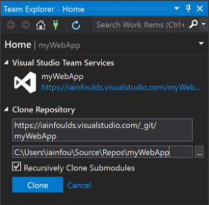

2. Under **Solutions**, select **New**.

    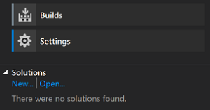

3. Select **Web** templates, and then choose the **ASP.NET Web Application** template.
    1. Enter a name for your application, such as *myWebApp*, and uncheck the box for **Create directory for solution**.
    2. If the option is available, uncheck the box to **Add Application Insights to project**. Application Insights requires you to authorize your web application with Azure Application Insights. To keep it simple in this tutorial, skip this process.
    3. Select **OK**.
4. Choose **MVC** from the template list.
    1. Select **Change Authentication**, choose **No Authentication**, then select **OK**.
    2. Select **OK** to create your solution.
5. In the **Team Explorer** window, choose **Changes**.

    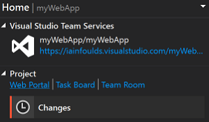

6. In the commit text box, enter a message such as *Initial commit*. Choose **Commit All and Sync** from the drop-down menu.


## Create build definition
In Team Services, you use a build definition to outline how your application should be built. In this tutorial, we create a basic definition that takes our source code, builds the solution, then creates web deploy package we can use to run the web app on an IIS server.

1. In your Team Services project, choose **Build & Release** across the top, then select **Builds**.
3. Select **+ New definition**.
4. Choose the **ASP.NET (PREVIEW)** template and select **Apply**.
5. Leave all the default task values. Under **Get sources**, ensure that the *myWebApp* repository and *master* branch are selected.

    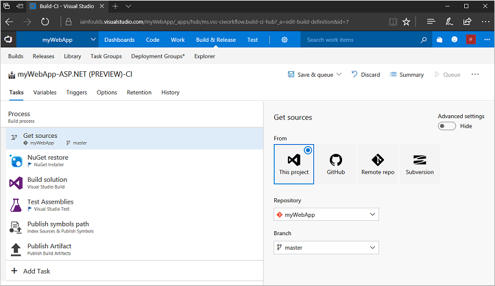

6. On the **Triggers** tab, move the slider for **Enable this trigger** to *Enabled*.
7. Save the build definition and queue a new build by selecting **Save & queue** , then **Save & queue** again. Leave the defaults and select **Queue**.

Watch as the build is scheduled on a hosted agent, then begins to build. The output is similar to the following example:

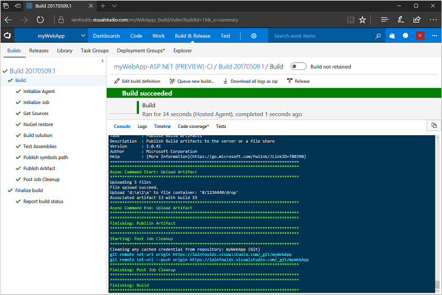


## Create virtual machine
To provide a platform to run your ASP.NET web app, you need a Windows virtual machine that runs IIS. Team Services uses an agent to interact with the IIS instance as you commit code and builds are triggered.

Create a Windows Server 2016 VM using [this script sample](../scripts/virtual-machines-windows-powershell-sample-create-vm.md?toc=%2fpowershell%2fmodule%2ftoc.json). It takes a few minutes for the script to run and create the VM. Once the VM has been created, open port 80 for web traffic with [Add-AzureRmNetworkSecurityRuleConfig](/powershell/module/azurerm.resources/new-azurermresourcegroup) as follows:

```powershell
Get-AzureRmNetworkSecurityGroup `
  -ResourceGroupName $resourceGroup `
  -Name "myNetworkSecurityGroup" | `
Add-AzureRmNetworkSecurityRuleConfig `
  -Name "myNetworkSecurityGroupRuleWeb" `
  -Protocol "Tcp" `
  -Direction "Inbound" `
  -Priority "1001" `
  -SourceAddressPrefix "*" `
  -SourcePortRange "*" `
  -DestinationAddressPrefix "*" `
  -DestinationPortRange "80" `
  -Access "Allow" | `
Set-AzureRmNetworkSecurityGroup
```

To connect to your VM, obtain the public IP address with [Get-AzureRmPublicIpAddress](/powershell/module/azurerm.network/get-azurermpublicipaddress) as follows:

```powershell
Get-AzureRmPublicIpAddress -ResourceGroupName $resourceGroup | Select IpAddress
```

Create a remote desktop session to your VM:

```cmd
mstsc /v:<publicIpAddress>
```

On the VM, open an **Administrator PowerShell** command prompt. Install IIS and required .NET features as follows:

```powershell
Install-WindowsFeature Web-Server,Web-Asp-Net45,NET-Framework-Features
```


## Create deployment group
To push out the web deploy package to the IIS server, you define a deployment group in Team Services. This group allows you to specify which servers are the target of new builds as you commit code to Team Services and builds are completed.

1. In Team Services, choose **Build & Release** and then select **Deployment groups**.
2. Choose **Add Deployment group**.
3. Enter a name for the group, such as *myIIS*, then select **Create**.
4. In the **Register machines** section, ensure *Windows* is selected, then check the box to **Use a personal access token in the script for authentication**.
5. Select **Copy script to clipboard**.


### Add IIS VM to the deployment group
With the deployment group created, add each IIS instance to the group. Team Services generates a script that downloads and configures an agent on the VM that receives new web deploy packages then applies it to IIS.

1. Back in the **Administrator PowerShell** session on your VM, paste and run the script copied from Team Services.
2. When prompted to configure tags for the agent, choose *Y* and enter *web*.
3. When prompted for the user account, press *Return* to accept the defaults.
4. Wait for the script to finish with a message *Service vstsagent.account.computername started successfully*.
5. In the **Deployment groups** page of the **Build & Release** menu, open the *myIIS* deployment group. On the **Machines** tab, verify that your VM is listed.

    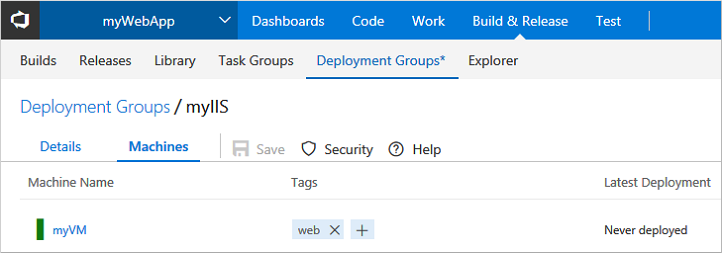


## Create release definition
To publish your builds, you create a release definition in Team Services. This definition is triggered automatically by a successful build of your application. You choose the deployment group to push your web deploy package to, and define the appropriate IIS settings.

1. Choose **Build & Release**, then select **Builds**. Choose the build definition created in a previous step.
2. Under **Recently completed**, choose the most recent build, then select **Release**.
3. Choose **Yes** to create a release definition.
4. Choose the **Empty** template, then select **Next**.
5. Verify the project and source build definition are populated with your project.
6. Select the **Continuous deployment** check box, then select **Create**.
7. Select the drop-down box next to **+ Add tasks** and choose *Add a deployment group phase*.
    
    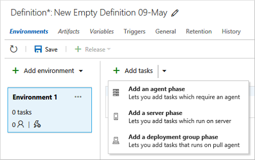

8. Choose **Add** next to **IIS Web App Deploy(Preview)**, then select **Close**.
9. Select the **Run on deployment group** parent task.
    1. For **Deployment Group**, select the deployment group you created earlier, such as *myIIS*.
    2. In the **Machine tags** box, select **Add** and choose the *web* tag.
    
    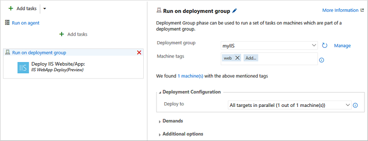
 
11. Select the **Deploy: IIS Web App Deploy** task to configure your IIS instance settings as follows:
    1. For **Website Name**, enter *Default Web Site*.
    2. Leave all the other default settings.
12. Choose **Save**, then select **OK** twice.


## Create a release and publish
You can now push your web deploy package as a new release. This step communicates with the agent on each instance that is part of the deployment group, pushes the web deploy package, then configures IIS to run the updated web application.

1. In your release definition, select **+ Release**, then choose **Create Release**.
2. Verify that the latest build is selected in the drop-down list, along with **Automated deployment: After release creation**. Select **Create**.
3. A small banner appears across the top of your release definition, such as *Release 'Release-1' has been created*. Select the release link.
4. Open the **Logs** tab to watch the release progress.
    
    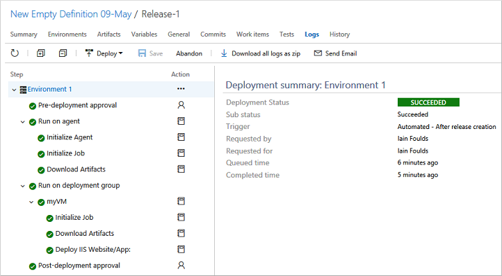

5. After the release is complete, open a web browser and enter the public IIP address of your VM. Your ASP.NET web application is running.

    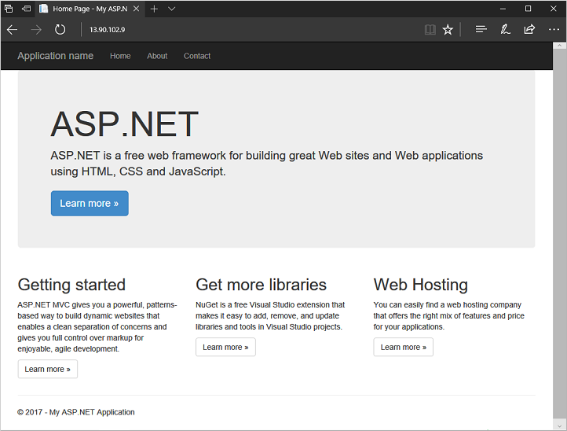


## Test the whole CI/CD pipeline
With your web application running on IIS, now try the whole CI/CD pipeline. After you make a change in Visual Studio and commit your code, a build is triggered which then triggers a release of your updated web deploy package to IIS:

1. In Visual Studio, open the **Solution Explorer** window.
2. Navigate to and open *myWebApp | Views | Home | Index.cshtml*
3. Edit line 6 to read:

    `<h1>ASP.NET with VSTS and CI/CD!</h1>`

4. Save the file.
5. Open the **Team Explorer** window, select the *myWebApp* project, then choose **Changes**.
6. Enter a commit message, such as *Testing CI/CD pipeline*, then choose **Commit All and Sync** from the drop-down menu.
7. In Team Services workspace, a new build is triggered from the code commit. 
    - Choose **Build & Release**, then select **Builds**. 
    - Choose your build definition, then select the **Queued & running** build to watch as the build progresses.
9. Once the build is successful, a new release is triggered.
    - Choose **Build & Release**, then **Releases** to see the web deploy package pushed to your IIS VM. 
    - Select the **Refresh** icon to update the status. When the *Environments* column shows a green check mark, the release has successfully deployed to IIS.
11. To see your changes applied, refresh your IIS website in a browser.

    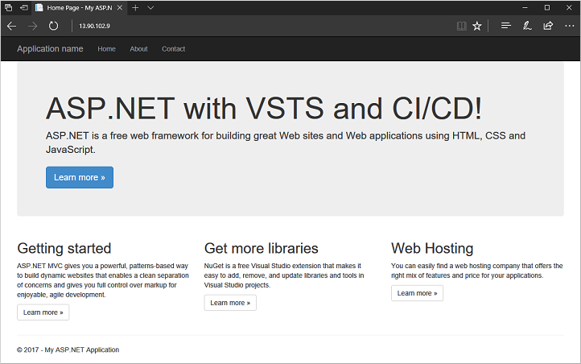


## Next steps

In this tutorial, you created an ASP.NET web application in Team Services and configured build and release definitions to deploy new web deploy packages to IIS on each code commit. You learned how to:

> [!div class="checklist"]
> * Publish an ASP.NET web application to a Team Services project
> * Create a build definition that is triggered by code commits
> * Install and configure IIS on a virtual machine in Azure
> * Add the IIS instance to a deployment group in Team Services
> * Create a release definition to publish new web deploy packages to IIS
> * Test the CI/CD pipeline

Follow this link to see pre-built virtual machine script samples.

> [!div class="nextstepaction"]
> [Windows virtual machine script samples](./powershell-samples.md)