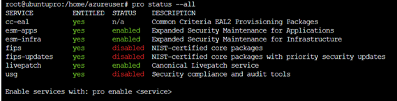

# Ubuntu Server to Ubuntu Pro in-place upgrade on Azure

**Applies to:** :heavy_check_mark: Linux virtual machines

Customers can now upgrade from Ubuntu Server (16.04 or higher) to Ubuntu Pro on your existing Azure Virtual Machines without redeployment or downtime. One of the major use cases includes conversion of Ubuntu 18.04 LTS going EOL to Ubuntu Pro. [Canonical announced that the Ubuntu 18.04 LTS (Bionic Beaver) OS images end-of-life (EOL)....](https://ubuntu.com/18-04/azure) Canonical no longer provides technical support, software updates, or security patches for this version. Customers need to upgrade to Ubuntu Pro to continue to be on Ubuntu 18.04 LTS. 

## What's Ubuntu Pro 
Ubuntu Pro is a cross-cloud OS, optimized for Azure, and security maintained for 10 years. The secure use of open-source software allows teams to utilize the latest technologies while meeting internal governance and compliance requirements. Ubuntu Pro 18.04 LTS, remains fully compatible with Ubuntu Server 18.04 LTS, but adds more security enabled by default, including compliance and management tools in a form suitable for small to large-scale Linux operations. Ubuntu Pro 18.04 LTS is fully supported until April 2028. Ubuntu Pro also comes with security patching for all Ubuntu packages due to Extended Security Maintenance (ESM) for Infrastructure and Applications and optional 24/7 phone and ticket support.  

Customers using Ubuntu Server 18.04, for example, can upgrade to Ubuntu Pro and continue to receive security patches from Canonical until 2028. Customers can upgrade to Ubuntu Pro via Azure CLI.

## Why developers and devops choose Ubuntu Pro for Azure 
* Access to security updates for 23,000+ packages including Apache Kafka, NGINX, MongoDB, Redis and PostgreSQL, integrated into normal system tools (for example Azure Update Manager, apt) 
* Security hardening and audit tools (CIS) to establish a security baseline across your systems (and help you meet the Azure Linux Security Baseline policy) 
* FIPS 140-2 certified modules
* Common Criteria (CC) EAL2 provisioning packages 
* Kernel Live patch: kernel patches delivered immediately, without the need to reboot 
* Optimized performance: optimized kernel, with improved boot speed, outstanding runtime performance and advanced device support 
* 10-year security maintenance: Ubuntu Pro 18.04 LTS provides security maintenance until April 2028 
* Production ready: Ubuntu is the leading Linux in the public cloud with > 50% of Linux workloads 
* Developer friendly: Ubuntu is the \#1 Linux for developers offering the latest libraries and tools to innovate with the latest technologies 
* Non-stop security: Canonical publishes images frequently, ensuring security is present from the moment an instance launches 
* Portability: Ubuntu is available in all regions with content mirrors to reduce the need to go across regions or out to the Internet for updates 
* Consistent experience across platforms: from edge to multicloud, Ubuntu provides the same experience regardless of the platform. It ensures consistency of your CI/CD pipelines and management mechanisms.

**This document presents the direction to upgrade from an Ubuntu Server (16.04 or higher) image to Ubuntu Pro with zero downtime for upgrade by executing the following steps in your VMs:**

1. Converting to Ubuntu Pro license 

2. Validating the license

>[!NOTE]
> Converting to UBUNTU_PRO is an irreversible process. You can't even downgrade a VM by running detach. Open a support ticket for any exceptions.

## Convert to Ubuntu Pro using the Azure CLI 
```azurecli-interactive
# The following will enable Ubuntu Pro on a virtual machine
az vm update -g myResourceGroup -n myVmName --license-type UBUNTU_PRO 
```

```In-VM commands 
# The next step is to execute two in-VM commands
sudo apt install ubuntu-advantage-tools 
sudo pro auto-attach 
```
(Note that "sudo apt install ubuntu-advantage-tools" is only necessary if "pro --version" is lower than 28) 

## Validate the license 
Expected output:



## Create an Ubuntu Pro VM using the Azure CLI
You can also create a new VM using the Ubuntu Server images and apply Ubuntu Pro at create time.

For example:

```azurecli-interactive
# The following will enable Ubuntu Pro on a virtual machine
az vm update -g myResourceGroup -n myVmName --license-type UBUNTU_PRO 
```

```In-VM commands
# The next step is to execute two in-VM commands
sudo apt install ubuntu-advantage-tools 
sudo pro auto-attach 
```

>[!NOTE]
> For systems with advantage tools version 28 or higher installed the system will perform a pro attach during a reboot.

## Check licensing model using the Azure CLI
You can use the az vm get-instance-view command to check the status. Look for a licenseType field in the response. If the licenseType field exists and the value is UBUNTU_PRO, your virtual machine has Ubuntu Pro enabled.

```Azure CLI
az vm get-instance-view -g MyResourceGroup -n MyVm 
```

## Check the licensing model of an Ubuntu Pro enabled VM using Azure Instance Metadata Service
From within the virtual machine itself, you can query the attested metadata in Azure Instance Metadata Service to determine the virtual machine's licenseType value. A licenseType value of UBUNTU_PRO indicates that your virtual machine has Ubuntu Pro enabled. [Learn more about attested metadata](../../instance-metadata-service.md).

## Billing
You are charged for Ubuntu Pro as part of the Preview. Visit the [pricing calculator](https://azure.microsoft.com/pricing/calculator/) for more details on Ubuntu Pro pricing. To cancel the Pro subscription during the preview period, open a support ticket through the Azure portal.

## Frequently Asked Questions

#### I launched an Ubuntu Pro VM. Do I need to configure it or enable something else?
With the availability of outbound internet access, Ubuntu Pro automatically enables premium features such as Extended Security Maintenance for [Main and Universe repositories](https://help.ubuntu.com/community/Repositories) and [live patch](https://ubuntu.com/security/livepatch/docs). Should any specific hardening be required (for example CIS), check the using 'usg' to [harden your servers](https://ubuntu.com/tutorials/comply-with-cis-or-disa-stig-on-ubuntu#1-overview) tutorial. Should you require FIPS, check enabling FIPS tutorials.

For more information about networking requirements for making sure Pro enablement process works (such as egress traffic, endpoints and ports) [check this documentation](https://canonical-ubuntu-pro-client.readthedocs-hosted.com/en/latest/references/network_requirements.html).

#### If I shut down the machine, does the billing continue?
If you launch Ubuntu Pro from Azure Marketplace you pay as you go, so, if you don’t have any machine running, you won’t pay anything additional.

#### Can I get volume discounts?
Yes. Contact your Microsoft sales representative.

#### Are Reserved Instances available?
Yes

#### If the customer doesn't do the auto attach will they still get attached to pro on reboot?
If the customer doesn't perform the auto attach, they still get the Pro attached upon reboot. However, this applies only if they have v28 of the Pro client.
* For Jammy and Focal, this process works as expected.
* For Bionic and Xenial this process doesn't work due to the older versions of the Pro client installed.
