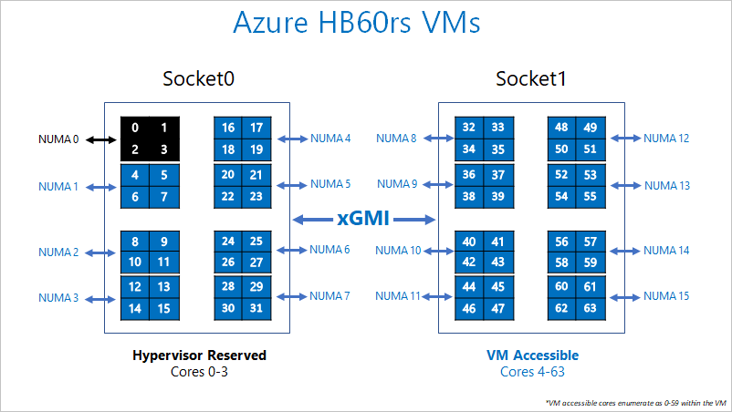

# HB-series virtual machines overview

Maximizing high performance compute (HPC) application performance on AMD EPYC requires a thoughtful approach memory locality and process placement. Below we outline the AMD EPYC architecture and our implementation of it on Azure for HPC applications. We will use the term “pNUMA” to refer to a physical NUMA domain, and “vNUMA” to refer to a virtualized NUMA domain.

Physically, an [HB-series](../../hb-series.md) server is 2 * 32-core EPYC 7551 CPUs for a total of 64 physical cores. These 64 cores are divided into 16 pNUMA domains (8 per socket), each of which is four cores and known as a “CPU Complex” (or “CCX”). Each CCX has its own L3 cache, which is how an OS will see a pNUMA/vNUMA boundary. A pair of adjacent CCXs shares access to two channels of physical DRAM (32 GB of DRAM in HB-series servers).

To provide room for the Azure hypervisor to operate without interfering with the VM, we reserve physical pNUMA domain 0 (the first CCX). We then assign pNUMA domains 1-15 (the remaining CCX units) for the VM. The VM will see:

`(15 vNUMA domains) * (4 cores/vNUMA) = 60` cores per VM

The VM, itself, doesn't know that pNUMA 0 wasn't given to it. The VM understands pNUMA 1-15 as vNUMA 0-14, with 7 vNUMA on vSocket 0 and 8 vNUMA on vSocket 1. While this is asymmetrical, your OS should boot and operate normally. Later in this guide, we instruct how best to run MPI applications on this asymmetric NUMA layout.

Process pinning will work on HB-series VMs because we expose the underlying silicon as-is to the guest VM. We strongly recommend process pinning for optimal performance and consistency.

The following diagram shows the segregation of cores reserved for Azure Hypervisor and the HB-series VM.

## Hardware specifications

| Hardware Specifications                | HB-series VM                     |
|----------------------------------|----------------------------------|
| Cores                            | 60 (SMT disabled)                |
| CPU                              | AMD EPYC 7551                    |
| CPU Frequency (non-AVX)          | ~2.55 GHz (single + all cores)   |
| Memory                           | 4 GB/core (240 GB total)         |
| Local Disk                       | 700 GB SSD                       |
| Infiniband                       | 100 Gb EDR Mellanox ConnectX-5 |
| Network                          | 50 Gb Ethernet (40 Gb usable) Azure second Gen SmartNIC |

## Software specifications

| Software Specifications           |HB-series VM           |
|-----------------------------|-----------------------|
| Max MPI Job Size            | 18000 cores (300 VMs in a single virtual machine scale set with singlePlacementGroup=true)  |
| MPI Support                 | HPC-X, Intel MPI, OpenMPI, MVAPICH2, MPICH, Platform MPI  |
| Additional Frameworks       | Unified Communication X, libfabric, PGAS |
| Azure Storage Support       | Standard and Premium Disks (maximum 4 disks) |
| OS Support for SRIOV RDMA   | CentOS/RHEL 7.6+, SLES 12 SP4+, WinServer 2016+  |
| Orchestrator Support        | CycleCloud, Batch  |

## Next steps

- Learn more about [AMD EPYC architecture](https://bit.ly/2Epv3kC) and [multi-chip architectures](https://bit.ly/2GpQIMb). For more detailed information, see the [HPC Tuning Guide for AMD EPYC Processors](https://bit.ly/2T3AWZ9).
- Read about the latest announcements and some HPC examples and results at the [Azure Compute Tech Community Blogs](https://techcommunity.microsoft.com/t5/azure-compute/bg-p/AzureCompute).
- For a higher level architectural view of running HPC workloads, see [High Performance Computing (HPC) on Azure](/azure/architecture/topics/high-performance-computing/).
